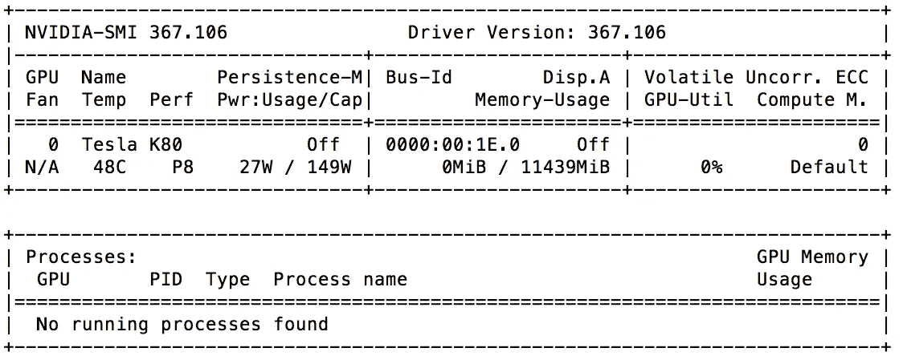
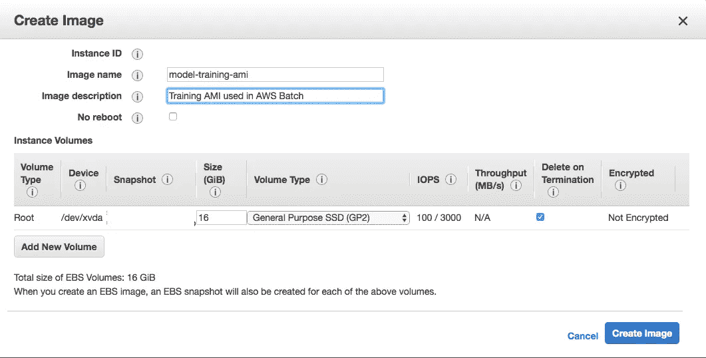
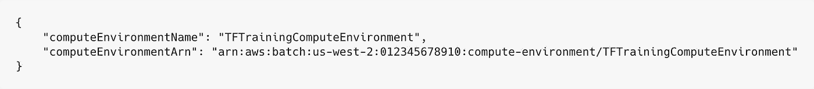
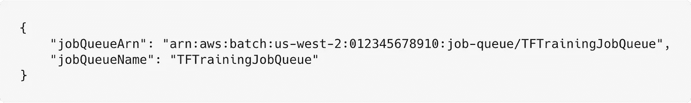
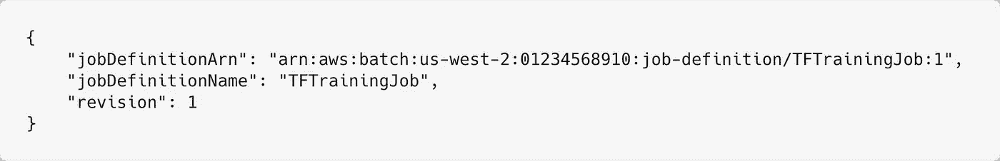
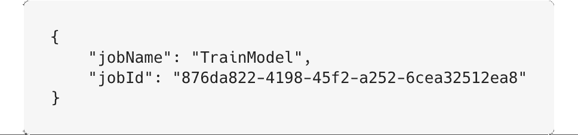

# 如何在云中运行定制的 Tensorflow 培训

> 原文：<https://towardsdatascience.com/how-to-run-customized-tensorflow-training-in-the-cloud-d0c142e3cfb5?source=collection_archive---------9----------------------->

您的 Tensorflow 代码在本地运行。现在，您希望在生产环境中设置它，以获得所有额外的 GPU 功能。有两种选择。比较流行的两个托管 ML 云平台是 Google Cloud ML Engine 和 AWS Sage Maker。它们让您快速部署您的模型并训练它们。但是，您可能想要构建一个更加定制化的解决方案。为此，您可以使用 [AWS 批次](https://aws.amazon.com/batch/)。

## **为什么 AWS 批量？**

这里的主要思想是尽可能降低成本，同时仍然利用 GPU 的能力。持续运行 GPU 实例会产生巨大的成本。AWS batch 使用一个作业队列，并根据作业需求扩展实例。因此，如果没有作业，就没有正在运行的实例。通过使用[点实例](https://aws.amazon.com/ec2/spot/)，您可以进一步降低运行培训工作的成本。

## **先决条件:**

*   AWS 账户:[https://aws.amazon.com/console](https://aws.amazon.com/console)。
*   用于部署的 AWS 命令行:[https://aws.amazon.com/cli/](https://aws.amazon.com/cli/)。
*   https://docs.docker.com/install/。

## **构建 Docker 映像**

AWS 批处理需要一个 docker 映像，您的 Tensorflow 训练代码将在其中运行。Dockerfile 文件如下。

*   安装所需的相关 cuda 基础映像和库，从这里获取[https://github . com/tensor flow/tensor flow/blob/master/tensor flow/tools/docker/docker file . GPU](https://github.com/tensorflow/tensorflow/blob/master/tensorflow/tools/docker/Dockerfile.gpu)(版本可能会有所不同)。
*   复制您的代码使用的 Pipfile 并将其安装在映像上。Pipfile 也应该包含 Tensorflow 版本。
*   设置相关的环境变量。
*   复制获取并运行脚本，该脚本将在 s3 上获取一个 shell 脚本(稍后将详细介绍)来处理 Tensorflow 代码的运行(也驻留在 S3 上)。

$RUN_SCRIPT 参数将作为环境变量传递给 AWS 批处理作业。

接下来，构建映像并将其推送到 docker 存储库，以便批处理作业可以访问它。

```
> docker build -t $DOCKER_IMAGE_TAG aws_batch_image
> docker push $DOCKER_IMAGE_TAG
```

aws_batch_image 是一个包含 docker 文件以及获取和运行脚本的文件夹。

## **建立 AMI**

Tensorflow 依赖于特定的 NVIDIA 驱动程序和软件包来运行。你可以使用 AWS Deeplearning AMI ，它附带了一组预装的驱动程序，或者你也可以自己构建一个。我将通过各种步骤来构建您的自定义 Tensorflow AMI。

**创建一个 GPU 基础 AMI**

从 Amazon EC2 仪表板创建 Amazon Linux AMI。我们将使用带有 16GB 通用 SSD 卷存储的 p2.xlarge 实例。确保生成一个定制的密钥对，您可以用它来 SSH 到实例中。

**安装 NVIDIA 驱动**

首先使用以下命令将 ssh 连接到您的实例。

```
> ssh -i custom-key-pair.pem ec2-user@<Public DNS> 
```

运行以下命令。

```
# Update package cache and get package updates
> sudo yum update -y# Installs gcc compiler and kernel header package
> sudo yum install -y gcc kernel-devel-$(uname -r)
```

接下来，我们需要安装基于 Tensorflow 版本的 NVIDIA 驱动程序。P2 实例包含特斯拉 K-80 GPU 的。我们将使用与 CUDA Toolkit 8.0 兼容的 Tensorflow 1.3。你可以使用这个链接帮助找到兼容的驱动程序[http://www.nvidia.com/Download/Find.aspx](http://www.nvidia.com/Download/Find.aspx)。我们将使用版本 367.106。

下载驱动程序安装文件。

```
> wget http://us.download.nvidia.com/XFree86/Linux-x86_64/367.106/NVIDIA-Linux-x86_64-367.106.run
```

运行安装文件，然后重新启动。

```
> sudo /bin/bash ./NVIDIA-Linux-x86_64-367.106.runVerifying archive integrity... OKUncompressing NVIDIA Accelerated Graphics Driver for Linux-x86_64 367.106............................................................................................................................................................................................................................................................................................................................................................................................................................................................................................................> sudo reboot
```

SSH 到您的实例中，并运行以下命令来测试驱动程序是否安装正确。

```
> nvidia-smi -q | head==============NVSMI LOG==============Timestamp                           : Tue Apr 10 11:01:04 2018Driver Version                      : 367.106Attached GPUs                       : 1GPU 0000:00:1E.0Product Name                    : Tesla K80Product Brand                   : Tesla
```

如果您选择的驱动程序不起作用，请尝试使用不同的版本。

**配置 nvidia-docker**

NVIDIA Docker RPM 安装将 NVIDIA 驱动程序复制到 AWS 批处理作业中 Docker 容器的正确位置所需的组件。

用以下内容创建一个 bash 脚本文件。

运行该脚本，验证您可以运行 docker 容器，并使用以下命令访问已安装的驱动程序。

```
> ./configure_nvidia_gpu.sh> sudo docker run --privileged -v /var/lib/nvidia-docker/volumes/nvidia_driver/latest:/usr/local/nvidia nvidia/cuda:8.0-cudnn6-devel nvidia-smi
```

您应该得到类似于下面的输出。



删除实例上的 docker 容器和映像，以减小 AMI 的大小。

```
> sudo docker rm $(sudo docker ps -aq)
> sudo docker rmi $(sudo docker images -q)
```

**从实例中创建 AMI**

1.  首先，创建图像的快照。可以参考这里[https://docs . AWS . Amazon . com/AWS C2/latest/user guide/EBS-creating-snapshot . html](https://docs.aws.amazon.com/AWSEC2/latest/UserGuide/ebs-creating-snapshot.html)。
2.  从 EC2 仪表板中选择您的实例，并选择**操作**、**图像**、**创建图像**。
3.  如下填写字段(我已经将快照 ID 和实例 Id 变白)。



4.单击创建图像。

您的 ami 现在应该显示在 AMIs 部分。状态变为可用可能需要一段时间。

# 设置 AWS 批

**先决条件**

1.  创建 AWS 批处理服务角色。参考[这里的](https://docs.aws.amazon.com/batch/latest/userguide/service_IAM_role.html)获取信息。
2.  创建一个 ecsInstanceRole。参考[此处的](https://docs.aws.amazon.com/batch/latest/userguide/instance_IAM_role.html)获取信息。
3.  创建一个 EC2SpotFleetRole。参考[此处](https://docs.aws.amazon.com/batch/latest/userguide/spot_fleet_IAM_role.html)获取信息。
4.  创建一个 EC2 密钥对。参考[此处](https://docs.aws.amazon.com/batch/latest/userguide/get-set-up-for-aws-batch.html#create-a-key-pair)获取信息。
5.  创建一个 EC2ContainerServiceTask 角色，并为其附加一个 AmazonS3FullAccess 策略。

AWS 批处理可以通过 GUI 或命令行设置。我们将通过命令行完成设置过程。如果你想通过图形用户界面来设置它，请遵循这里的教程[并填写下面给出的信息。](https://docs.aws.amazon.com/batch/latest/userguide/Batch_GetStarted.html)

**创建计算环境**

创建一个 JSON 文件来指定计算环境的各种属性。

**类型**:我们选择 managed，因为我们希望 AWS Batch 负责调度和管理资源。

**状态**:表示您现在是否想要激活。我们将其设置为 enabled。

**计算资源:**

*   **类型**:现场实例或按需实例。选择 spot 实例以降低成本。
*   这是你在上面创建的舰队角色的 arn。

提示:您可以使用 cli 获取您的角色的 arn，如下所示。

```
> aws iam get-role --role-name aws-batch-spot-fleet-role --query 'Role.Arn' --output text
```

*   minvCpus :不管作业需求如何，要维护的虚拟 CPU 的最小数量。为了节省成本，我们将其设置为零。
*   **maxvCpus** :我们希望作业运行的虚拟 CPU 的最大数量。
*   **desiredvCpus** :计算环境在启动时应该拥有的虚拟 CPU 的数量。随着需求的增加或减少，AWS 批次的数量将在最大值和最小值之间进行调整。
*   **实例类型**:要启动的 EC2 实例的类型。我们将把它设置为 p2.xlarge(我们用来创建 AMI 的同一个实例)。
*   **bidPercentage** :实例启动前，现货实例价格与该实例类型的按需价格相比必须达到的最大百分比。
*   **子网:**要在其中运行批处理实例的虚拟私有云(VPC)子网。

提示:您可以从 cli 查询您的子网 id，如下所示:

```
> aws ec2 describe-subnets
```

*   **security groupid:**您希望应用到您的实例的安全组的标识符，例如 SSH 访问。

提示:您可以从 cli 查询您的安全组 id，如下所示。

```
> aws ec2 describe-security-groups
```

*   **ec2KeyPair:** 用于 SSH 进入实例。将其设置为您在上面创建的值。
*   **instanceRole** :将其设置为您在上面创建的角色的名称。

**serviceRole:** 将其设置为您在上面创建的角色的名称。

运行以下命令创建计算环境。

```
> aws batch create-compute-environment --cli-input-json file://<path_to_json_file>/compute_environment_spec.json
```

您应该会得到类似下面的输出。



**创建作业队列**

创建一个 JSON 文件来指定作业队列参数。

**jobQueueName:** 作业队列的名称。

**状态:**表示您希望它现在激活。我们将其设置为 enabled。

**优先级:**当与相同的计算环境相关联时，优先级参数具有较高整数值的作业队列首先被评估。我们使用单独的计算环境进行培训，因此我们只将其设置为 1。

**计算环境清单:**

*   **顺序:**作业调度器使用该参数来确定哪个计算环境应该执行给定的作业。
*   **计算环境:**计算环境的名称。

运行以下命令创建作业队列。

```
> aws batch create-job-queue --cli-input-json file://<path_to_json_file>/job_queue_spec.json
```

输出应该如下所示。



**登记工作定义**

创建一个 JSON 文件来指定作业定义参数。

**作业定义名称:**作业定义的名称。

**类型:**作业的类型。目前只支持容器类型。

**容器属性:**

*   **图片:**你上面创建的 docker 图片的标签。
*   **vcpu:**工作所需的 vcpu 数量。
*   **内存:**作业所需的内存。
*   **jobRoleArn:** 您在上面创建的 EC2ContainerServiceTask 角色的 Arn。
*   **卷:**传递给 docker 守护进程的卷。
*   **主机:**数据卷在容器上的位置。我们将把它指向我们在 AMI 上安装的 NVIDIA 驱动程序。
*   **名称:**卷的名称。
*   **挂载点:**容器中卷的挂载点。
*   **containerPath:** 容器上装载主机卷的路径。
*   **sourceVolume:** 上面提到的源卷的名称。
*   **privileged:** 这赋予容器在主机容器实例上的根特权。
*   **重试策略:**重试失败作业的策略。
*   **尝试次数:**运行作业的尝试次数。我们将它设置为 1，这表示如果失败就不会重试。

使用以下命令创建作业定义。

```
> aws batch register-job-definition --cli-input-json file://<path_to_json_file>/job_definition_spec.json
```

输出应该如下所示。



**设置代码**

1.  在 Tensorflow 代码文件夹中创建运行脚本，如下所示

$ SCRIPT _ DIR:S3 目录路径，包含运行培训的所有脚本。

$MODEL_DIR:存储检查点的 s3 目录路径。

$EXPORT_PATH:保存训练好的模型的 s3 目录路径。

$TRAINING_DATA:包含训练数据的 CSV 的 s3 路径。

$TEST_DATA:包含测试数据的 CSV 的 s3 路径。

批处理作业将通过环境变量传递这些变量的值。

2.将您的 Tensorflow 代码、训练数据和测试数据上传到 s3 中的文件夹。(样本训练代码和数据可参考 https://github.com/vigbk/tensorflow-ami-example[的](https://github.com/vigbk/tensorflow-ami-example)

**运行批处理作业**

创建以下 JSON 来指定批处理作业参数

按如下方式运行批处理作业。

```
aws batch submit-job --cli-input-json file://<path_to_json_file>/batch_job_spec.json
```

作业输出应该如下所示。



您可以通过 Amazon CloudWatch 控制台查看您的作业日志，或者使用以下命令从 cli 获取它

```
> aws logs get-log-events --log-group-name /aws/batch/job --log-stream-name TrainModel/default/876da822-4198-45f2-a252-6cea32512ea8--query events[*].message --limit 100
```

## 这就是所有的人…

有许多即插即用的解决方案可以在云中使用 Tensorflow 管理培训，但我希望这篇文章能够让您了解如何定制 Tensorflow 培训，从而在不牺牲性能的情况下降低成本。

如果你喜欢这篇文章，请随意点击“鼓掌”按钮👏帮助其他人找到它。

**参考文献:-**

*   [https://docs . AWS . Amazon . com/batch/latest/user guide/batch-GPU-ami . html](https://docs.aws.amazon.com/batch/latest/userguide/batch-gpu-ami.html)
*   [https://docs . AWS . Amazon . com/AWS C2/latest/user guide/install-NVIDIA-driver . html](https://docs.aws.amazon.com/AWSEC2/latest/UserGuide/install-nvidia-driver.html)

*我是啰嗦的项目维护者之一，这是一个数据转换库。帮助我们在 GitHub 上宣传这个项目:*[*https://github.com/productml/blurr*](https://github.com/productml/blurr)