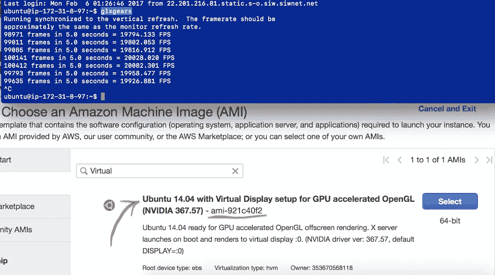
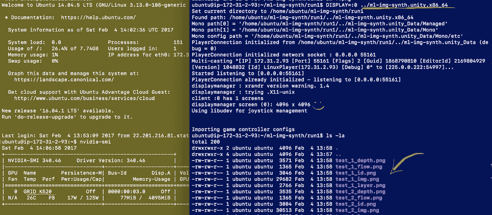

# 如何在亚马逊云上或没有监视器的情况下运行 Unity

> 原文：<https://towardsdatascience.com/how-to-run-unity-on-amazon-cloud-or-without-monitor-3c10ce022639?source=collection_archive---------1----------------------->

经过几天的咒骂和诅咒，我设法让我的 Unity 应用程序在一台“无头”Linux 机器上运行和渲染，这台机器没有物理显示器。最终甚至在亚马逊云上！

最后，所有的问题都是由于 Unity 的*而不是*，而是配置操作系统和驱动程序的问题。一旦我设法让 OpenGL 样本 **glxgears** 在没有监视器的情况下运行，Unity 也能运行。

**TL；DR:** [**给我准备好使用使用 GPU 的亚马逊磁盘镜像。**](https://console.aws.amazon.com/ec2/v2/home?region=us-west-1#LaunchInstanceWizard:ami=ami-921c40f2)

## 为什么有人想在没有显示器的情况下运行 Unity 应用程序？

如果你正在与机器学习合作— [教学代理](https://chatbotslife.com/reinforcement-learning-or-evolutionary-strategies-nature-has-a-solution-both-8bc80db539b3)通过查看像素来玩 Unity 游戏或在 [Udacity 自动驾驶汽车模拟器](https://medium.com/towards-data-science/introduction-to-udacity-self-driving-car-simulator-4d78198d301d)中驾驶。如果你用合成图像来扩充训练集，或者简单地为你的电影渲染大量的帧，你可能想要在远程服务器上运行，在云中运行，或者至少在你自己的桌面上隐藏烦人的窗口。

你仍然需要渲染循环运行和 GPU 工作，所以通常的方法来运行 Unity 作为一个服务器是行不通的。

Linux 来拯救我们了！

## 在没有显示器的服务器上运行带有图形的 Unity 应用程序

假设你有 Linux box(我在 **Ubuntu14.04)** 上测试过)并且已经安装了 NVIDIA 驱动程序并且可以工作。

剩下的工作非常简单——配置虚拟显示器，运行 X 服务器，并确保在与 X 相同的显示器上启动应用程序:

## 在本地机器上运行 Unity 应用程序

当您的 DeepQ 代理正在学习时，隐藏烦人的窗口很有用。

安装[虚拟](https://xpra.org/trac/wiki/Xdummy)和[虚拟](http://www.virtualgl.org)。xduminum 将在屏幕外创建新的虚拟显示，VirtualGL 将捕获传入的 OpenGL 调用，并在真实的 GPU 上执行它们。参见说明:

## 在亚马逊云上运行带有图形的 Unity 应用程序！

现在最有趣和最有价值的部分——在[亚马逊弹性计算云(亚马逊 EC2)](https://aws.amazon.com/ec2/) 上运行 Unity。

亚马逊提供了几个 GPU 选项:旧的 **g2** 实例和更快的 **p2** 实例。到目前为止，我在使用 **Ubuntu 14.04** 的 **g2.2xlarge** 单 GPU 实例上测试了以下内容。

最复杂的部分是找到正确的 NVIDIA 驱动程序，可以支持云上的 GPU。到目前为止，我发现 **367.57** 和 **340.46** 正在使用位于 **g2** 实例内部的 [GRID K520](https://www.techpowerup.com/gpudb/2312/grid-k520) GPU。然而，安装程序有一个问题——它忘记将总线 ID 添加到配置中——需要手动修补文件。

你需要禁用 Ubuntu 自带的新驱动程序。他们对可怜的 K520 没有任何好处。

除此之外——构建并安装 X 服务器，设置虚拟显示并启动 X。

您的应用程序应该准备好在与 x 相同的显示器上启动。

如果你想知道更多关于 NVIDIA 驱动安装的细节，请关注:[https://askubuntu . com/questions/429596/how-to-choose-the-VGA-when-setting-the-x-server/534622 # 534622](https://askubuntu.com/questions/429596/how-to-choose-the-vga-when-setting-up-the-x-server/534622#534622)

# 准备使用亚马逊启动映像

如果你不能被上面的步骤所困扰，那也没关系。我为你创建了可以在 Amazon 上运行 Unity 或任何其他 OpenGL 应用程序的引导磁盘映像(AMI)。

图片包含 Ubuntu 14.04，NVIDIA 驱动 367.57。在启动时，它用虚拟显示器启动 X 服务器。当然，所有的 OpenGL 调用都将在 GPU 上执行。

图像名为: **Ubuntu 14.04，带有针对 GPU 加速 OpenGL** 的虚拟显示设置，可在以下位置获得: **us-west-1** 、 **us-west-2** 和 **us-east** 。

要在亚马逊云上找到它，只需在 AMI 搜索栏中键入“ **Ubuntu GPU** ”或使用链接:[https://console.aws.amazon.com/ec2/v2/home?region = us-west-1 # LaunchInstanceWizard:ami = ami-921 C40 f 2](https://console.aws.amazon.com/ec2/v2/home?region=us-west-1#LaunchInstanceWizard:ami=ami-921c40f2)

***PS:*** *出于测试目的，你可以下载我的小 Unity app，它会渲染一些盒子，抓取截图并写入磁盘:*[*【https://www.dropbox.com/s/abycjktjzmkrmb4/auto.zip?dl=0】*](https://www.dropbox.com/s/abycjktjzmkrmb4/auto.zip?dl=0)

