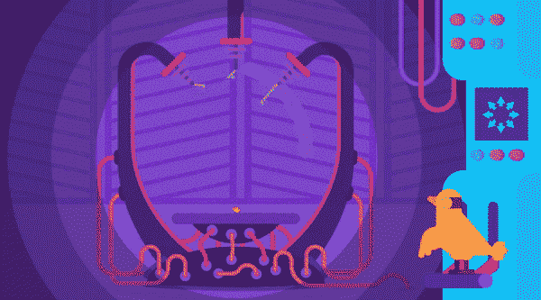
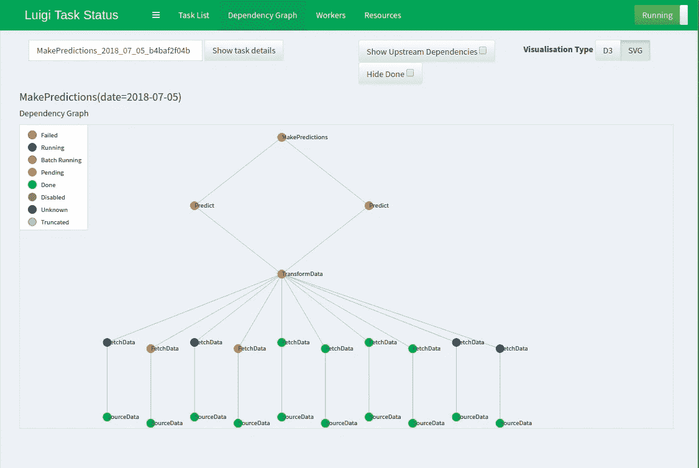
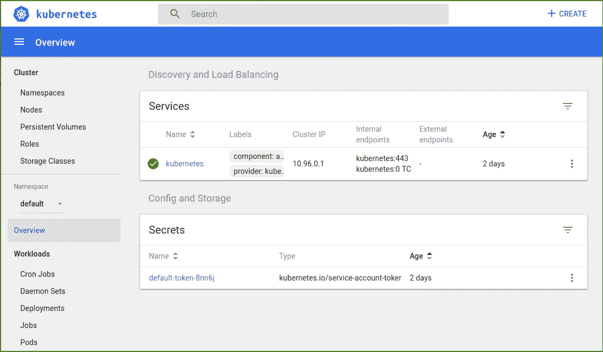
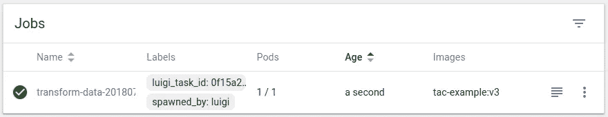

# 如何扩展您的机器学习管道

> 原文：<https://towardsdatascience.com/how-to-scale-your-machine-learning-pipeline-dc820bb9460c?source=collection_archive---------5----------------------->

## 使用 Luigi、Docker 和 Kubernetes 并行化和分发您的 Python 机器学习管道



kurzgesagt.org

本文介绍了将您的机器学习应用程序从简单的 Python 程序转变为运行在集群上的**可伸缩管道的最简单方法。**

查看 [Github 库](https://github.com/datarevenue-berlin/tac-example)中现成的示例代码。

# 您将学到的内容:

*   如何使用`[luigi](http://luigi.readthedocs.io/)`管理任务
*   如何用`[click](http://click.pocoo.org/6/)`轻松创建 python 脚本的命令行界面
*   如何在多个 Docker 容器中运行管道
*   如何在您的机器上部署小型集群
*   如何在集群上运行应用程序

# 不要计算两次——Luigify 你的管道

您的应用程序中的一些函数可能非常耗时，并且会返回大量输出，因此，如果您的管道在运行过程中出现故障，无论出于什么原因，**修复一个小错误并重新运行所有内容都将花费您大量的时间和精力。**

让我们做点什么吧。

假设您的管道需要做以下事情:

1.  获取最近 10 天的数据；
2.  转换数据；
3.  用两种不同的模型做预测。

您可以像这样编写工作流:

但是这段代码很容易出错，比如在下载数据时可能发生的错误——一个网络错误，您所做的所有工作都会丢失。此外，如果您今天下载了最近十天的数据，并计划明天再次运行相同的管道，**再次下载 90%的必要数据没有多大意义。**

> 那么如何才能避免同样的事情做两次呢？

当然，您可以想出如何保存和重用中间结果的想法，但是没有必要自己编写代码。

我推荐使用`[luigi](http://luigi.readthedocs.io/)`套装。它让您可以轻松地将代码划分为单独的数据处理单元——称为任务——每个单元都有具体的需求和输出。

您的任务之一可能如下所示:

从这个片段中，我们可以看到:

*   任务名称为`TransformData`；
*   任务有一个参数，即`date`；
*   这取决于`FetchData`类的十个任务，前十天各一个；
*   它将其输出保存在一个以`date`参数命名的 CSV 文件中。

下面我给出了一个完整的虚拟管道的例子。花点时间分析任务的依赖关系是如何创建逻辑管道的:

现在，当您尝试运行`MakePredictions`任务时，Luigi 将确保所有上游任务都提前运行。尝试用`pip install luigi`安装 Luigi，将上面的例子保存在`task-dummy.py`中，然后运行这个命令:

```
PYTHONPATH=. luigi --module task-dummy MakePredictions --date 2018-01-01 --local-scheduler
```

此外，当输出已经存在时，Luigi 不会运行任何任务。尝试再次运行相同的命令——Luigi 将报告给定日期的`MakePredictions`已经完成。

[在这里](https://luigi.readthedocs.io/en/stable/example_top_artists.html)你可以找到另一个帮助你开始学习 Luigi 的好例子。

# 免费并行— Luigi workers

> 我可以同时运行多个任务吗？

是的，你可以！Luigi 提供了开箱即用的功能。例如，只需在命令中添加
`--workers 4`，就可以让 Luigi 同时运行四个任务。

让我们利用这个机会来介绍一下 Luigi 的图形界面。

打开第二个终端并运行以下命令:

```
luigid
```

这将启动一个所谓的*中央 Luigi 调度器*，它监听默认端口 8082。你可以在你的浏览器上查看它漂亮的仪表盘: [http://localhost:8082](http://localhost:8082/) 。

现在回到第一个终端——您可以再次运行 Luigi 命令，这一次不带`--local-scheduler`参数(不要忘记删除您已经创建的文件，或者选择另一个日期来查看任务的执行情况)。如果需要并行，在命令中添加`--workers 4`。刷新仪表板页面后，您应该会看到一个计划任务列表。点击`MakePredictions`任务旁边的树图标，查看它所有的依赖项(是不是很漂亮？):



# 大规模并行—迁移到集群

现在我们开始认真起来——如果一台机器不足以让您并行运行任务，您可以将您的管道提升到下一个级别，并将其部署在集群上。我会引导你完成所有必要的步骤。

在前面的示例中，所有文件都保存在执行任务的同一台计算机上。

> 那么，如何在集群中的多台机器之间共享文件呢？

这个问题有很多答案，但我们将专注于其中一种可能的方式——使用亚马逊的 S3。

AWS S3 是一个简单的存储服务。它可以让你把你的文件存储在云端。你将文件保存在`s3://bucket/data/file.csv`下，而不是`/home/user/data/file.csv`。Python 提供了一些工具，可以轻松地从本地存储切换到 S3。

*为了简化本教程，如果你想遵循下面的说明，我需要你* ***建立一个免费的 AWS 试用帐户*** *你将使用它来存储你的文件。你可以在这里做*[](https://portal.aws.amazon.com/billing/signup)**而且一年内完全免费。如果你不再需要它，你可以选择退出。**

**创建账户后，到* [*这里*](https://s3.console.aws.amazon.com/s3) *创建一个桶。把一个桶想象成硬盘上的一个分区。**

*为了从 S3 读取和写入数据，我们将使用`luigi.contrib.s3.S3Target`类。您可以通过简单地添加一个适当的导入并替换任务定义中的`LocalTarget`来修改这个虚拟示例，正如我在这里所做的:*

*你还需要删除所有的`self.output().makedirs()`来电，因为你不需要在 S3 上创建文件夹。*

*要使用 Luigi 的 S3 功能，您必须`pip install boto3`。*

*您还需要为 S3 认证提供您的应用程序凭证。让我们使用最简单的方法:您可以在[站点](https://console.aws.amazon.com/iam/home#/security_credential)上创建一个新的访问密钥。您将获得一个访问密钥 ID 和一个秘密访问密钥——分别保存在环境变量`AWS_ACCESS_KEY_ID`和`AWS_SECRET_ACCESS_KEY`中。*

*现在，您的应用程序应该能够读写 AWS S3 的数据。通过再次运行管道来尝试一下。*

# *将您的管道容器化，放在一个集群上*

*可悲的是，你不能把你的 Python 代码放在一个集群上，然后直接执行它。但是，您可以在某个容器中运行某个命令。*

*我将向您展示如何重构您的管道，以便在单独的 Docker 容器中运行每个任务。*

## *将您的任务转化为迷你程序—通过点击添加一个简单的 CLI*

*在容器中运行任务的第一步是让它们可以从命令行运行。*

> *用 Python 写 CLI 最快的方法是什么？*

*回答:[点击](http://click.pocoo.org/6/)。Click 是一个非常棒的软件包，它使得创建命令行界面变得非常容易。*

*让我们回到`TransformData`任务的例子(不是虚拟的)。它的`run()`方法调用两个函数，即`transform_data`和`save_result`。假设这些函数是在名为`transform.py`的文件中定义的:*

*现在让我们从命令行运行这些功能:*

*这里，我们定义了一个函数(`cli`)，当我们从命令行运行这个脚本时会调用这个函数。我们指定第一个参数将是一个输出路径，所有进一步的参数将组成一个输入路径元组。运行`pip install click`之后，我们可以从命令行调用数据转换:*

```
*python transform.py s3://your-bucket/output.csv input1.csv input2.csv*
```

*为了方便起见，我们把我们的项目叫做`tac`(为什么不重要)。如果您将`setup.py`添加到项目中，并将`pip install`添加到项目中(查看[示例项目](https://github.com/datarevenue-berlin/tac-example)以了解项目应该如何构建，并且不要忘记将`__init__.py`添加到包目录中)，您应该能够运行您的脚本:*

```
*python -m tac.transform s3://your-bucket/output.csv input1.csv input2.csv*
```

## *让东西变得可移植——在容器中运行任务*

*现在的问题是:*

> *如何轻松创建一个 Docker 容器来运行我的命令？*

*嗯，那很简单。*

*首先，在项目根目录下创建一个`requirements.txt`文件。您将需要以下软件包:*

```
*click 
luigi 
boto3 
pykube # we'll talk about this one later*
```

*现在，在项目根目录下创建一个`Dockerfile`,并将它放入:*

```
*FROM python

COPY requirements.txt /requirements.txt
RUN pip install -r /requirements.txt
COPY . /tac
RUN pip install /tac

ARG AWS_ACCESS_KEY_ID
ENV AWS_ACCESS_KEY_ID=${AWS_ACCESS_KEY_ID}

ARG AWS_SECRET_ACCESS_KEY
ENV AWS_SECRET_ACCESS_KEY=${AWS_SECRET_ACCESS_KEY}*
```

*让我们来分解一下:*

*   *`FROM python`给我们一个安装了 python 的基础映像。*
*   *`COPY requirements.txt /requirements.txt`和`RUN pip install -r /requirements.txt`安装所有需要的软件包。*
*   *`COPY . /tac`和`RUN pip install /tac`安装我们的项目。*
*   *最后四行将让我们在构建时在映像中设置 AWS 凭证(这不是一个好的做法，但让我们保持本教程简单)。*

*现在，您可以通过从项目根目录执行来构建包含项目的 Docker 映像(假设您在 env 变量中仍有 AWS 凭证):*

```
*docker build -t tac-example:v1 . --build-arg AWS_ACCESS_KEY_ID=$AWS_ACCESS_KEY_ID --build-arg AWS_SECRET_ACCESS_KEY=$AWS_SECRET_ACCESS_KEY*
```

*因此，您刚刚构建了一个标记为`tac-example:v1`的 Docker 映像。让我们看看它是否有效:*

```
*docker run tac-example:v1 python -m tac.transform s3://your-bucket/docker-output.csv input1.csv input2.csv*
```

*这应该会在您的 S3 存储桶中保存一个`docker-output.csv`文件。*

## *与集群对话—准备要在 Kubernetes 中运行的任务*

*如果您想在一个集群中运行所有或者部分管道任务，Luigi 提供了一个解决方案。*

*看一看`uigi.contrib.kubernetes.KubernetesJobTask`。*

*长话短说，Kubernetes 是一个可以管理集群的系统。如果你想和一个集群互动，可以和 Kubernetes 交流。*

*要在集群中运行一段代码，您需要向 Kubernetes 提供以下信息:*

*   *应该用于创建容器的图像；*
*   *应为容器指定的名称；*
*   *应该在容器中执行的命令。*

*让我们修改来自虚拟管道的旧任务`TransformData`,以符合这些需求。*

*   *首先，将基类更改为“KubernetesJobTask”:*

```
*from luigi.contrib.kubernetes import KubernetesJobTask

class TransformData(KubernetesJobTask):
    date = luigi.DateParameter()*
```

*   *给它起个名字:*

```
 *@property
    def name(self):
        return 'transform-data'*
```

*   *定义应该运行的命令:*

```
 *@property
    def cmd(self):
        command = ['python', '-m', 'tac.transform', 
                   self.output().path]
        command += [item.path for item in self.input()]
        return command*
```

*   *提供要传递给 Kubernetes 的信息:*

```
 *@property
    def spec_schema(self):
        return {
            "containers": [{
                "name": self.name,
                "image": 'tac-example:v1',
                "command": self.cmd
            }],
        }*
```

*   *删除`run()`方法，因为它是由`KubernetesJobTask`实现的。*
*   *此外，运行`pip install pykube`，因为这是`KubernetesJobTask`的要求。*

*您应该会得到类似于您在[示例项目](https://github.com/datarevenue-berlin/tac-example/blob/master/tac/task-dummy.py)中看到的东西。*

*但是在连接到集群之前，我们无法运行它。继续读。*

# *家居集群— Kubernetes 和 Minikube*

> *如何在不访问集群的情况下在集群中运行管道？*

*最酷的是，你实际上可以在你的笔记本电脑上运行一个真实集群的迷你版本！*

*你可以用 [Minikube](https://kubernetes.io/docs/setup/minikube/) 来做这件事。Minikube 在您计算机上的虚拟机内运行单节点(单机)集群。*

*现在花点时间安装 Minikube。你可以在这里找到说明。你需要这些说明中提到的所有部件。*

*安装后，您应该能够运行*

```
*minikube start*
```

*启动您的本地集群。耐心点，因为这可能需要一段时间，尤其是当你第一次做的时候。验证您的群集正在运行*

```
*kubectl cluster-info*
```

*您应该会看到类似如下的内容:*

```
*Kubernetes master is running at https://192.168.99.100:8443
KubeDNS is running at https://192.168.99.100:8443/api/v1/...*
```

*如果一切正常，您应该能够访问 Kubernetes 的仪表板，其中显示了您的集群的当前状态:*

```
*minikube dashboard*
```

*将会打开一个新的浏览器选项卡，并向您显示以下内容:*

**

*由于集群运行在一个单独的(虚拟)机器上，它不能访问您的 Docker 映像(因为您没有将它推送到任何在线注册表)。我们将使用一个小技巧来克服这一点。*

*以下命令会将您当前的控制台会话设置为不使用本地 docker 引擎，而是使用集群虚拟机的 Docker 引擎来执行 Docker 命令:*

```
*eval $(minikube docker-env)*
```

*现在你需要做的就是再次调用`docker build`命令。这一次，您的映像将构建在虚拟机内部:*

```
*docker build -t tac-example:v1 . --build-arg AWS_ACCESS_KEY_ID=$AWS_ACCESS_KEY_ID --build-arg AWS_SECRET_ACCESS_KEY=$AWS_SECRET_ACCESS_KEY*
```

*关键时刻到了。*

*我们将在刚刚配置的集群中执行管道。*

*如果一切顺利，只需调用 Luigi 命令就足够了。Minikube 已经设置了适当的配置，所以`KubernetesJobTask`知道目标 Kubernetes 在哪里运行。*

*所以试着从`task-dummy.py`所在的目录执行这个命令:*

```
*PYTHONPATH=. luigi --module task-dummy MakePredictions --date 2018-01-01*
```

*并观察您的`TransformTask`作业如何在集群中运行:*

**

# *尾注*

*   *如果`KubernetesJobTask`报告如下消息:`No pod scheduled by transform-data-20180716075521-bc4f349a74f44ddf`并且无法运行，这可能是 Luigi 错误，而不是您的错。检查仪表板，查看`transform-data-…` Pod 是否处于状态`Terminated:Completed`。如果是这样，那么任务实际上已经完成，再次运行管道应该可以解决问题。*
*   *考虑一下 Google Kubernetes 引擎如何构建一个真正的集群。*
*   *当使用谷歌的集群时，考虑从 AWS S3 切换到谷歌云存储，以显著加快数据访问速度。[这个模块](http://luigi.readthedocs.io/en/stable/api/luigi.contrib.gcs.html)应该会有帮助。*
*   *阅读更多关于使用 Dask 和 Kubernetes 加速管道的信息。*

**原载于*[*www.datarevenue.com*](https://www.datarevenue.com/en/blog/how-to-scale-your-machine-learning-pipeline)*。**