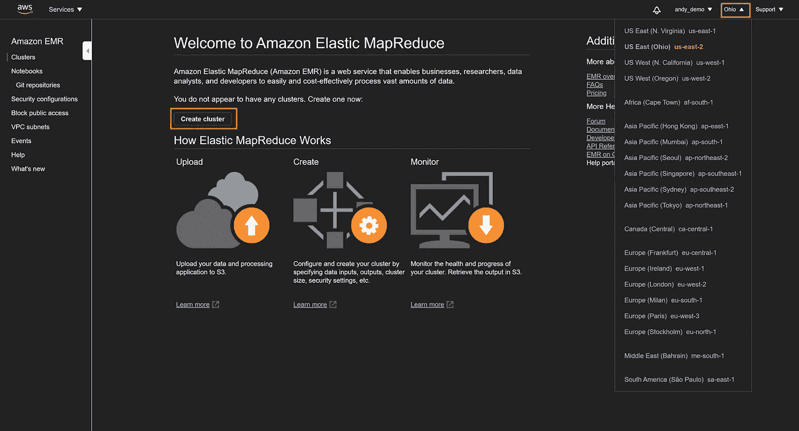
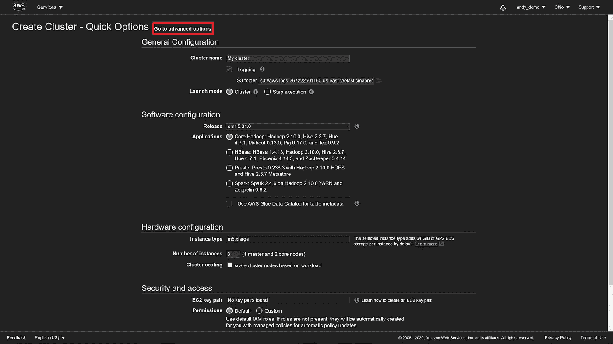
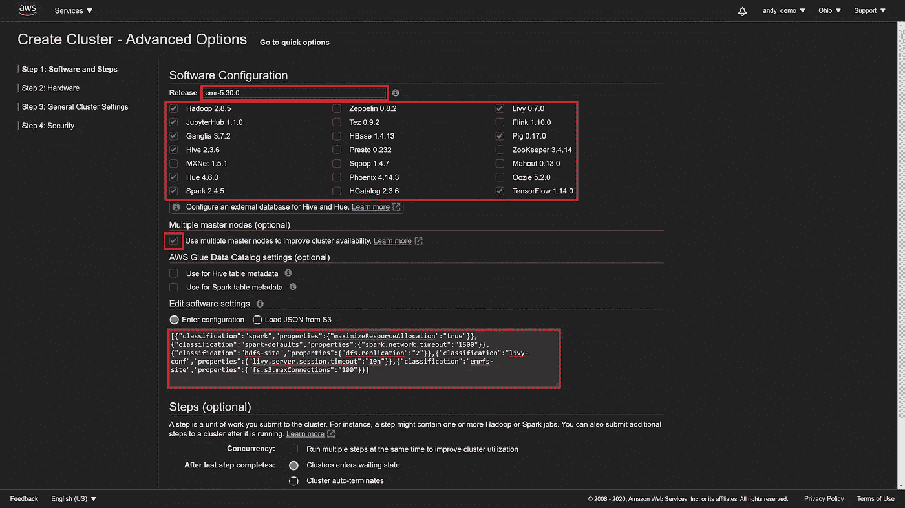
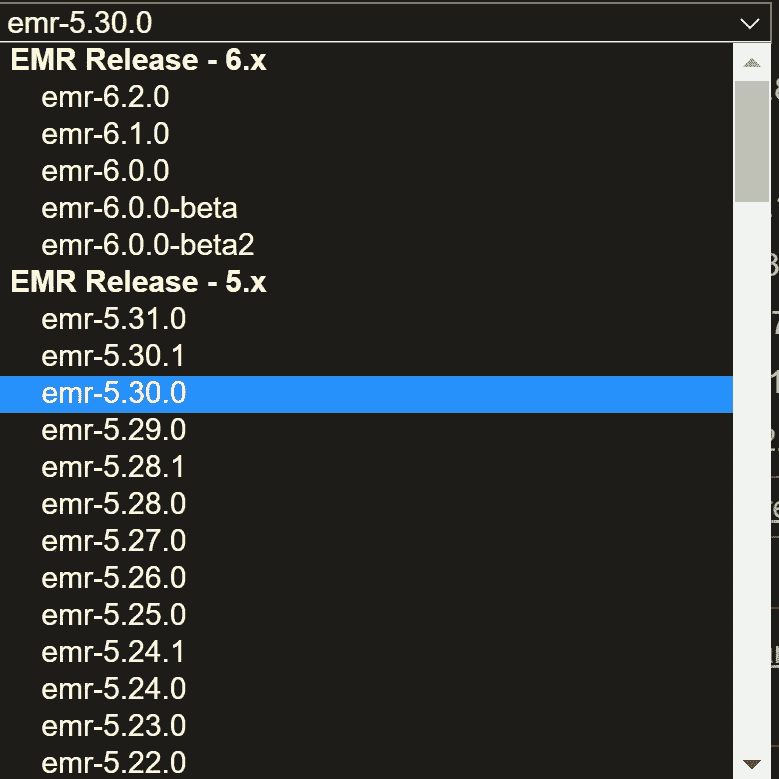
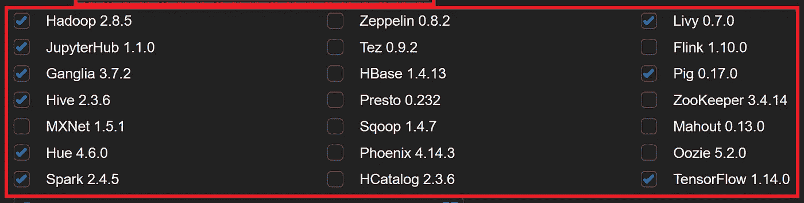
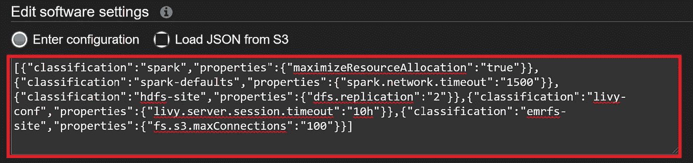
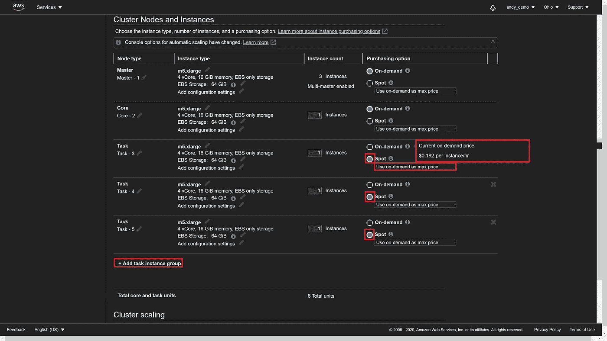
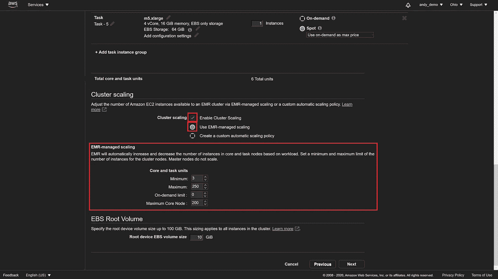
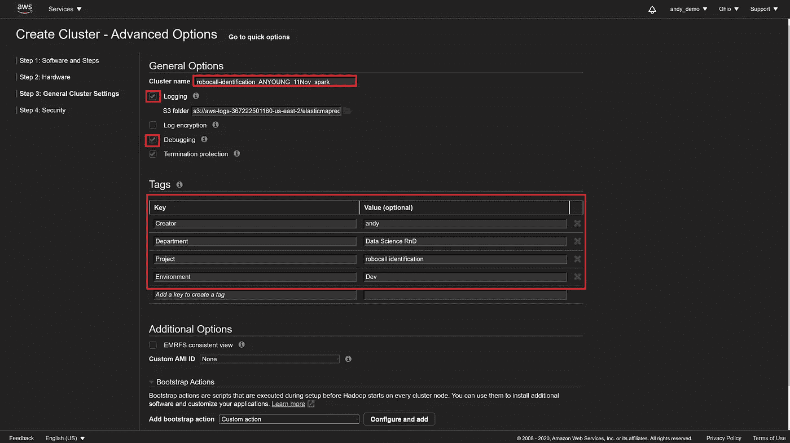
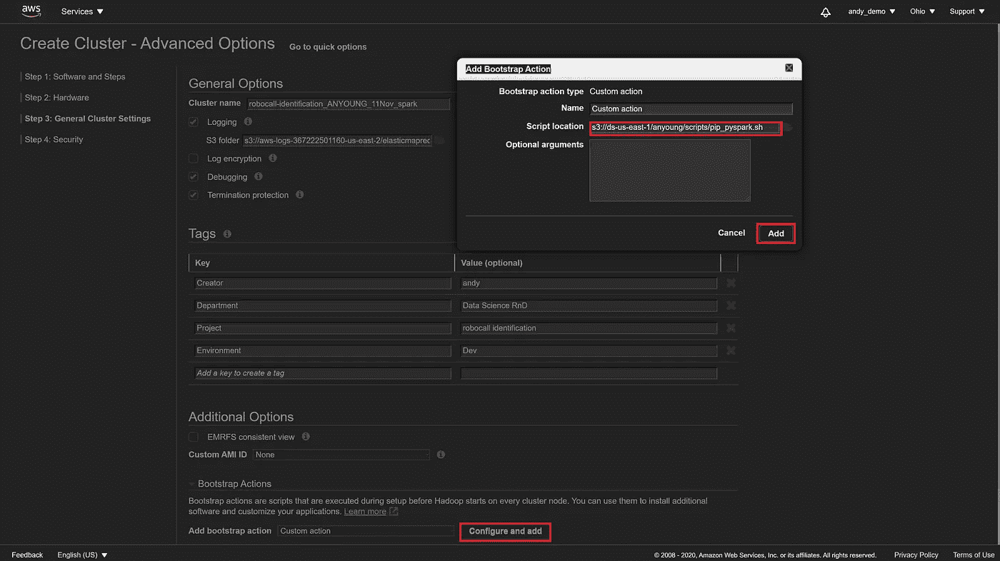

# 如何为 SparkSQL 设置经济高效的 AWS EMR 集群和 Jupyter 笔记本电脑(2020 年 11 月更新)

> 原文：<https://towardsdatascience.com/how-to-set-up-a-cost-effective-aws-emr-cluster-and-jupyter-notebooks-for-sparksql-552360ffd4bc?source=collection_archive---------8----------------------->

## 高级数据科学技能


Photo by [Myriam Jessier](https://unsplash.com/@mjessier?utm_source=unsplash&utm_medium=referral&utm_content=creditCopyText) on [Unsplash](https://unsplash.com/s/photos/data?utm_source=unsplash&utm_medium=referral&utm_content=creditCopyText)

这是一篇基于我个人工作笔记的生活类文章。随着时间的推移，AWS 界面和选项发生了很大的变化，所以我会在空闲时间不断更新本文。

> 我在一家国际信息服务公司工作，处理来自各个领域的数百个数据源，因此本文的主题对我和许多其他人来说都很重要。不要浪费时间处理我已经有的问题！

# 入门指南

创建 EMR 集群有三种主要方式:

1.  从头开始创建一个，这在本文中有详细介绍。
2.  克隆现有的 EMR 集群。如果您正在克隆其他人的集群，您只需更改集群名称、指定您的 RSA 密钥、启用集群自动缩放并更改集群标签*(即* `*creator*` *、* `*product*` *等)。一些公司使用标签来自动应用规则到你的集群，像闲置 X 分钟自动终止，S3 数据访问权限和会计/预算。)*您要克隆的集群不必当前处于活动或运行状态，即它可以处于`terminated` 或`running`状态。我喜欢使用如下的命名分类法，因为它具有足够的描述性和唯一性，我可以在以后的克隆中找到:
    `project-name_myuseridANYOUNG_DDMM_spark.` 一旦你创建了一个特定于你的项目类型的集群，这个过程在将来会更加简单，因为你不需要改变你的集群标签，只需要偶尔改变你的集群名称。
3.  使用 AWS CLI。这是最快最有效的方法。但是，这也是最先进的方法，并且配置最适合您项目的参数的前期成本很高。对于本文的读者来说，我只在尝试了前两种方法后才推荐这种方法。

# 步骤 0:创建 EMR 集群

选择右上方的区域。区域影响成本和延迟，这与实时应用相关。点击`Create cluster`按钮。



Image source: author, taken Nov. 2020.

# 步骤 1:软件配置

点击`"Go to advanced Options."`



Image source: author, taken Nov. 2020.

选择如下所示的配置，然后单击下一步。



I recommend installing more software than you need if: 1\. you work on a variety projects 2\. you want a one-size-fits-most cluster to clone in the future. Image source: author, taken Nov. 2020.



Image source: author. Taken Nov. 2020.

如果您打算在笔记本中安装 Python/Scala 包和 SQL 函数，请确保选择的`Release`是`emr-5.30.0` **。有些包，尤其是实现新算法的包，不能通过带有`!pip install`或`pypi`的笔记本安装在集群的所有节点上。在撰写本文时，无论是我还是多个企业 AWS 技术支持成员(国外和美国都有，如果这对你很重要的话)都无法在任何更高版本的`emr`上安装包，尽管进行了数周的试验。坦率地说，我在使用 emr-5.30.0 版本时没有遇到任何问题，尽管目前有这么多更新的版本。**



Software configuration that I recommend for a one-size-fits-most cluster. Image source: author, taken Nov. 2020.

默认情况下，选择并安装 Hadoop、Hive 和 Ganglia 应用程序。你将不得不添加火花和其他你可能需要的。安装比您需要的更多的软件的后果是，集群将需要更长的启动时间，但在大多数情况下，额外的等待时间可以忽略不计。

一个可选步骤优化您的集群以读取存储在 S3 的 Parquet 格式的文件，在 PySpark 数据框中处理它们，并防止在尝试从 Jupyter 笔记本中长时间运行 Spark 作业时出现常见错误。完成上述任务的代码，



Image source: author, taken Nov. 2020.

**编辑软件设置，进入配置**，添加以下 JSON 代码:

```
[{"classification":"spark","properties":{"maximizeResourceAllocation":"true"}},{"classification":"spark-defaults","properties":{"spark.network.timeout":"1500"}},{"classification":"hdfs-site","properties":{"dfs.replication":"2"}},{"classification":"livy-conf","properties":{"livy.server.session.timeout":"10h"}},{"classification":"emrfs-site","properties":{"fs.s3.maxConnections":"100"}}]
```

解释:

```
"maximizeResourceAllocation":"true" -- Configures your executors to utilize the maximum resources possible on each node in a cluster. This EMR-specific option calculates the maximum compute and memory resources available for an executor on an instance in the core instance group. It then sets the corresponding spark-defaults settings based on this information. [[reference](https://docs.aws.amazon.com/emr/latest/ReleaseGuide/emr-spark-configure.html#emr-spark-maximizeresourceallocation)]"livy.server.session.timeout":"10h" -- addresses errors from long-running Spark tasks in a Jupyter/EMR notebook that die after an hour of execution: 
An error was encountered:
Invalid status code '400' from https://xxx.xx.x.xxx:18888/sessions/0/statements/20 with error payload: "requirement failed: Session isn't active." [[reference](https://stackoverflow.com/questions/54220381/how-to-set-livy-server-session-timeout-on-emr-cluster-boostrap)]"fs.s3.maxConnections":"100" -- addresses the “Timeout waiting for connection from pool” error [[reference](https://aws.amazon.com/premiumsupport/knowledge-center/emr-timeout-connection-wait/)]
```

# 步骤 2:硬件配置

选择内部 AWS 工程团队指定的**网络**和**子网，或者保留默认设置**。

对于 Spark 作业，建议申请以下实例数量和类型:

1 个**主**节点实例、
1 个**核心**节点实例、
1 个**任务**节点实例各 1-3 种不同类型，即`r4.2xlarge`、`r5.2xlarge`、`r5.4xlarge`等。



Image source: author, taken Nov. 2020.

对于任务节点，选择**现货**定价，选择**按需作为最高价格**。我们愿意为主节点和核心节点支付“按需”价格，因为主节点总是需要对我们连续可用，而任务节点可以基于市场定价(“现货”定价)来来去去。


Image source: author, taken Nov. 2020.

在我上面的截图中，我显示按需价格是每实例小时 0.192 美元；相同实例类型、地区和日期的现货价格显示在左侧:0.040 美元/实例小时。**按需定价**几乎贵了 5 倍！

> 我推荐固定数量的实例的原因是因为我们正在构建一个**自动伸缩的集群:**实例的数量将根据您的工作的计算压力和您指定的自动伸缩规则而增加或减少。

在实施自动扩展规则之前，为每个 **EBS 卷实例**将**核心和任务**节点的 **EBS 存储**类型调整到至少 500 GB 的**吞吐量优化 HDD (ST1)** 。您还可以为每个“ **EBS 卷实例**”增加“**实例**的数量一般来说，我有两个卷实例，每个实例有 500 GB，核心总共有 1000 GB。如果您正在处理大数据，请添加更多实例/内存。**主**节点不需要 EBS 存储。

*当在 S3 使用 Spark 时，中间数据被写入磁盘临时本地存储，而不是在 HDFS，因此当处理大型数据集时，为实例提供更多存储是有用的。我们选择 500 GB 的硬盘驱动器(HDD)而不是固态驱动器(SSD)上的 32 GB 存储，因为写入速度的瓶颈将是互联网速度而不是 HDD 写入速度，并且 HDD 更便宜。*

# 步骤 2*:集群扩展(2020 年 7 月发布)

这对我来说是最重要的一步，也是 AWS 在 2020 年 7 月 7 日发布了 [EMR 管理的自动缩放功能后最简单的一步。这曾经是一个非常痛苦、耗时的过程，但现在变得非常容易。自动缩放是这样完成的:](https://aws.amazon.com/blogs/big-data/introducing-amazon-emr-managed-scaling-automatically-resize-clusters-to-lower-cost/)

选中`Enable Cluster Scaling`并使用默认`Use EMR-managed scaling.`主节点不可伸缩，因此这只影响核心和任务节点。

> 根据我正在做的事情，我喜欢将核心和任务节点的最小数量保持在 1 到 3 之间。1 如果我正在试验一个新项目，3 如果我想安全行事，保证在关键任务的最后期限内不会出现任何问题。

*   **简单来说:核心节点是数据存储，任务节点是计算**。处理更大的数据？允许更多的核心节点以避免内存问题(进一步阅读: [AWS 文档](https://docs.aws.amazon.com/emr/latest/ManagementGuide/emr-master-core-task-nodes.html))
*   **将最大节点数设置为一个较大但合理的数值。我根据自己的项目选择 250 到 1000 之间的一个数字。**在理论和实践中，最大数量的节点只会在需要的时候被征用。但是，从理论上讲，用户错误和/或未知的未知因素也有可能导致您的集群占用大量接近无穷大的节点。一个合理的数字是一个防止预算超支的数字，并允许对你的最大燃烧速度进行一些控制。在三年多的时间里，我经常在 AWS 上处理数十 Pb 的数据，最大节点数不超过 1000 个，没有出现任何问题。
*   将**按需限制**设置为 0。我们不想为节点支付按需价格，因为它们比现货价格高 5 倍！我将随时以现货价格(每实例小时 0.040 美元)购买一个 **m5.xlarge** 节点，而不是以按需价格(每实例小时 0.100 美元)购买一个 **m4.large** 节点！(注意，这是指定多个实例类型允许您“套利”AWS 节点投标系统的地方，因为您可以以更低的采购成本获得更大的能力)。
*   将最大核心节点设置为接近但不等于最大值的高值。在下面的例子中，我将其设置为 200，最多 250 个节点。我这样做是为了让我的集群可以自由地分配我的节点；如果我需要的核心节点比任务节点多，那就给我弄来。



Image source: author, taken Nov. 2020.

# 步骤 3:常规集群设置

下面的要点后面提供了截图示例。

*   描述性地命名集群。这使您能够记住它的用途以及您仅通过查看名称就能设置的一些参数。我喜欢使用如下所示的集群命名分类法，因为它具有足够的描述性和唯一性，便于我日后进行克隆:
    `project-name_myuseridANYOUNG_DDMM_spark.`
*   始终启用**记录**和**调试**。您需要同时启用这两个功能，以便对错误进行故障排除，或者在 AWS 技术支持下进行调试。
*   填写标签中的标签，以帮助跟踪贵公司工程团队指定的使用情况、预算和自动化集群策略。下面是标签示例:

**创建者**:输入你的名字或其他一些唯一的标识符。
**项目**:一个详细描述你正在进行的项目的有用名称。
**部门**:【数据科学 R & D、数据科学分析、其他】
**环境**:【开发、测试、生产】

克隆此群集时会复制这些设置，因此如果您要克隆其他人的群集，请根据需要进行更改。如果您正在克隆您自己的旧集群，您可能不需要做太多改变！



Image source: author, taken Nov. 2020.

# 步骤 3*:引导安装脚本

您需要一个引导脚本来在 EMR 集群的所有节点上安装软件包。以下是实现这一点的步骤:

1.  用以下内容创建一个`.sh`文件并保存在 S3:

Author’s code

```
#!/bin/bash -xesudo pip install \
 pandas \
 numpy \
 xgboost \
 scikit-learn \
 nbextensions
```

2.指定引导操作脚本 S3 位置:



Image source: author, taken Nov. 2020.

# 步骤 4:安全设置

如果您在大型企业环境中工作，您可能需要指定这些设置。选择您的 EC2 密钥对和 EC2 实例角色。我将撰写另一篇文章，介绍如何创建 EC2 密钥对，允许登录主节点进行故障排除/测试。下面的截图是一个虚拟的 AWS 帐户，所以我没有创建 EC2 密钥对，因此警告说不能 SSH 到它。


Image source: author, taken Nov. 2020.

# 步骤 5:创建后监视集群

点击**创建集群**后，仪表盘页面显示状态为**开始**，设置完成后变为**【等待】**。

请注意，您可以对正在运行的 EMR 集群进行动态调整。例如，您可以通过克隆一个“step”脚本并在 S3 将输入文件更改为新上传或修改的`.sh`脚本来安装软件。

# 第六步:使用电子病历笔记本(2018 年 11 月发布)

命名并配置您的笔记本。将其附加到您创建的 EMR 集群。即使在 EMR 集群终止后，笔记本仍然存在。EMR 笔记本很好，因为您可以通过浏览器连接，每个包含 PySpark 代码的单元格在执行后都有其作业进度跟踪。

# 关于作者

安德鲁·杨是 Neustar 的 R&D 数据科学家经理。例如，Neustar 是一家信息服务公司，从航空、银行、政府、营销、社交媒体和电信等领域的数百家公司获取结构化和非结构化的文本和图片数据。Neustar 将这些数据成分结合起来，然后向企业客户出售具有附加值的成品，用于咨询、网络安全、欺诈检测和营销等目的。在这种情况下，Young 先生是 R&D 一个小型数据科学团队的实践型首席架构师，负责构建、优化和维护一个为所有产品和服务提供信息的系统，该系统为 Neustar 带来了超过 10 亿美元的年收入。(在 LinkedIn[上关注他，了解数据科学的最新趋势！)](https://bit.ly/2X4uJzX)

# 更多热门文章:

*   [隔离森林是目前最好的大数据异常检测算法](/isolation-forest-is-the-best-anomaly-detection-algorithm-for-big-data-right-now-e1a18ec0f94f)
*   [高效数据科学家必备的演示工具](/must-know-presentation-tools-for-the-effective-data-scientist-93e618ffc8c2)

# 过时的说明(备案)

由于 AWS Engineering 于 2020 年 7 月 7 日发布，以下说明已过时:[引入 Amazon EMR 托管扩展—自动调整集群大小以降低成本](https://aws.amazon.com/blogs/big-data/introducing-amazon-emr-managed-scaling-automatically-resize-clusters-to-lower-cost/)

接下来，定义自动扩展策略。对于**核心**节点，将最大实例数设置为 100(或其他合理的值)，将最小实例数设置为 1。选中规则中默认的**横向扩展**和**比例的复选框，因为它们性能良好。对于**任务**节点类型，将最大实例数设置为 50，最小实例数设置为 0。检查**规则中默认**横向扩展**和**比例的复选框，因为它们执行良好。如果由于某种原因默认规则不可见，请手动添加它们。有两个**横向扩展**规则:**

1.  “rule1”:如果**YARNMemoryAvailablePercentage**比 15 小 **1** 五分钟，冷却时间 **300** 秒，则增加 **1** 实例。
2.  “规则 2”:如果 **ContainerPendingRatio** 大于 0.75**0.75**持续 **1** 五分钟，冷却时间为 **300** 秒，则添加 **1** 实例。

在标尺中增加一个**标尺:**

1.  “rule1t”:如果**YARNMemoryAvailablePercentage**大于 **75** 持续 **1** 五分钟，冷却时间为 **300** 秒，则终止 **1** 实例。

*任何横向扩展规则都不能与任何纵向扩展规则同名。注意，最大实例数在技术上是任意的，但是为了安全起见，不要给出一个荒谬的数字。大致来说，运行 10 小时的 10 节点集群的成本与运行 1 小时的 100 节点集群的成本相同，因此最好在需要时征用所需的节点。*