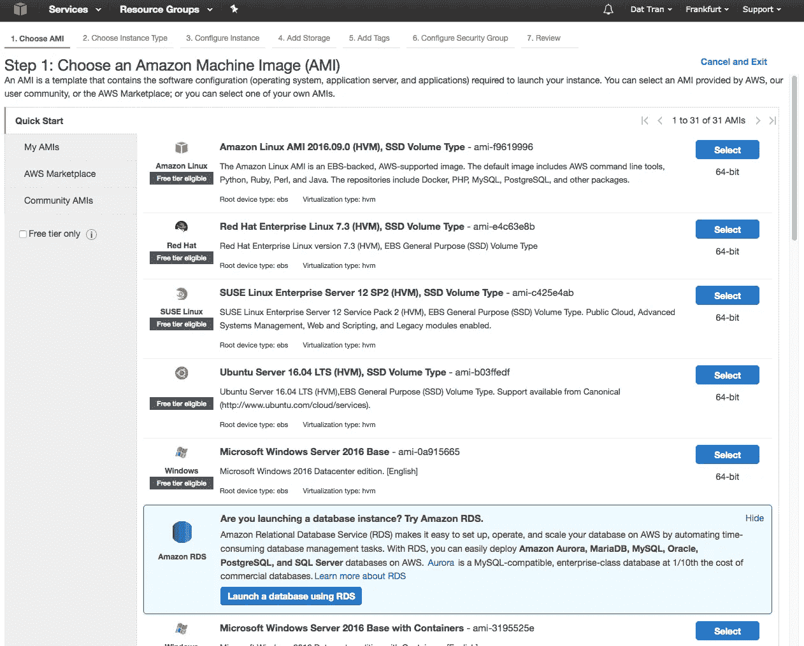
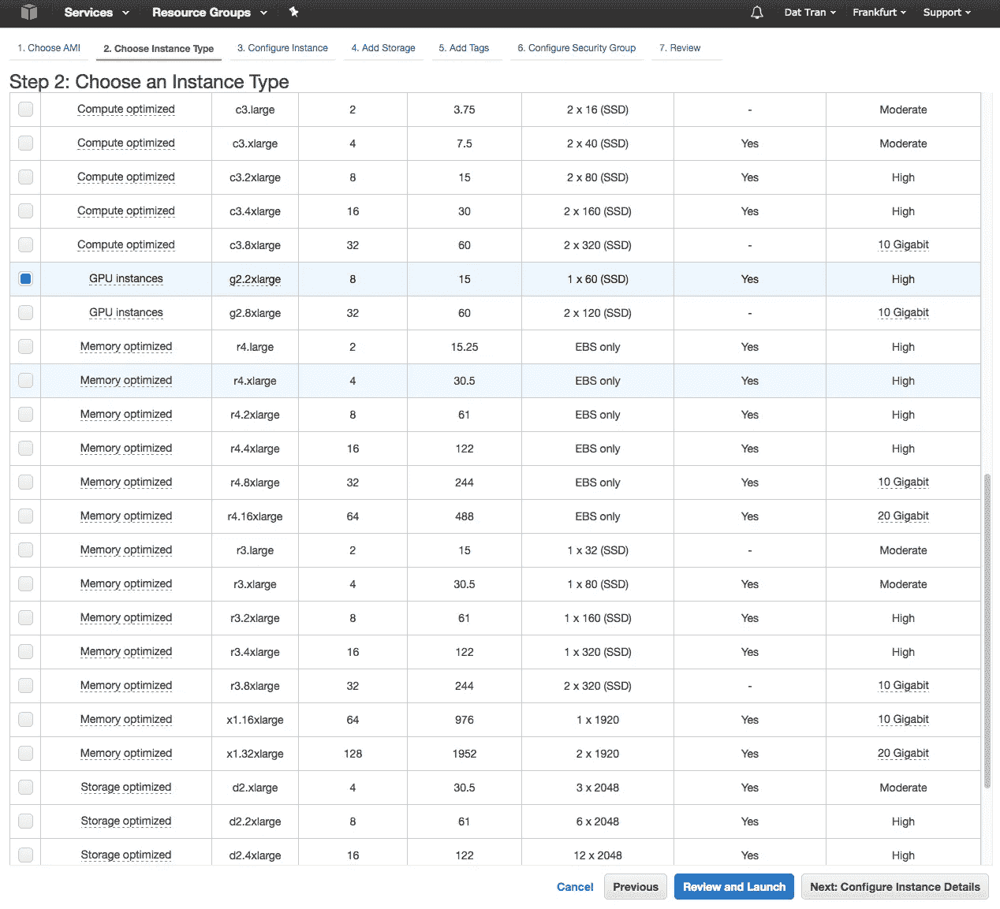
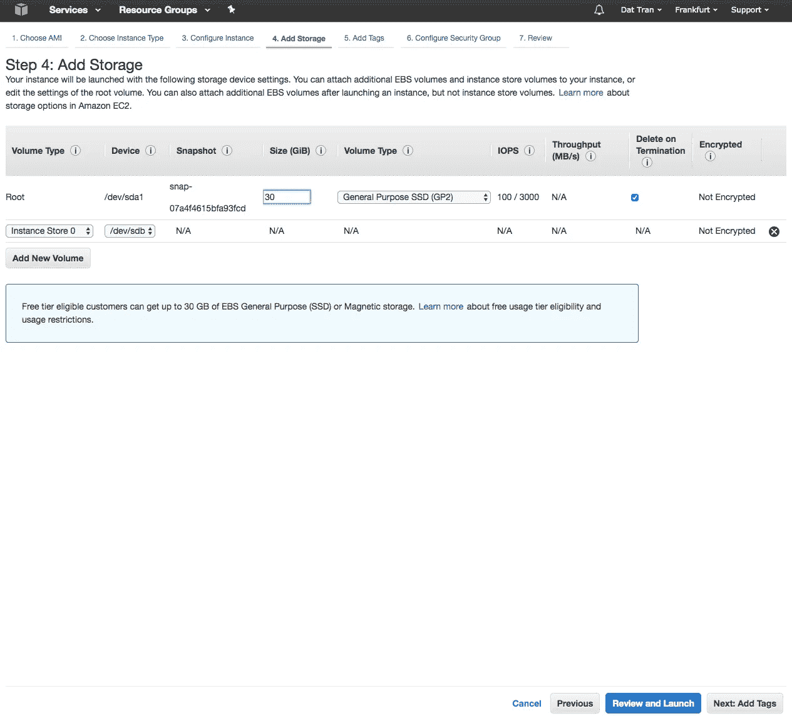
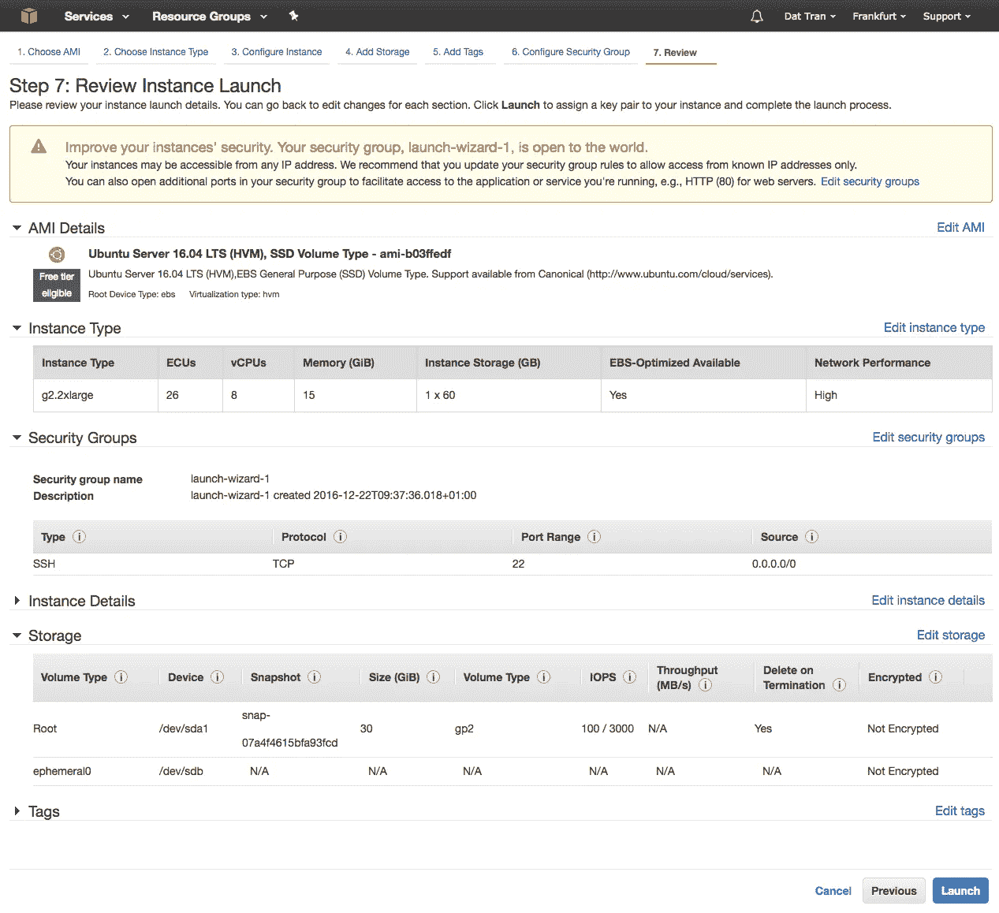
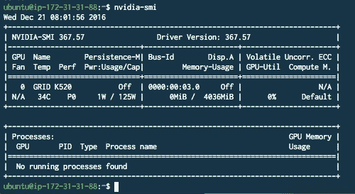
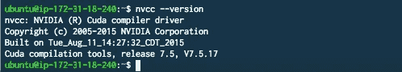
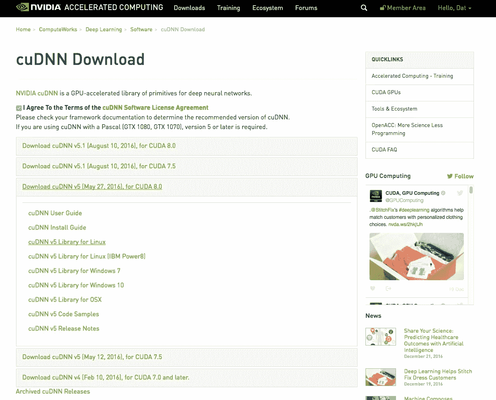
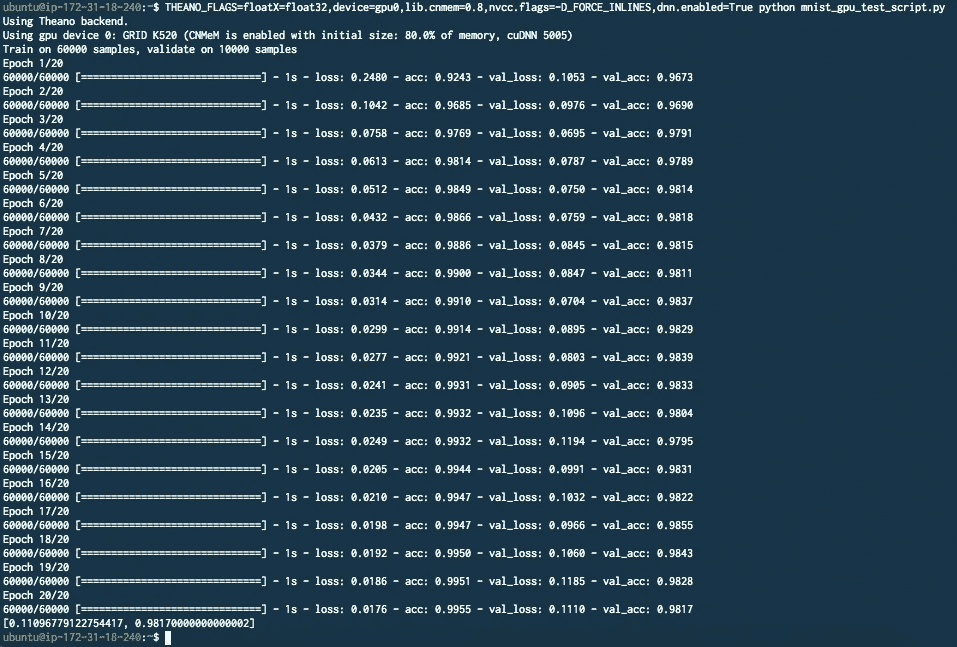
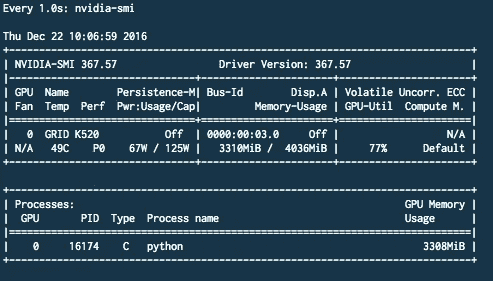

# 如何用 Keras/Theano 在 AWS 上搭建深度学习环境

> 原文：<https://towardsdatascience.com/how-to-set-up-a-deep-learning-environment-on-aws-with-keras-theano-b0f39e3d861c?source=collection_archive---------0----------------------->


**更新:**2017 年 5 月 19 日——在这篇文章中，我将一步一步地解释如何建立一个运行在[亚马逊的 EC2 GPU 实例](https://aws.amazon.com/ec2/instance-types/)上的深度学习环境，使用:

*   图片:ami-b 03 ffedf(Ubuntu Server 16.04 LTS(HVM)，SSD 卷类型)
*   区域:欧盟中部-1(欧盟法兰克福)
*   实例类型:g2.2xlarge
*   存储:30 GB(建议至少 20gb 以上)

软件:

*   [CUDA 8.0](https://developer.nvidia.com/accelerated-computing-toolkit) / [cuDNN 5.0](https://developer.nvidia.com/cudnn)
*   [带 Python 3 的 Anaconda 4.20】](https://www.continuum.io/downloads)
*   [Keras](https://keras.io/) / [Theano](http://deeplearning.net/software/theano/)

# **1。创建一个新的 EC2 GPU 实例**



Select the Ubuntu Server 16.04 LTS AMI.



Take the g2.2xlarge GPU Instance. Alternatively, you could also take the g2.8xlarge if you need more computing power.



Change the standard storage size to 30 GB.



Launch the cluster and assign an EC2 key pair.

# **2。在 GPU 实例上安装 CUDA/cud nn**

## NVIDIA 驱动程序

更新图形驱动程序:

```
$ sudo add-apt-repository ppa:graphics-drivers/ppa -y
$ sudo apt-get update
$ sudo apt-get install -y nvidia-375 nvidia-settings
```

## **CUDA**

SSH 到 EC2 GPU 实例:

```
$ ssh -i ~/folder_key_pair/key_pair.pem ubuntu@public_dns_ec2
```

首先下载 CUDA 8.0 到你的$HOME 文件夹( */home/ubuntu* ):

```
$ wget [https://developer.nvidia.com/compute/cuda/8.0/Prod2/local_installers/cuda-repo-ubuntu1604-8-0-local-ga2_8.0.61-1_amd64-deb](https://developer.nvidia.com/compute/cuda/8.0/Prod2/local_installers/cuda-repo-ubuntu1604-8-0-local-ga2_8.0.61-1_amd64-deb)
```

安装 CUDA:

```
$ sudo dpkg -i cuda-repo-ubuntu1604-8-0-local_8.0.44-1_amd64-deb
$ sudo apt-get update
$ sudo apt-get install -y cuda nvidia-cuda-toolkit
```

检查所有安装是否正确:

```
$ nvidia-smi
```



```
$ nvcc --version
```



## **cuDNN**

接下来，在 [NVIDIA 的加速计算开发者计划](https://developer.nvidia.com/cudnn)上注册一个帐户，并将 cuDNN 5.0 下载到您的本地机器上:



Select cuDNN v5 Library for Linux

将 TAR 归档文件 SCP 到 EC2 GPU 实例:

```
$ scp -i ~/folder_key_pair/key_pair.pem ~/folder_tar_file/cudnn-8.0-linux-x64-v5.0-ga.tgz ubuntu@public_dns_ec2:/home/ubuntu/
```

SSH 到 EC2 GPU 实例并解压缩文件:

```
$ tar -zxvf cudnn-8.0-linux-x64-v5.0-ga.tgz
```

最后，打开*。巴沙尔*然后加上这个:

```
export LD_LIBRARY_PATH=/home/ubuntu/cuda/lib64:$LD_LIBRARY_PATHexport CPATH=/home/ubuntu/cuda/include:$CPATHexport LIBRARY_PATH=/home/ubuntu/cuda/lib64:$LD_LIBRARY_PATH
```

重新装上*。巴沙尔:*

```
$ source ~/.bashrc
```

# **3。安装 Keras 和 Theano**

在 EC2 实例上下载 Anaconda 并安装它:

```
$ wget [https://repo.continuum.io/archive/Anaconda3-4.2.0-Linux-x86_64.sh](https://repo.continuum.io/archive/Anaconda3-4.2.0-Linux-x86_64.sh)$ bash Anaconda3-4.2.0-Linux-x86_64.sh
```

*注意:重新加载您的 bash 概要文件(源代码。bashrc)以便激活 Anaconda。*

最后，安装 Keras 和 Theano:

```
$ pip install --upgrade --no-deps git+git://github.com/Theano/Theano.git$ pip install keras
```

*注意:确保在 Keras 中将 Theano 用作后端。如果没有，您需要在 Keras 配置中更改它。keras/keras.json)，通常在 python 中第一次导入后创建。*

```
1 {
2     "backend": "theano",
3     "epsilon": 1e-07,
4     "floatx": "float32",
5     "image_dim_ordering": "th"
6 }
```

# **4。测试您的环境:**

现在你可以走了！通常，我倾向于用一个简单的脚本来测试我的环境，看看是否一切都像预期的那样工作。

以下是一个用于训练 MNIST 数据集的简单 MLP 网络:

通过调用以下命令运行脚本:

```
$ THEANO_FLAGS=floatX=float32,device=gpu0,lib.cnmem=0.8,nvcc.flags=-D_FORCE_INLINES,dnn.enabled=True python mnist_gpu_test_script.py
```

或者，您可以在[的 no 配置](http://deeplearning.net/software/theano_versions/dev/library/config.html)文件(*中指定设置。theanorc* ):

```
[global]floatX = float32device = gpu[lib]cnmem = 0.8[dnn]enabled = true[nvcc]flags = -D_FORCE_INLINES
```

*注意:标志“nvcc.flags=-D_FORCE_INLINES”对于 Ubuntu 16.04 非常重要，因为 CUDA 8.0 似乎不支持默认的 gcc 版本(5.4.0)(参见* [*Ubuntu 16.04 和 CUDA*](https://github.com/Theano/Theano/issues/4430)*[*glibc 2.23*](https://github.com/Theano/Theano/pull/4369)*)的修复)。目前这是一个棘手的问题。或者，您也可以通过使用 update-alternatives 将 CUDA 链接到一个较旧的 gcc 版本(参见* [*此处*](http://stackoverflow.com/questions/34670989/cuda-7-5-installation-unsupported-compiler-error) *)。**

*最终，这里是输出:*

**

*We can see that cuDNN is enabled (cuDNN 5005).*

**注意:监视 NVIDIA 的系统管理界面以查看是否有一些活动也很有趣，例如内存使用、运行进程和 GPU 利用率。**

```
*$ watch -n1 nvidia-smi*
```

**

# ***结论/展望***

*在这篇博文中，我一步一步地描述了如何在 AWS 上建立深度学习环境。如果有不清楚的地方，请通过 twitter [@datitran](https://twitter.com/datitran) 联系我，或者关注我。在下一篇文章中，我将关注如何通过使用 [docker](https://github.com/NVIDIA/nvidia-docker) 来自动化上面解释的那些步骤，从而极大地加快设置过程。*