# 如何为深度学习设置一个强大且经济高效的 GPU 服务器

> 原文：<https://towardsdatascience.com/how-to-set-up-a-powerful-and-cost-efficient-gpu-server-for-deep-learning-aa1de0d4ea56?source=collection_archive---------2----------------------->

Looking for GPU computational power for deep learning experimentations?

## 使用 Paperspace 和 fast.ai

## 语境

如果你打算开始你的深度学习之旅，并成为令人兴奋的深度学习实践者社区的一部分，你肯定需要设置一个 [GPU 服务器](https://www.quora.com/Why-are-GPUs-well-suited-to-deep-learning)。

在这篇文章中，我将介绍 [**Paperspace**](https://www.paperspace.com/) ，一个非常适合深度学习活动(以及其他)的虚拟机云提供商。尽管存在其他几种替代方案([亚马逊网络服务](https://aws.amazon.com/)、[谷歌云平台](https://cloud.google.com/)、[微软 Azure](https://azure.microsoft.com/en-us/) 、 [Crestle](https://www.crestle.com/) 、…)、**，但我发现**[**paper space**](https://www.paperspace.com/)**使用起来非常方便，而且功能强大，性价比高**。

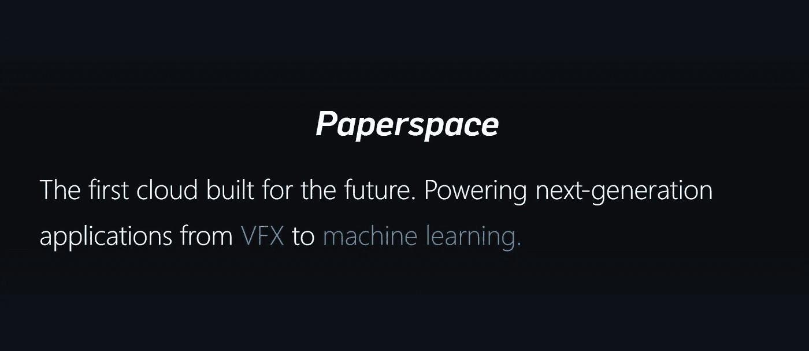

I quickly adopted [Paperspace](https://www.paperspace.com/) as my perfect deep learning platform.

[Paperspace](https://www.paperspace.com/) 提供了一个现成的 fast.ai 模板。 [**fast.ai**](http://course.fast.ai/index.html) **是一个构建在** [**PyTorch**](http://pytorch.org/) 之上的超级便捷的深度学习框架，由[杰瑞米·霍华德](https://medium.com/u/34ab754f8c5e?source=post_page-----aa1de0d4ea56--------------------------------)和[瑞秋托马斯](https://medium.com/u/ee56d0bac1b7?source=post_page-----aa1de0d4ea56--------------------------------)开发并教授；你肯定会想在某个时候尝试一下。

让我们来配置你的深度学习环境吧！

## 关于定价

[Paperspace](https://www.paperspace.com/) 提供有吸引力的定价选项。你确实可以以不到 40 美元的价格获得一台功能强大的机器，预计每月使用 40 小时。定价可详述如下:

*   **一个**公共 IP 地址**每月 3$**
*   **250 GB 硬盘**(存储)每月 7 美元
*   **0.65 美元/小时**对于一台 **NVidia Quadro P5000** 机器(RAM 30GB8 个 CPU，8GB GPU)

我上面提到的替代方案在我看来既不便宜也不简单。

**注意**:学习深度学习的另一个好方法(这也是我真心推荐的！)是跟随[**deep learning . ai**](https://www.deeplearning.ai/)**的专精**由[吴恩达](https://medium.com/u/592ce2a67248?source=post_page-----aa1de0d4ea56--------------------------------)。这种在线课程(mooc)由 5 门课程组成(每门课程约 1 个月)，每月 **49 美元**。稍微贵一点，但是仍然值得投资，因为 Andrew 也是一个很好的老师。

## 步骤 1:创建图纸空间帐户

如果你打算使用这项服务，这是非常明显的一步！您需要提供有效的电子邮件地址作为标识符，以及密码。

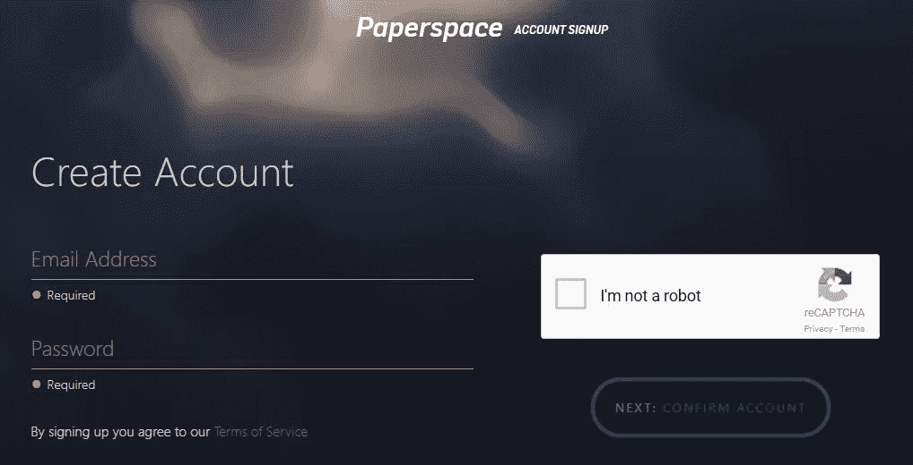

Enter valid email address + password to create your account.

一旦完成，你就可以在几分钟内创建你的深度学习 gpu 服务器。

## 步骤 2:创建一台机器

*   从[https://www.paperspace.com/console/machines](https://www.paperspace.com/console/machines)，**点击‘新机器’按钮**

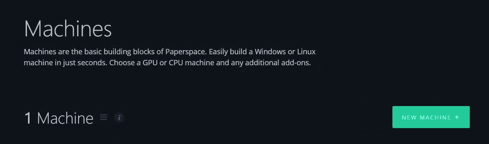

You GPU server is only a few clicks away from this screen.

*   选择一个地区(选择离你最近的一个)

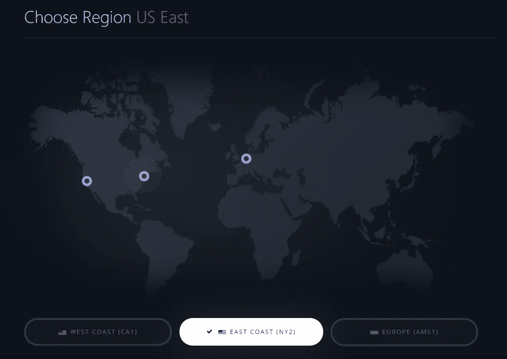

For some regions, you might have to provide some justification on your planned usage, in order to reduce fraud and enable [Paperspace](https://www.paperspace.com/) to prioritize requests. In such a case expect ~2 days for the investigation to take place.

*   **为您的机器选择一个模板**

[Paperspace](https://www.paperspace.com/) 提供多种模板供您使用。我推荐使用 [**fast.ai**](http://www.fast.ai/) 模板。Paperspace 的 fast.ai 模板是云中的一个全功能 Linux (Ubuntu 16.04) 实例，专为启动和运行非常受欢迎的 [Fast.ai 在线 MOOC 而构建，名为“程序员实用深度学习](http://www.fast.ai/)”。**该模板旨在为交互式开发提供一个全功能的机器学习环境**。

该模板包括英伟达用于使用 GPU 运行机器学习程序的库，以及各种用于 ML 开发的库(Anaconda Python 发行版、Jupyter notebook、fast.ai 框架……)。

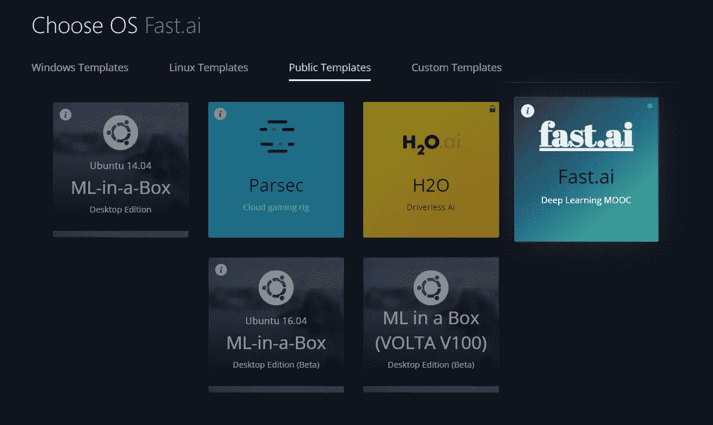

fast.ai is a popular template that will definitively make your life easier!

*   **选择机器的计算能力**

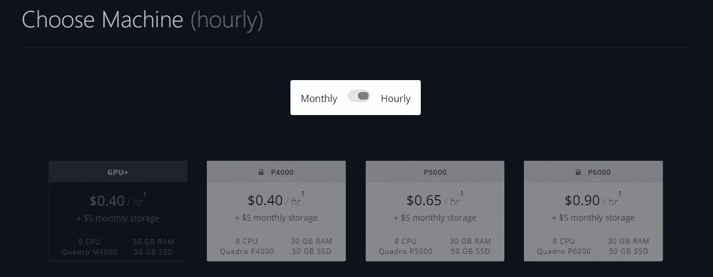

Available options might evolve over time. P4000 and P5000 will give you sufficient resources to build world-class classifiers and become a serious Kaggle competitor.

*   **根据您的需求选择存储空间**，从 50GB 到 2000GB 不等

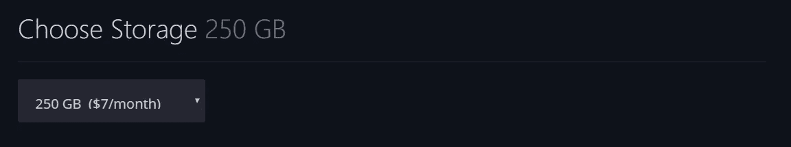

Note that you can upgrade to a higher storage any time.

*   **选择选项** -您需要一个公共 IP 地址来访问 jupyter 笔记本电脑

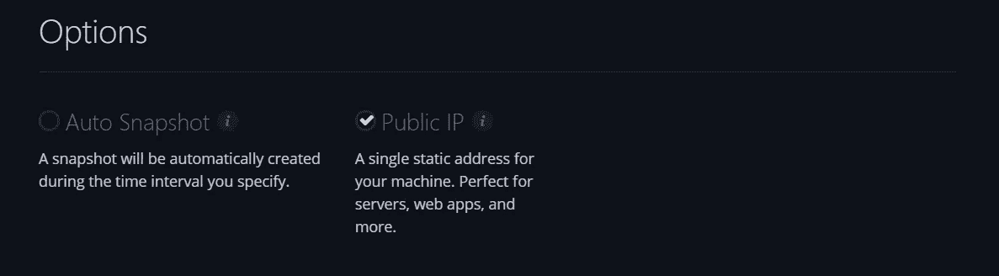

Turn ON `Public IP` (cost is `$3/month`) | Turn OFF `Auto Snapshot` (to save money on doing back-ups)

*   **添加您的信用卡信息**并继续付款
*   **创建您的纸张空间**框

由于高需求，您的请求可能需要几个小时才能完成。完成后，您将收到一封主题为“**您的新 Paperspace Linux 机器准备就绪**”的电子邮件，其中包含一个临时密码，可通过 ssh 登录到您的新机器。

## 步骤 3:连接到您的机器

*   点击‘开始’按钮来**启动你的机器**

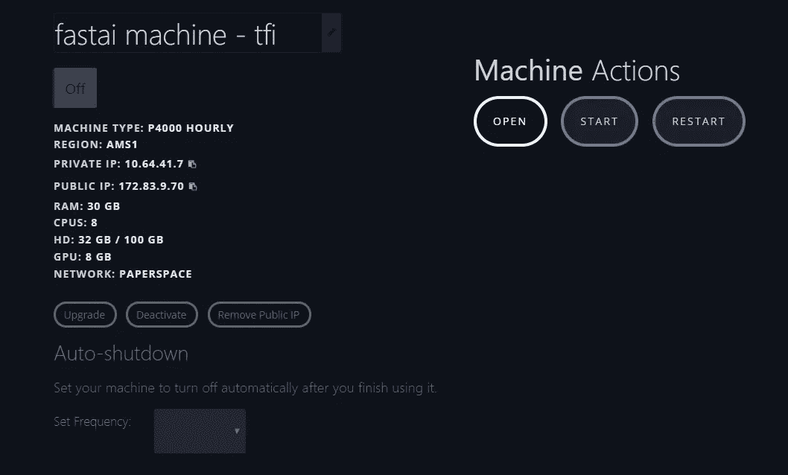

Screenshot from Paperspace home > Machines > Machine id.

*   **打开机器**。您将被重定向到一个基于 web 的命令行界面，但是您可以随意使用任何其他界面( [Cygwin](https://www.cygwin.com/) ，…)

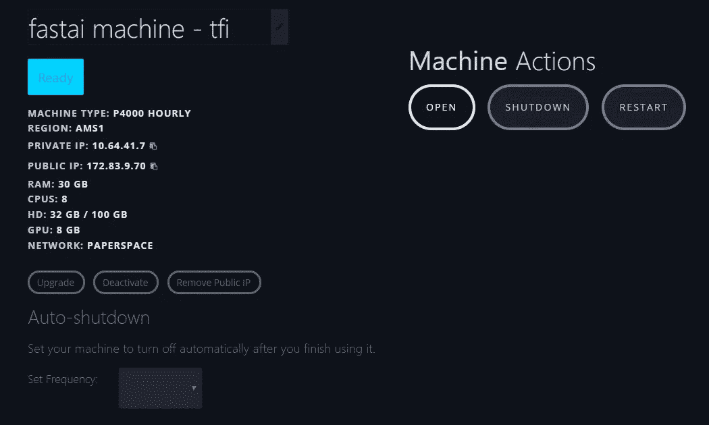

Click the ‘open’ button once machine is ready.

*   **将确认邮件中的密码复制粘贴到终端**中:Windows: Ctrl + Shft + v. Mac: Cmd + v

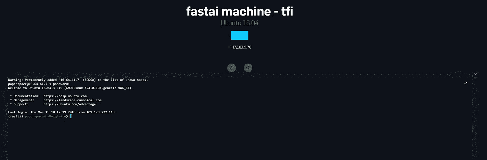

And here you are!

## 第四步:不要忘记关闭你的机器！

**每当您停止工作时，点击“关机”按钮**,以防止您每月的账单无谓地增加！

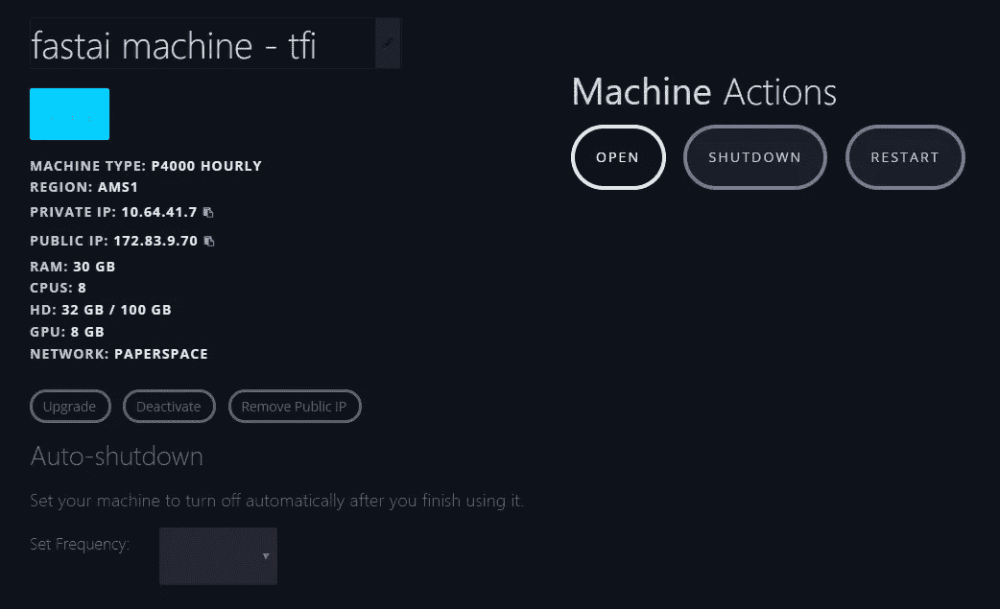

Tip: Paperspace let you choose to automatically shut down your machine at: 1h, 8h, 1d, 1w.

## **结论**

请随意评论和分享您自己对 Paperspace 或任何其他提供商的体验。感谢阅读，快乐深度学习！

## 来源

*   [fast.ai 学生笔记](https://github.com/reshamas/fastai_deeplearn_part1/blob/master/tools/paperspace.md)
*   [Paperspace 网站](https://www.paperspace.com/)
*   [fast.ai 网站](http://course.fast.ai/index.html)