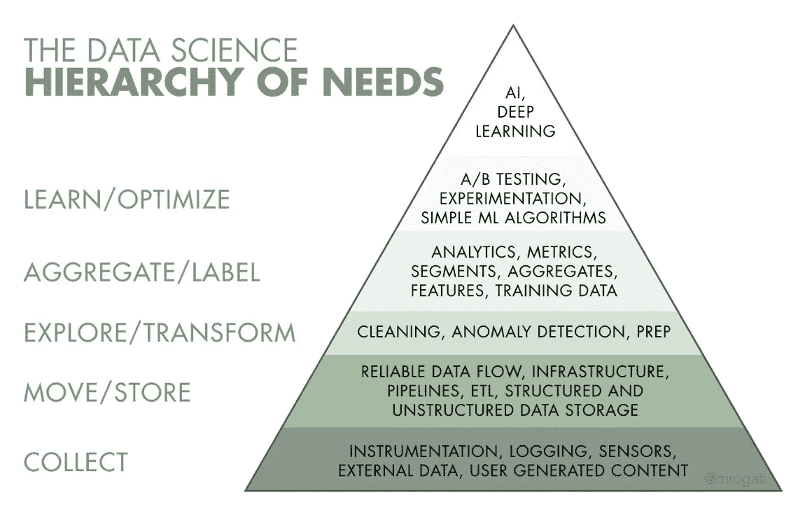
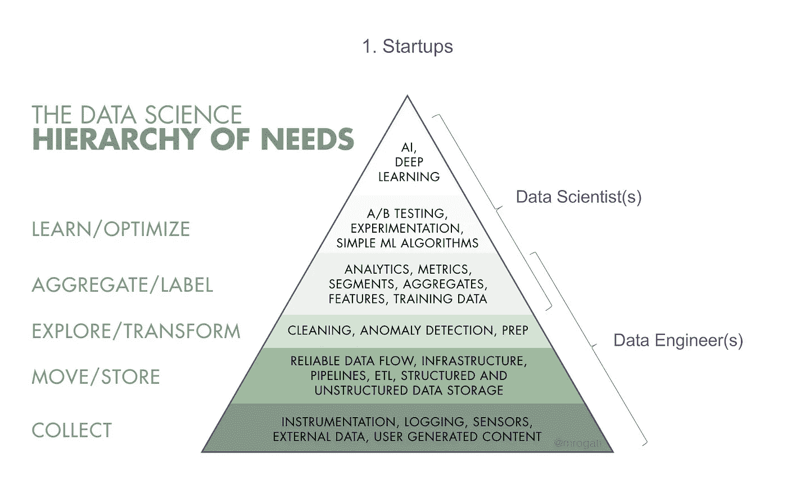
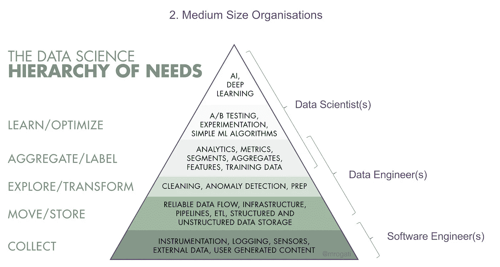
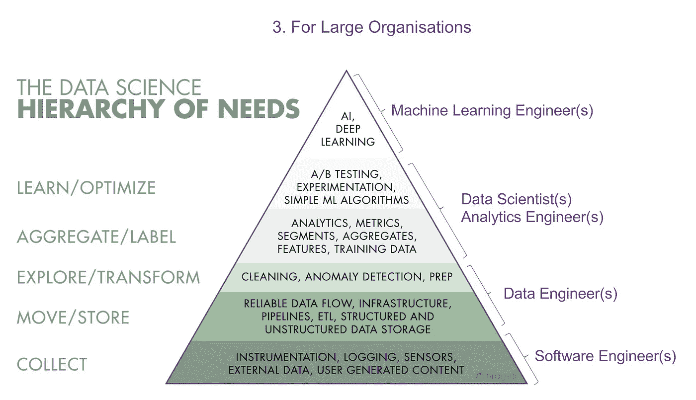

# 如何为您的组织设置数据科学职能

> 原文：<https://towardsdatascience.com/how-to-setup-a-data-science-function-for-your-organisation-9d247e605202?source=collection_archive---------3----------------------->

*本文将提供在 3 种类型的组织中建立数据科学职能的有效方法的高级理解:****(1)*******初创公司，(2)中型组织，以及(3)大型组织。****

*M ost 公司已经意识到，为了在各自的市场中保持竞争力，他们需要数据科学能力。在某些情况下，来自组织内数据科学(DS)团队的产品和见解正日益成为他们的主要竞争优势。*

*然而，很少有公司做对了这一点。*

*组织需要的东西和数据科学家想要研究的东西之间的脱节与双方的优先事项有关。*

*大多数公司都有很多“易得之果”(数据清理、简单查询等)。)不需要复杂的数据科学模型来解决。然而，大多数数据科学家希望解决业务中最复杂的问题。*

*组织需要清楚地传达为什么这些唾手可得的成果能迅速为组织增加价值，数据科学家需要明白，解决这些问题将让他们了解业务。一旦他们了解了业务，数据科学家就可以在组织数据科学能力的成熟过程中发挥重要作用。*

# *为了做好这件事，需要做两件事:*

**

*[Source](https://hackernoon.com/the-ai-hierarchy-of-needs-18f111fcc007): Monica Rogati’s article on “The AI Hierarchy of Needs”*

*(I)了解“数据科学需求层次”*

*[https://hacker noon . com/the-ai-hierarchy-of-needs-18f 111 FCC 007](https://hackernoon.com/the-ai-hierarchy-of-needs-18f111fcc007)*

*(ii)如何根据组织的规模组建团队。*

# ***1。创业公司:***

*在大多数初创公司中，资源(时间、资源和员工数量)是有限的，同时，你的 DS 团队必须(1)负责建立整个数据基础设施，以及(2)生成引导组织朝着正确方向前进所需的关键见解。*

*由于这两个原因，创业公司中最有效的 DS 团队有成对的数据科学家和数据工程师一起工作。这使得两种技能都能发挥各自的优势，推动数据产品和见解向前发展。*

**

# *2.中型组织*

*在中型公司中，可以用来创建数据产品和见解的资源不那么稀缺。这意味着他们可以将数据科学家和数据工程师分开。在某些情况下，一个中等规模的公司也可能有软件工程师来负责数据收集和数据获取。*

*这允许基于技能组合的更多的分离。*

*这里的关键要点是，数据工程师和数据科学家可以专注于分析和指标，这些分析和指标可以有效地告诉企业他们的产品或服务表现如何，同时还可以拓展开发新的复杂模型的范围。*

**

# *3.大型组织*

*当公司变得足够大时，他们开始在员工身上花钱。这样做有两个好处:(1)员工不必担心他们领域之外的事情，以及(2)员工可以专注于他们最擅长的事情，很少分心。*

*与中型组织类似，在大型组织中，软件工程师负责仪表、日志等。数据工程师专注于数据管道的架构。*

*现在，不同类型的数据科学家之间出现了分化。*

1.  ***数据科学，分析工程师**
    这些数据科学家专注于:
    (i)获取大型数据集，并将它们转化为具体的结论和可操作的见解。
    (ii)向不同的受众传达复杂的主题。
    (iii)创造性地思考，发现新的机会，将组织引向正确的方向。*
2.  ***数据科学，机器学习工程师**
    这些数据科学家专注于:
    (i)开发高度可扩展的工具，利用基于规则的模型。
    (ii)建议、收集和综合需求，以创建有效的路线图。
    (iii)与工程团队合作编写可交付成果。
    (iii)采用标准的机器学习方法，最好地利用现代并行环境。*

**

*在数据科学家的动机和组织表示希望数据科学家加入他们的意思之间，仍然很难弥合差距。*

*双方都要思考数据科学的需求层次，以及如何最好地实施配对，让个人发挥他们的优势，这将为数据科学团队带来最佳结果。*

*在我的下一篇文章中，我将讨论产品设计师和数据科学家如何合作开发高效的产品。*