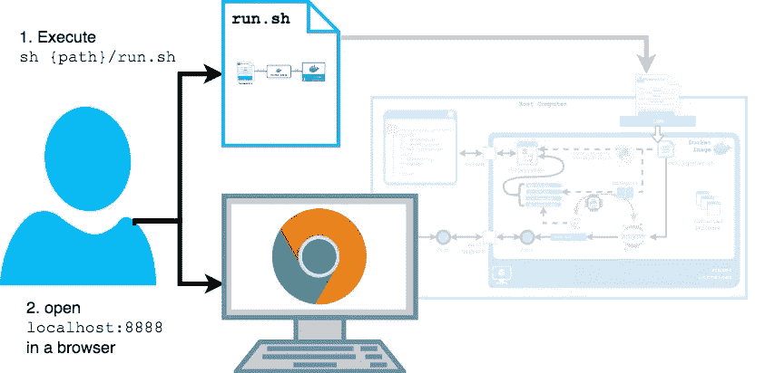
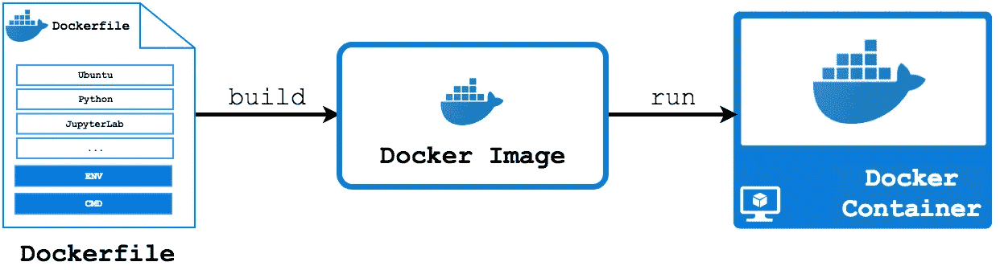
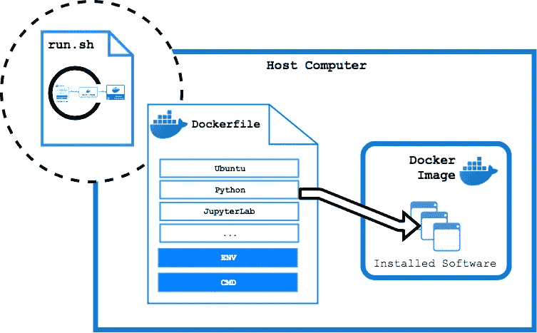
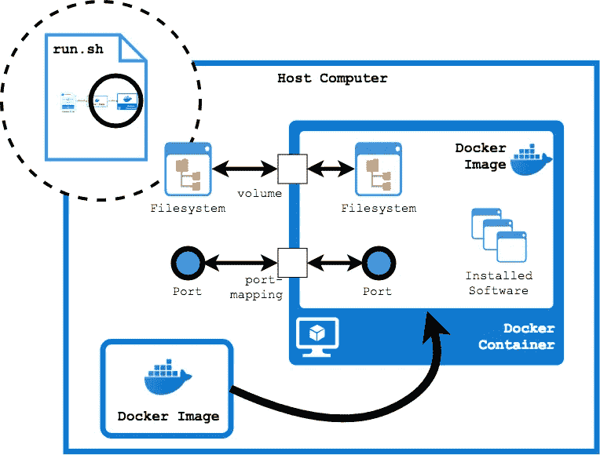
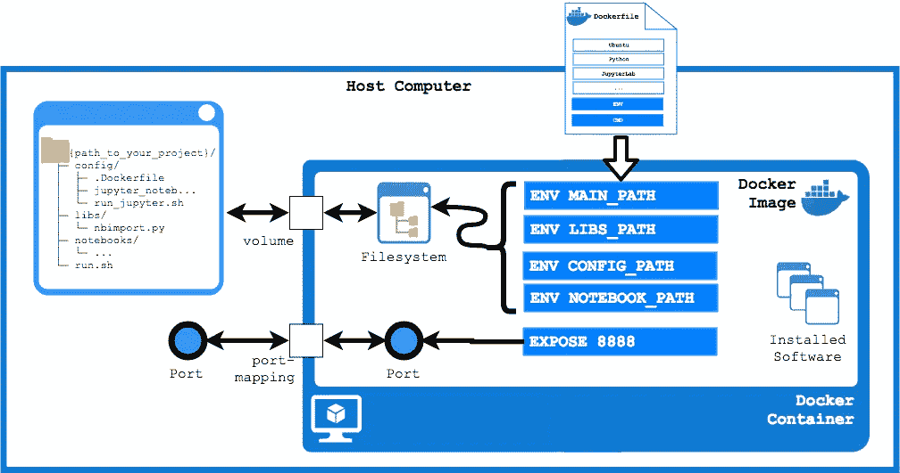
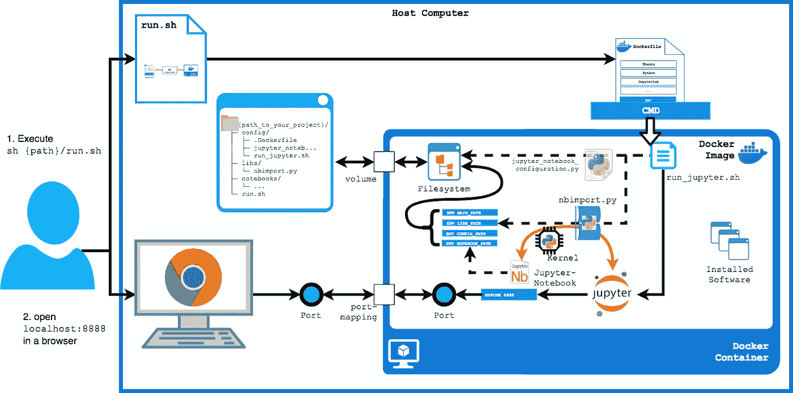

# 如何设置 JupyterLab 项目环境

> 原文：<https://towardsdatascience.com/how-to-setup-your-jupyterlab-project-environment-74909dade29b?source=collection_archive---------1----------------------->

在一分钟内创建和定制您的容器化和脚本控制的 JupyterLab 项目环境。

本文是本书的一部分: [**用 Python 实践量子机器学习。**](https://www.pyqml.com/page?ref=medium_jupyterlab&dest=/)


在这里免费获得前三章。

# TL；博士:

[JupyterLab-Configuration](https://github.com/frankzickert/jupyterlab-configuration) 让您轻松创建您的 **JupyterLab 配置**，它在**容器**中运行 JupyterLab，并使用**脚本**自动完成整个设置。容器是一个独立的环境，它封装了您在其中安装的库，而不会影响您的主机。脚本自动执行您通常需要手动运行的所有命令。因为您可以查看和编辑脚本，所以您可以随时完全控制您的配置。

在本帖中，您将看到这个 JupyterLab 配置是如何工作的，以及如何定制它来满足您的需求。

# 我是一名数据科学家，不是 DevOps 工程师


> 该死的吉姆。我是数据科学家，不是 DevOps 工程师

数据科学家的要求清单非常长。它包含数学和统计，编程和数据库，通信和可视化，领域知识，等等。

*“求求你，不要把 DevOps 加到名单里，”*你觉得呢？好吧！你觉得这些过程怎么样？

**创建您的 JupyterLab 配置:**

1.  JupyterLab-Configuration 让你轻松创建你的定制配置
2.  下载并解压缩您的配置
3.  根据您的需求进行定制(可选)

下图显示了运行中的 JupyterLab 配置。**通过两个简单的步骤使用它**:

1.  执行`sh {path_to_your_project}/run.sh`
2.  在浏览器中打开`localhost:8888`



Using the JupyterLab configuration

# 如果我对这种配置的工作原理感兴趣呢？解释它需要多少时间？


> 当然，几个小时，先生。但是你没有几个小时，所以我会在几分钟内为你做。

这篇文章的剩余部分从概念上给你一个 JupyterLab 配置如何工作的概述。它解释了构造块，并使您能够根据自己的需求定制配置，例如

*   添加软件包
*   添加您自己的 Python 模块
*   定制 Jupyter 笔记本服务器

# 我为什么需要一个 JupyterLab 配置？

2018 年，Project Jupyter 推出了 JupyterLab——一个用于处理笔记本、代码和数据的交互式开发环境。JupyterLab 完全支持 Jupyter 笔记本，使您能够在选项卡式工作区中与笔记本一起使用文本编辑器、终端、数据文件查看器和其他自定义组件。

如果您运行的是基于 Unix 的操作系统(macOS 或 Linux)，那么您可以使用两个简单的命令来安装和启动 JupyterLab:

```
python -m pip install jupyterlab
jupyter lab
```

**但是等等！**JupyterLab 的手动设置如此简单，乍看之下可能无法满足您在数据科学项目中需要做的所有事情。您可能还需要:

*   Jupyter 内核(例如 bash、Javascript、R 等等)
*   文件转换器(如 Pandoc、Markdown 等)
*   库(例如 NumPy、SciPy、TensorFlow、PyTorch 等)
*   支持软件(Git、NbSphinx 等)

将这些依赖项直接安装在您的计算机上并不是一个好主意，因为您将很难确保保持您的计算机干净。

*   *如果您有不同的项目需要不同版本的库会怎样？你会在每次切换项目时卸载旧版本并安装正确的版本吗？*
*   如果你不再需要一个库，该怎么办？如果你发现你还需要它，你会马上把它移除并重新安装吗？或者您会等到忘记删除这个库吗？

手动安装这些依赖项也不是一个好主意。你将无法控制你安装的所有东西。

*   如果你想在另一台电脑上完成这个项目，该怎么办？重新建立项目需要多少时间和工作量？
*   如果有人问你要你正在使用的所有第三方库怎么办？在您安装在主机上的所有库当中，您如何识别您在本项目中使用的库？

# 集装箱式结构

容器是独立于主机的虚拟环境。它创建了自己的运行时环境，可以适应您特定的项目需求。它只以特定的方式与宿主互动。对容器的任何更改都不会影响您的主机，反之亦然。 [Docker](https://www.docker.com/) 是用于项目环境虚拟化的最著名和最广泛使用的平台之一。

下图描述了包含两个步骤的 Docker 过程:(1)从 Docker 文件构建一个映像，以及(2)在容器中运行该映像。



The Docker process

我们的配置在`run.sh`-脚本中自动化了这个过程。这是一个运行在主机上的 shell 脚本(`sh`或`bash`)。同样，这个脚本是您开始 JupyterLab 项目的切入点。只需打开一个终端并运行:

```
sh {path_to_your_project}/run.sh
```

Docker 文件是告诉 Docker 如何在容器内配置系统的脚本。在`docker build`步骤中，Docker 创建了该系统的映像。映像是一个可执行包，其中包含运行应用程序所需的一切—代码、运行时环境、库、环境变量和配置文件。

虽然 Docker 支持从头开始构建系统，但最佳实践是从现有映像开始，例如包含操作系统甚至完整配置的映像。

配置从一个[现有图像](https://hub.docker.com/r/leandatascience/jupyterlabconfiguration/)开始。你可以在这个 [GitHub-Repository](https://github.com/lean-data-science/jupyterlab-configuration) 中找到相应的 Dockerfile。此映像包含以下软件和库:

*   Ubuntu 18.04
*   Python 3.7.0
*   点
*   朱庇特和朱庇特实验室
*   Bash 和 Jupyter Bash-Kernel
*   文档(pdf)工具(`pandoc`、`texlive-xetex`)
*   构建工具(例如，`build-essential`、`python3-setuptools`、`checkinstall`)
*   通讯工具(`openssl`、`wget`、`requests`、`curl`)
*   各种 Python 开发库

如果你需要更多的软件库，那么 **Dockerfile** 就是你要去的地方。只需在`FROM`语句后添加一个新行。这一新行需要以`RUN`开始，并包含您可能想要执行的任何 shell 命令，通常类似于`apt-get install`或`pip install`。例如，您可以使用以下语句使用`pip`安装一些主要的数据科学包:

```
RUN pip install numpy
RUN pip install scipy
RUN pip install pandas
```

Dockerfile 中的更改在`build`步骤中生效。如果您已经启动了容器，您需要停止它(例如在您的终端中使用 ctrl+c)并重新启动它(`sh {path_to_your_project}/run.sh`)。编辑 docker 文件时，`build`步骤可能需要一些时间。Docker 试图重用现有的图像，当你没有改变任何东西时，它在随后的启动中非常快。

如果您从 Docker 文件中删除命令并重新运行`run.sh`-脚本，Docker 会创建一个新的系统映像。您不需要从系统中卸载任何东西。因为被删除的命令从来就不是这个结果系统的一部分。这使您的配置始终保持干净。您可以实验性地安装库，而不必担心。如果你不需要它们，就去掉它们。您将得到一个从未安装它们的系统映像。

下图描述了 Dockerfile 如何配置系统:它按照其`RUN`-命令中指定的方式安装软件。



The Dockerfile specifies the configuration of the system

命令在一个容器中执行这个图像。此外，它定义了在容器内运行的系统如何连接到外部世界，即主机。

有两种主要的连接类型:卷和端口。**卷**是主机上的目录和容器中的目录之间的链接。这些目录是同步的，即主机目录中的任何变化都会影响容器中的目录，反之亦然。**端口映射**让 Docker 将对主机端口的任何请求(例如 HTTP 请求)转发到容器的映射端口。

下图描述了我们到目前为止的配置。`run.sh`-脚本负责 Docker `build`和`run`步骤。一旦您执行该脚本，它将创建一个运行容器，通过文件系统卷和端口映射与您的主机连接。



The run.sh script automates the Docker process

# 文件系统

当您从 [Git-Hub-Repository](https://github.com/frankzickert/jupyterlab-configuration) 下载文件时，您将在`.zip`文件中获得以下文件结构:

```
{path_to_your_project}/
├─ config/
│ ├─ {projectname}.Dockerfile
│ ├─ jupyter_notebook_configuration.py
│ └─ run_jupyter.sh
├─ libs/
│ └─ nbimport.py
├─ notebooks/
│ └─ …
└─ run.sh
```

*   文件夹包含 JupyterLab 项目的配置文件。这些文件配置 Docker 容器，安装软件包，并配置 JupyterLab 环境。
*   `libs`-文件夹包含软件库，这些软件库不是作为软件包安装的，而是作为文件添加的，例如您在其他项目中自己编写的 Python 模块。
*   文件夹是我们放笔记本的目录。

在 Dockerfile 文件中，我们设置指向这些目录的环境变量。因为配置中的脚本使用了这些环境变量，所以如果愿意，您可以编辑它们。只要确保变量中的路径与实际路径匹配即可。

```
ENV MAIN_PATH=/usr/local/bin/{projectname}
ENV LIBS_PATH=${MAIN_PATH}/libs
ENV CONFIG_PATH=${MAIN_PATH}/config
ENV NOTEBOOK_PATH=${MAIN_PATH}/notebooks
```

在配置中，我们将当前工作目录(`{path_to_your_project}`)映射到容器中的`${MAIN_PATH}`-文件夹。因此，您放入该目录的任何文件在您的 JupyterLab 项目中都是可用的。反之亦然，您在 JupyterLab 中添加或更改的任何文件(例如 Jupyter 笔记本)都会出现在您的主机上。

此外，在 Dockerfile 的`EXPOSE`命令中，我们指定配置提供 JupyterLab 端口`8888`。容器内的这个端口被映射到您的主机计算机的端口。

下图描述了容器如何将其文件系统和端口连接到主机。



Connect the file system and the port

# 特定于 JupyterLab 的配置

我们 docker 文件中的最后一个命令是`CMD`-命令。它告诉 Docker 无论何时启动容器都要执行这条指令。在配置中，我们执行`run_jupyter.sh`-脚本。这个脚本允许我们做一些最后的准备，比如:

*   将`jupyter_notebook_configuration.py`文件放在 JupyterLab 期望的位置
*   配置一个定制的 Jupyter-Kernel 来自动加载`nbimport.py` Python 模块

`jupyter_notebook_configuration.py`可让您配置 Jupyter 笔记本电脑服务器，例如设置用于网络认证的密码。可用选项列表可在[这里](https://jupyter-notebook.readthedocs.io/en/stable/config.html)找到。

定制 Python 内核将`${LIBS_PATH}`添加到您的 Python `sys.path`中。这允许您从`${LIBS_PATH}`-文件夹中导入任何 Python 模块，例如`import libs.nbimport`。此`nbimport.py`-模块进一步使您能够导入位于`${NOTEBOOK_PATH}`-文件夹中的笔记本。每当你用 Python 内核启动 Jupyter 笔记本时，系统会自动为你做这些事情。

最后，`run_jupyter.sh`-脚本启动 JupyterLab。您现在可以在浏览器中打开`localhost:8888`，其中`8888`是您指定的端口。

下图描述了完整的 JupyterLab 配置。



The complete JupyterLab configuration

# 摘要

JupyterLab-Configurator 可让您轻松创建自定义配置。这个 **JupyterLab-Configuration** 在**容器**中运行 JupyterLab。它将 JupyterLab 运行的环境与主机环境分开。因此，您可以更改 JupyterLab 环境(例如，卸载/安装软件包),而不会影响您的主机或任何其他项目。

这个**JupyterLab-Configuration**使用**脚本**自动完成整个设置。这些脚本:

*   使您能够使用**单个命令**(例如`sh run.sh`)运行 JupyterLab
*   使您的项目可移植:只需将目录移动或复制到另一台主机上
*   揭示您的配置的一部分，并允许您查看和编辑您的配置
*   让您的配置成为您的源代码的一部分。您可以像对代码进行版本控制一样对它们进行版本控制

GitHub-repository[提供了完整的源代码。](https://github.com/frankzickert/jupyterlab-configuration)

使用 JupyterLab 配置非常简单:

1.  执行`sh {path_to_your_project}/run.sh`
2.  在浏览器中打开`localhost:8888`


Using the JupyterLab configuration

***注*** :运行 Docker 容器的能力是这个 JupyterLab-Configuration 对主机的唯一要求。Docker 在 Windows 上可用，并且最近获得了运行基于 Linux 的容器的能力。因此，Jupyterlab 没有理由不在 Windows 上运行。如果你想尝试一下，你需要运行 Docker，并将`run.sh`的`docker build`和`docker run`命令移动到一个可以在 Windows 上执行的`.cmd`文件中。