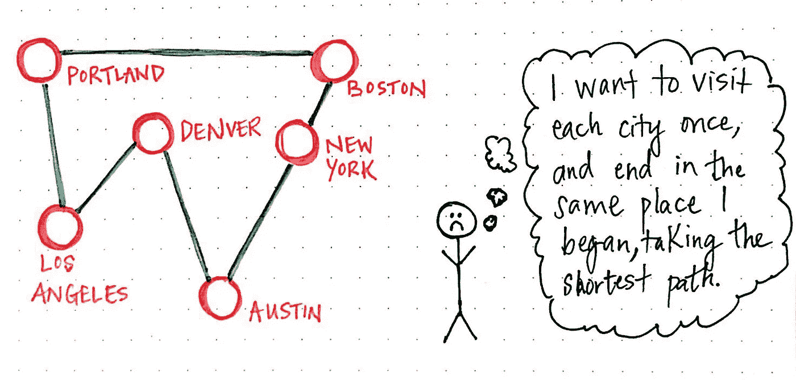
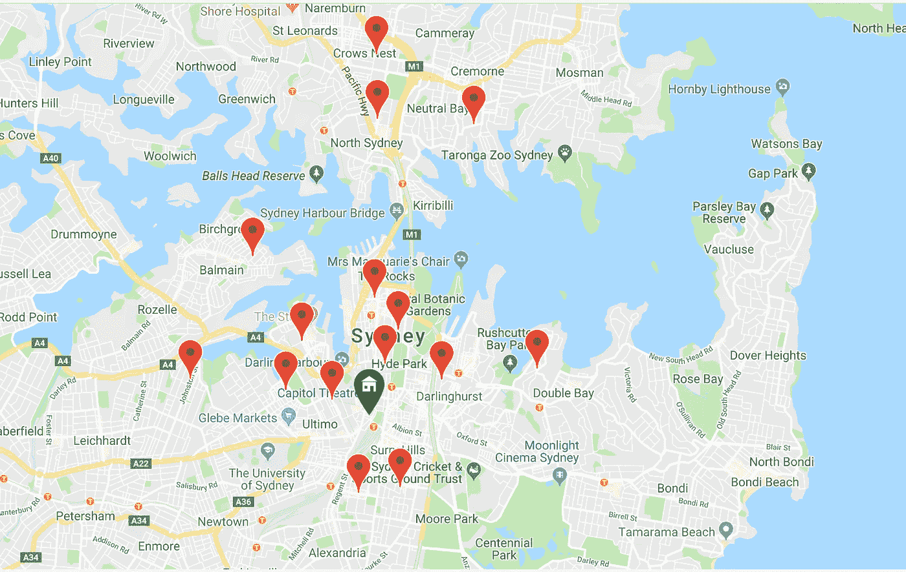
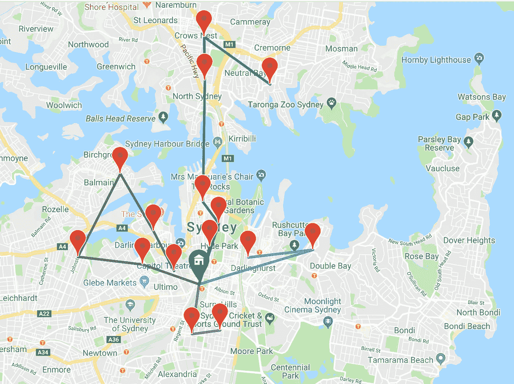

# 如何解决最后一公里物流难题？

> 原文：<https://towardsdatascience.com/how-to-solve-the-last-mile-logistics-conundrum-2ced70f5f7f3?source=collection_archive---------13----------------------->

电子商务的兴起和消费者对快速送货的期望给物流公司带来了前所未有的压力，要求他们消除最后一公里物流中的摩擦和低效。“最后一英里”通常是指从运输中心(如仓库)到最终交付目的地(如您的家)的货物交付。对物流公司来说，这最后一段是最昂贵的，占运输成本的近 28%。

我们都听说过这样的轶事:送货不准时、包裹被损坏、错过送货和包裹失窃。最后一公里物流在当天送达的世界中更加重要，并给物流提供商带来越来越大的压力。巨大的挑战包括改善基础设施、确保透明度以及通过智能车辆路线将成本降至最低。在这篇文章中，我们将研究一些算法，看看它们如何应用于现实生活中的实际情况，以最小化最后一英里的成本。在一个依赖高销量和低利润的行业，优化最后一英里将直接带来高利润和满意的客户。

## 旅行推销员和 NP 难题

计算机科学中最著名的问题之一是旅行推销员问题。这个问题构成了物流世界中车辆路径的基础。给定一组点，我们如何找到从起点到终点的最短路径，其中我们访问每个点恰好一次？

Travelling salesman problem

求解旅行商是一个 NP-hard 问题，也就是说没有‘快速’解(快速是指多项式时间算法)。一个精确的算法将包括找到所有的路由排列和组合，并比较每一个来提取最短的路由。“Held-Karp”算法可用于求解旅行推销员问题的精确解，利用子路径并使用动态编程技术。即使这样，这样的算法也只能在合理的时间内解决少量的点。点数的任何增加都会导致计算时间的指数增长。因此，在实际应用中，我们使用近似算法的组合来逼近最佳路径，误差在最佳精确解的 1%以内。

## 车辆路径问题

最后一英里物流的成本最小化本质上是一个车辆路径问题。车辆路径问题概括了前面提到的旅行推销员问题，并处理寻找一组路径或路线，以最小化成本。问题域可能涉及许多车辆、数百个交货地点和一组仓库地点。车辆路线算法的目标包括但不限于以下内容:

*   为每辆车寻找最短的路径，或最短的行驶时间以节省燃料费用
*   每辆车的容量可能有限，因此目标是使用最少的车辆覆盖所有路线
*   交付需要在特定的时间窗口内发生，我们需要在特定的时间范围内安排路径
*   交货从仓库开始，必须返回仓库

## 克拉克·赖特储蓄算法

Clarke 和 Wright 节约算法在车辆路径问题的近似解方面非常流行。该算法的决策变量是要使用的车辆数量。该算法的基本思想是，如果两条路线可以可行地合并并产生距离节省，那么我们就选择合并的路径。该算法的工作原理如下:

*   通过将每辆车分配给客户或位置，创建一个初步可行的解决方案
*   对于所有的位置对，我们在连接它们时计算节省，并且我们将节省列表按降序排列
*   我们从节省列表的顶部选取每个子路径，如果没有超过最大车辆容量，则加入其他子路径
*   我们重复上一步，直到考虑了整个节省列表，或者容量限制不允许更多的子路径合并。

最终结果将是在不超出车辆容量的情况下，为最小车辆集分配一定数量的路径或循环，并且每个位置只被访问一次。

## 蚁群优化算法

蚁群算法大致基于蚂蚁寻找食物的行为。起初，一群蚂蚁会漫无目的地游荡，当一只蚂蚁找到食物时，它会走回蚁群，留下信息素或标记供其他蚂蚁跟随。随着越来越多的蚂蚁追踪这些标记，信息素的踪迹变得越来越突出。更短的路径意味着蚂蚁会更频繁地在上面行走，从而产生更强的信息素踪迹。这个原理可以用来逼近最佳路径。

## 谷歌或工具

我们如何构建一个软件应用程序来解决车辆路径问题，并利用广泛的优化算法？原来我们可以使用 [Google 或者-tools](https://developers.google.com/optimization/) 包来解决我们最后一英里的物流问题。

在我们的示例问题域中，我们将在悉尼市中心附近生成多个装货地点和一个仓库。然后，我们的车辆将从仓库出发，访问这些地点，并装载一些具有一定重量的货物。在我们的问题中，我们将每辆车的载重量限制在 15 公斤，我们的车队最多有 10 辆卡车。

The green marker signifies the home depot, our fleet of trucks must visit the 16 locations on this map.

这个项目将包括一个简单的 Django 后端服务器和一个用 React.js 构建的前端。第一个端点简单地生成一些地址，第二个端点在 Google 或-tools 中运行有容量限制的车辆路径算法。我们选择使用上述节约算法，该算法以其相对较快的计算时间而闻名。这种算法的输入包括使用 Google distance matrix API 计算的距离矩阵，其他参数包括每个给定位置的重量需求列表(随机生成)和许多约束条件，包括车辆的最大数量和每辆车的最大容量。

对于前端，我们只需使用谷歌地图 javascript 库来呈现位置和路线。我们只需在地图上标出送货地点，然后用彩色编码折线显示计算出的路线。我们还可以看到每辆车的路线和它们在每个位置的容量。随着我们给这个问题增加越来越多的问题，只有我们也增加车队的规模，才能产生一个解决方案。例如，如果我们将车队限制为 3 辆车，我们将无法为 20 多个地点提供载重量为 15 公斤的最佳路线。

Optimal vehicle routes plotted using Polylines using Google Maps Javascript Library

这个项目的代码可以在[这里](https://github.com/schumanzhang/vehicle_routing)和[这里](https://github.com/schumanzhang/vehicle_routing_react)找到。

## 聚类增强

在上面的例子中，我们展示了我们可以使用 Google 或-tools 为我们的车队计算一组优化的路线。然而，随着递送点数量的增加，计算时间变得不合理地长。在现实世界的交付示例中，我们可能要处理数百个交付位置和多个仓库位置。在这种情况下，使用聚类算法将地理上相似的点分组在一起，然后将有容量限制的车辆路线算法应用于每个聚类是合适的。 [DBSCAN](https://en.wikipedia.org/wiki/DBSCAN) 聚类算法将适合这样的任务，DBSCAN 算法是一种基于密度的聚类技术，它将紧密堆积的邻居分组在一起，这可以大大加快我们在 Google OR-tools 套件中实现算法的速度。

## 未来应用

正如我们所看到的，解决车辆路径问题和找到最佳路线将是任何最后一英里物流运营降低成本和增加利润的关键。几项关键的技术开发目前正在进行中，以将最后一英里物流提升到一个新的水平，并确保满足消费者对当天交付等服务的高期望。我们开始看到一些公司在测试自动地面车辆和无人驾驶送货机。这些技术有可能进一步降低运输成本，并将服务范围扩大到农村地区。