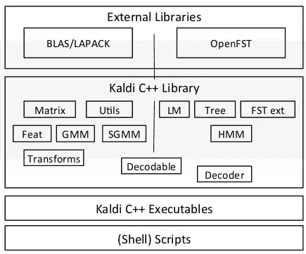
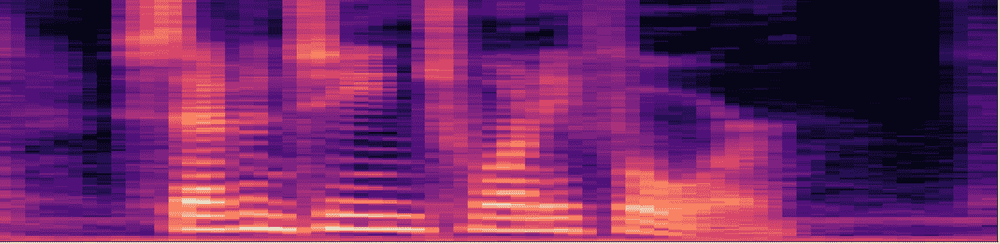
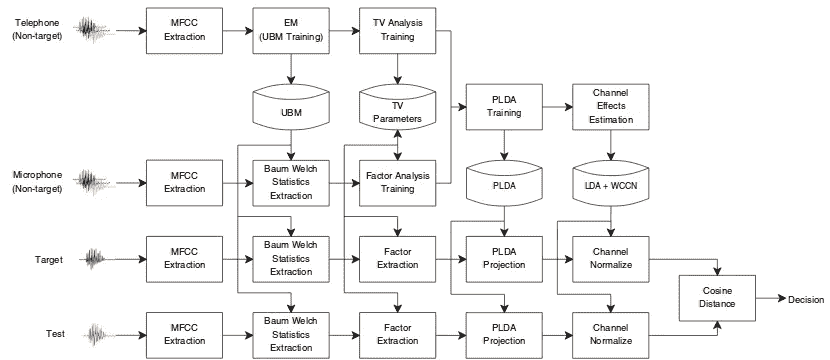
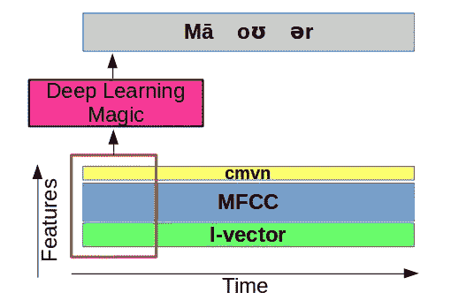
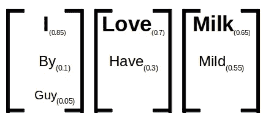
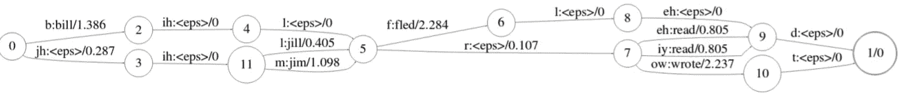
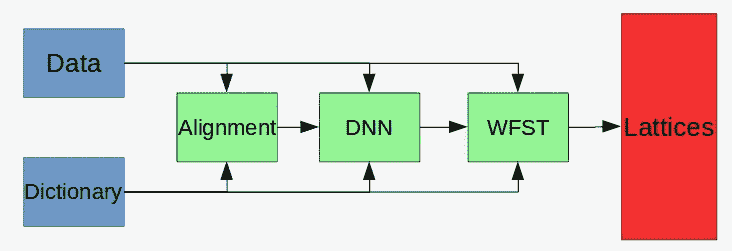

# 如何从 Kaldi 和语音识别开始

> 原文：<https://towardsdatascience.com/how-to-start-with-kaldi-and-speech-recognition-a9b7670ffff6?source=collection_archive---------2----------------------->

## 实现最先进的语音识别系统的最佳方式

Today Speech recognition is used mainly for Human-Computer Interactions (Photo by [**Headway**](https://unsplash.com/@headwayio?utm_source=medium&utm_medium=referral) on [Unsplash](https://unsplash.com?utm_source=medium&utm_medium=referral))

# 卡尔迪是什么？

Kaldi 是一个[开源](https://github.com/kaldi-asr/kaldi)工具包，用于处理语音数据。它被用于与语音相关的应用，主要用于[语音识别](https://en.wikipedia.org/wiki/Speech_recognition)，但也用于其他任务——如[说话人识别](https://en.wikipedia.org/wiki/Speaker_recognition)和[说话人日记化](https://en.wikipedia.org/wiki/Speaker_diarisation)。这个工具包已经很老了(大约 7 年了)，但是仍然在不断更新，并由一个相当大的社区进一步开发。Kaldi 在学术界(2015 年被引用 400 多次)和工业界都被广泛采用。

Kaldi 主要是用 C/C++编写的，但是工具包包装了 Bash 和 Python 脚本。对于基本用法，这种包装避免了深入源代码的需要。在过去的 5 个月里，我了解了这个工具包并学会了如何使用它。这篇文章的目标是引导你完成这个过程，并给你对我帮助最大的材料。把它看作一条捷径。

Kaldi simplified view ([As to 2011](https://publications.idiap.ch/downloads/papers/2012/Povey_ASRU2011_2011.pdf)). **for basic usage you only need the Scripts**.

**本文将包括**对 Kaldi 中语音识别模型的训练过程的一般理解，以及该过程的一些理论方面。
**本文不包括**代码片段和实践中做这些事情的实际方法。关于这一点，你可以阅读《[卡尔迪傻瓜指南》或其他在线资料。](http://kaldi-asr.org/doc/kaldi_for_dummies.html)

# 卡尔迪的三个部分

## 预处理和特征提取

如今，大多数处理音频数据的模型都使用基于像素的数据表示。当您想要提取这样的表示时，您通常会希望使用有利于以下两点的特征:

1.  识别人类说话的声音
2.  丢弃任何不必要的噪声。

多年来有几次尝试使那些功能和今天的****在业界得到广泛应用。****

********

****An Example of MFCC. The Y Axis represents features and the X axis represents time.****

******MFCC** 代表*梅尔频率倒谱系数*，自从[戴维斯和梅尔斯坦](https://books.google.co.il/books?id=yjzCra5eW3AC&pg=PA65&dq=cosine+mel+pols&lr=&as_brr=3&ei=ytJmSZGLNI6ukAThwuGxCA&redir_esc=y#v=onepage&q=cosine%20mel%20pols&f=false)在 80 年代发明以来，它几乎已经成为行业标准。在这篇[令人惊叹的可读文章](http://www.practicalcryptography.com/miscellaneous/machine-learning/guide-mel-frequency-cepstral-coefficients-mfccs/)中，你可以获得关于 MFCCs 的更好的理论解释。对于基本的用法，你需要知道的是 MFCCs 只考虑我们的耳朵最容易听到的声音。****

****在 Kaldi 中，我们使用了另外两个特性:****

1.  ****[**cmvn**](https://en.wikipedia.org/wiki/Cepstral_mean_and_variance_normalization)**用于[更好的规范 MFCC](https://www.isca-speech.org/archive_open/archive_papers/robust2004/rob4_38.pdf)******
2.  ******[**I-Vectors**](https://link.springer.com/article/10.1007/s10772-015-9295-3) (值得自己写一篇文章)，用于更好地理解域内的方差。例如，创建依赖于说话者的表示。I 向量基于 JFA(联合因子分析)的相同思想，但是更适合于理解通道和说话者的变化。I-Vectors 背后的数学原理在[这里](http://www1.icsi.berkeley.edu/Speech/presentations/AFRL_ICSI_visit2_JFA_tutorial_icsitalk.pdf)和[这里](https://link.springer.com/article/10.1007/s10772-015-9295-3)有清晰的描述。******

********

****The Process of using I-Vectors as described in *Dehak, N., & Shum,**S****.*** *(2011)* ***In Practice: It’s complicated*******

****为了对这些概念有一个基本的了解，请记住以下几点:****

1.  ******MFCC** 和 **CMVN** 用于表示每个音频话语的**内容**。****
2.  ******I 向量**用于表示每个音频话语或说话者的**风格**。****

## ****模型****

****Kaldi 后面的[矩阵数学](http://kaldi-asr.org/doc/matrixwrap.html)是用 [BLAS](http://www.netlib.org/blas/) 和 [LAPACK](http://www.netlib.org/lapack/) 实现的(用 Fortran 写的！)，或者基于 [CUDA](https://en.wikipedia.org/wiki/CUDA) 的替代 [GPU 实现](http://kaldi-asr.org/doc/cudamatrix.html)。由于使用了如此低级的包，Kaldi 在执行这些任务时效率很高。****

****Kaldi 的模型可以分为两个主要部分:
第一部分是**声学模型**，它曾经是一个 [GMM](https://www.youtube.com/watch?v=Rkl30Fr2S38) 但现在被[深度神经网络](https://www.danielpovey.com/files/2015_interspeech_multisplice.pdf)疯狂取代。该模型将把我们创建的音频特征转录成一些依赖于上下文的[音素](https://en.wikipedia.org/wiki/Phoneme)(在 Kaldi 方言中，我们称它们为“pdf-id”，并用数字表示它们)。****

********

****The Acoustic model, generalized. On top you can see [IPA](https://en.wikipedia.org/wiki/Help:IPA/English) phoneme representation.****

****第二部分是**解码图**，它获取音素并将其转换成[点阵](http://kaldi-asr.org/doc/lattices.html)。网格是可能用于特定音频部分的备选单词序列的表示。这通常是您希望在语音识别系统中得到的输出。解码图考虑了你的数据的语法，以及相邻特定单词的分布和概率( [n-grams](https://en.wikipedia.org/wiki/N-gram) )。****

********

****A representation of lattice — The words and the probabilities of each word****

****解码图本质上是一个 [WFST](https://en.wikipedia.org/wiki/Finite-state_transducer#Weighted_automata) ，我强烈鼓励任何想要专业化的人彻底学习这个主题。最简单的方法就是通过[那些视频](https://www.youtube.com/playlist?list=PLxbPHSSMPBeicXAHVfyFvGfCywRCq39Mp)和这篇[经典文章](https://cs.nyu.edu/%7Emohri/pub/hbka.pdf)。理解了这两点之后，你就可以更容易地理解解码图的工作方式了。这种不同 wfst 的组合在 Kaldi 项目中被命名为“HCLG.fst 文件”，它基于 [open-fst](http://www.openfst.org/twiki/bin/view/FST/WebHome) 框架。****

********

****A simple representation of a WFST taken from “Springer Handbook on Speech Processing and Speech Communication”. Each connection is labeled: Input:Output/Weighted likelihood****

******值得注意的是**:这是模型工作方式的简化。关于用决策树连接两个模型，以及你表示音素的方式，实际上有很多细节，但是这种简化可以帮助你掌握这个过程。****

****你可以在描述 Kaldi 的[原始文章中深入了解整个架构，特别是在这个惊人的博客中了解解码图。](https://publications.idiap.ch/downloads/papers/2012/Povey_ASRU2011_2011.pdf)****

## ****培训过程****

****一般来说，这是最棘手的部分。在 Kaldi 中，你需要按照一个真正特定的顺序排列你转录的音频数据，这个顺序在[文档](http://kaldi-asr.org/doc/data_prep.html)中有详细描述。****

****对数据进行排序后，您需要将每个单词表示为创建它们的音素。这种表示将被命名为“字典”,它将确定声学模型的输出。这是这种字典的一个例子:****

> ****八-> ey t
> 五- > f ay v
> 四- > f ao r
> 九- > n ay n****

****当你手头有了这两样东西，你就可以开始训练你的模型了。你可以使用的不同训练步骤在卡尔迪方言中被命名为“食谱”。最广泛使用的配方是 [WSJ 配方](https://github.com/kaldi-asr/kaldi/tree/master/egs/wsj)，你可以查看 [run bash 脚本](https://github.com/kaldi-asr/kaldi/blob/master/egs/wsj/s5/run.sh)来更好地理解这个配方。****

****在大多数食谱中，我们从用 GMM 将音素排列成声音开始。这个基本步骤(名为“比对”)帮助我们确定我们希望我们的 DNN 稍后吐出的序列是什么。****

********

****The general process of training a Kaldi model. The Input is the transcribed data and the output are the lattices.****

****校准后，我们将创建 DNN，它将形成**声学模型**，我们将训练它以匹配校准输出。创建声学模型后，我们可以训练 WFST 将 DNN 输出转换为所需的网格。****

> *****“哇，太酷了！接下来我能做什么？”*****

1.  ****试试看。****
2.  ****阅读更多****

## ****如何尝试****

****下载这个[免费口语数字数据集](https://github.com/Jakobovski/free-spoken-digit-dataset)，试着用它来训练卡尔迪吧！你也许应该试着模糊地跟随[这个](http://jrmeyer.github.io/asr/2016/12/15/DNN-AM-Kaldi.html)。你也可以只使用上面提到的[多种不同食谱](https://github.com/kaldi-asr/kaldi/tree/master/egs)中的一种。****

****如果你成功了，试着获取更多的数据。如果你失败了，试着在[卡尔迪帮助小组](https://groups.google.com/forum/#!forum/kaldi-help)中提问。****

## ****在哪里阅读更多内容****

****我无法强调这个 121 张幻灯片的演示对我的帮助有多大，它主要基于一系列的讲座。另一个很好的来源是约什·梅尔的网站。你可以在我的[Github-Kaldi-awesome-list](https://github.com/YoavRamon/awesome-kaldi)中找到这些链接和更多。****

****试着通读论坛，试着更深入地挖掘代码，试着阅读更多的文章，我很确定你会从中得到一些乐趣。:)****

****如果您有任何问题，请在此自由提问或通过我的[电子邮件](mailto:ramonyoav@gmail.com)联系我，并在 [Twitter](https://twitter.com/YoavR7) 或 [Linkedin](https://www.linkedin.com/in/yoav-ramon-611718174/) 上自由关注我。****