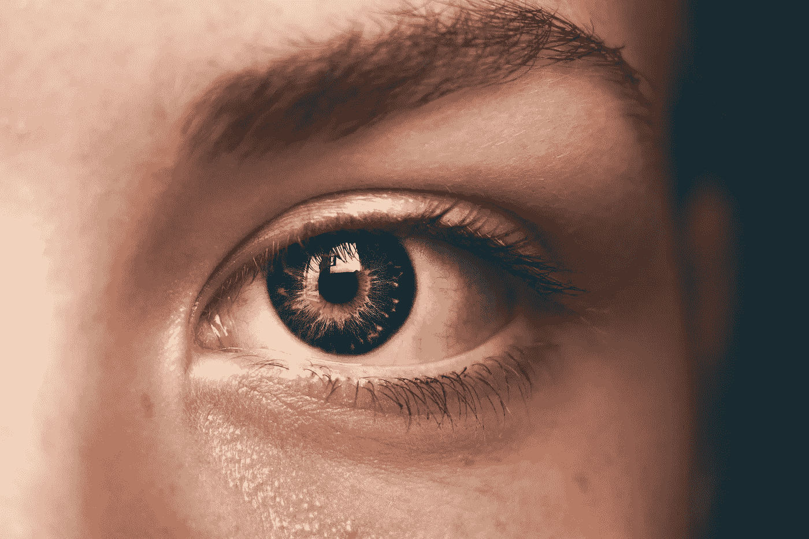
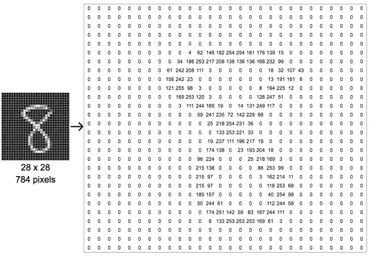
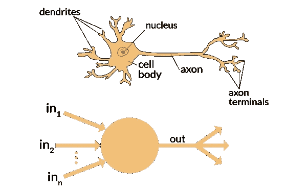
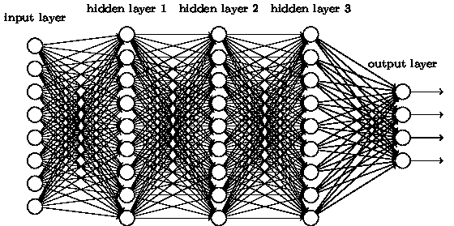
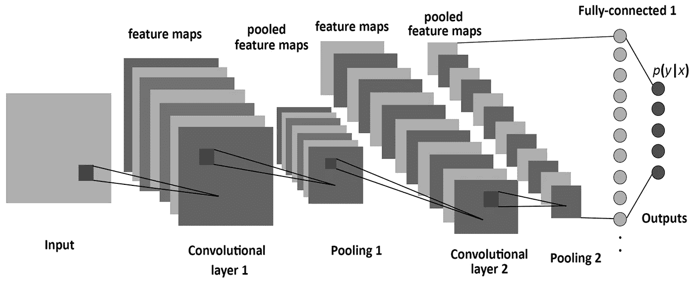
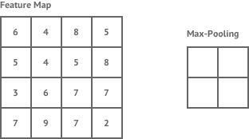
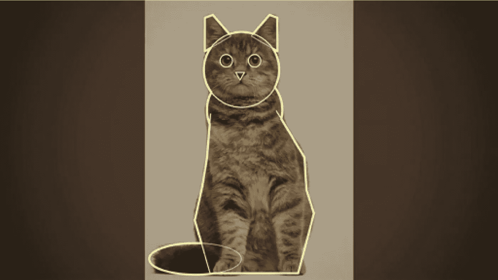
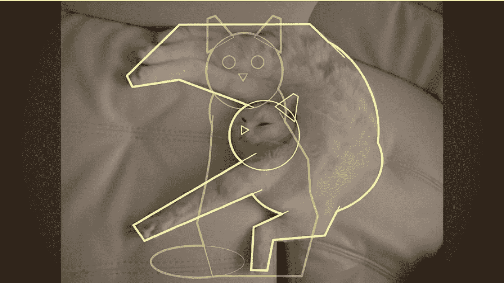
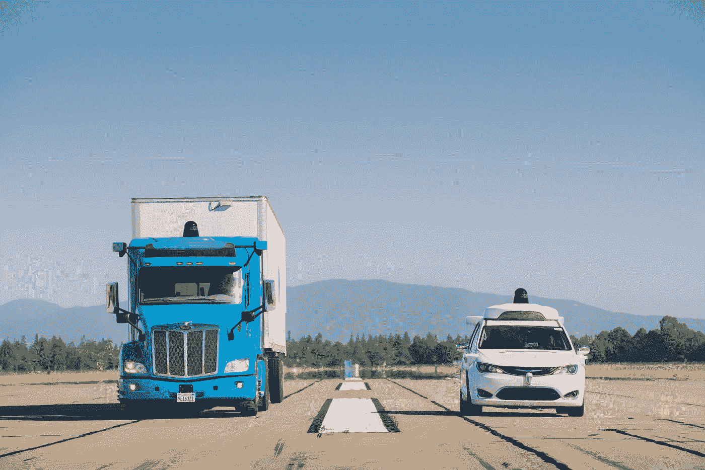
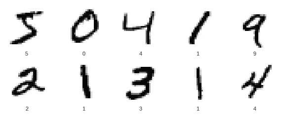

# 如何用卷积神经网络教计算机看东西

> 原文：<https://towardsdatascience.com/how-to-teach-a-computer-to-see-with-convolutional-neural-networks-96c120827cd1?source=collection_archive---------11----------------------->

在过去的几年里，计算机视觉领域取得了巨大的进步。卷积神经网络极大地提高了图像识别模型的准确性，并在现实世界中有大量的应用。在本文中，我将介绍它们是如何工作的，一些真实世界的应用程序，以及如何用 Python 和 Keras 编写一个应用程序。

Photo by [Amanda Dalbjörn](https://unsplash.com/photos/UbJMy92p8wk?utm_source=unsplash&utm_medium=referral&utm_content=creditCopyText) on [Unsplash](https://unsplash.com/search/photos/eyes?utm_source=unsplash&utm_medium=referral&utm_content=creditCopyText)

对我们大多数人来说，看是我们日常生活的一部分。我们用眼睛来寻找我们周围世界的道路。我们用它们来交流和理解。大概不用我说，视力超级重要。这是我们一天中如此重要的一部分。我是说，你能想象，看不见吗？

但是如果我让你解释视觉是如何工作的呢？我们如何理解眼睛解读的东西？嗯，首先你看一些东西，然后…什么？大脑就像一台经过数百万年自然发展的超级复杂的计算机。**我们已经非常擅长识别各种模式和物体。**

**许多技术都是基于自然机制。**以相机为例。快门控制光量，类似于我们的瞳孔。相机和眼睛中的镜头聚焦并反转图像。相机和眼睛都有某种方式来感知光线，并将其转换为可以理解的信号。

Photo by [Alfonso Reyes](https://unsplash.com/photos/xVg65Jh4CI4?utm_source=unsplash&utm_medium=referral&utm_content=creditCopyText) on [Unsplash](https://unsplash.com/search/photos/camera?utm_source=unsplash&utm_medium=referral&utm_content=creditCopyText)

但显然，我们不只是用胳膊和腿移动摄像机。我们目前拥有的相机显然不能完全理解他们在拍什么。如果他们这样做了，那就有点可怕了。对照相机和电脑来说，一张照片只是一串排列的数字。

Digit 8 from [MNIST](http://yann.lecun.com/exdb/mnist/) dataset represented as an array. [Source.](https://cdn-images-1.medium.com/max/1600/1*av47vApmzuM0AN21VaIcSA.png)

那么，我们究竟怎样才能创造出能够告诉我们狗是狗还是猫的程序呢？这是我们试图用**计算机视觉**解决的问题。

这就是神经网络如何帮助我们的！

# 神经网络如何工作

人工神经网络(ANN)是基于人脑的松散程序。**神经网络由许多相连的神经元组成。**这些神经网络中的一些可以有数百万个节点和数十亿个连接！

**神经元基本上是一种接受输入并返回输出的功能。**

Artificial neurons are modeled off biological neurons. [Source.](https://www.quora.com/What-is-the-differences-between-artificial-neural-network-computer-science-and-biological-neural-network)

一个神经元本身做不了多少事。但是当你有大量的神经元连接在一起时，乐趣就开始了。不同层次/结构的神经网络让你做很多很酷的事情。

You can get something like this!

每个神经元通常与某种权重相关联。基本上，当一个连接比另一个更重要时。假设我们有一个网络想告诉你图片是不是一个[热狗](https://medium.com/@timanglade/how-hbos-silicon-valley-built-not-hotdog-with-mobile-tensorflow-keras-react-native-ef03260747f3)。那么我们会希望包含热狗特征的神经元比普通狗的特征更重要。

神经网络的权重是通过对数据集进行训练来学习的。它将运行许多次，通过关于损失函数的反向传播来改变它的权重。神经网络基本上通过测试数据，做出预测，然后看到它有多错。然后它得到这个分数，让自己变得稍微准确一点。通过这个过程，神经网络可以学习提高其预测的准确性。

我不会在这篇文章中讨论反向传播或损失函数，但是有很多很棒的资源，比如 [this](https://medium.com/datathings/neural-networks-and-backpropagation-explained-in-a-simple-way-f540a3611f5e) 涵盖了这些主题！

**卷积神经网络(CNN)是一种特殊的神经网络。当应用于图像数据集时，它们表现得非常好。**

# 卷积神经网络

A diagram of Convolutional Neural Networks. [Source.](https://www.mdpi.com/entropy/entropy-19-00242/article_deploy/html/images/entropy-19-00242-g001.png)

正如我之前提到的，计算机将图片视为一组数组中的数字。CNN 的不同层将函数应用于这些阵列，以从图像中提取各种特征，并降低图像的复杂性。

让我们来看看在热狗检测器上训练 CNN 的一些步骤。

首先，我们用随机权重初始化 CNN。这基本上意味着网络完全是在猜测。一旦它做出预测，它将检查使用损失函数的错误程度，然后更新其权重，以便下次做出更好的预测。

**CNN 包含称为卷积层和池层的层。你可以这样想象卷积层会发生什么。**

假设你有一张照片和一个放大镜。把你的放大镜放在图片的左上角，寻找一个特定的特征。记下它是否在那里。慢慢地在图像中移动，重复这个过程。

Visualizing feature extraction in a convolutional layer. [Source.](https://github.com/vdumoulin/conv_arithmetic)

**卷积层创建一堆特征图。**

对于一个用来描述不同图像如动物或面孔的 CNN 来说。第一卷积层寻找的特征可以是对象的不同边缘。这就像是把图片中不同的边列了一个清单。这个列表然后被传递到另一个卷积层，它做类似的事情，除了它在图像中寻找更大的形状。这可能是动物的一条腿，也可能是脸上的一只眼睛。最终，这些特征被一个全连接的层所接受，该层对图像进行分类。

汇集层也用于卷积层。这需要另一个放大镜，但它不会寻找特征。而是取一个区域的最大值来降低图像的复杂度。

Pooling in a CNN. [Source.](https://shafeentejani.github.io/assets/images/pooling.gif)

这很有用，因为大多数图像都很大。它们有大量的像素，这使得处理器很难处理它们。共享让我们在保留大部分重要信息的同时缩小图像的尺寸。池化还用于防止过度拟合，即当模型变得过于擅长识别我们对其进行训练的数据，而对我们给出的其他示例不太适用时。

An example of overfitting on a linear dataset. [Source.](http://By Ghiles - Own work, CC BY-SA 4.0, https://commons.wikimedia.org/w/index.php?curid=47471056)

如图所示，该图中的数据可以用一条直线来表示。蓝色的模型显然击中了所有的数据点，但如果我们试图让它预测其他东西，它将无法做到。就我们的 CNN 而言，这可能意味着它将对我们训练它的图像超级准确，但无法在其他图像上给我们正确的预测。

最后，我们把 CNN 的结构扁平化成一个超长的特写。我们基本上只是把所有的数据放在一起，这样我们就可以把它传递给一个完全连接的层来进行预测。

## 为什么神经网络更好？

假设我们没有使用神经网络。我们将如何处理这个问题？假设我们正在尝试编写一个识别猫的程序。我们可以通过寻找特定的形状来表现猫。

Cat shapes from Computer Vision Expert Fei-Fei Li’s TED Talk.

看起来很简单，对吧？但是等一下。不是所有的猫都长这样。如果你有一只伸展开的猫呢？我们需要添加更多的形状。

More cat shapes from Computer Vision Expert Fei-Fei Li’s TED Talk.

至此，应该很清楚告诉计算机寻找某些形状是行不通的。猫有各种形状和大小。这是假设我们只在找猫。如果我们想要一个可以对各种图片进行分类的程序呢？

这就是为什么使用神经网络要好得多。你可以让电脑设定自己的规则。**通过使用高度先进的算法，神经网络可以以极高的准确度对图像进行分类。**一些模型已经在这项任务中击败了人类！

# 我们应用计算机视觉的一些很酷的方式

随着算法变得更高效，硬件变得更强大，我们可能能够用更接近科幻小说领域的神经网络来完成任务。但这并不意味着我们现在没有用这项技术做很多很酷的事情！

## 零售

你可能在新闻里听说过。 [**亚马逊 Go**](https://www.amazon.com/b?ie=UTF8&node=16008589011) ，电商巨头的无收银员杂货店。你走进去，拿起一些东西，然后走出来。系统会自动向你收取费用。**覆盖在天花板上的摄像头会记录下你拿起的物品。**虽然该系统并不完善，而且可能容易受到入店行窃的影响。看到这个想法在未来几年内如何发展将会非常有趣。

## 自动驾驶汽车

在我看来，自动驾驶汽车是目前正在开发的最酷的东西之一。 [**Waymo**](https://waymo.com/) **，**最初是谷歌的自动驾驶汽车项目，**优步和特斯拉是一些公司目前正在开发可以自行导航道路的车辆。**

Waymo 的自动驾驶汽车车队已经行驶了超过 1000 万英里的道路！平均每年旅行约 12000 英里。总共有 800 多年的驾驶经验！

One of Waymo’s self-driving cars. [Source.](https://waymo.com/ontheroad/)

## 卫生保健

在医疗保健中，CNN 被用于识别许多不同种类的疾病。**通过对癌症或其他医疗状况的某些数据集进行训练，神经网络可以以很高的准确率找出是否有问题！通过让神经网络提取特征并在数据中找到模式，它可以利用我们从未想到过的图片信息！**

微软正在开发其[**InnerEye**](https://www.microsoft.com/en-us/research/project/medical-image-analysis/)**项目，该项目帮助临床医生使用深度学习和 CNN 分析 3D 放射图像。这有助于医疗从业者提取定量测量值，并有效地计划手术。**

# **用 Keras 创建卷积神经网络**

**既然我们理解了 CNN 应该如何工作背后的一些直觉。我们可以用 Python 编写的高级 API**Keras**在 **Python** 中创建一个。Keras 将帮助我们编写易于理解和超级可读的代码。**

**你可以从安装 [**Anaconda**](https://www.anaconda.com/download/) 开始，在命令界面运行`conda install keras`。然后你可以使用 **Jupyter 笔记本**开始用 Python 编程。如果你想在云端运行一切，你也可以使用谷歌的合作实验室。**

**我们将使用属于 Keras 库的 **MNIST 数据集**。包含 *6 万个训练样本和 1 万个手写数字测试样本。*我们开始吧！**

****

**The first few training examples in the MNIST dataset.**

**首先，我们要从 Keras 库中导入我们需要的所有东西。这包括顺序模型，这意味着我们可以通过添加层来轻松构建模型。接下来我们将导入 Conv2D (Convolution2D)，MaxPooling2D，Flatten 和 Dense 层。前 3 个是不言自明的，密集层帮助我们建立完全连接的层。**

**我们将需要 **Keras Utils** 来帮助我们**编码数据**以确保它与我们模型的其余部分兼容。这使得数字 9 不会被视为比 1 更好。最后，我们将导入用于训练模型的 MNIST 数据集。**

**导入数据集后，我们需要将它分成训练数据和测试数据。训练数据就是我们要教给神经网络的东西。测试数据是我们用来衡量准确性的。我们将*重塑*数据，以匹配 **TensorFlow 后端所需的格式。接下来我们将*归一化*数据，以保持数值范围在 0 到 1 之间。并且*对*MNIST 标签进行分类编码。****

**太好了！现在我们可以开始构建我们的模型了。我们将从创建一个序列模型开始，这是一个*层的线性堆栈*。正如你在下面的代码中看到的，这使得我们向模型中添加更多的层变得非常容易。**

**在我们建立完模型后，我们将编译它。该模型使用 *Adam 优化器*，这是一种用于调整权重的梯度下降算法。我们的模型使用的损失函数是*分类交叉熵*，它告诉我们的模型我们离结果有多远。指标参数用于定义如何评估绩效。它类似于损失函数，但在实际训练过程中不会用到。**

**我们将在训练台上调整或训练我们的模型。*批量大小*决定了我们在每次迭代中要考虑多少张图像。*历元的数量*决定了模型在整个集合中迭代的次数。在一定数量的时代之后，模型将基本上停止改进。**

***详细*值决定了模型是否会告诉我们模型的进度，而*验证数据*决定了模型如何在每个时期后评估其损失。**

**最后，我们将打印出我们的模型有多精确。最终结果应该在 98%到 99%之间**

**你可以在 [my GitHub](https://github.com/uyxela/mnist-keras) 上找到完整的代码，或者你可以在 [Google Colaboratory](https://colab.research.google.com/drive/1oSE2zRroFcjZkBrrWv-p0tnWR7_yOYrH) 上运行它。**

# **关键要点**

*   **神经网络松散地基于我们大脑解释信息的方式。**
*   **卷积神经网络特别适合处理图像。**
*   **计算机视觉在现实世界中有很多应用。**

**感谢阅读！如果您喜欢，请:**

*   **在 LinkedIn[上添加我](https://www.linkedin.com/in/alexjy/)并关注我的媒体，了解我的旅程**
*   **留下一些反馈或给我发电子邮件(alexjy@yahoo.com)**
*   **与你的网络分享这篇文章**