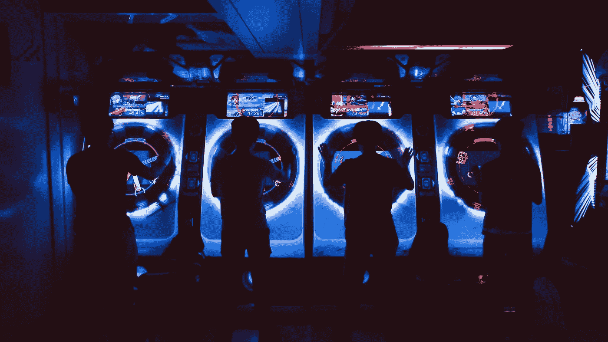
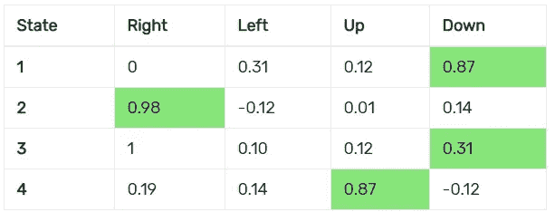
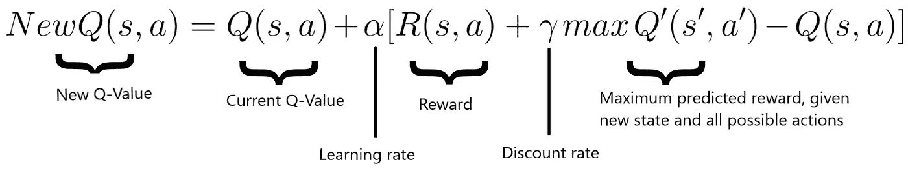
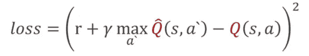
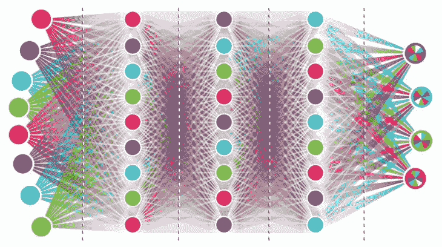
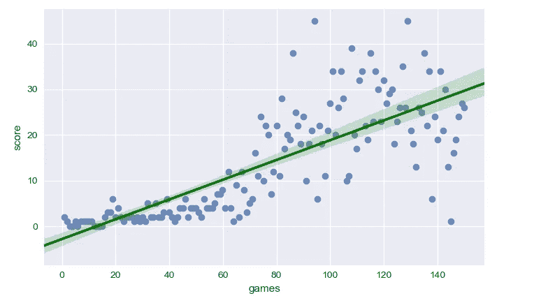

# 如何教 AI 玩游戏:深度强化学习

> 原文：<https://towardsdatascience.com/how-to-teach-an-ai-to-play-games-deep-reinforcement-learning-28f9b920440a?source=collection_archive---------0----------------------->



如果你对机器学习感兴趣，并且对它如何应用于游戏或优化感兴趣，那么这篇文章就是为你准备的。我们将看到强化学习和深度强化学习(神经网络+ Q 学习)的基础知识应用于游戏 Snake。让我们开始吧！

与普遍的看法相反，人工智能和游戏并不能和谐相处。这是一个有争议的观点吗？是的，它是，但是我将解释它。人工智能和人工行为是有区别的。我们不希望我们游戏中的代理比玩家更聪明。我们希望他们足够聪明，能够提供乐趣和参与。我们不想挑战我们 ML bot 的极限，就像我们通常在不同行业所做的那样。对手需要是不完美的，模仿一个类似人类的行为。

然而，游戏不仅仅是娱乐。训练一个虚拟代理人超越人类玩家可以教会我们如何在各种不同和令人兴奋的子领域中优化不同的过程。这就是[谷歌 DeepMind](https://deepmind.com/research/alphago/) 用其广受欢迎的 AlphaGo 所做的事情，它击败了历史上最强的围棋选手，**打进了一个在当时被认为不可能的进球**。在本文中，我们将开发一个**人工智能代理**，它能够从头开始学习如何玩热门游戏《贪吃蛇》。为了做到这一点，我们在 Tensorflow 和 PyTorch(两个版本都可用，您可以选择您喜欢的一个)之上使用两个 Keras 实现了一个[](https://deepmind.com/blog/deep-reinforcement-learning/)****深度强化学习算法**。这种方法包括两个组件之间的交互:环境(游戏本身)和代理(Snake)。代理收集关于其当前状态的信息(我们将在后面看到这意味着什么)并相应地执行动作。环境基于执行的动作奖励或惩罚代理。随着时间的推移，代理学会了什么样的行为能使回报最大化(在我们的例子中，什么样的行为会导致吃掉苹果和避开墙壁)。没有给出关于游戏的规则。最初，Snake 不知道该做什么，并且执行随机的动作。目标是制定一个策略(技术上称为“政策”)来最大化分数——或回报。
我们将看到一个[深度 Q 学习](http://cs229.stanford.edu/notes/cs229-notes12.pdf)算法如何学习玩蛇，在短短 5 分钟的训练中，得分高达 50 分，显示出扎实的策略。可选地，代码显示如何使用[贝叶斯优化](https://distill.pub/2020/bayesian-optimization)来优化人工神经网络。这个过程不是必须的，但是我想为高级读者提一下。**

**关于**完整代码**，请参考 [GitHub 库](https://github.com/maurock/snake-ga)。下面我将展示学习模块的实现。**

# **游戏**

****

**On the left, the AI does not know anything about the game. On the right, the AI is trained and learnt how to play.**

**这个游戏是用 Pygame 用 python 编写的，Pygame 是一个允许开发相当简单的游戏的库。在左边，代理没有经过训练，也不知道该做什么。右边的游戏指的是训练后的特工(5 分钟左右)。**

# **它是如何工作的？**

**强化学习是一系列用于控制的算法和技术(如机器人技术、自动驾驶等)..)和决策。这些方法解决了需要表达为马尔可夫决策过程(MDP)的问题。这是什么意思？这意味着我们需要通过一组状态 S(例如，基于蛇的位置的索引)、一组动作 A(例如，上、下、右、左)、一个奖励函数 R(例如，当蛇吃苹果时+10，当蛇碰壁时-10)和可选的描述状态之间转换的转换函数 T 来描述我们的游戏。为了使用强化学习，我们需要使用这四个部分来形式化我们的问题。如果这是令人困惑的，*怕不是*，几分钟后一切都会明朗。
在我的实现中，我使用了**深度 Q 学习**，而不是传统的监督机器学习方法。有什么区别？传统的 ML 算法需要用一个输入和一个叫做 target 的“正确答案”来训练。然后，系统将尝试学习如何根据看不见的输入来预测目标。在这个例子中，我们不知道在游戏的每个状态下应该采取的最佳行动(这实际上是我们正在努力学习的！)，所以传统的方法不会有效。
在强化学习中，我们有两个主要组件:环境*(我们的游戏)和代理*(我们的蛇..或者正确的说，驱动我们蛇行动的深层神经网络)。每当代理执行一个动作，环境就给代理一个**奖励**，奖励可以是正的也可以是负的，这取决于*该动作在特定状态*下有多好。代理的目标是在给定每一种可能状态的情况下，学习什么样的行为能使奖励最大化。状态*状态*是*代理在每次迭代中从环境中接收到的观察结果*。一个状态可以是它的位置，它的速度，或者任何描述环境的变量数组。更严格地说，使用强化学习符号，代理用来做决策的策略被称为**策略**。在理论层面上，策略是从状态空间(代理可以接收的所有可能观察的空间)到动作空间(代理可以采取的所有动作的空间，比如上、下、左和右)的映射。最优智能体可以在整个状态空间中进行归纳，从而总是预测最佳的可能行动..甚至对于那些代理人从来没有见过的情况！如果这还不清楚，下一个例子会澄清你的疑惑。为了理解代理如何做决定，我们需要知道什么是 Q 表。Q 表是一个矩阵，它将代理的*状态*与代理可能采取的行动相关联。表中的值是行动成功的概率(从技术上来说，是对预期累积奖励的一种衡量)，根据代理在培训期间获得的奖励进行更新。贪婪策略的一个例子是代理查找表格并选择导致最高分数的动作的策略。****

********

****Representation of a Q-Table****

****在这个例子中，如果我们处于状态 2，我们可能会选择右，如果我们处于状态 4，我们可能会选择上。Q 表中的值代表从状态 *s.* 采取行动 *a* 的**累积** **预期报酬**，换句话说，这些值给我们一个指示，即如果代理从该状态 *s* 采取行动 *a* 时它获得的平均报酬。 ***这个表就是我们之前提到的代理人的策略:*** 它决定了从每个状态应该采取什么行动来最大化期望报酬。这有什么问题？策略是一个表，因此它只能处理有限的状态空间。换句话说，我们不能有一个无限大的表，有无限个状态。对于我们有很多可能状态的情况，这可能是个问题。****

****深度 Q 学习通过将表格转换成深度神经网络来增加 Q 学习的潜力，深度神经网络是参数化函数的强大表示。Q 值根据贝尔曼方程更新:****

********

****一般来说，该算法工作如下:****

*   ****游戏开始，Q 值随机初始化。****
*   ****代理收集当前状态 **s** (观察)。****
*   ****代理基于收集的状态**执行**动作**。动作可以是随机的，也可以由神经网络返回。在训练的第一阶段，系统通常选择随机动作来最大化**探索。后来，系统越来越依赖它的神经网络。********
*   ****当人工智能选择并执行动作时，环境给智能体一个**奖励**。然后，代理到达新状态**state’**，并根据上述贝尔曼方程更新其 Q 值。此外，对于每一步棋，它存储原始状态、动作、执行该动作后达到的状态、获得的奖励以及游戏是否结束。该数据稍后被采样以训练神经网络。这个操作被称为**重放存储器**。****
*   ****这最后两个操作重复进行，直到满足某个条件(例如:游戏结束)。****

# ****状态****

****状态是代理发现自己所处的情况的表示。状态也代表神经网络的输入。在我们的例子中，状态是一个包含 11 个布尔变量的数组。它考虑到:
-如果蛇的接近(右，左，直)有立即的危险。
-蛇是否上下左右移动。
-如果食物在上面、下面、左边或右边。****

# ****失败****

****深度神经网络将输出(行动)优化为特定的输入(状态)，试图最大化预期的回报。损失函数给出了表示预测与事实相比有多好的值。神经网络的工作是最小化损失，减少真实目标和预测目标之间的差异。在我们的例子中，损失表示为:****

********

# ****报酬****

****如前所述，人工智能试图最大化预期回报。在我们的例子中，只有当代理吃了食物目标(+10)时，才会给予它积极的奖励。如果蛇撞到墙或者撞到自己，奖励为负(-10)。此外，我们可以对蛇每走一步而不死给予积极的奖励。在这种情况下，Snake 可能会利用这种情况，跑一圈而不是去够食物，因为它每走一步都会得到积极的回报，同时避免撞到墙上的风险。有时，强化学习代理比我们聪明，在我们的策略中呈现出我们没有预料到的缺陷。****

# ****深度神经网络****

****人工智能代理的大脑使用**深度学习**。在我们的例子中，它由 120 个神经元的 3 个隐藏层组成。学习率不固定，从 0.0005 开始，递减到 0.000005。不同的架构和不同的超参数有助于更快地收敛到最优，以及可能的最高分数。
网络接收状态作为输入，并返回与三个动作相关的三个值作为输出:向左移动、向右移动、直线移动。最后一层使用 Softmax 函数。****

********

# ****学习模块的实施****

****该计划最重要的部分是深度 Q 学习迭代。在上一节中，解释了高级步骤。在这里你可以看到它是如何实现的(要查看完整代码，请访问 [GitHub 库](https://github.com/maurock/snake-ga/edit/master/snakeClass.py))。编辑:由于我正在扩展这个项目，Github repo 中的实际实现可能会略有不同。概念与下面的实现相同)。****

```
**while not game.crash:
            #agent.epsilon is set to give randomness to actions
            agent.epsilon = 80 - counter_games

            #get old state
            state_old = agent.get_state(game, player1, food1)

            #perform random actions based on agent.epsilon, or  choose the action
            if randint(0, 1) < agent.epsilon:
                final_move = to_categorical(randint(0, 2), num_classes=3)
            else:
                # predict action based on the old state
                prediction = agent.model.predict(state_old.reshape((1,11)))
                final_move = to_categorical(np.argmax(prediction[0]), num_classes=3)[0]

            #perform new move and get new state
            player1.do_move(final_move, player1.x, player1.y, game, food1, agent)
            state_new = agent.get_state(game, player1, food1)

            #set treward for the new state
            reward = agent.set_reward(player1, game.crash)

            #train short memory base on the new action and state
            agent.train_short_memory(state_old, final_move, reward, state_new, game.crash)

            # store the new data into a long term memory
            agent.remember(state_old, final_move, reward, state_new, game.crash)
            record = get_record(game.score, record)**
```

# ****决赛成绩****

****在实施结束时，人工智能在 20x20 的游戏棋盘上平均得分为 40 分(每吃一个水果奖励一分)。记录是 83 分。
为了可视化学习过程以及深度强化学习方法的有效性，我绘制了分数和玩游戏的数量。正如我们在下图中看到的，在前 50 场比赛中，人工智能得分很低:平均不到 10 分。这是意料之中的:在这一阶段，代理人经常采取随机行动探索棋盘，并在其记忆中存储许多不同的状态、行动和奖励。在过去的 50 场比赛中，代理不再采取随机的行动，而是根据它的神经网络(它的策略)来选择做什么。****

> ****在仅仅 150 场比赛中——不到 5 分钟——代理学会了一个可靠的策略，并获得了 45 分！****

********

# ****结论****

****这个例子展示了一个简单的代理如何在几分钟内用几行代码学会一个进程的机制，在这个例子中是游戏 Snake。我强烈建议深入研究代码并尝试改进结果。一个有趣的升级可能会在每次迭代时通过当前游戏的截图获得。在这种情况下，状态可以是每个像素的 RGB 信息。深度 Q 学习模型可以用双深度 Q 学习算法来代替，以实现更精确的收敛。****

****如果您有任何问题或建议，请随时留言，我将非常乐意回答。****

****要引用这篇文章，请参考这个快速 BibTex 推荐:****

```
****@article**{comi2018,
    title = "How to Teach an AI to Play Games using Deep Q-Learning",
    author  = "Comi, Mauro",
    journal = "Towards Data Science",
    year    = "2018",   
    url     = "https://towardsdatascience.com/how-to-teach-an-ai-toplay-games-deep-reinforcement-learning-28f9b920440a"
}**
```

*****如果你喜欢这篇文章，我希望你能点击鼓掌按钮*👏*这样别人可能会偶然发现它。对于任何意见或建议，不要犹豫留下评论！*****

## ****我是一名研究工程师，热爱机器学习及其无尽的应用。你可以在 maurocomi.com[找到更多关于我和我的项目的信息。你也可以在](http://www.maurocomi.com) [Linkedin](https://www.linkedin.com/in/mauro-comi/) ，在 [Twitter](https://twitter.com/mauro_ai) 上找到我，或者直接给我发邮件。我总是乐于聊天，或者合作新的令人敬畏的项目。****

****如果你对这篇文章感兴趣，你可能会喜欢我的其他文章:****

*   ****[人工智能遇上艺术:神经传递风格](https://medium.com/p/50e1c07aa7f7?source=your_stories_page---------------------------)****
*   ****[人工智能是种族歧视吗？(及其他关注)](https://medium.com/p/817fa60d75e9?source=your_stories_page---------------------------)****
*   ****[计算机图形学中人工智能的 3 大挑战](https://medium.com/p/223e06bd846b?source=your_stories_page---------------------------)****