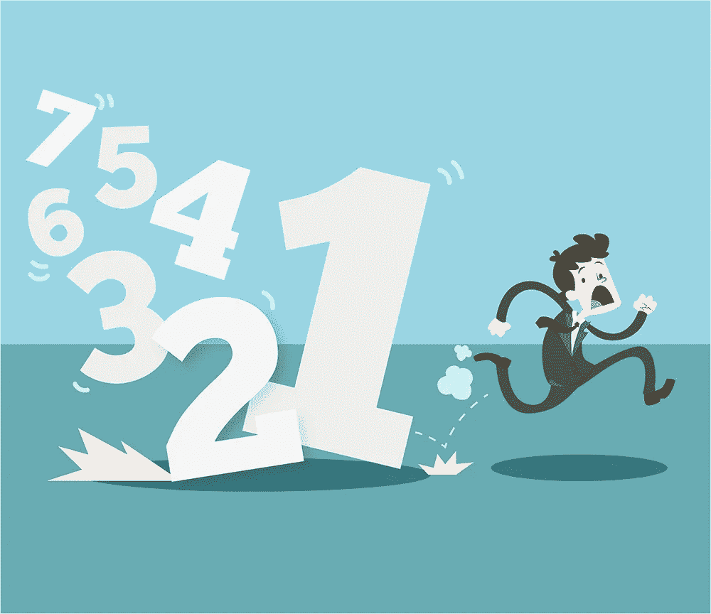
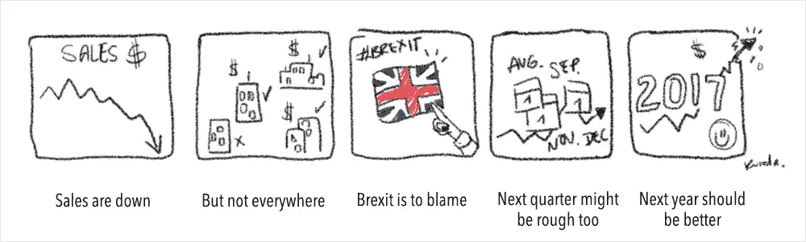
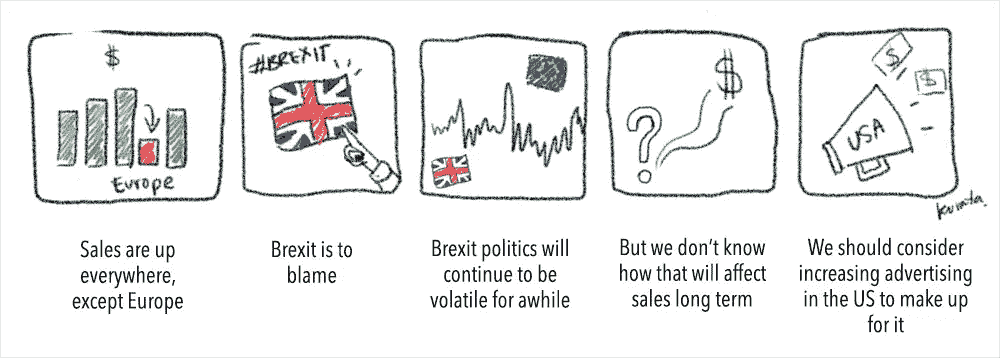
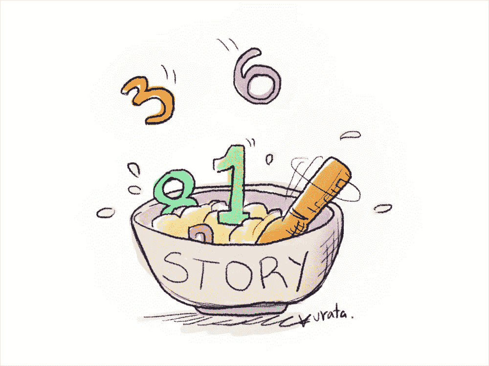

# 如何讲故事，用数据编织有凝聚力的叙事

> 原文：<https://towardsdatascience.com/how-to-tell-stories-and-weave-a-cohesive-narrative-with-data-532f33ba60cf?source=collection_archive---------2----------------------->

讲故事是人类最重要的进化优势之一。这是一个大胆的说法，但我相信这是真的。

当古代人围坐在村庄的篝火旁讲故事时，他们正在教其他村民去哪里寻找食物，如何成功捕获猎物，什么草药可以治愈疾病，哪些动物应该避开(以及如何避开！)等必备的生存技能。

这些信息没有在村里的时事通讯或洞壁上的安全海报中分享(嗯…我猜它们有点像早期的海报…但你知道我的意思)。这些课程主要以故事的形式出现。

所以几万年来，这是人类相互学习最重要的东西的方式，因此，这也是我们期望相互学习的方式。

# 数字让人害怕

每个人都知道如何讲故事。我们都到处编故事。我们知道如何讲笑话，制造悬念，围绕一个奇怪的假期轶事或关于我们孩子的芭蕾课讲一个流畅的故事。

然而，出于某种原因，一旦大多数人不得不交流数字，他们吓坏了。“我讨厌数学！我不知道数字！我有数据要分享…我该怎么办？！？我知道，我会把所有的数字放在一张幻灯片上，然后期待最好的结果。其他人都会想通的……”

这感觉熟悉吗？[你并不孤单](http://blogs.scientificamerican.com/degrees-of-freedom/we-hate-math-say-4-in-10-a-majority-of-americans/)。在我们的文化中，我们有一种严重的数字恐惧症，这种恐惧症让许多人——尤其是专业沟通者——神经紧张。

但是正如[认知行为疗法](http://psychcentral.com/lib/in-depth-cognitive-behavioral-therapy/)可以通过直面恐惧来帮助解决各种恐惧症的问题一样，我相信每个人都可以学会以类似的方式交流数据——通过这样做。仅仅是尝试和练习的行为，就能使任何沟通者成为数据沟通者。

最重要的策略之一是从讲故事的角度来看待数据通信。不仅因为讲故事是如此强大，是在许多主题上与许多观众联系的最佳方式，而且因为我们都知道如何做，所以它有助于将令人生畏的数字转化为故事的简单成分。

# 用数字编织一个故事

将数字转化为叙事的最重要的步骤之一是，像你讲述其他故事一样，概述或讲述你的故事，忽略数据本身，专注于论点的流动。例如，假设你有公司的销售数据，你需要为你的 CEO 做一份报告。你是做什么的？

首先，你要弄清楚 KWYRWTS——我的首字母缩略词，这是有史以来最糟糕的首字母缩略词，但它代表了一个非常重要的思想:知道你真正想说什么。

假设你这个季度的销售数字大幅下降。但你知道主要原因是因为围绕英国退出欧盟公投的争论和随后的通过，你的欧洲办公室的销售额大幅下降。显然这将是你故事的焦点。那是你的 KWYRWTS。也许有两个要点，或者三个要点，但是你必须知道它们到底是什么！

所以你创建一个故事板，并像这样决定叙事流程:

这五个“面板”故事建立了一个流程和逻辑，你可以很容易地围绕它编织一个故事。你知道你以“销售额下降”开始，这可能包括公司销售的概述。你正在建立一些预期，激活你的 CEO 的情绪(希望不是针对你的愤怒——也许他有些焦虑！).

然后，你会通过显示地区数字，暗示一些好消息，将故事转移到缓解焦虑上？或者至少一些可能有助于支持解决方案的信息。接下来，你得到你对问题的假设，这是从地区故事的逻辑构建。然后你进入预测未来阶段，关注近期(下个季度)和长期(明年)，这让你以一个快乐的音符结束——对你的数据故事来说，这是一个好莱坞式的结局！

只有当你对自己的故事非常有信心时，你才会担心获得实际的数据，并考虑要展示什么图表，以及如何展示。换句话说，我需要理解数据的要点，以知道要讲什么故事，但我不需要一点实际数据来概述一个令人信服的故事，解释需要解释的内容，并以最大化我对首席执行官的影响的方式呈现信息。

这是一个非常简单的过程，根据大量的内容简单地勾勒出一个基本的线性故事，这是从一堆数字中挤出一个故事的非常有效和非常简单的方法。

对了，隐藏在这里面的，是我观众非常清晰的认识。我知道我虚构的 CEO 不会因为一点坏消息就大发雷霆——我肯定她已经知道了。我也知道她很好奇销售额下降的原因，以及我们是否能对未来做出任何预测。

因此，我将这个故事编织成一种方式，可以很快找到原因，然后进行预测。我也知道她希望坦诚，所以清楚地知道下一季度可能没那么好是很重要的，同时也在最后提供一缕阳光。

如果是另一位老板，我可能会以不同的方式讲述这个故事:

# 只是不要害怕

你已经知道如何讲故事了。知道你想说什么，尽可能在你的叙述中注入情感、悬念和兴趣，概述你的故事流程，忽略数据直到过程的最后，然后才担心具体包括什么以及如何可视化你的数据。最好的建议？你在用数字讲故事。不要害怕。你在讲一个故事…用数字——它们只是成分！

要了解更多关于[数据叙事](http://rockthevizcomm.com/data-storytelling-udemy-for-communicators)的信息，只需在 Udemy 上查看课程即可(使用此链接可节省 50%的费用)。

*本帖* [*原版*](http://blog.visme.co/how-to-tell-stories-with-data/) *最早出现在 Visme 的* [*视觉学习中心*](http://blog.visme.co/) *。*