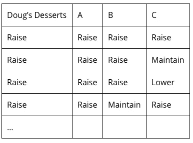
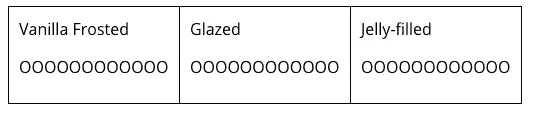
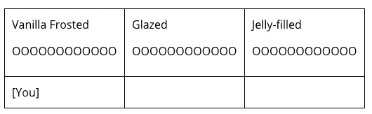
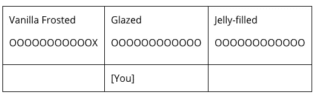
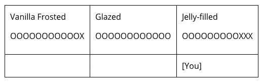

# 如何像数据科学家一样思考组合学

> 原文：<https://towardsdatascience.com/how-to-think-about-combinatorics-like-a-data-scientist-bddbd18eff80?source=collection_archive---------2----------------------->

牢固掌握这些基本概念，以改善您的决策过程并推动您的公司向前发展。

我们最近讨论了[决策树、](http://outlier.ai/2017/01/16/decision-theory/) [博弈论](http://outlier.ai/2017/01/23/game-theory/)和[客户角色](http://outlier.ai/2017/01/30/customer-personas/)。对于每个主题，我们都使用了具有少量案例的示例，这样我们就可以向您展示一些有趣但大小可控的内容。上周，我们讨论了如何使用集群来减少您试图解决的问题的规模。本周，我们将更进一步，讨论如何计算你必须开始的案例数。

为此，我们将讨论[组合学](https://en.wikipedia.org/wiki/Combinatorics)的数学领域，特别是排列和组合。排列计算结果的数量，而你计算的顺序很重要。另一方面，组合计算结果的数量，而你计算的顺序并不重要。排列和组合都被进一步细分，以考虑您正在选择的选项是否允许重复，即在每次选择后在可用选项集中替换，或者不允许(您将看到这个概念被称为“重复”和“替换”——本周我将使用“替换”)。本周我们将讨论每个场景:

*   [置换置换](http://outlier.ai/2017/02/14/combinatorics-permutations-with-replacement)
*   [没有替换的排列](http://outlier.ai/2017/02/15/combinatorics-permutations-without-replacement/)
*   [没有替换的组合](http://outlier.ai/2017/02/16/combinatorics-combinations-without-replacement/)
*   [替换组合](http://outlier.ai/2017/02/17/combinatorics-combinations-with-replacement/)

开始数数吧！

> [**离群值**](http://outlier.ai/) **监控您的业务数据，并在发生意外变化时通知您。**我们帮助营销/发展&产品团队从他们的业务数据中获取更多价值。
> 
> [**今天安排一次演示。**](http://outlier.ai/)
> 
> - Outlier 是 Strata+Hadoop World 2017 观众奖得主。

# 置换置换

回到我们讨论博弈论的时候，我们讨论的一个场景是，你的公司(例如，道格的甜点)需要决定是提高价格、降低价格还是保持价格不变。假设你有另外 3 个竞争者(让我们称他们为 A、B 和 C ),他们和你卖同样的产品，他们面临同样的三个决定。此外，根据您过去的经验，您知道您的公司是该领域的领导者，然后其他公司总是以相同的顺序对您的定价决策做出反应，A，B，c。

> 排列计算结果的数量，而你计算的顺序很重要。另一方面，组合计算结果的数量，而你计算的顺序并不重要。

那么会发生多少种不同的情况呢？我们当然可以用手数出来…

…但随着选项数量的增加，这变得越来越难。这个问题是置换排列的一个例子。让我们从头开始思考结果的数量。道格的甜点首先在 3 个选项中做出选择，然后 A 公司在同样的 3 个选项中做出选择。换句话说，对于道格的甜点可以选择的 3 个选项中的每一个，公司 A 可以选择相同的 3 个选项中的任何一个，这意味着有 3 * 3 = 9 种可能的结果。接下来，B 公司在同样的 3 个选项中做出选择。换句话说，对于我们为道格的甜点和 A 公司计算的 9 个结果中的每一个，B 公司可以选择 3 个选项，这意味着有 9 * 3 = 27 个结果。最后，C 公司在同样的 3 个选项中做出选择。换句话说，对于我们为道格甜点计算的 27 个结果中的每一个，公司 A、公司 B、公司 C 可以选择 3 个选项，这意味着有 27 * 3 = 81 个结果。

你现在可以看到这个模式了——每次做出一个新的选择，我们都要把之前的结果乘以选项的数量。让我们将 n 表示为选项的数量，在本例中 n = 3，k 表示做出选择的次数，在本例中 k = 4。然后，我们可以概括置换的概念:当有 n 个选项被选择 k 次，每次替换选项，有 n^k 不同的结果。在这个例子中，这意味着，3⁴ = 3 * 3 * 3 * 3 = 81。

接下来，我将讨论不允许替换选项的排列场景。

# 没有替换的排列

这就是当在过程的每一步都有相同的选项时，如何计算排列的方法。现在我来讲讲每个选择只允许做一次的情况下，如何统计结果。

假设你准备推出一款新产品，并试图找出向公众发布的最佳策略。你已经确定了四种不同的营销策略，并正在考虑实施:

*   发送新闻稿并安排新闻媒体的采访
*   开展在线营销活动
*   开展电视/广播营销活动
*   在行业会议上发起并发言

根据您的营销经验，您认为采取这些措施的顺序很重要。换句话说，你认为在发起行业会议并在会议上发言之前进行在线营销活动的结果会与在线营销活动之前举行会议的结果不同。

那么你要考虑多少种不同的结果呢？这是一个没有替换的排列的例子。有四种不同的策略可以考虑，我们将它们表示为 n。当考虑先做什么时，您有四种选择。当考虑下一步做什么时，你只剩下三个选择(因为我们不会做两次同样的营销策略)。当你选择第三步做什么的时候，你还有两个策略。最后，最后做的策略是由你之前的选择决定的，因为只剩下一个选项了。综上所述，你有 4 * 3 * 2 * 1 = 24 种不同的结果需要考虑。

我们刚刚做的整数乘积的计算发生得如此频繁，以至于它有自己特殊的名字和数学符号。它被称为[阶乘](https://en.wikipedia.org/wiki/Factorial)，用“！”表示在一个数字之后。它的简写意思是，取每个小于或等于该数的整数的乘积。比如 4！= 4 * 3 * 2 * 1 = 24，正是我们上面计算的结果。更一般地说，如果我们要采取所有 n 个营销策略，那么我们必须考虑 n 个！不同的结果。

但是，如果你因为没有时间或预算而无法完成所有的营销策略，该怎么办呢？而是只能选择 4 个选项中的 2 个。让我们把你要做的选择数记为 k，在这个例子中 k = 2。你可以从第一步的 4 个策略和第二步的 3 个策略中选择，但是你就此打住。所以你有 4 * 3 = 12 个结果要考虑。请注意，这个结果与之前的唯一不同之处是 2 * 1 不再出现在公式中。我们可以将公式改写为 4 * 3 * 2 * 1 / 2 * 1 = 4 * 3 = 12(很快就会明白为什么了)。换句话说，我们总共有 n 个！结果，但需要将该值减去我们能够做出的选择数，即(n — k)！

把这两个例子，我们可以写一个，一般公式如何计算置换:n！/ (n — k)！，通常表示为 P(n，k)。在我们讲的第一个例子中，有 4 个选项(n = 4)和 4 个选择(k = 4)，所以 4！/ (4–4)!= 4!/ 0!= 24 [1].在第二个例子中，有 4 个选项(n = 4)和 2 个选择(k = 2)，所以 4！/ (4–2)!= 4!/ 2!= 12.

既然我们已经知道了如何在顺序很重要的情况下计数，明天，我将讨论顺序无关紧要的组合。

# 没有替换的组合

当你想到密码时，首先想到的可能是“密码锁”。不幸的是，这实际上是一个非常糟糕的组合的例子！正如我们在过去的几天里谈到的，在排列中，顺序很重要，但在组合中，顺序并不重要。正如你所知道的，你在密码锁中输入数字的顺序非常重要，所以如果我们想要更准确(至少从数学家的角度来看)，我们应该将“密码锁”重命名为“排列锁”！

让我们重新考虑一下昨天的例子，您有四个不同的营销活动策略，您正在考虑即将到来的产品发布。在排列的情况下，这些决定的顺序很重要。但是今天，让我们假设你要进行一次大的营销宣传，同时实施所有这些策略。那有多少种不同的结果？简单，一——你同时做所有的事情！

现在让我们假设你想大出风头，但没有预算或时间同时实施这四个策略。相反，你只能做两个。考虑没有替换的组合的最简单的方法是首先计算没有替换的排列的数量，然后用选项可以排序的方式的数量来减少该值。昨天我们计算出，当我有四个选项和两个选择时，有 12 种不同的没有替换的排列。那么，有多少种方法可以让我们做出两种选择，并进行替换呢？我们从昨天就已经知道答案了，是 P(2，2) = 2！/ (2–2)!= 2!= 2 * 1 / 1 = 2.这意味着没有替换的组合数是 12 / 2 = 6。

我们可以把所有这些放在一起形成一个通用的形式，再次表示 n 为选项的数量，k 为选择的数量。我们将今天的结果计算为 P(n，k) / P(k，k)。因为 P(k，k)和 k 是一样的！，我们可以把这个写成 P(n，k) / k！= n！/ (n — k)！* k！，通常表示为 C(n，k)。在我们今天讲的第一个例子中，有 4 个选项(n = 4)和 4 个选择(k = 4)，所以 4！/ (4–4)!* 4!= 4!/ 0!* 4!= 1.在第二个例子中，有 4 个选项(n = 4)和 2 个选择(k = 4)，所以 4！/ (4–2)!* 2!= 4!/ 2!* 2!= 6.

接下来，我将通过讨论替换组合来结束我们关于组合学的讨论。

# 替换组合

我们要讨论的最后一种组合是替换组合。这类计数问题的一个例子是在商店购买产品。举个例子，你站在我假设的面包店 Doug 's Desserts 的柜台前，想买四个甜甜圈(即你做出选择的数量，这里 k = 4)。我的面包店出售三种甜甜圈:香草霜甜甜圈、糖衣甜甜圈和果冻馅甜甜圈(即你拥有的选择数量，其中 n = 3)。现在的问题是，考虑到你可以随心所欲地购买每种甜甜圈，你有多少种方法可以从三种选择中购买四种甜甜圈？

类似的逻辑也适用于我在讨论置换时讨论的例子——四家公司各自选择三种产品价格处理方案。在排列的背景下，我们假设选择的顺序很重要。不过，对于组合来说，让我们假设顺序无关紧要。现在的问题是，假设这四家公司都在同一时间定价，他们有多少种不同的定价方式？

在这两个例子中，有 n = 3 个选项可供选择，并且做出 k = 4 次决策，其中每次做出决策时所有选项都可用。

让我们用甜甜圈的例子来思考如何解决这个问题，因为它更容易形象化。想象你在面包店，每种类型的甜甜圈都在自己的托盘上。因此，一个托盘上有一打香草冰淇淋(在表格中用“O”表示)，旁边的托盘上有一打果冻，还有一打糖浆放在自己的托盘上。

你喜欢香草霜，也确实喜欢果冻馅的，但是不喜欢蜜饯的，所以你的方案是选一个香草霜，三个果冻馅的。您可以想象购买过程如下。

首先，你站在香草霜甜甜圈托盘前(你看到的托盘是蓝色的)…

然后要一个甜甜圈放在你的包里。然后你移到下一盘甜甜圈，浇上糖浆。

既然你不想要这些甜甜圈，就不要从托盘里拿走。你移动到最后一盘油炸圈饼，果冻填充…

三次要一个甜甜圈。

如果一个旁观者记录了你购买甜甜圈的步骤，它应该是这样的:(1)甜甜圈(2)移到下一个托盘(3)移到下一个托盘(4)甜甜圈(5)甜甜圈(6)甜甜圈。实际选择的甜甜圈并不重要，因为这是一个组合，选择的顺序并不重要。

以这种方式来看购买，无论你选择哪种甜甜圈，你总是会有 4(即，k)“甜甜圈”步骤和 2(即，n-1)“移动到下一个托盘”步骤。这就像说，我们有 k + (n -1)，在我们的例子中是 6，选择甜甜圈或移动到下一个托盘的不同选项，我们想选择 k，在我们的例子中是 4，甜甜圈。换句话说，这与没有替换的组合是一样的，但是对我们昨天讨论的公式的输入稍作修改！结果总数为 C(k + (n — 1)，k) = (k + (n — 1))！/ (k + (n — 1) — k)！* k！=(k+(n-1))！/ (n — 1)！* k！。从示例中插入我们的值，有 6 个！/ 2!* 4!=你如何选择甜甜圈的 15 个结果(或者公司可以做出定价决定)。

好了，这就是排列和组合。我希望你已经享受了这一周的计算结果，你可能会面临你的业务！

> [**离群值**](http://outlier.ai/about-outlier/) **监控您的业务数据，并在发生意外变化时通知您。**我们帮助营销/发展&产品团队从他们的业务数据中获取更多价值。 [**今天安排试玩。**](http://outlier.ai/)
> 
> - Outlier 是 Strata+Hadoop World 2017 观众奖得主。
> 
> 这是 30 秒后的异常值。

[1] 0!= 1，按照惯例。

[2]一打油炸圈饼并不重要，只要每个托盘上至少有四个——因为这是你要做的选择，我们假设每个选择都有所有选项——逻辑是一样的。