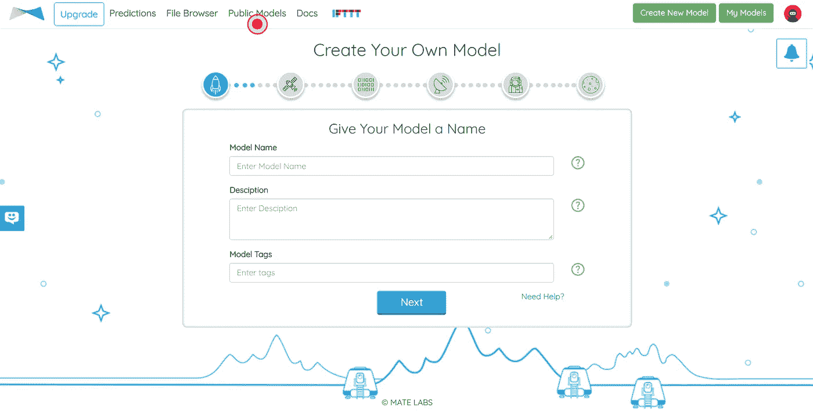
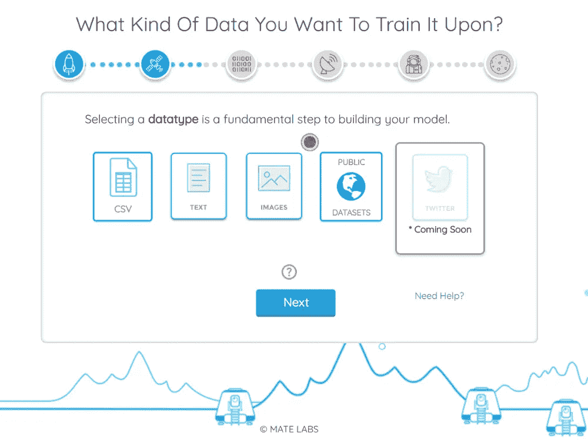
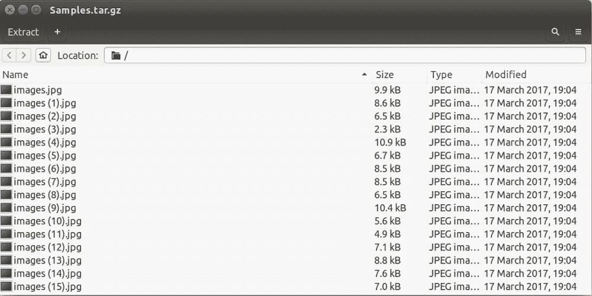
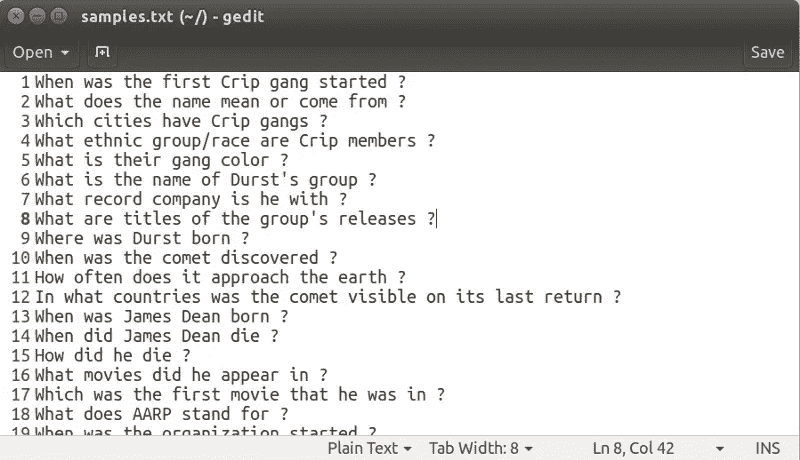
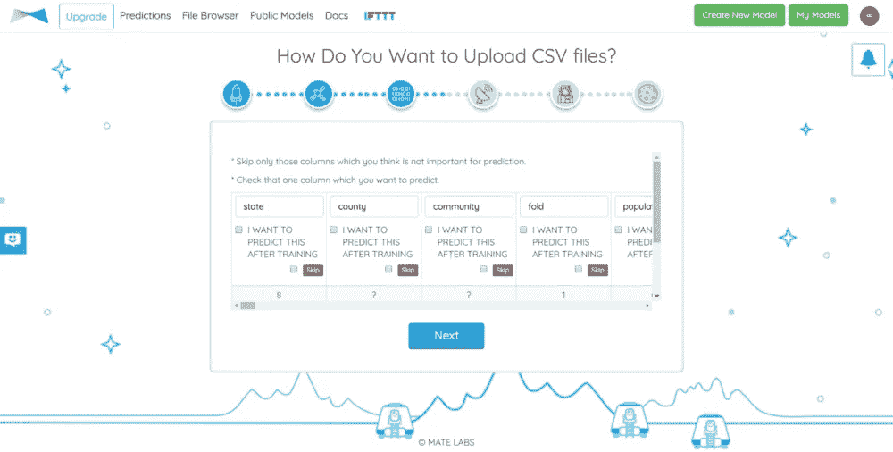
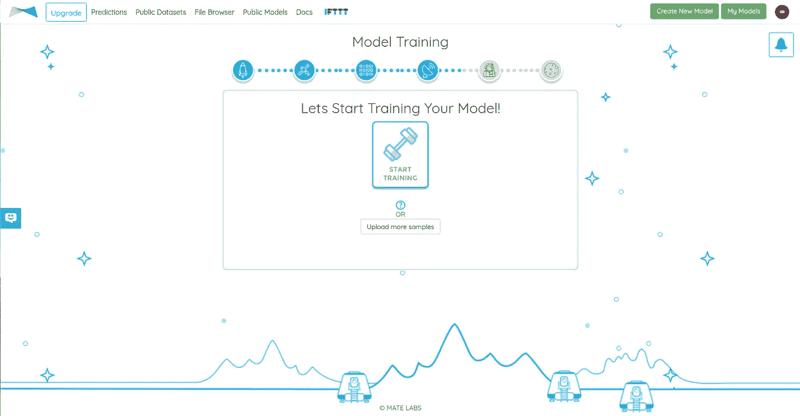

# 如何在 5 分钟内训练一个机器学习模型

> 原文：<https://towardsdatascience.com/how-to-train-a-machine-learning-model-in-5-minutes-c599fa20e7d5?source=collection_archive---------3----------------------->

**关于** [**Mateverse**](https://www.mateverse.com/) :我们在 [**Mate Labs**](http://matelabs.in/) 已经建立了 Mateverse，使每个人都能够建立和训练机器学习模型，而无需编写一行代码。在 Mateverse 上培训模型只需 5 个步骤。如果你想要的**只是**一个智能解决方案，甚至不需要学习编码技能，更不用说机器学习的概念了。

看看它是如何工作的:

1。 **模型命名** —给你的模型起个名字:先给你的模型起个名字，描述你的模型，给你的模型贴上标签。标签是为了让你的模型可以被搜索。

Step 1— Naming your model

2。 **数据类型选择** —选择数据类型(Images/Text/CSV):是时候告诉我们你想要训练你的模型的数据类型了。我们支持**图片、文字和*。**CSV(分类数据)数据类型。选择适当的数据类型，然后单击“下一步”继续下一步。我们还公开了一些数据集，供大家开始使用。 [**公开数据集**](https://medium.com/@matelabs_ai/public-data-sets-use-these-to-train-machine-learning-models-on-mateverse-4dda18a27851) 是为了让你知道在 **Mateverse** 上训练你的模型需要什么类型的数据。

Step 2— Data Type Selection

3。 **数据上传** —上传您的数据或从公共数据集中选择:从公共数据集中选择，如珠宝数据集(图像)、性别数据集(图像)、问题或句子数据集(文本)、数字数据集(CSV)或上传您的数据。上传您的数据是一个简单的过程，只需选择您的文件并键入所选文件的标签。

我们举一个图像数据集的例子。图像可以直接上传，也可以压缩成压缩文件上传(不同的标签/类别有不同的压缩文件)。属于一个唯一类别的所有图像都应该在这个压缩文件中。

附:建议:不要压缩文件夹，压缩文件夹的话就不行了。选择文件并直接压缩。

Sample compressed file with images — This is how your compressed file’s data should look like

文本—同样，您可以上传文本(*。txt)文件。下面是一个示例文本文件。每个独特的句子应该是文本文件中的不同行。

Sample Text(.txt) file

CSV——如果你想训练一个模型，不管是分类还是回归(预测),只需上传**一个** csv 文件就可以了。一旦你上传了文件，你必须做两件事:

a) **按下“跳过”按钮，跳过**您发现对训练所需模型来说多余/不重要的列。

b)在模型训练完成后，选择一个要进行预测的列。

您甚至可以更改列名以供参考。

CSV fIle Upload Preview

附注:尽量避免在文本和 CSV 文件中使用不支持的字符。

4。 **为您上传的文件(图像/文本文件)键入类别(标签)**，点击提交开始上传。等待一段时间，直到我们的 web 应用程序上传所有文件。您可以上传尽可能多类别的图像。您需要至少 2 个标签(类别)来对图像/文本进行分类。我们支持带“*”的文本文件。txt "扩展名。

5。 **开始训练:**按下按钮，开始训练。现在，Mateverse 的智能后端将开始处理你上传的数据，并为训练做准备。与此同时，它还将开始选择最佳的机器学习/深度学习算法，以最高的精度训练最佳模型。

Step 4: Push the Button to Start Training

6。 **开始测试:**你的模型训练好了，可以开始测试你刚训练好的模型了。您可以通过 UI 使用它，或者通过 API 集成它([参考文档](http://docs.mateverse.com/))。

# 关于我们的更多信息

> 在让 Mateverse 成为一个更好的平台方面，我们已经走了很长的路。借助 Mateverse V1.0，我们利用专有技术、复杂管道、大数据支持、自动化数据预处理(使用 ML 模型的缺失值插补、异常值检测和格式化)、自动化超参数优化以及[更多](http://bit.ly/2UKMO2J)功能，让分析师和数据科学家的工作变得更加轻松。
> 
> [*如果你也想在 5 分钟内训练出一个 ML 模型，请在这里填写*](https://matelabs.typeform.com/to/LIAau1) *。*
> 
> 为了帮助您的企业采用机器学习，而不会浪费您的团队在数据清理和创建有效数据模型方面的时间，您也可以通过[电子邮件](http://mate@matelabs.in)与我们联系，我们将与您联系。

# 让我们携起手来。

> 告诉我们你第一次在 Mateverse 中训练模型的经历。而且我们会分享给所有我们认识的对 AI 和机器学习着迷的人。共建共享。*查看* [*LinkedIn*](https://www.linkedin.com/company/mate-labs/) *，了解更多。*
> 
> 如果你有新的建议，请告诉我们。我们的耳朵和眼睛总是为真正令人兴奋的事情而张开。

# 之前我们分享过。

1.  [公共数据集:用这些在 Mateverse 上训练机器学习模型。](https://medium.com/@matelabs_ai/public-data-sets-use-these-to-train-machine-learning-models-on-mateverse-4dda18a27851)
2.  [Mateverse 公测公告。](https://medium.com/@matelabs_ai/big-announcement-mateverse-is-in-public-beta-a968e727cfdc)
3.  [为什么我们需要机器学习的民主化？](https://medium.com/startup-grind/why-do-we-need-the-democratization-of-machine-learning-80104e43c76f)
4.  一个非常清晰的解释全有线电视新闻网的实施。[这些研究人员如何尝试一些非常规的东西，以实现更小但更好的图像识别。](https://medium.com/@matelabs_ai/how-these-researchers-tried-something-unconventional-to-came-out-with-a-smaller-yet-better-image-544327f30e72)
5.  我们的愿景。[关于人工智能大家都没告诉你的事情](https://medium.com/startup-grind/what-everyone-is-not-telling-you-about-artificial-intelligence-36c8552f3f53)