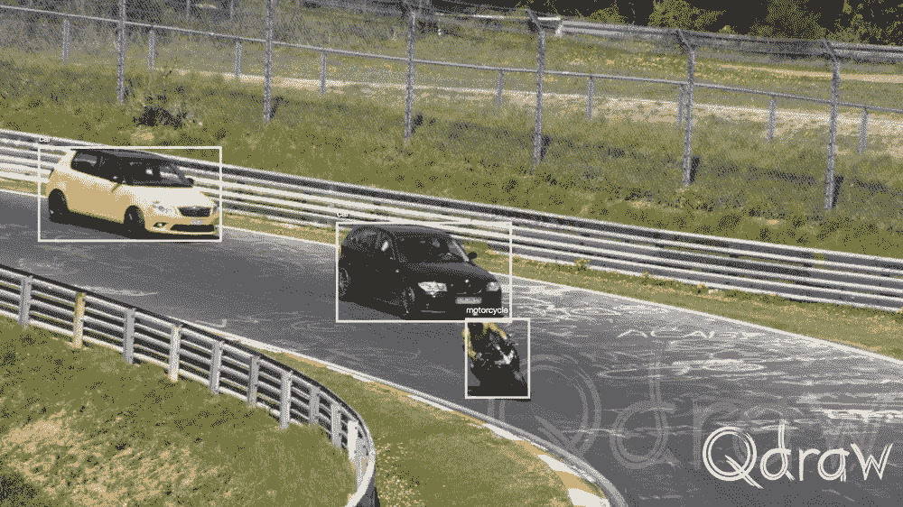
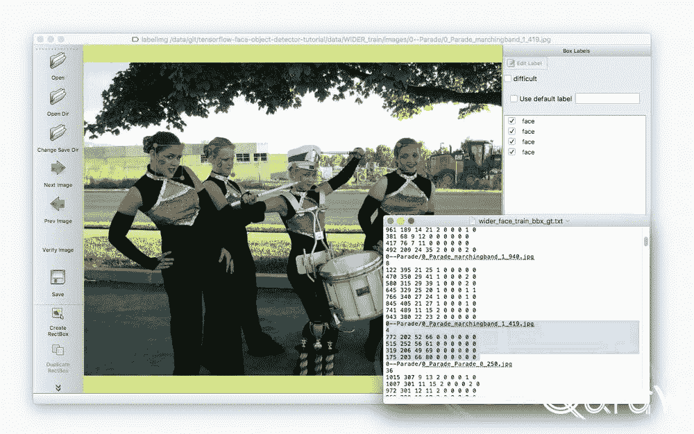
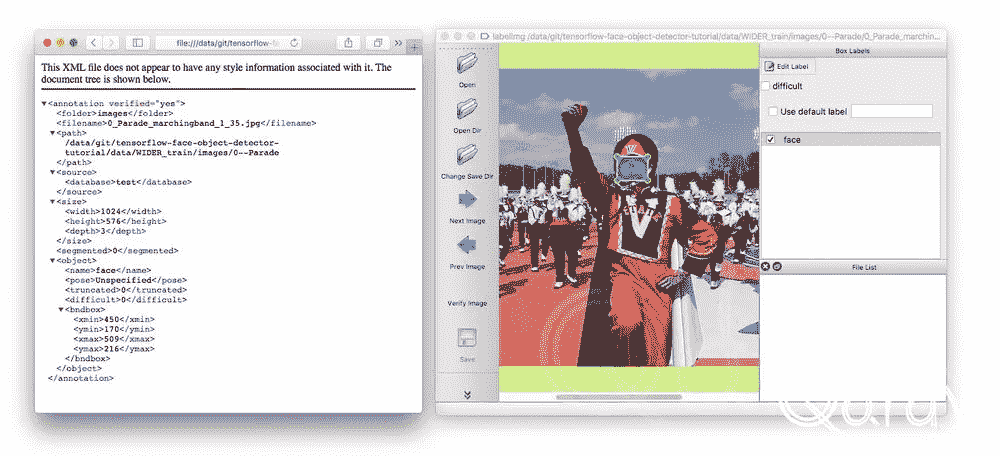
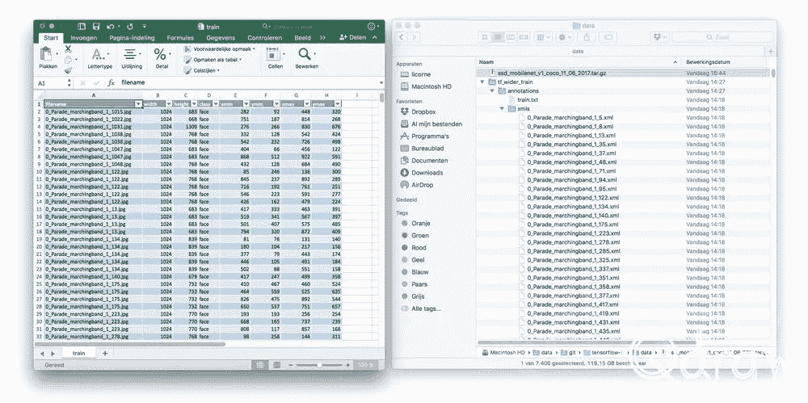
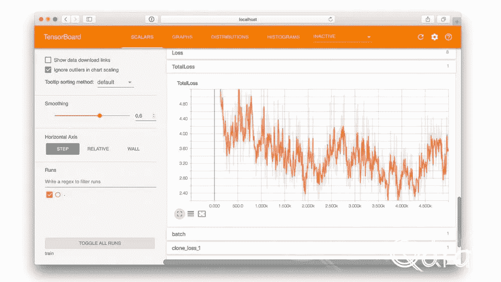
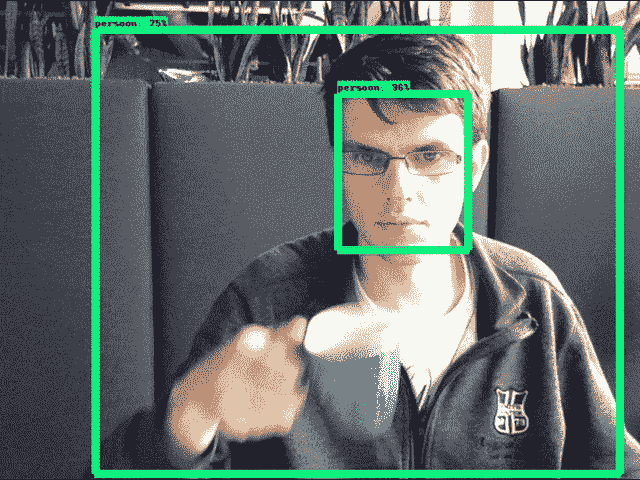
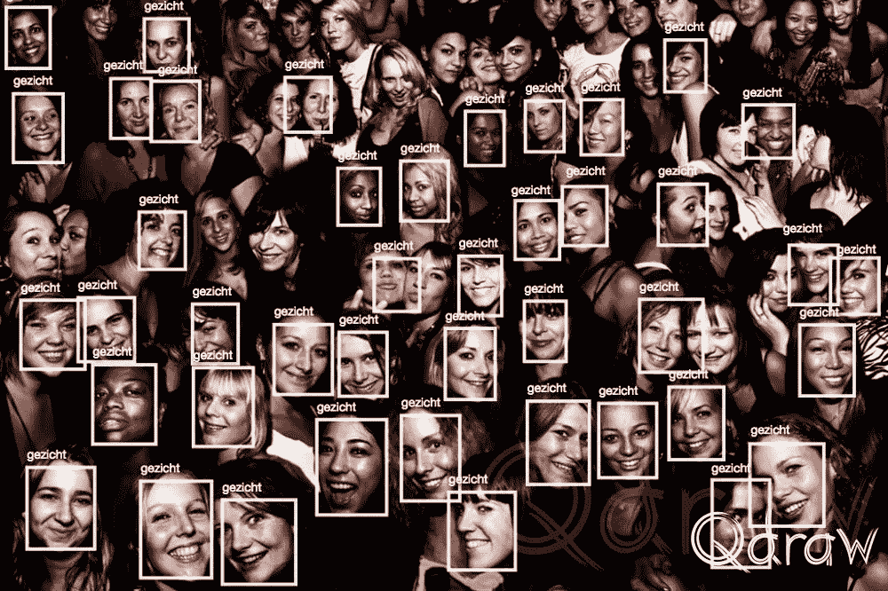

# 如何训练一个 Tensorflow 人脸对象检测模型

> 原文：<https://towardsdatascience.com/how-to-train-a-tensorflow-face-object-detection-model-3599dcd0c26f?source=collection_archive---------2----------------------->

人工智能使得分析图像成为可能。在这篇博文中，我将着重于用定制的类来训练一个对象检测器。你要做的第一件事是设置。在 [Tensorflow 文档](https://github.com/tensorflow/models/blob/4f32535fe7040bb1e429ad0e3c948a492a89482d/research/object_detection/g3doc/installation.md)中写了如何在本地机器上设置。我们将使用 Tensorflow 对象检测来训练实时对象识别应用程序。[训练好的模型在这个库中可用](https://github.com/qdraw/tensorflow-face-object-detector-tutorial)

*这是一个翻译的'*[*Train een tensor flow gezi cht object detectie model*](https://qdraw.nl/blog/design/train-een-tensorflow-gezicht-object-detectie-model/)*和*[*Objectherkenning meet de 计算机视觉库 Tensorflow*](https://medium.com/@qdraw/objectherkenning-met-de-computer-vision-library-tensorflow-fc88efe1f35a)



*MS COCO Tensorflow Nürburgring example (own picture)*

# OpenCV

你可以在 Ubuntu 上的 */usr/local 中自动安装 OpenCV。*用下面的脚本。该脚本安装 OpenCV 3.2 并与 Ubuntu 16.04 一起工作。

```
$ curl -L [https://raw.githubusercontent.com/qdraw/tensorflow-object-detection-tutorial/master/install.opencv.ubuntu.sh](https://raw.githubusercontent.com/qdraw/tensorflow-object-detection-tutorial/master/install.opencv.ubuntu.sh) | bash
```

在我的 Mac 上，我使用 OpenCV 3.3.0 en Python 2.7.13。我在 OpenCV 3.2 和 3.3 中试过，但是在 Python 3.6 中失败了。然而，在 Ubuntu Linux 上，这种组合确实有效。

```
$ brew install homebrew/science/opencv
```

# “超薄”和对象检测模块的设置

第一步是克隆 Tensorflow-models 存储库。在本教程中，我们只使用了 *slim* 和 *object_detection* 模块。

```
$ nano .profileexport PYTHONPATH=$PYTHONPATH:/home/dion/models/research:/home/dion/models/research/slim
```

您还需要编译 protobuf 库

```
$ protoc object_detection/protos/*.proto --python_out=.
```

# 克隆教程存储库并安装依赖项

示例代码可在*tensor flow-face-object-detector-tutorial*资源库中找到。你可以克隆这个回购。

```
$ git clone [https://github.com/qdraw/tensorflow-face-object-detector-tutorial.git](https://github.com/qdraw/tensorflow-face-object-detector-tutorial.git)
```

转到子文件夹:

```
 $ cd tensorflow-face-object-detector-tutorial/
```

使用 PIP 安装依赖项:我使用 Python 3.6，OpenCV 使用 Python 绑定安装。

```
$ pip install -r requirements.txt
```

# 下载培训和验证数据

香港中文大学有一个庞大的标签图像数据集。较宽的人脸数据集是人脸检测基准数据集。我已经使用了标签来显示边界框。所选文本是面标注。



*WIDER example using labelImg (credits:* [*http://mmlab.ie.cuhk.edu.hk/projects/WIDERFace/)*](http://mmlab.ie.cuhk.edu.hk/projects/WIDERFace/))

脚本 *001_down_data.py* 将用于下载 [WIDERFace](http://mmlab.ie.cuhk.edu.hk/projects/WIDERFace/) 和[SSD _ mobilenet _ v1 _ coco _ 11 _ 06 _ 2017](https://github.com/tensorflow/models/blob/master/research/object_detection/g3doc/detection_model_zoo.md)。我将使用预训练模型来加快训练时间。

```
$ python 001_down_data.py
```

# 将 WIDERFace 转换为 Pascal XML

首先，我们需要将数据集转换成 Pascal XML。Tensorflow 和 labelImg 使用不同的格式。图像被下载到 *WIDER_train* 文件夹中。使用*002 _ data-to-Pascal-XML . py*我们转换宽面数据并将其复制到不同的子文件夹。我的电脑处理 9263 张图片需要 5 分钟。

```
$ python 002_data-to-pascal-xml.py
```



*From the dataset WIDERFace and the film Marching Band (2009) with XML and LabelImg interface.*

# Pascal XML 到 Tensorflow CSV 索引

当数据被转换成 Pascal XML 时，就会创建一个索引。通过训练和验证数据集，我们使用这些文件作为输入来生成 TFRecords。但是，也可以使用 labelImg 之类的工具手动标记图像，并使用此步骤在此创建索引。

```
$ python 003_xml-to-csv.py
```



*Excel and OS X Finder with list of files*

# 创建 TFRecord 文件

TFRecords 文件是一个很大的二进制文件，可以读取它来训练机器学习模型。在下一步中，Tensorflow 将顺序读取该文件。训练和验证数据将被转换为二进制文件。

**训练数据到 TFRecord (847.6 MB)**

```
$ python 004_generate_tfrecord.py --images_path=data/tf_wider_train/images --csv_input=data/tf_wider_train/train.csv  --output_path=data/train.record
```

**验证数据到 TFRecord (213.1MB)**

```
$ python 004_generate_tfrecord.py --images_path=data/tf_wider_val/images --csv_input=data/tf_wider_val/val.csv  --output_path=data/val.record
```

# 设置配置文件

在储存库中，*SSD _ mobilenet _ v1 _ face . config*是用于训练人工神经网络的配置文件。这个文件基于一个 pet 探测器。

在这种情况下， *num_classes* 的数量保持为 1，因为只有面部会被识别。

变量 *fine_tune_checkpoint* 用于指示获取学习的前一模型的路径。这个位置将适合你在这个文件。微调检查点文件用于应用迁移学习。迁移学习是机器学习中的一种方法，专注于将从一个问题获得的知识应用到另一个问题。

在类 *train_input_reader* 中，与用于训练模型的 TFRecord 文件建立链接。在配置文件中，您需要将其定制到正确的位置。

变量 *label_map_path* 包含索引 id 和名称。在这个文件中，零被用作占位符，所以我们从 1 开始。

```
item {
  id: 1
  name: 'face'
}
```

对于验证，两个变量很重要。类 *eval_config* 中的变量 *num_examples* 用于设置示例的数量。
T5*eval _ input _ reader*类描述了验证数据的位置。这个位置也有一条小路。

此外，还可以更改学习率、批量和其他设置。目前，我保留了默认设置。

# 让我们训练；)

现在要开始真正的工作了。计算机将从数据集中学习，并在这里建立一个神经网络。由于我在 CPU 上模拟火车，这将需要几天才能得到一个好的结果。有了强大的 Nvidia 显卡，这是有可能缩短到几个小时。

```
$ python ~/tensorflow_models/object_detection/train.py --logtostderr --pipeline_config_path=ssd_mobilenet_v1_face.config  --train_dir=model_output
```

Tensorboard 让我们深入了解学习过程。该工具是 Tensorflow 的一部分，是自动安装的。

```
$ tensorboard --logdir= model_output
```



*Tensorflow Tensorboard TotalLoss*

# 将检查点转换为 protobuf

通过计算机视觉库 Tensorflow 在对象识别中使用该模型。下面的命令提供了模型库和最后一个检查点的位置。文件夹 folder 将包含 freezed _ inference _ graph . Pb。

```
$ python ~/tensorflow_models/object_detection/export_inference_graph.py \
--input_type image_tensor \
--pipeline_config_path ssd_mobilenet_v1_face.config \
--trained_checkpoint_prefix model_output/model.ckpt-12262 \
--output_directory model/
```

**TL；DR；**
中的*模型/冻结 _ 推理 _ 图形。*github 知识库上的 pb 文件夹是一个人工神经网络的冻结模型。香港中文大学拥有广泛的研究面，该数据集已被用于训练模型。

# 估价

除了用于训练的数据之外，还有一个评估数据集。基于该评估数据集，可以计算准确度。对于我的模型，我计算了精度(平均精度)。我在 14337 步(epochs)时得到了 83.80%的分数。对于这个过程，Tensorflow 有一个脚本，可以在 Tensorboard 中看到分数。除了培训之外，建议您运行评估流程。

```
python ~/tensorflow_models/object_detection/eval.py --logtostderr --pipeline_config_path=ssd_mobilenet_v1_face.config  --checkpoint_dir=model_output --eval_dir=eval
```

然后你可以用 Tensorboard 监控这个过程。

```
tensorboard --logdir=eval --port=6010
```

# 冻结模型的结论和使用

训练人脸识别模型已经成为可能。冻结模型*model/frozen _ inference _ graph . Pb*可以部署在例如[具有计算机视觉库 Tensorflow](https://github.com/qdraw/tensorflow-object-detection-tutorial) 的对象识别中。

计算机视觉的世界应该让你感兴趣，但是你仍然不知道如何应用它，并且有必要的问题吗？给我发一封电子邮件，然后我们可以一起喝杯咖啡。



Me and a cup of coffee



In this example, 43 faces are recognized. Source image: Ricardo Lago [https://www.flickr.com/photos/kruzul/4763629720/](https://www.flickr.com/photos/kruzul/4763629720/)