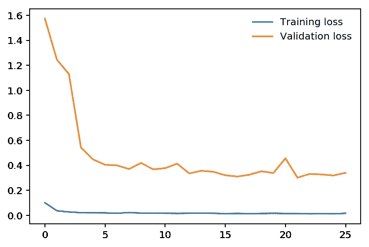
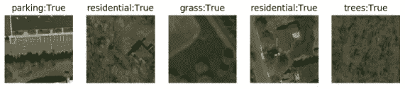

# 如何在 PyTorch 中训练一个图像分类器，并使用它对单幅图像进行基本推理

> 原文：<https://towardsdatascience.com/how-to-train-an-image-classifier-in-pytorch-and-use-it-to-perform-basic-inference-on-single-images-99465a1e9bf5?source=collection_archive---------2----------------------->

## 使用自己的图像训练 ResNet 的教程

如果你刚刚开始使用 PyTorch，并且想学习如何做一些基本的图像分类，你可以遵循这个教程。它将介绍如何组织您的训练数据，使用预训练的神经网络来训练您的模型，然后预测其他图像。

为此，我将使用一个由 Google Maps 地图切片组成的数据集，并根据它们包含的地形特征对它们进行分类。我将写另一个关于我如何使用它的故事(简而言之:为了识别无人机飞越或着陆的安全区域)。但是现在，我只想使用一些训练数据来对这些地图分块进行分类。

下面的代码片段来自 Jupyter 笔记本。你可以将它们组合在一起构建你自己的 Python 脚本，或者从 GitHub 下载笔记本。这些笔记本最初是基于 Udacity 的 PyTorch 课程。如果你使用云虚拟机进行深度学习开发，并且不知道如何远程打开笔记本，请查看[我的教程](https://medium.com/@chrisfotache/how-to-connect-to-your-cloud-hosted-ipython-jupyter-notebook-from-your-local-windows-machine-1426f1dafec2)。

**组织你的训练数据集**

PyTorch 希望数据按文件夹组织，每个类一个文件夹。大多数其他 PyTorch 教程和示例希望您进一步组织它，在顶部有一个 training and validation 文件夹，然后在其中有 class 文件夹。但我认为这非常麻烦，必须从每个类中挑选一定数量的图像，并将它们从训练文件夹移动到验证文件夹。因为大多数人会选择一组连续的文件，所以在选择时可能会有很多偏差。

因此，有一种更好的方法可以将数据集动态拆分为训练集和测试集，就像 Python 开发人员习惯的 SKLearn 一样。但是首先，让我们导入模块:

```
%matplotlib inline
%config InlineBackend.figure_format = 'retina'
import matplotlib.pyplot as pltimport numpy as np
import torch
from torch import nn
from torch import optim
import torch.nn.functional as F
from torchvision import datasets, transforms, models
```

接下来，我们将定义训练/验证数据集加载器，使用 SubsetRandomSampler 进行拆分:

```
data_dir = '/data/train'def load_split_train_test(datadir, valid_size = .2):
    train_transforms = transforms.Compose([transforms.Resize(224),
                                       transforms.ToTensor(),
                                       ]) test_transforms = transforms.Compose([transforms.Resize(224),
                                      transforms.ToTensor(),
                                      ]) train_data = datasets.ImageFolder(datadir,       
                    transform=train_transforms)
    test_data = datasets.ImageFolder(datadir,
                    transform=test_transforms) num_train = len(train_data)
    indices = list(range(num_train))
    split = int(np.floor(valid_size * num_train))
    np.random.shuffle(indices)
    from torch.utils.data.sampler import SubsetRandomSampler
    train_idx, test_idx = indices[split:], indices[:split]
    train_sampler = SubsetRandomSampler(train_idx)
    test_sampler = SubsetRandomSampler(test_idx)
    trainloader = torch.utils.data.DataLoader(train_data,
                   sampler=train_sampler, batch_size=64)
    testloader = torch.utils.data.DataLoader(test_data,
                   sampler=test_sampler, batch_size=64)
    return trainloader, testloadertrainloader, testloader = load_split_train_test(data_dir, .2)
print(trainloader.dataset.classes)
```

接下来我们来确定我们有没有 GPU。我假设如果你这样做，你有一个 GPU 驱动的机器，否则代码将至少慢 10 倍。但是概括和检查 GPU 的可用性是一个好主意。

我们还将加载一个预训练模型。对于这个例子，我选择了 ResNet 50:

```
device = torch.device("cuda" if torch.cuda.is_available() 
                                  else "cpu")
model = models.resnet50(pretrained=True)
print(model)
```

打印模型将向您展示 ResNet 模型的层架构。这可能超出了你我的理解范围，但看看这些深藏的层里面是什么仍然很有趣。

选择哪种模型取决于您，并且可能会根据您的特定数据集而有所不同。这里列出了所有的 [**PyTorch 型号**](https://pytorch.org/docs/stable/torchvision/models.html) 。

现在我们进入了深层神经网络的有趣部分。首先，我们必须冻结预训练的层，这样我们就不会在训练过程中反向穿透它们。然后，我们重新定义最终的完全连接的层，我们将使用我们的图像进行训练。我们还创建了标准(损失函数)并选择了优化器(在这种情况下是 Adam)和学习率。

```
for param in model.parameters():
    param.requires_grad = False

model.fc = nn.Sequential(nn.Linear(2048, 512),
                                 nn.ReLU(),
                                 nn.Dropout(0.2),
                                 nn.Linear(512, 10),
                                 nn.LogSoftmax(dim=1))
criterion = nn.NLLLoss()
optimizer = optim.Adam(model.fc.parameters(), lr=0.003)
model.to(device)
```

现在最后，让我们训练我们的模型！在这个例子中只有一个纪元，但是在大多数情况下你需要更多。从代码来看，基本过程非常直观:加载成批图像并进行前馈循环。然后计算损失函数，并使用优化器在反向传播中应用梯度下降。

PyTorch 就是这么简单。下面的大部分代码用于显示每 10 个批次的损失和计算准确度，因此您可以在训练过程中获得更新。在验证过程中，不要忘记将模型设置为 eval()模式，完成后再返回到 train()。

```
epochs = 1
steps = 0
running_loss = 0
print_every = 10
train_losses, test_losses = [], []for epoch in range(epochs):
    for inputs, labels in trainloader:
        steps += 1
        inputs, labels = inputs.to(device), labels.to(device)
        optimizer.zero_grad()
        logps = model.forward(inputs)
        loss = criterion(logps, labels)
        loss.backward()
        optimizer.step()
        running_loss += loss.item()

        if steps % print_every == 0:
            test_loss = 0
            accuracy = 0
            model.eval()
            with torch.no_grad():
                for inputs, labels in testloader:
                    inputs, labels = inputs.to(device),
                                      labels.to(device)
                    logps = model.forward(inputs)
                    batch_loss = criterion(logps, labels)
                    test_loss += batch_loss.item()

                    ps = torch.exp(logps)
                    top_p, top_class = ps.topk(1, dim=1)
                    equals = 
                        top_class == labels.view(*top_class.shape)
                    accuracy +=
                   torch.mean(equals.type(torch.FloatTensor)).item()
            train_losses.append(running_loss/len(trainloader))
            test_losses.append(test_loss/len(testloader))                    
            print(f"Epoch {epoch+1}/{epochs}.. "
                  f"Train loss: {running_loss/print_every:.3f}.. "
                  f"Test loss: {test_loss/len(testloader):.3f}.. "
                  f"Test accuracy: {accuracy/len(testloader):.3f}")
            running_loss = 0
            model.train()
torch.save(model, 'aerialmodel.pth')
```

然后…在您等待几分钟(或更长时间，取决于数据集的大小和历元数)后，训练完成，模型被保存以供以后的预测使用！

现在还有一件事你可以做，那就是绘制训练和验证损失图:

```
plt.plot(train_losses, label='Training loss')
plt.plot(test_losses, label='Validation loss')
plt.legend(frameon=False)
plt.show()
```



如您所见，在我的一个时期的特定示例中，验证损失(这是我们感兴趣的)在第一个时期结束时趋于平缓，甚至开始上升趋势，因此 1 个时期可能就足够了。培训损失，正如预期的那样，非常低。

现在进入第二部分。因此，您训练了您的模型，保存了它，并需要在应用程序中使用它。为此，您需要能够对图像进行简单的推断。您也可以在[我们的资源库](https://github.com/cfotache/pytorch_imageclassifier)中找到这款演示笔记本。我们导入与培训笔记本中相同的模块，然后再次定义转换。我只再次声明图像文件夹，这样我就可以使用其中的一些示例:

```
data_dir = '/datadrive/FastAI/data/aerial_photos/train'test_transforms = transforms.Compose([transforms.Resize(224),
                                      transforms.ToTensor(),
                                     ])
```

然后，我们再次检查 GPU 可用性，加载模型并将其置于评估模式(因此参数不会改变):

```
device = torch.device("cuda" if torch.cuda.is_available() else "cpu")
model=torch.load('aerialmodel.pth')
model.eval()
```

预测特定图像的类别的函数非常简单。注意，它需要一个枕头图像，而不是一个文件路径。

```
def predict_image(image):
    image_tensor = test_transforms(image).float()
    image_tensor = image_tensor.unsqueeze_(0)
    input = Variable(image_tensor)
    input = input.to(device)
    output = model(input)
    index = output.data.cpu().numpy().argmax()
    return index
```

现在为了更容易测试，我还创建了一个函数，它将从数据集文件夹中随机选取一些图像:

```
def get_random_images(num):
    data = datasets.ImageFolder(data_dir, transform=test_transforms)
    classes = data.classes
    indices = list(range(len(data)))
    np.random.shuffle(indices)
    idx = indices[:num]
    from torch.utils.data.sampler import SubsetRandomSampler
    sampler = SubsetRandomSampler(idx)
    loader = torch.utils.data.DataLoader(data, 
                   sampler=sampler, batch_size=num)
    dataiter = iter(loader)
    images, labels = dataiter.next()
    return images, labels
```

最后，为了演示预测功能，我获取随机图像样本，预测它们并显示结果:

```
to_pil = transforms.ToPILImage()
images, labels = get_random_images(5)
fig=plt.figure(figsize=(10,10))
for ii in range(len(images)):
    image = to_pil(images[ii])
    index = predict_image(image)
    sub = fig.add_subplot(1, len(images), ii+1)
    res = int(labels[ii]) == index
    sub.set_title(str(classes[index]) + ":" + str(res))
    plt.axis('off')
    plt.imshow(image)
plt.show()
```

这里有一个在谷歌地图上预测的例子。标签是预测的类，我也显示它是否是一个正确的预测。



差不多就是这样了。继续在您的数据集上尝试。只要您正确地组织了您的图像，这段代码应该可以正常工作。很快我会有更多关于你可以用神经网络和 PyTorch 做的其他酷事情的故事。

克里斯·福塔什(Chris Fotache)是一名人工智能研究员，他在新泽西的 [*CYNET.ai*](http://www.cynet.ai) *工作。他涵盖了与我们生活中的人工智能、Python 编程、机器学习、计算机视觉、自然语言处理等相关的主题。*