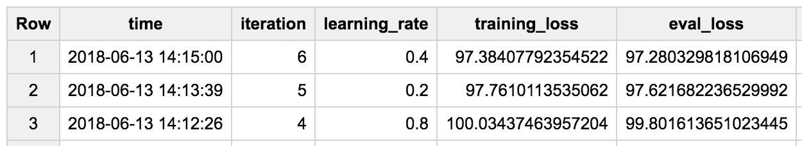
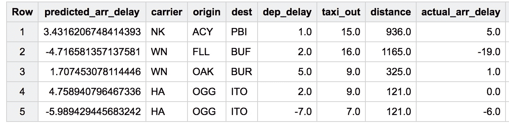
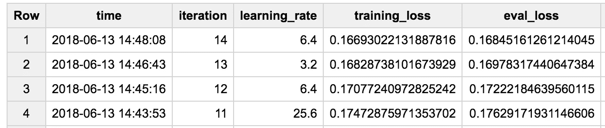
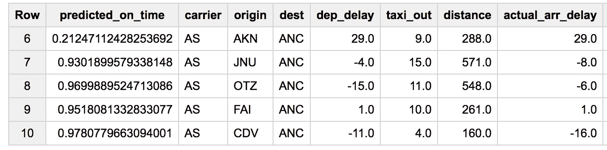
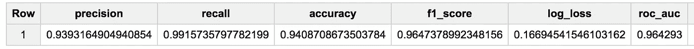

# 如何仅使用 SQL 来训练和预测回归和分类 ML 模型—使用 BigQuery ML

> 原文：<https://towardsdatascience.com/how-to-train-and-predict-regression-and-classification-ml-models-using-only-sql-using-bigquery-ml-f219b180b947?source=collection_archive---------3----------------------->

在我的书([Google 云平台上的数据科学](http://shop.oreilly.com/product/0636920057628.do))中，我讲述了一个航班延误预测问题，并展示了如何使用包括 Spark Mlib 和 TensorFlow 在内的各种工具来解决这个问题。既然已经宣布了 BigQuery ML，我想我应该展示如何使用 BQ ML 预测航班延误。


Predict whether this flight will arrive late. Using only SQL.

毫无疑问，您仍然需要收集数据、探索数据、清理数据并丰富数据。基本上所有我在第 1-9 章做的事情。在第十章，我用了 TensorFlow。在本文中，我将使用 BQML。

# 创建回归模型

下面是一个创建模型的 BigQuery 查询:

```
#standardsql
CREATE OR REPLACE MODEL flights.arrdelayOPTIONS
  (model_type='linear_reg', input_label_cols=['arr_delay']) ASSELECT
  arr_delay,
  carrier,
  origin,
  dest,
  dep_delay,
  taxi_out,
  distance
FROM
  `cloud-training-demos.flights.tzcorr`
WHERE
  arr_delay IS NOT NULL
```

请注意:

1.  它从创建模型开始，模型的名称看起来就像一个表名。注意:“flights”是用于存储结果模型的数据集的名称，因此，您需要在运行查询之前创建一个空数据集。
2.  这些选项指定了算法，在本例中是线性回归算法，标签为 arr_delay
3.  本质上，我在 SELECT 中引入了预测变量和标签变量

大约 10 分钟后，模型被训练，并且评估结果已经为每个迭代填充:



这里的损失是均方误差，因此模型收敛于迭代#6，RMSE 约为 sqrt(97) = 10 分钟。

# 使用模型预测

训练模型的目的是用它来预测。您可以使用 SQL 语句进行模型预测:

```
#standardsql
SELECT * FROM ML.PREDICT(MODEL flights.arrdelay,
(
SELECT
  carrier,
  origin,
  dest,
  dep_delay,
  taxi_out,
  distance,
  arr_delay AS actual_arr_delay
FROM
  `cloud-training-demos.flights.tzcorr`
WHERE
  arr_delay IS NOT NULL
LIMIT 10))
```

这导致:



如你所见，因为我们训练了模型来预测一个叫做“arr_delay”的变量，ML。PREDICT 创建一个名为 predicted_arr_delay 的结果列。在本例中，我从原始表中提取 10 行，并预测这些航班的到达延迟。

# 创建分类模型

在书中，我实际上并没有试图预测到达延迟。相反，我预测航班晚点超过 15 分钟的概率。这是一个分类问题，您可以通过稍微更改训练查询来做到这一点:

```
#standardsql
CREATE OR REPLACE MODEL flights.ontime
OPTIONS
  (model_type='logistic_reg', input_label_cols=['on_time']) ASSELECT
  IF(arr_delay < 15, 1, 0) AS on_time,
  carrier,
  origin,
  dest,
  dep_delay,
  taxi_out,
  distance
FROM
  `cloud-training-demos.flights.tzcorr`
WHERE
  arr_delay IS NOT NULL
```

下面是评测结果:



预测的一个例子是:



# 评估模型

可以在独立的数据集上评估模型。我手边没有，所以我将只向您展示如何在模型训练的同一数据集上运行评估:

```
#standardsql
SELECT * FROM ML.EVALUATE(MODEL flights.ontime,
(
SELECT
  IF(arr_delay < 15, 1, 0) AS on_time,
  carrier,
  origin,
  dest,
  dep_delay,
  taxi_out,
  distance
FROM
  `cloud-training-demos.flights.tzcorr`
WHERE
  arr_delay IS NOT NULL
))
```

结果是:



BQML 真的很简单，真的很强大。尽情享受吧！