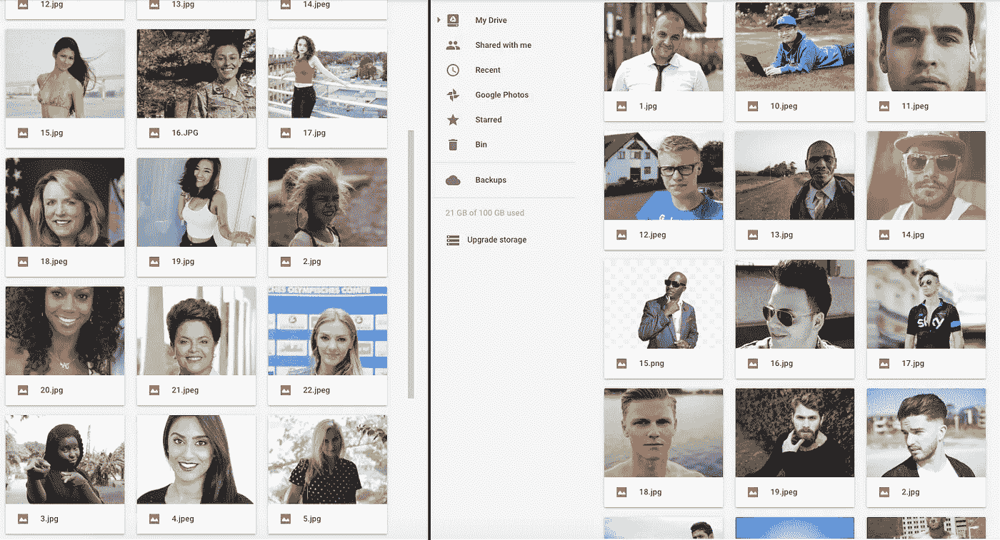
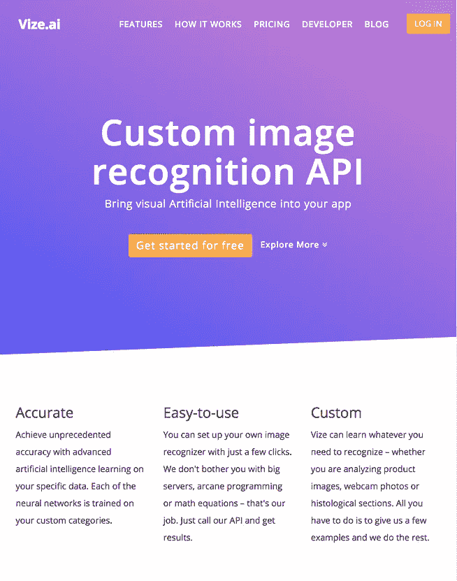
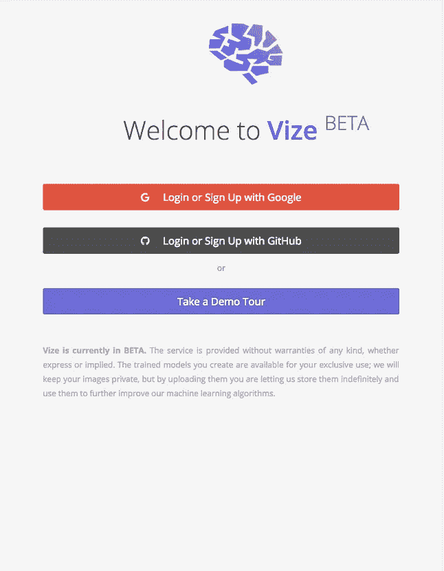
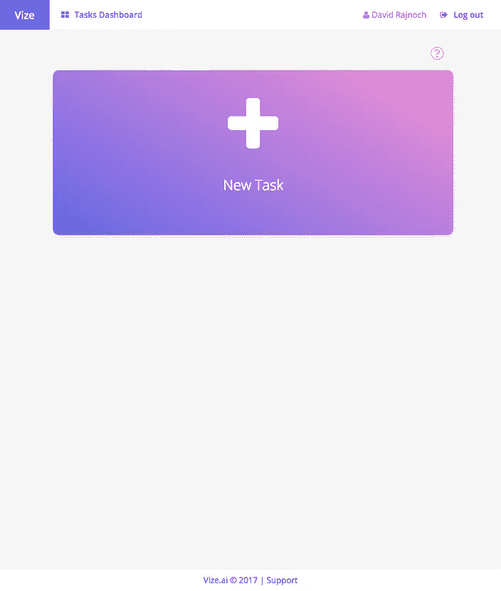
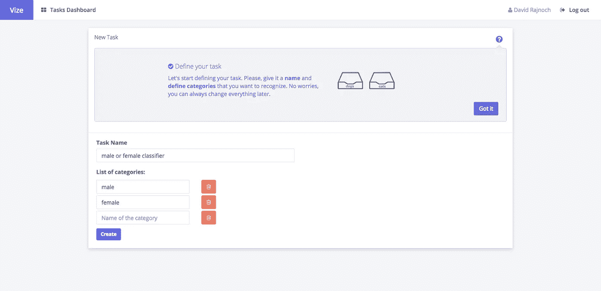
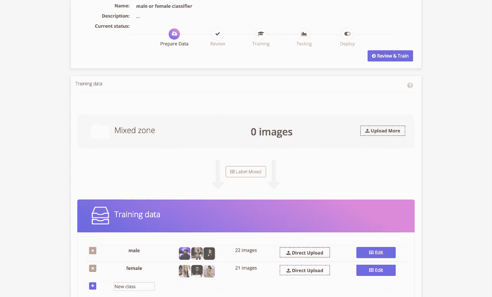
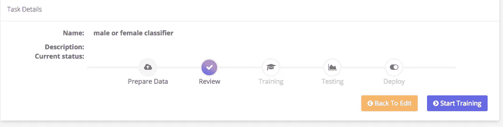
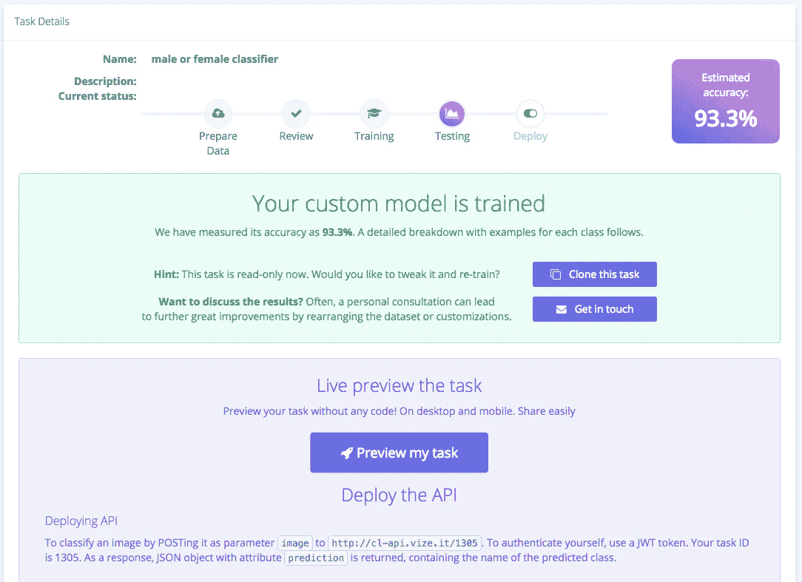
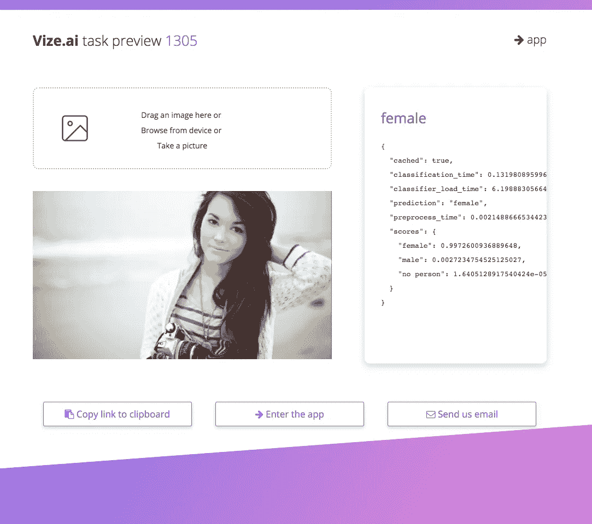

# 如何在 5 分钟内训练自定义图像分类器

> 原文：<https://towardsdatascience.com/how-to-train-custom-image-classifier-in-5-minutes-4efa61255fc7?source=collection_archive---------2----------------------->

## 使用 Vize 分类器 API 识别图像

今天我将展示如何使用 [Vize.ai —自定义图像分类 API](https://vize.ai) 来设置和测试自定义图像分类引擎。我们将准备数据集，上传图像，训练分类器，并在 web 界面中测试我们的分类器。我们不需要编码经验，除非我们想在我们的项目中建立 API。让我们现在开始。

# 准备数据集

我们希望分类器识别人的性别。首先，我们需要每只**雄性**和**雌性**的 20 张图片。让我们用谷歌搜索“男人”和“女人”，并分别保存 20 张照片。在这里你可以下载我的数据集。我尽量避免时尚图片和模特，所以我的数据集是**普通人图片**。我还搜索了不同的文化类型和肤色，因此我的数据集尽可能多样化。我只用了正面图像。

Male and female images in dataset

# 将数据集上传到 Vize

我们需要[在**vize . ai**上创建一个帐户。访问主页，然后点击“免费开始”，并使用 Google 或 GitHub 帐户**登录**。我们准备**创建一个新任务。**一个任务是分类引擎(卷积网络模型),它让我们对图像进行分类。](https://vize.ai)

Homepage, signup page, task dashboard

我们点击**“新任务”**按钮，填写我们的分类器名称**“男性或女性分类器”**。我们要增加两类**【男】****【女】**。我们可以随时添加和删除类别。点击**“创建”**进入图像上传。

Name your task and create categories to sort

现在，我们将点击**“直接上传”**将图片上传到我们的两个类别中。我们可以在下面的图片上看到上传的 22 和 21 张图片。我们可以使用**“编辑”**按钮来显示图像，并将它们从一个类别移动到另一个类别。要删除一些图像，将它们移动到新的**“删除”**类别，并删除该类别。我们现在不需要这些。让我们点击右上角的**“复习训练”**。

Images uploaded into categories

# 训练分类器

在这一步，我们可以回顾我们的类别。我们准备点击**【开始训练】**按钮。

Start custom classifier training

一项任务正在训练中。根据图像的数量，可能需要一至五个小时。Vize 使用[迁移学习](https://medium.com/towards-data-science/transfer-learning-using-keras-d804b2e04ef8)和一组微调的模型架构，以在每项任务上达到尽可能最佳的准确性。现在是喝咖啡的时候了，等待训练结束。

Classifier training finished

# 测试分类器

我们的模型准备好了！我们在 43 张图像数据集上达到了 93%的准确率。我们现在可以使用**预览**来测试它。我们将点击**“部署和预览”**，然后点击**“预览我的任务”。** [在我们的数据集“test”文件夹](http://bit.ly/classifier-in-5-minutes)中，我们可以找到一些测试图像来测试我们的分类器。

Preview trained task — test classification

# 摘要

我们使用 Vize web 界面训练和测试了我们的分类器。这是构建图像分类引擎最简单的方法。我们达到了 93%的准确率，随着**上传更多的图像**，我们可以将准确率提高到 100%。是时候尝试图像分类带来的巨大可能性了。在[开发者文档](https://vize.ai)中，我们还可以找到将 REST API 实现到我们的应用中的示例代码。

使用视觉 AI 可以构建什么样的应用？在评论中让我知道你的想法。