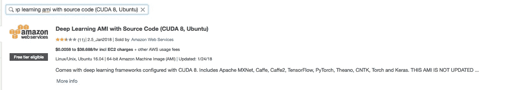
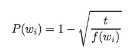
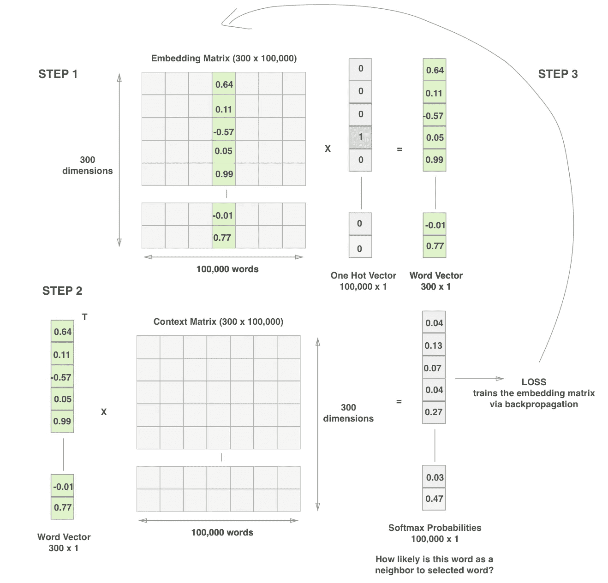
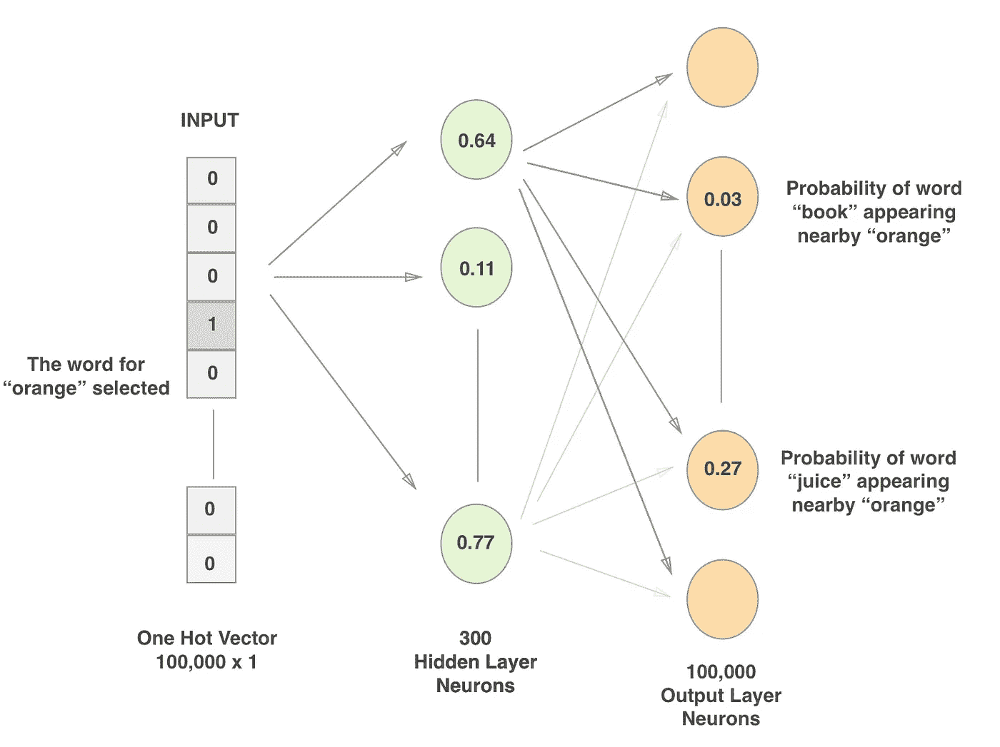
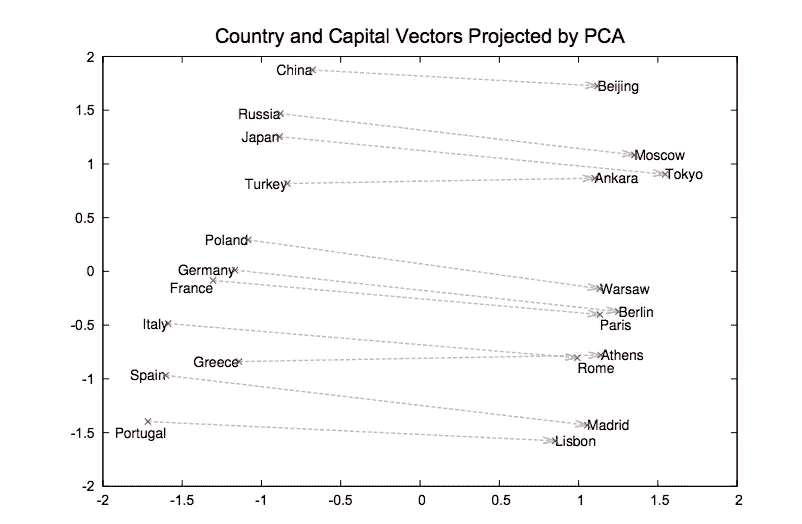

# 如何在 AWS 上使用 GPU 训练自定义单词嵌入

> 原文：<https://towardsdatascience.com/how-to-train-custom-word-embeddings-using-gpu-on-aws-f62727a1e3f6?source=collection_archive---------2----------------------->

语言很重要。人类用文字交流，文字承载着意义。我们能训练机器也学习意义吗？这篇博客的主题是我们如何训练机器使用**单词嵌入**来学习单词的意思。在我浏览堆栈溢出、EC2 文档和博客的过程中，我将记下某人在 AWS 的 GPU 上使用 TensorFlow 训练单词嵌入的步骤。但是在介绍这些步骤之前，让我们先简要了解一下为什么我们需要单词嵌入。


Language is all around us — can we make a machine learn meaning?

通常，在大多数自然语言处理任务中，单词被转换成**一键向量**，其中每个单词在向量中获得唯一的索引。因此，在苹果、桔子和果汁这三个单词的词汇表中，我们可以用[1 0 0]、[0 1 0]和[0 0 1]来表示这三个单词。对于小型语言任务，这些向量非常有用。然而，其中有两个主要缺点:
a)对于具有 *n* 个字的训练数据，我们将需要 *n* 个维度向量。所以你可以想象 1000000 维向量非常大，并且非常稀疏。
b)one-hot vectors 中没有**上下文**的意义——每个单词都是完全唯一的。因此，如果一个模特已经学会了“苹果汁”，它就不能**转移**对填充“桔子 __”的学习。单词嵌入遵循的原则是“[你将一个单词由它所保持的公司](https://en.wikipedia.org/wiki/John_Rupert_Firth)”，因此我们在单词嵌入向量中的每个维度都可以表示一个“特征”，如食物或性别或资本等等——如下所示:


Visualizing Word Embeddings (from a [class](https://www.coursera.org/learn/intro-to-deep-learning/lecture/dhzl5/word-embeddings) by Andrew Ng)

训练有素的单词嵌入可以用于翻译、文本摘要、情感分析和类比任务，例如男人>女人、国王>王后。**[**word 2 vec**](https://machinelearningmastery.com/develop-word-embeddings-python-gensim/)和 [**Glove**](https://nlp.stanford.edu/projects/glove/) 是两个流行的预训练单词嵌入，可以作为开源软件获得——它们对于开始一般的语言任务非常强大。但是，在本教程中，我们将学习如何在特定领域为我们自己的自定义数据构建 word 嵌入。我正致力于为电子数据，如微处理器、电容器、ram、电源等构建字嵌入。**

**因此，让我们开始制作单词嵌入的旅程，我们将在 AWS GPU 上进行训练！**

1.  ****选择 P2 或 P3 实例类型**T3 首先，您需要选择一个 EC2 实例类型。最近 AWS 在 EC2 上发布了 p3 实例，但是它们的价格大约是每小时 3 美元，这是一笔不小的数目。所以我将继续使用 **p2 实例**，它可能没有那么快，但是更便宜(大约每小时 1 美元)。这篇[博客](https://blog.iron.io/aws-p2-vs-p3-instances/)进行了更详细的比较。一旦你选择了 p2 实例，你可能需要在你的帐户上请求一个限制增加来得到使用他们。**
2.  ****建立深度学习 AMI 和安全组** 如果您正在构建自己的 GPU 硬件，您需要自己设置 CUDA 驱动程序，但是在 AWS 上使用 EC2 实例为我们提供了使用预构建 AMI 或 Amazon 机器映像的优势。我选择了**深度学习 AMI，带源代码(CUDA 8，Ubuntu)。
    更新(2018 年 6 月):**最新的 TensorFlow 库与 CUDA 8 不太兼容，请使用支持 CUDA 9 的 AMI 比如[这个](https://aws.amazon.com/marketplace/pp/B077GCH38C)这个。**

****

**如果我们想在 EC2 实例中使用 Jupyter notebook，我们需要更改安全组，以允许从端口 8888 访问 EC2。这可以通过创建一个**新的安全组**和使用**自定义 TCP 规则**和**端口范围作为 8888** 和在源选择**任何地方来完成。现在您可以启动实例了。接下来，创建一个新的密钥对，并将其保存在本地计算机上。当我丢失这个的时候，我不得不再次做这些步骤。pem 文件，所以请确保它在一个安全的地方！使用`chmod 400 YourPEMFile.pem`将读写权限更改为只读。接下来，通过右键单击实例实例状态> Start 来启动您的 GPU。****

**3.**登录并在 EC2 实例上设置 Conda 环境** 您可以通过`ssh -i path/YourPEMFile.pem ubuntu@X.X.X.X`登录到您的 GPU，其中`X.X.X.X`代表您的 GPU 的公共 IP，`path/YourPEMFile.pem`是您在上一步中创建的`.pem`文件的路径。一旦您登录到 EC2 实例，您就可以设置自己的 Conda 环境。你为什么需要它？我们来看看这个[的回答](https://stackoverflow.com/questions/34398676/does-conda-replace-the-need-for-virtualenv)，它讨论了康达如何优于 virtualenv。键入`conda -V`会导致一个错误，因为路径变量还没有设置好。我们需要转到`.bash_profile`并添加路径。**

**下面是让 `**conda**` **在新 EC2 实例**
上工作的**步骤 a .通过`vim ~/.bash_profile`和
创建或编辑文件 b .添加`export PATH=”/home/ubuntu/src/anaconda2/bin:$PATH”`路径指定包含可执行程序的目录，无需知道命令行上的完整路径即可启动这些程序。运行`source ~/.bash_profile`来获取这个文件。你现在可以运行`conda -V`并且不会看到错误。
e .通过`conda create -n embeddings python=3`创建一个新环境这将使用最新版本的 Python 3 创建一个新的 conda 环境。
f .运行`source activate embeddings`启动 conda 环境。****

**4.**安装 Tensorflow-GPU、Jupyter notebook 等软件包** 设置并激活 conda 环境后，现在可以安装 Tensorflow 等软件包了。
a)我们可以使用`pip install tensorflow-gpu jupyter notebook nltk scikit-learn pandas`来安装所有必要的包来完成 word 嵌入的工作。我们需要使用`tensorflow-gpu`而不是`tensorflow`，因为前者已经过优化，适合在 GPU 中使用。所有这些要求都可以用`pip freeze > requirements.txt`保存到一个文件中**

**b)我们现在可以使用`jupyter notebook --ip=0.0.0.0 --no-browser`转到`X.X.X.X:8888/?token=<TOKEN>`来启动 jupyter 笔记本，其中`X.X.X.X`是 EC2 机器的 IP 地址，`<TOKEN>`是我们运行上面的命令时出现的令牌。**

**c)运行以下代码检查 TensorFlow 版本，并查看 TensorFlow 是否在 GPU 上正确运行。**

```
import tensorflow as tf
print('TensorFlow Version: {}'.format(tf.__version__)) 
print('Default GPU Device: {}'.format(tf.test.gpu_device_name()))
```

**我得到的输出是:
`TensorFlow Version: 1.3.0
Default GPU Device: /gpu:0`**

**为了绝对确定 GPU 确实被使用，运行
`sess = tf.Session(config=tf.ConfigProto(log_device_placement=True))`，你应该会看到以`/gpu:0`结尾的东西，这也是[官方文档](https://www.tensorflow.org/programmers_guide/using_gpu)所建议的。这帮助我最近在设置实际使用 GPU。**

**5.**建立用于训练单词嵌入的文本语料库** 你可以使用 IMDB 或维基百科数据集，但由于本博客的目标是通过自定义单词嵌入，我们将建立自己的语料库。如果你有很多文本文件，那么你可以一个一个地阅读它们，并建立语料库。在这里，我假设你有 PDF 文件，这是有点难以处理。为此，我使用了库`PyPDF2`。我使用的代码是:**

```
import PyPDF2def read_pdf(fname):
    pdfFileObj = open(fname, 'rb')
    pdfReader = PyPDF2.PdfFileReader(pdfFileObj)
    print("TOTAL PAGES in file", pdfReader.numPages)
    pageObj = pdfReader.getPage(0)
    text = pageObj.extractText()
    return ' '.join(text.split())
```

**我在本地存储的一堆 PDF 文件上运行了上面的代码。我将上述函数返回的字符串连接起来，并写入一个文本文件。我们的文本语料库准备好了！**

****6。预处理文本并创建查找表** 现在，让我们预处理文本，为训练单词嵌入做好准备。在自然语言处理中，在运行分类器或算法之前，通常的做法是将所有单词小写，并进行一些停用词移除。我们将使用库`re`(Python 中的正则表达式库)来执行其中的一些任务。**

```
text = text.lower()
text = text.replace('.', ' __PERIOD__ ') 
text = text.replace('-', ' ')    
# Remove ' and full stops and brackets
text = re.sub(r'[{}()\']', '', text)
# Replace commas, dashes, colons and @ with spaces
text = re.sub(r'[;,:-@#]', ' ', text) 
```

**我们可以根据需要做更多的预处理，比如把缩写改成全称，用`__NUMBER__` token 代替数字等等。上图中，我把句号改成了一个`__PERIOD__`，它可以作为训练的标志。理解句子中单词上下文的动态变化是很重要的，而`__PERIOD__`将帮助我们做到这一点。**

**接下来，让我们创建两个散列表，我们可以使用它们从索引>词汇以及词汇>索引中查找词汇。
下面的代码可以做到这一点:**

```
word_counts = Counter(words)
sorted_vocab = sorted(word_counts, key=word_counts.get, reverse=True)
int_to_vocab = {ii: word for ii, word in enumerate(sorted_vocab)}
vocab_to_int = {word: ii for ii, word in int_to_vocab.items()}
```

**7.**执行二次采样** 经常出现的单词，如“the”、“is”等，对于为附近的单词提供上下文来说不是很有用。如果我们删除所有这些信息，我们就有效地删除了他们提供的任何信息。Mikolov 等人提出的一种更好的方法是删除一些单词，以消除数据中的一些噪声。对于训练集中的每个单词，我们以概率丢弃它:**

****

**Probability to discard words to reduce noise**

**其中 t 是阈值参数，f(w)是单词 w 的频率。**

**8.**创建张量流图****

**我总是很难想象单词嵌入和数学是如何工作的。我发现吴恩达的解释在理解数学方面非常有用，下面是我们试图用 TensorFlow 做的工作流程(假设一个单词向量有 300 个维度，词汇表有 100，000 个独特的单词):**

****

****The 3 steps in training word embeddings — we only care about embedding matrix****

**输入的单词作为一个热点向量传递到一个隐藏的线性单元层。这些然后被连接到用于预测**上下文**单词的软最大层。换句话说，给定每个单词，我们将尝试最小化预测邻居或上下文单词的损失。我们最终可以扔掉 soft-max 层权重，只使用我们构建的单词向量的嵌入矩阵——这些单词向量是单词的低维表示，同时保留了上下文！
[Chris McCormick 的](http://mccormickml.com/2016/04/19/word2vec-tutorial-the-skip-gram-model/)博客是下图的灵感来源，该图是上图的另一个视图:**

****

**Visualizing the neural network of word embeddings**

**TensorFlow 使用数据流图来计算深度学习操作，我们需要首先定义图，然后在一个会话中在这个图上运行我们的数据。
让我们浏览一下这段代码:**

```
import tensorflow as tf
train_graph = tf.Graph() # Placeholders for our training data 
with train_graph.as_default():
    inputs = tf.placeholder(tf.int32, [None], name='inputs')
    labels = tf.placeholder(tf.int32, [None, None], name='labels')n_vocab = len(int_to_vocab)
n_embedding = 300  # Number of embedding features# Embedding matrix that we care about 
with train_graph.as_default():
    embedding = tf.Variable(tf.random_uniform((n_vocab, n_embedding), -1, 1))
    word_vector = tf.nn.embedding_lookup(embedding, inputs)
```

**首先我们定义图中的`placeholders`的`inputs`和`labels`。接下来，我们使用`Variable`来定义我们想要训练的内容。这个[讨论](https://stackoverflow.com/questions/36693740/whats-the-difference-between-tf-placeholder-and-tf-variable)对他们的区别很好。我们使用一个`feed_dict`将值输入到占位符中。我们的`total vocabulary size x number of embedding dimensions`给出了我们需要训练的总重量。
接下来，我们可以定义 softmax 权重和偏差:**

```
# Softmax layer that we use for training but don't care about
with train_graph.as_default():
    softmax_w = tf.Variable(tf.truncated_normal((n_vocab, n_embedding), stddev=0.1))
    softmax_b = tf.Variable(tf.zeros(n_vocab)) 
```

****9。负采样和损失函数** 我们准备了一组单词和上下文单词，它们是**正示例**。但是我们也会添加一些单词和非上下文单词。这些将作为**反面**的例子。所以`orange juice`是正面例子，但`orange book`和`orange king`也是反面例子。这使得向量的学习更好。对于每个正面的例子，我们可以选择 2 到 20 个反面的例子。这被称为负采样，TensorFlow 为此提供了一个函数`[tf.nn.sampled_softmax_loss](https://www.tensorflow.org/api_docs/python/tf/nn/sampled_softmax_loss)`！**

**我们已经写好了整个图表，我们需要写损失函数是什么，以及如何优化权重。**

```
with train_graph.as_default():
   loss = tf.nn.sampled_softmax_loss(softmax_w, softmax_b, 
                                      labels, word_vector,
                                      n_sampled, n_vocab)

   cost = tf.reduce_mean(loss)
   optimizer = tf.train.AdamOptimizer().minimize(cost)
```

****10。运行 TensorFlow 会话来训练单词嵌入** 写出图形和损失函数以及优化器后，我们可以编写 TensorFlow 会话来训练单词嵌入。**

```
**with** tf.Session(graph=train_graph) **as** sess:
    loss = 0
    sess.run(tf.global_variables_initializer())

    **for** e **in** range(1, 11): # Run for 10 epochs
        batches = get_batches(train_words, batch_size, window_size)
        **for** x, y **in** batches:

            train_loss, _ = sess.run([cost, optimizer], feed_dict= {inputs: x, labels: np.array(y)[:, **None**]})
            loss += train_loss
```

**`get_batches`此处未显示函数，但它在笔记本中(在参考文献中)——它批量返回特征和类的生成器。上述步骤在 CPU 上可能需要很长时间，但在 p2.x 实例上运行起来相当快。我能够在几分钟内运行 10 个纪元来训练 100k 单词的单词大小。我们可以使用我们学过的`embedding`来绘制 T-SNE 图，以形象化地展示上下文是如何被学习的。请注意，T-SNE 图将把我们的 300D 数据缩减到 2D，因此一些上下文将会丢失，但是它保留了许多关于上下文的信息。**

```
from sklearn.manifold import TSNE
tsne = TSNE() 
embed_tsne = tsne.fit_transform(embedding[:viz_words, :]) 

fig, ax = plt.subplots(figsize=(14, 14)) 
**for** idx **in** range(viz_words):     
     plt.scatter(*embed_tsne[idx, :], color='steelblue')            
     plt.annotate(int_to_vocab[idx], (embed_tsne[idx, 0], embed_tsne[idx, 1]), alpha=0.7)
```

**我们还可以使用主成分分析来可视化单词之间的关系，我们预计会发现如下关系:**

****

**Visualizing word vectors using PCA from the original [Mikolov paper](https://papers.nips.cc/paper/5021-distributed-representations-of-words-and-phrases-and-their-compositionality.pdf)**

**这使得单词嵌入非常有趣！如果你在一家电子商务公司工作，如果你能开始识别`battery size`和`battery capacity`是否是同一件事，这可能会对用户产生巨大的影响，或者如果你在一个酒店预订网站，发现`hotel`和`motel`相似可能会产生巨大的影响！因此，在涉及语言的情况下，单词嵌入在改善用户体验方面非常有效。**

**我也觉得这个话题挺有意思的。我喜欢写作和语言，也喜欢数学和机器学习。词向量在某种程度上是这两个世界之间的桥梁。我刚刚完成了一个关于文本分类的大项目，接下来我会更多地研究这些与单词向量相关的想法！**

**祝你好运~**

**我正在创建一个类似主题的新课程，名为
“查询理解技术概述”。
本课程将涵盖信息检索技术、文本挖掘、查询理解技巧和诀窍、提高精确度、召回率和用户点击量的方法。有兴趣的请在这里报名[！这种兴趣展示将允许我优先考虑和建立课程。](https://sanketgupta.teachable.com/p/query-understanding-techniques/)**

****

**[My new course: Overview of Query Understanding Techniques](https://sanketgupta.teachable.com/p/query-understanding-techniques)**

**如果你有任何问题，给我的 LinkedIn 个人资料[留言或者给我发电子邮件到 sanket@omnilence.com。感谢阅读！](https://www.linkedin.com/in/sanketgupta107/)**

****参考文献:****

**a) [吴恩达关于单词嵌入的课程](https://www.coursera.org/learn/intro-to-deep-learning/lecture/dhzl5/word-embeddings)。斯坦福大学 CS224n 曼宁教授的讲座。c)[uda city 的深度学习纳米度](https://www.google.com/search?q=udacity+deep+learning&oq=udacity+deep+learning&aqs=chrome..69i57j0j69i60l2j69i65j69i60.4966j0j4&sourceid=chrome&ie=UTF-8)。
d)我在 Github 上的[字矢量笔记本](https://github.com/sanketg10/deep-learning-repo/blob/master/embeddings/Skip-Gram_word2vec.ipynb)。**