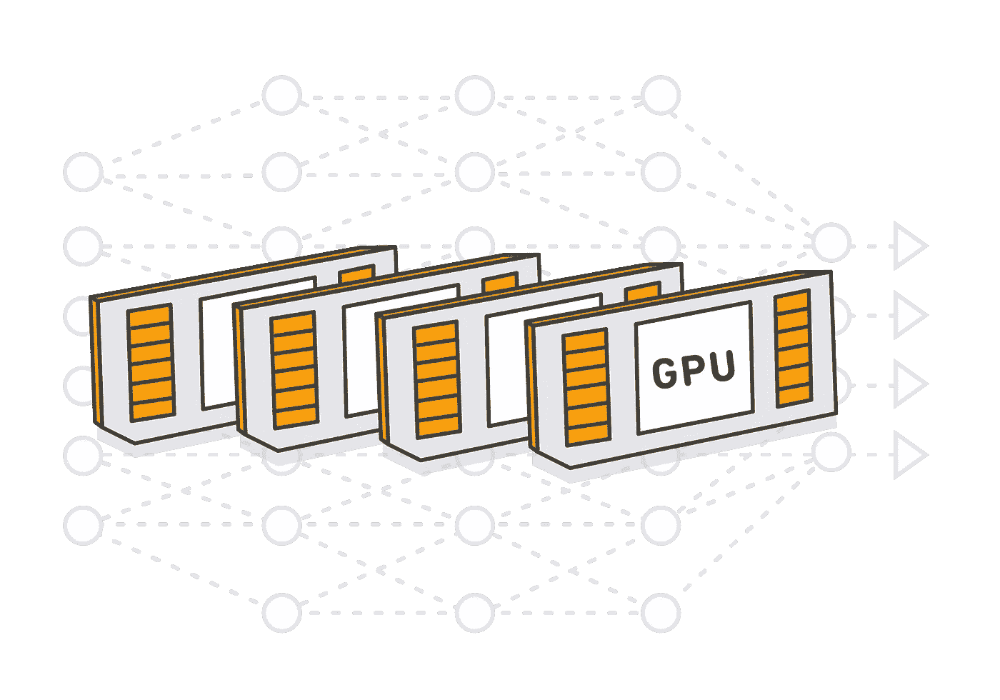
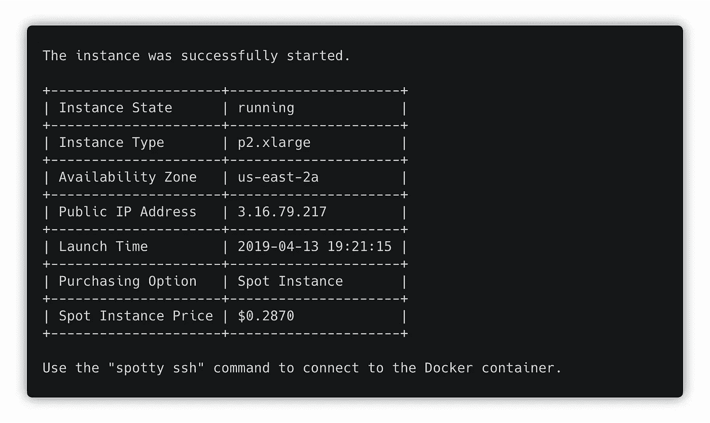
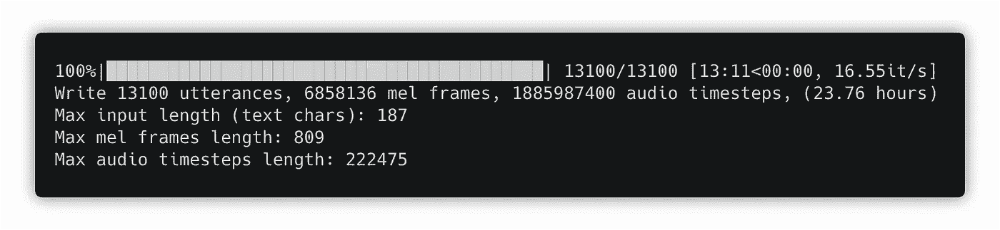
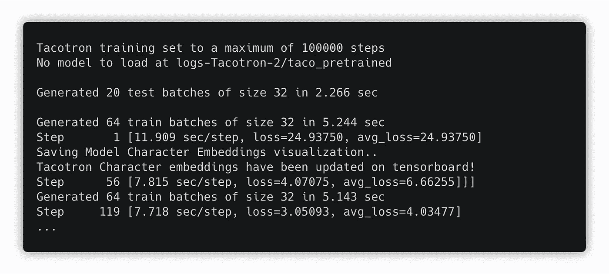
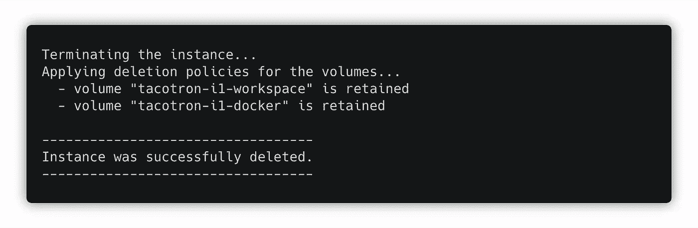

# 如何使用 Spotty 在 AWS Spot 实例上训练深度学习模型？

> 原文：<https://towardsdatascience.com/how-to-train-deep-learning-models-on-aws-spot-instances-using-spotty-8d9e0543d365?source=collection_archive---------5----------------------->



[Spotty](https://github.com/apls777/spotty) 是一个工具，它极大地**简化了 AWS 上深度学习模型的训练。**

## 你为什么会❤️这个工具？

*   它使得在 AWS GPU 实例上的培训就像在本地计算机上的培训一样简单
*   它自动管理所有必要的 AWS 资源，包括 ami、卷、快照和 SSH 密钥
*   它使得每个人都可以通过几个命令在 AWS 上训练你的模型
*   它使用 [tmux](https://en.wikipedia.org/wiki/Tmux) 轻松地将远程进程从 SSH 会话中分离出来
*   通过使用 [AWS Spot 实例](https://docs.aws.amazon.com/AWSEC2/latest/UserGuide/using-spot-instances.html)，它可以为您节省高达 70%的成本

为了展示它是如何工作的，让我们采用一些非平凡的模型，并尝试训练它。我选择了 [Tacotron 2](https://github.com/Rayhane-mamah/Tacotron-2) 的一个实现。这是谷歌的语音合成系统。

将 Tacotron 2 的存储库克隆到您的计算机上:

```
git clone https://github.com/Rayhane-mamah/Tacotron-2.git
```

# Docker 图像

码头集装箱内参差不齐的火车模型。因此，我们需要找到一个满足模型需求的公开可用的 Docker 映像，或者用适当的环境创建一个新的 Docker 文件。

Tacotron 的这个实现使用 Python 3 和 TensorFlow，所以我们可以使用 Docker Hub 的官方 Tensorflow 图像[。但是这个图像并不满足“requirements.txt”文件中的所有要求。所以我们需要扩展映像，并在其上安装所有必要的库。](https://hub.docker.com/r/tensorflow/tensorflow/)

将“requirements.txt”文件复制到“docker/requirements-spotty.txt”文件中，并创建包含以下内容的`docker/Dockerfile.spotty`文件:

这里我们扩展了原始的 TensorFlow 映像，并安装了所有其他需求。当您启动实例时，将自动构建此映像。

# 参差不齐的配置文件

一旦我们有了 docker 文件，我们就可以编写一个参差不齐的配置文件了。在项目的根目录下创建一个`spotty.yaml`文件。

[在这里](https://github.com/apls777/Tacotron-2/blob/master/spotty.yaml)你可以找到这个文件的全部内容。它由 4 个部分组成:*项目*、*容器*、*实例*、和*脚本*。我们一个一个来看。

## 第一部分:项目

此部分包含以下参数:

1.  `**name**` **:** 项目名称。该名称将用于 Spotty 为此项目创建的所有 AWS 资源的名称中。例如，它将用作 EBS 卷的前缀，或者用在帮助将项目代码与实例同步的 S3 存储桶的名称中。
2.  `**syncFilters**` **:** 同步过滤器。这些过滤器将用于在将项目代码与正在运行的实例同步时跳过一些目录或文件。在上面的例子中，我们忽略了 PyCharm 配置、Git 文件、Python 缓存文件和训练数据。在幕后，Spotty 通过“aws s3 sync”命令使用这些过滤器，因此您可以在这里获得更多关于它们的信息:[使用排除和包含过滤器](https://docs.aws.amazon.com/cli/latest/reference/s3/index.html#use-of-exclude-and-include-filters)。

## 第二部分:集装箱

本节描述了项目的 Docker 容器:

1.  `**projectDir**` **:** 容器内的一个目录，一旦实例启动，本地项目将被同步到这个目录。确保它是卷装载路径的子目录(见下文)或者与卷装载路径完全匹配，否则，一旦实例停止，对项目代码的所有远程更改都将丢失。
2.  `**volumeMounts**` **:** 定义 EBS 卷应该挂载到的容器内的目录。EBS 卷本身将在配置文件的`instances`部分描述。该列表的每个元素描述一个挂载点，其中`name`参数应该与来自`instance`部分的相应 EBS 卷相匹配(见下文)，而`mountPath`参数指定一个卷在容器中的目录。
3.  `**file**`:我们之前创建的 Dockerfile 文件的路径。一旦实例启动，Docker 映像将自动构建。作为一种替代方法，您可以在本地构建映像，并将其推送到 [Docker Hub](https://hub.docker.com) ，然后您可以使用`**image**`参数而不是`**file**` 参数直接指定映像的名称。
4.  `**ports**`:实例应该公开的端口。在上面的例子中，我们打开了 2 个端口:6006 用于 TensorBoard，8888 用于 Jupyter Notebook。

在[文档](https://apls777.github.io/spotty/docs/configuration/)中阅读更多关于其他容器参数的信息。

## 第 3 节:实例

本节描述了实例及其参数的列表。每个实例包含以下参数:

1.  `**name**`:实例名称。该名称将用于专门为此实例创建的 AWS 资源的名称中。例如，EBS 卷和 EC2 实例本身。此外，如果在配置文件中有多个实例，这个名称也可以用在 Spotty 命令中。例如，`spotty start i1`。
2.  `**provider**`:实例的云提供商。目前，Spotty 只支持“ **aws** ”提供商(亚马逊网络服务)，但在不久的将来也会支持谷歌云平台。
3.  `**parameters**`:实例的参数。它们特定于云提供商。请参见下面的 AWS 实例参数。

**AWS 实例参数:**

1.  `**region**`:应该启动 Spot 实例的 AWS 区域。
2.  `**instanceType**`:EC2 实例的类型。点击阅读更多关于 AWS GPU 实例[的信息。](https://docs.aws.amazon.com/dlami/latest/devguide/gpu.html)
3.  `**volumes**`:应该附加到实例的 EBS 卷列表。要将一个卷附加到容器的文件系统，参数`name`应该匹配来自`container`部分的一个`volumeMounts`名称。请参见下面对 EBS 卷参数的描述。
4.  `**dockerDataRoot**`:使用此参数，我们可以更改 Docker 存储所有图像(包括我们构建的图像)的目录。在上面的示例中，我们确保它是连接的 EBS 卷上的一个目录。所以下一次不会再重建图像，而只是从 Docker 缓存中加载。

**EBS 音量参数:**

1.  `**size**`:卷的大小，以 GB 为单位。
2.  `**deletionPolicy**`:使用`spotty stop`命令停止实例后，如何处理卷。可能的值包括:" **create_snapshot** " *(默认)*， **update_snapshot** "， **retain** ， **delete** "。在文档中阅读更多信息:[卷和删除策略](https://apls777.github.io/spotty/docs/aws-provider/volumes-and-deletion-policies/)。
3.  `**mountDir**`:将在实例上安装卷的目录。默认情况下，它将被装载到“/mnt/ < ebs_volume_name >”目录中。在上面的例子中，我们需要为“docker”卷显式指定这个目录，因为我们在`dockerDataRoot`参数中重用了这个值。

在[文档](https://apls777.github.io/spotty/docs/aws-provider/instance-parameters/)中阅读更多关于其他 AWS 实例参数的信息。

## 第 4 部分:脚本

脚本是可选的，但是非常有用。可以使用以下命令在实例上运行它们:

```
spotty run <SCRIPT_NAME>
```

对于这个项目，我们创建了 4 个脚本:

*   **预处理**:下载数据集并为训练做准备。
*   **训练**:开始训练，
*   **tensorboard** :在 6006 端口运行 tensorboard，
*   **jupyter** :启动端口 8888 上的 jupyter 笔记本服务器。

**就是这样！该模型已准备好在 AWS 上接受训练。**

# 参差不齐的安装

## 要求

*   Python ≥3.5
*   安装和配置 AWS CLI(参见[安装 AWS 命令行界面](http://docs.aws.amazon.com/cli/latest/userguide/installing.html))

## 装置

使用 [pip](http://www.pip-installer.org/en/latest/) 安装 Spotty:

```
pip install -U spotty
```

# 模特培训

1。使用 Docker 容器启动 Spot 实例:

```
spotty start
```



一旦实例启动并运行，您将看到它的 IP 地址。以后用它打开 TensorBoard 和 Jupyter 笔记本。

2。下载并预处理 Tacotron 模型的数据。我们在配置文件中已经有了一个自定义脚本来完成这个任务，只需运行:

```
spotty run preprocess
```



数据处理完毕后，使用`**Ctrl + b**`，然后使用`**x**`组合键关闭 tmux 面板。

3。预处理完成后，训练模型。运行“训练”脚本:

```
spotty run train
```



您可以使用`**Ctrl + b**`，然后使用`**d**`组合键来分离这个 SSH 会话。训练过程不会中断。要重新连接该会话，只需再次运行`spotty run train`命令。

## 张量板

使用“TensorBoard”脚本启动 tensorboard:

```
spotty run tensorboard
```

TensorBoard 将在端口 6006 上运行。您可以使用`**Ctrl + b**`键和`**d**`组合键分离 SSH 会话，TensorBoard 仍将运行。

## Jupyter 笔记本

您也可以使用“Jupyter”脚本启动 Jupyter Notebook:

```
spotty run jupyter
```

Jupyter 笔记本将在 8888 端口上运行。使用将在命令输出中看到的实例 IP 地址和令牌打开它。

## 下载检查点

如果您需要将检查点或任何其他文件从正在运行的实例下载到您的本地机器，只需使用`download`命令:

```
spotty download -f 'logs-Tacotron-2/taco_pretrained/*'
```

## SSH 连接

要通过 SSH 连接到正在运行的 Docker 容器，请使用以下命令:

```
spotty ssh
```

它使用一个 [tmux](https://github.com/tmux/tmux/wiki) 会话，因此您可以使用`**Ctrl + b**`然后使用`**d**`组合键来分离它，并在以后再次使用`spotty ssh`命令来附加该会话。

**完成后，不要忘记停止实例！**使用以下命令:

```
spotty stop
```



在上面的示例中，我们对卷使用了“保留”删除策略，因此 Spotty 将只终止实例，而不会触及卷。但是，如果我们使用“创建快照”或“更新快照”删除策略，它可以自动创建快照。

# 结论

使用 Spotty 是在 AWS Spot 实例上训练深度学习模型的一种便捷方式。它不仅可以为您节省高达 70%的成本，还可以节省大量为您的型号和笔记本电脑设置环境的时间。一旦你的模型有了一个参差不齐的配置，每个人都可以用几个命令来训练它。

**如果你喜欢这篇文章，请在 GitHub** **上启动** [**项目，点击👏按钮，并与您的朋友分享这篇文章。**](https://github.com/apls777/spotty)