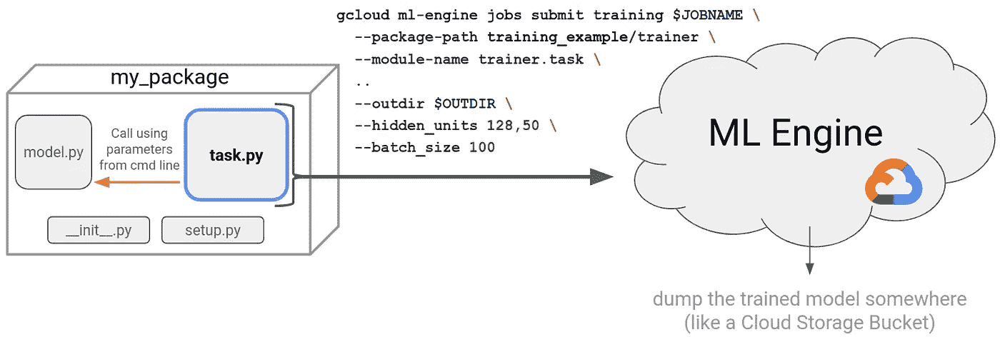

# 如何使用云 ML 引擎在云端训练机器学习模型

> 原文：<https://towardsdatascience.com/how-to-train-machine-learning-models-in-the-cloud-using-cloud-ml-engine-3f0d935294b3?source=collection_archive---------1----------------------->

以及如何使用 docopt 包巧妙地编写一个`task.py`


在云中训练 ML 模型很有意义。为什么？在许多原因中，它允许你用大量的计算训练大量的数据，并且可能并行训练许多模型。加上也不难做！在 Google 云平台上，可以使用 Cloud ML Engine 在 TensorFlow 和其他 Python ML 库中(如 scikit-learn)训练机器学习模型，而无需管理任何基础设施。为了做到这一点，你需要将你的代码放入一个 Python 包中(即添加`setup.py`和`__init__.py`文件)。此外，将您的代码组织成一个`model.py`和`task.py`是一个最佳实践。在这篇博文中，我将带你一步一步地了解这涉及到什么。



*Submitting a job to ML Engine. The file* `*task.py*` *is the file actually executed by ML Engine and it references the model logic located in* `*model.py*`*.*

**`**task.py**`**文件****

**作为一名教师，我看到学生，尤其是那些刚接触 Python 的学生，最先遇到的事情之一就是创建一个`task.py`文件。虽然这在技术上是可选的(见下文)，但强烈推荐，因为它允许你将超参数从模型逻辑中分离出来(位于`model.py`)。它通常是由 ML 引擎调用的实际文件，其目的有两个:**

1.  **读取和解析模型参数，如训练数据和输出模型的位置、隐藏层数、批量大小等。**
2.  **用所述参数调用位于`model.py`中的模型训练逻辑**

***An example task.py file that parses command line arguments for training data location, batch size, hidden units, and the output location of the final model.***

**有许多不同的方法可以编写一个`task.py`文件——你甚至可以给它起不同的名字。事实上`task.py`和`model.py`约定仅仅是一个约定。我们本来可以称之为`task.py` `aReallyCoolArgument_parser.py` 和`model.py` `very_deeeep_model.py`。**

**我们甚至可以将这两个实体合并到一个文件中，进行参数解析和训练模型。只要你把你的代码安排到一个 Python 包中(即它[必须包含](https://python-packaging.readthedocs.io/en/latest/minimal.html) `setup.py`和`__init__.py`)，ML 引擎就不会在意。但是，坚持在一个 trainer 文件夹中命名为`task.py`和`model.py`的两个文件的惯例(更多细节在下面),这两个文件分别存放您的参数解析和模型逻辑。**

**查看[云 ML 示例](https://github.com/GoogleCloudPlatform/cloudml-samples)和[云 ML 培训](https://github.com/GoogleCloudPlatform/training-data-analyst)报告，了解使用云 ML 引擎的完整示例以及`model.py`和`task.py` 文件的示例。**

****使用 docopt 编写干净** `**task.py**` **文件****

**尽管许多人使用 argparse，这是用于解析命令行参数的标准 Python 库，但我更喜欢使用 [docopt](https://github.com/docopt/docopt) 包来编写我的`task.py`文件。为什么？因为这是写一个*记载* `task.py`最简洁的方法。事实上，几乎你唯一需要写的就是你的程序的使用信息(即帮助信息),而 docopt 会处理剩下的事情。基于您在模块的 doc 字符串中编写的用法消息(Python 将调用这个`__doc__`)，您调用`docopt(__doc__)`，它根据您在 doc 字符串中指定的格式为您生成一个参数解析器。以下是上面使用 docopt 的示例:**

**很不错，对吧？让我来分解一下。第一块代码是您的`task.py`的用法。如果您不带参数调用它或者错误地调用`task.py`,这将显示给用户。**

**第`arguments = docopt(__doc__)`行从帮助字符串中解析用法模式(“用法:…”)和选项描述(以破折号“-”开头的行)，并确保程序调用与用法模式匹配。**

**最后一部分将这些参数分配给`model.py`变量，然后执行训练和评估。**

**让我们运行一个任务。记住`task.py`是称为 Python 包的文件家族的一部分。在实践中，您将花大部分时间编写`model.py`文件，花一点时间创建`task.py file`，其余的基本上是样板文件。**

```
training_example # root directory
   setup.py # says how to install your package
   trainer # package name, “trainer” is convention
      model.py
      task.py
      __init__.py # Python convention indicating this is a package
```

**因为我们使用的是 docopt，它不是标准库的一部分，我们必须将它添加到`setup.py`，所以我们在`setup.py`中插入了一个额外的行:**

**这将告诉 Cloud ML Engine 在我们向云提交作业时通过运行`pip install docopt`来安装 docopt。**

**最后，一旦我们有了以上结构的文件，我们就可以向 ML 引擎提交一个作业。在我们这样做之前，让我们首先使用`python -m`和`ml-engine local predict`在本地测试我们的包。这两个步骤虽然是可选的，但可以帮助您在提交到云之前调试和测试包的功能。你通常在一个很小的数据集或非常有限的训练步骤上这样做。**

**Before you train on the cloud, test your package locally to make sure there are no syntactic or semantic errors.**

**一旦我们在本地测试了我们的模型，我们将使用`gcloud ml-engine jobs submit training`向 ML 引擎提交我们的作业**

**这两行与我们的讨论相关:**

```
— package-path=$(pwd)/my_model_package/trainer \
— module-name trainer.task
```

**第一行表示我们包名的位置，我们总是称之为`trainer`(一个约定)。第二行表示，在培训师包中，我们将调用培训师包中的任务模块(`task.py`)。**

****结论****

**通过构建`task.py`,我们可以将超参数作为命令行参数来处理，这允许我们将模型逻辑从超参数中分离出来。一个重要的好处是，这使我们能够使用不同的参数轻松地并行启动多个作业，以确定最佳超参数集(我们甚至可以使用内置的[超参数调整](https://cloud.google.com/ml-engine/docs/tensorflow/using-hyperparameter-tuning)服务！).最后，docopt 包根据用户编写的用法字符串自动为我们的`task.py`文件生成一个解析器。**

**就是这样！我希望这能清楚地说明如何提交一个 ML 引擎作业并构建一个`task.py`。如果你觉得这很有帮助，请留下你的掌声，让其他人也能发现。**

****附加资源****

*   **[谷歌云 ML 样本](https://github.com/GoogleCloudPlatform/cloudml-samples)**
*   **[谷歌云机器学习培训](https://github.com/GoogleCloudPlatform/training-data-analyst)**
*   **[云 ML 引擎文档](https://cloud.google.com/ml-engine/docs/tensorflow/technical-overview)**
*   **[docopt 文档](https://github.com/docopt/docopt)**
*   **[封装一个 Python 模块](http://python-packaging.readthedocs.io/en/latest/minimal.html)**