# 如何用优化器更快的训练神经网络？

> 原文：<https://towardsdatascience.com/how-to-train-neural-network-faster-with-optimizers-d297730b3713?source=collection_archive---------6----------------------->

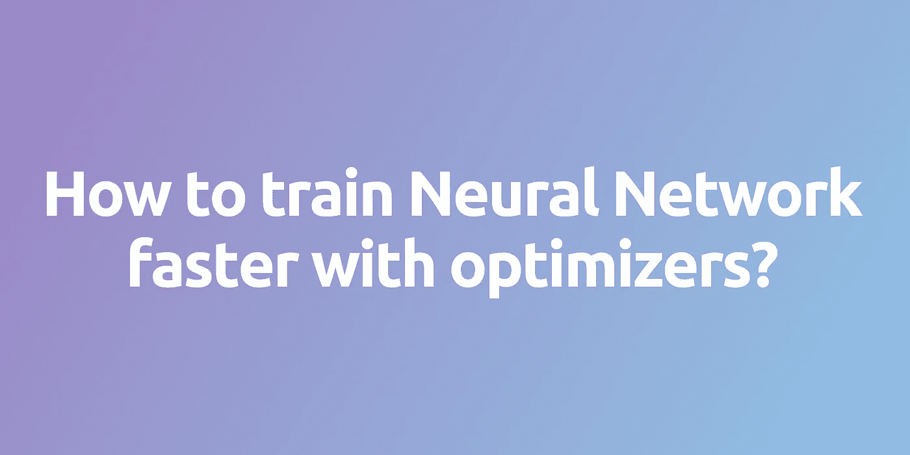

## 神经网络的秘密第四部分

当我在写最后一篇[文章](/lets-code-a-neural-network-in-plain-numpy-ae7e74410795)时，我有机会只用 Numpy 创建自己的神经网络。这是一项非常具有挑战性的任务，但同时它极大地拓宽了我对神经网络内部发生的过程的理解。其中，这次经历让我真正意识到有多少因素影响神经网络的性能。所选的架构、适当的超参数值，甚至参数的正确初始化，只是其中的一部分...然而，这一次，我们将关注对学习过程速度有巨大影响的决策，以及获得的预测的准确性——优化策略的选择。我们将深入了解许多流行的优化器，研究它们是如何工作的，并将它们相互比较。

**注意:**由于我想涵盖的内容范围相当广，所以我决定不在本文中包含任何代码片段。但是请记住，像往常一样，您可以在 [GitHub](https://github.com/SkalskiP/ILearnDeepLearning.py) 上找到所有用于创建可视化效果的代码。我还准备了一些笔记本，可以让你更好地理解讨论的问题。

## 机器学习算法的优化

O 优化是一个寻找使我们的功能最小化或最大化的参数的过程。当我们训练机器学习模型时，我们通常使用间接优化。我们选择某种度量标准，如准确度、精确度或召回率，这表明我们的模型解决给定问题的效果如何。然而，我们正在优化一个不同的成本函数 ***J(θ)*** ，并希望最小化其值将改善我们关心的度量。当然，成本函数的选择通常与我们要解决的特定问题有关。本质上，它是故意设计来表明我们离理想的解决方案有多远。可以想象，这个话题相当复杂，是一篇单独文章的绝佳话题。

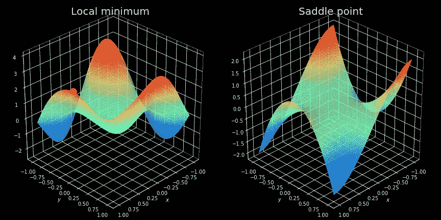

**Figure 1\.** Examples of points which are a problem for optimization algorithms.

## 一路上的陷阱

然而事实证明，找到非凸成本函数的最小值通常并不容易，我们必须使用高级优化策略来定位它们。如果你学过微分学，你肯定知道**局部最小值**的概念——这是我们的优化器可能陷入的一些最大的陷阱。对于那些还没有接触过数学中这一奇妙部分的人，我只能说，这些是函数取最小值的点，但只是在给定的区域内。上图的左侧显示了这种情况的一个示例。我们可以清楚地看到，优化器定位的点并不是整体最优解。

克服所谓的**鞍点**通常被认为更具挑战性。这些是平台，其中成本函数值几乎是恒定的。这种情况显示在同一图的右侧。在这些点上，所有方向上的梯度几乎为零，使得不可能逃脱。

有时，特别是在多层网络的情况下，我们可能不得不处理成本函数非常陡峭的区域。在这些地方，渐变的值急剧增加——**爆炸渐变**——这导致采取巨大的步骤，经常破坏整个先前的优化。然而，这个问题可以通过**渐变裁剪**轻松避免——定义最大允许渐变值。

## 梯度下降

在我们了解更高级的算法之前，让我们先来看看一些基本策略。可能最直接的方法之一就是简单地沿着与梯度相反的方向前进。这种策略可以用下面的等式来描述。

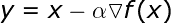

其中，α是一个称为学习率的超参数，它转化为我们在每次迭代中将要采取的步长。它的选择在一定程度上表达了学习速度和可以获得的结果的准确性之间的折衷。选择太小的步长会导致繁琐的计算，并且需要执行更多的迭代。然而，另一方面，选择太高的值会有效地阻止我们找到最小值。这种情况如图 2 所示——我们可以看到在随后的迭代中，我们如何来回跳动，无法稳定下来。同时，模型中适当的步骤被定义，几乎立即找到最小值。

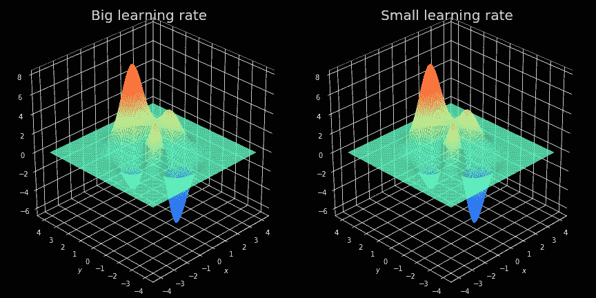

**Figure 2\.** Visualization of gradient descent behavior for small and large learning rate values. In order to avoid obscuring the image, only the last ten steps are visible at any time.

此外，该算法易受先前描述的鞍点问题的影响。由于在随后的迭代中执行的校正的大小与计算的梯度成比例，我们将无法逃离平台。

最后，最重要的是，该算法是无效的——它需要在每次迭代中使用整个训练集。这意味着，在每个时期，我们必须查看所有示例，以便执行下一个优化步骤。当训练集由几千个例子组成时，这可能不是问题，但正如我在我的一篇[文章](/preventing-deep-neural-network-from-overfitting-953458db800a)中提到的那样——当神经网络拥有数百万条记录时，它们工作得最好。在这种情况下，很难想象在每次迭代中我们都使用整个集合。这会浪费时间和计算机内存。所有这些因素导致梯度下降，以其最纯粹的形式，在大多数情况下不起作用。

## 小批量梯度下降

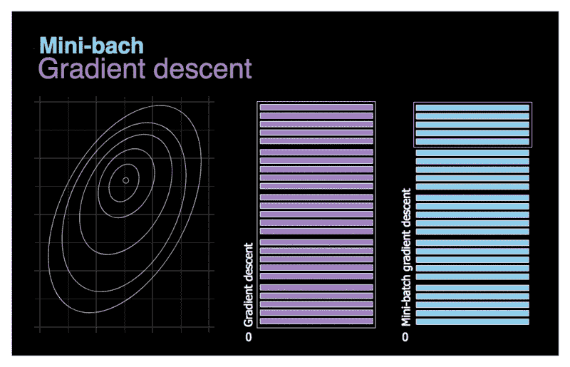

**Figure 3\.** Comparison of gradient descent and mini-batch gradient descent.

L et 首先尝试解决上一章提到的最后一个问题——效率低下。虽然[矢量化](/https-medium-com-piotr-skalski92-deep-dive-into-deep-networks-math-17660bc376ba)允许我们通过一次处理许多训练示例来加速计算，但当数据集有数百万条记录时，整个过程仍然需要很长时间才能完成**。**。让我们尝试使用一个相当简单的解决方案——将整个数据集划分为更小的批次，并在后续迭代中使用它们进行训练。我们的新策略已经在上面的动画中形象化了。想象一下，画在左边的等高线象征着我们想要优化的成本函数。我们可以看到，由于我们需要处理的数据量更少，我们的新算法做出决策的速度更快。再来关注一下对比车型在运动上的对比。梯度下降采取罕见的，相对较大的步骤，几乎没有噪音。另一方面，批量梯度下降需要更多的步骤，但是由于分析数据集中可能的多样性，我们有更多的噪音。甚至有可能在一次迭代中，我们会朝着与预期相反的方向前进。然而，平均来说，我们向最小值移动。

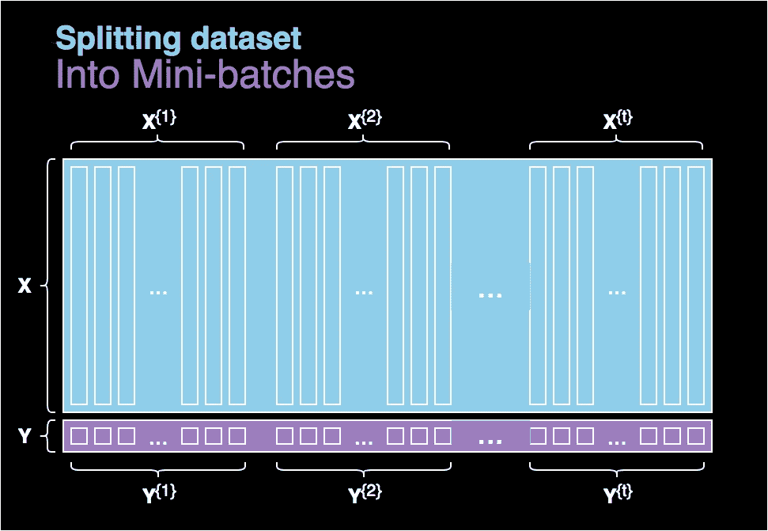

**Figure 4\.** Splitting the dataset into batchs.

我知道你在想什么…如何选择批量？正如深度学习中经常出现的情况一样，答案不是确定的，取决于具体的情况。如果我们批处理的大小等于整个数据集，那么我们本质上是在处理一个普通的梯度下降。另一方面，如果大小为 1，那么在每次迭代中，我们只使用数据集中的一个例子，因此失去了矢量化的好处。这种方法有时是合理的，使用它的策略的一个例子是**随机梯度下降**。这是通过选择**随机数据集记录**并在后续迭代中将其用作训练集来完成的。然而，如果我们决定使用小批量，我们通常选择一个中间值—通常从 64 到 512 个示例中选择。

## 指数加权平均值

T 他的想法被用在很多领域，比如统计学、经济学甚至深度学习。许多先进的神经网络优化算法使用这个概念，因为它允许我们继续优化，即使在给定点计算的梯度为零。让我们花一些时间来理解这个算法。作为一个例子，我们将使用去年最大的科技公司的股票价值。

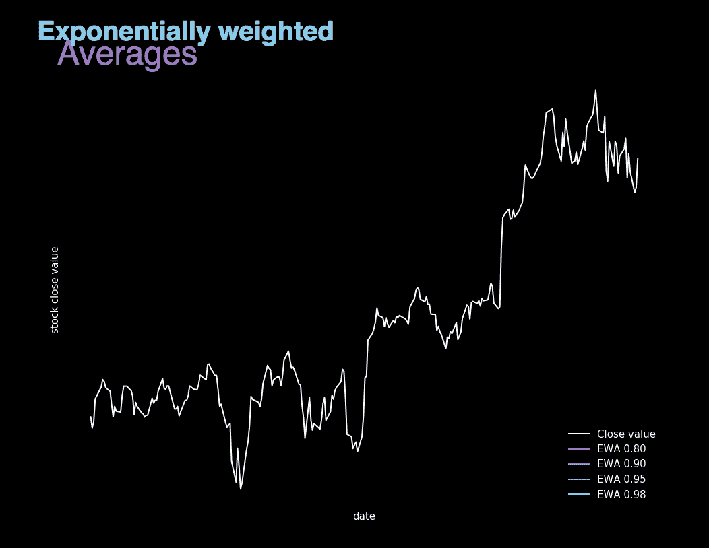

**Figure 5\.** Visualization showing Exponentially weighted averages calculated for different β values.

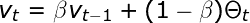

EWA 本质上是平均许多以前的值，以便独立于局部波动，专注于整体趋势。它的值是使用上面显示的递归公式计算的，其中β是用于控制要平均的值的范围的参数。我们可以说，在随后的迭代中，我们考虑了 1/(1 - β)个例子。对于较大的β值，我们得到的图形要平滑得多，因为我们对许多记录进行了平均。另一方面，我们的图表越来越向右移动，因为当我们在很长一段时间内平均时，EWA 适应新趋势的速度更慢。这可以从图 5 中看出，我们在图 5 中展示了收盘时的实际股票价值，以及 4 个显示为不同 beta 参数计算的指数加权平均值的图表。

## 动量梯度下降

这种策略利用指数加权平均值来避免成本函数的梯度接近于零的点的麻烦。简而言之，我们允许我们的算法获得动量，这样即使局部梯度为零，我们仍然依靠先前计算的值向前移动。由于这个原因，它几乎总是比纯梯度下降更好的选择。

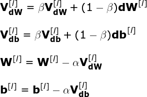

像往常一样，我们使用反向传播来计算网络每层的 **dW** 和 **db** 的值。然而，这次不是直接使用计算的梯度来更新我们的 NN 参数值，而是首先计算 **VdW** 和 **Vdb** 的中间值。这些值实际上是成本函数关于单个参数的导数的 EWA。最后，我们将在梯度下降中使用 **VdW** 和 **Vdb** 。整个过程可以用下面的等式来描述。还值得注意的是，该方法的实现需要存储迭代之间的 EWA 值。您可以在我的存储库上的一个笔记本中看到详细信息。

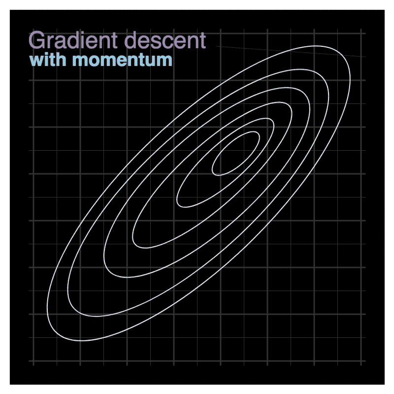

**Figure 6\.** Gradient descent with momentum.

现在，让我们尝试对 EWA 对我们的模型行为的影响有一个直观的认识。再一次，让我们想象下面画的等高线象征着我们优化的成本函数。上面的可视化显示了标准梯度下降和带有动量的 GD 之间的比较。我们可以看到，成本函数的图形形状迫使采用非常缓慢的优化方式。就像在股票市场价格的例子中一样，指数加权平均值的使用让我们关注领先的趋势而不是噪音。指示最小值的分量被放大，导致振荡的分量被慢慢消除。此外，如果我们在后续更新中获得指向相似方向的梯度，学习率将会提高。这导致更快的收敛和减少的振荡。然而，这种方法有一个缺点—当您接近最小值时，动量值会增加，并可能变得如此之大，以至于算法将无法在正确的位置停止。

## RMSProp

另一种提高梯度下降性能的方法是应用 RMSProp 策略——均方根传播，这是最常用的优化器之一。这是另一种使用指数加权平均值的算法。此外，它是自适应的——它允许对模型的每个参数的学习速率进行单独调整。后续参数值基于为特定参数计算的先前梯度值。

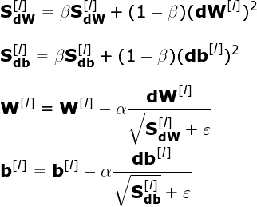

使用图 6 中的例子。和上面的等式，让我们考虑这个策略背后的逻辑。根据名称，在每次迭代中，我们计算关于相应参数的成本函数的导数的逐元素平方。此外，我们使用 EWA 来平均最近迭代中获得的值。最后，在我们更新网络参数值之前，相应的梯度分量除以平方和的平方根。这意味着对于梯度大的参数，学习速率降低得更快，而对于梯度小的参数，学习速率降低得更慢。这样，我们的算法减少了振荡，并防止噪声控制信号。为了避免被零除(数值稳定性)，我们还为分母增加了一个非常小的值，在引用的公式中标记为ɛ.

我必须承认，在写这篇文章的时候，我有两个惊叹的时刻——我被我分析的优化器之间的质量飞跃震惊了。第一个是当我看到标准梯度下降和小批量之间的训练时间的差异。第二，当我将 RMSprop 与我们目前所见的一切进行比较时。然而，这种方法也有缺点。随着上述方程的分母在每次迭代中增加，我们的学习速率变小。因此，这可能会导致我们的模型完全停止。

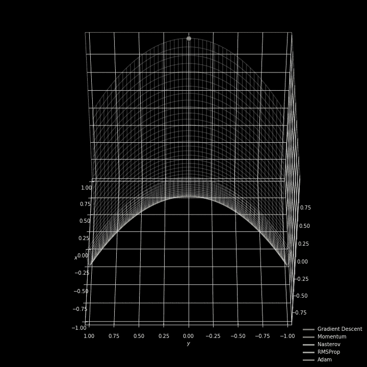

**Figure 7\.** Optimizers comparison.

## 圣经》和《古兰经》传统中）亚当（人类第一人的名字

L 快速但同样重要的是，让我告诉你关于自适应矩估计。与 RMSProp 一样，这是一种在广泛的应用中运行良好的算法。它利用了 RMSProp 的最大优点，并将它们与动量优化的思想相结合。结果是一个允许快速有效优化的策略。上图显示了讨论得很好的优化器如何处理函数中困难部分的优化。你可以立即看到亚当在这种情况下做得很好。

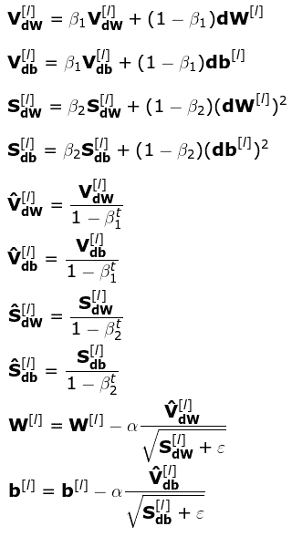

不幸的是，随着我们方法的有效性增加，计算的复杂性也增加了。是真的…以上，我写了十个矩阵方程，描述优化过程的单次迭代。根据经验，我知道你们中的一些人——尤其是那些不太熟悉数学家的人——现在会心情沉重。**别担心！请注意，这里没有什么新内容。**这些等式与之前为 momentum 和 RMSProp 优化器编写的等式相同。这一次我们将简单地同时使用这两种想法。

## 结论

我希望我已经设法以透明的方式解释了这些难题。这篇文章让我明白了选择正确的优化器有多重要。理解这些算法可以有意识地使用它们，理解单个超参数的变化如何影响整个模型的性能。

如果你设法来到这里，恭喜你。这当然不是最容易的阅读。如果你喜欢这篇文章，请在 [Twitter](https://twitter.com/PiotrSkalski92) 和 [Medium](https://medium.com/@piotr.skalski92) 上关注我，并在 [GitHub](https://github.com/SkalskiP) 和 [Kaggle](https://www.kaggle.com/skalskip) 上查看我正在进行的其他项目。本文是“神经网络的奥秘”系列的第四部分，如果你还没有机会，请阅读[其他文章](/preventing-deep-neural-network-from-overfitting-953458db800a)。如果你对接下来的帖子有什么有趣的想法，请写在评论里。保持好奇！

