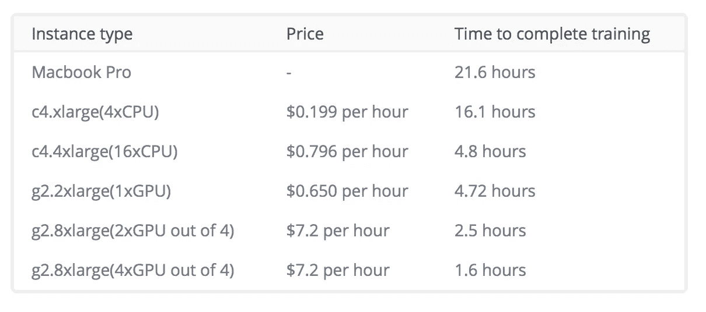
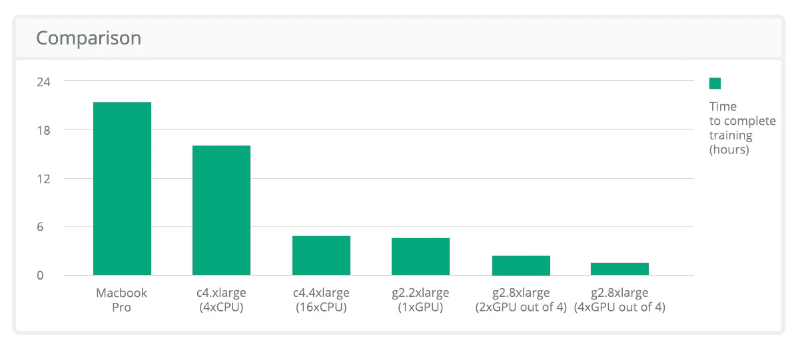

# 如何训练张量流模型

> 原文：<https://towardsdatascience.com/how-to-traine-tensorflow-models-79426dabd304?source=collection_archive---------0----------------------->

## 使用 GPU


近年来，机器学习领域取得了重大进展。这种进步很大程度上可以归功于图形处理单元(GPU)的使用越来越多，以加速机器学习模型的训练。特别是，额外的计算能力导致了**深度学习**的普及——使用复杂的多层神经网络来创建模型，能够从大量未标记的训练数据中进行特征检测。

# GPU 简介

GPU 非常适合深度学习，因为它们被设计来处理的计算类型恰好与深度学习中遇到的计算类型相同。图像、视频和其他图形都表示为矩阵，因此当您执行任何操作(如放大效果或相机旋转)时，您所做的只是对矩阵应用一些数学变换。

实际上，这意味着与中央处理器(CPU)相比，GPU 更擅长执行矩阵运算和其他几种高级数学转换。这使得深度学习算法在 GPU 上的运行速度比 CPU 快好几倍。学习时间通常可以从几天缩短到几个小时。

# 机器学习中的 GPU

那么，如何使用 GPU 来完成机器学习任务呢？在这篇文章中，我们将探索一个支持 GPU 的 AWS 实例的设置，以在 Tensorflow 中训练神经网络。

首先，在 AWS 控制面板中创建一个新的 EC2 实例。

我们将使用 Ubuntu Server 16.04 LTS (HVM)作为操作系统，但是这个过程在任何 64 位 Linux 发行版上都应该是相似的。

对于实例类型，选择 g2.2xlarge 这些是通过 NVIDIA GRID GPU 启用的。也有几个这样的 GPU 的实例，但利用一个以上需要额外的设置，这将在本文稍后讨论。

使用您首选的安全设置完成设置。

一旦设置和创建完成，SSH 进入您的实例。

Python 应该已经存在于系统中，所以安装所需的库:

```
sudo apt-get update
sudo apt-get install python-pip python-dev
```

接下来，安装启用 GPU 支持的 Tensorflow。最简单的方法是:

```
pip install tensorflow-gpu
```

但是，对于某些安装，这可能会失败。如果发生这种情况，还有一个替代方案:

```
export TF_BINARY_URL=https://storage.googleapis.com/tensorflow/linux/gpu/tensorflow_gpu-0.12.1-cp27-none-linux_x86_64.whl
sudo pip install --upgrade $TF_BINARY_URL
```

如果在 TF 安装过程中得到一个`locale.Error: unsupported locale setting`，请输入:

```
export LC_ALL=C
```

然后，重复安装过程。

如果不再出现错误，TF 安装就结束了。然而，为了让 GPU 加速正常工作，我们仍然必须安装 Cuda 工具包和 cuDNN。

首先，让我们安装 Cuda 工具包。

开始之前，请注意安装过程将下载大约 3gb 的数据。

```
wget "http://developer.download.nvidia.com/compute/cuda/repos/ubuntu1604/x86_64/cuda-repo-ubuntu1604_8.0.44-1_amd64.deb"
sudo dpkg -i cuda-repo-ubuntu1604_8.0.44-1_amd64.deb
sudo apt-get update
sudo apt-get install cuda
```

安装 CUDA 工具包后，下载 [cuDNN Library for Linux](https://developer.nvidia.com/cudnn) (注意，您需要注册加速计算开发者计划)并将其复制到您的 EC2 实例中。

```
sudo tar -xvf cudnn-8.0-linux-x64-v5.1.tgz -C /usr/local
export PATH=/usr/local/cuda/bin:$PATH
export LD_LIBRARY_PATH="$LD_LIBRARY_PATH:/usr/local/cuda/lib64:/usr/local/cuda/extras/CUPTI/lib64"
export CUDA_HOME=/usr/local/cuda
```

最后，设置过程已经结束，我们可以测试安装了:

```
python
>>> import tensorflow as tf
>>> sess = tf.Session()
```

你应该看到`Found device 0 with properties: name: GRID K520`

```
>>> hello_world = tf.constant("Hello, world!")
>>> print sess.run(hello_world)
```

将显示`Hello, world!`

```
>>> print sess.run(tf.constant(123)*tf.constant(456))
```

`56088`是正确答案。

系统现在准备好利用带有 Tensorflow 的 GPU。

对 Tensorflow 代码的更改应该是最小的。如果 TensorFlow 操作同时具有 CPU 和 GPU 实现，则将操作分配给设备时，GPU 设备将优先。

如果您想在自己选择的设备上运行一个特定的操作，而不是使用默认的，您可以使用`with tf.device`创建一个设备上下文。这将强制该上下文中的所有操作具有相同的设备分配。

```
# Creates a graph.
with tf.device('/gpu:0'):
 a = tf.constant([1.0, 2.0, 3.0, 4.0, 5.0, 6.0], shape=[2, 3], name='a')
 b = tf.constant([1.0, 2.0, 3.0, 4.0, 5.0, 6.0], shape=[3, 2], name='b')
 c = tf.matmul(a, b)
# Creates a session with log_device_placement set to True.
sess = tf.Session(config=tf.ConfigProto(log_device_placement=True))
# Runs the op.
print sess.run©
```

如果您想在多个 GPU 上运行 TensorFlow，可以以多塔的方式构建一个模型，并将每个塔分配给不同的 GPU。例如:

```
# Creates a graph.
c = []
for d in ['/gpu:2', '/gpu:3']:
 with tf.device(d):
 a = tf.constant([1.0, 2.0, 3.0, 4.0, 5.0, 6.0], shape=[2, 3])
 b = tf.constant([1.0, 2.0, 3.0, 4.0, 5.0, 6.0], shape=[3, 2])
 c.append(tf.matmul(a, b))
with tf.device('/cpu:0'):
 sum = tf.add_n(c)
# Creates a session with log_device_placement set to True.
sess = tf.Session(config=tf.ConfigProto(log_device_placement=True))
# Runs the op.
print sess.run(sum)
```

# 利用 GPU 的优势

出于基准测试的目的，我们将使用卷积神经网络(CNN)来识别图像，这是作为 [Tensorflow 教程](https://github.com/tensorflow/models/tree/master/tutorials/image/cifar10)的一部分提供的。CIFAR-10 分类是机器学习中常见的基准问题。任务是将 RGB 32x32 像素图像分为 10 类。

让我们比较在几种流行的配置上训练该模型的性能:



# 结果

如结果所示，在这个特定示例中，16 个 CPU 的能力与 1 个 GPU 的能力相当。在撰写本文时，同样的训练时间，使用 GPU 也要便宜 18%。

*由*[*data art*](https://www.dataart.com/industry/iot-and-m2m-solutions?utm_source=medium&utm_medium=social&utm_campaign=i-spring-2018)*的高级建筑师尼古拉·哈巴罗夫撰写。*