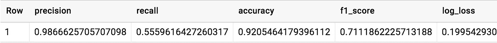
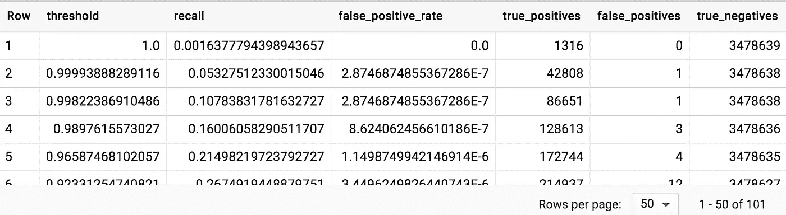
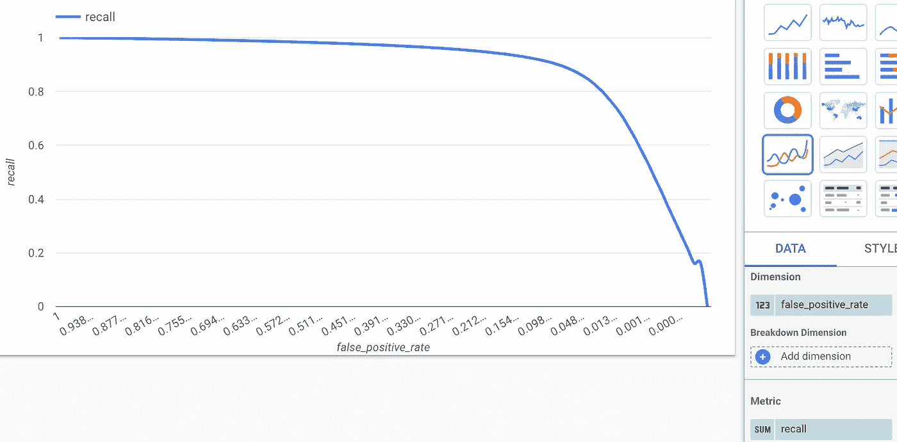
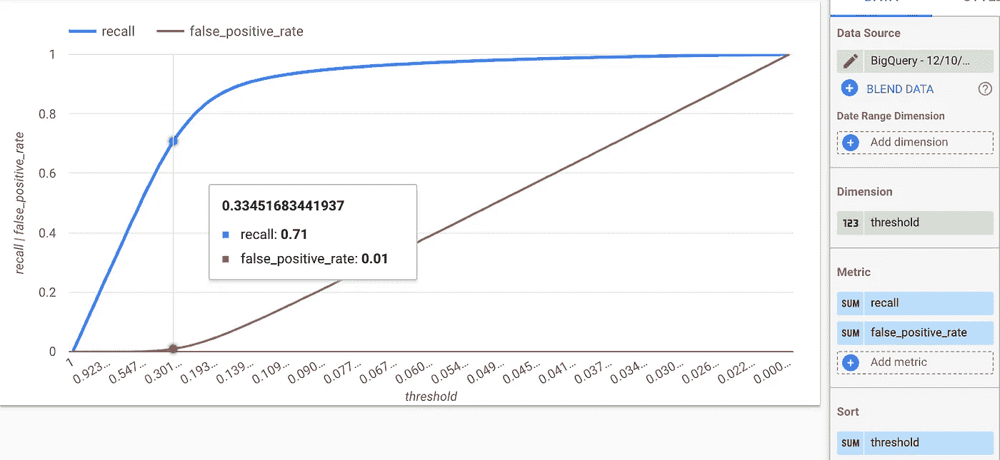
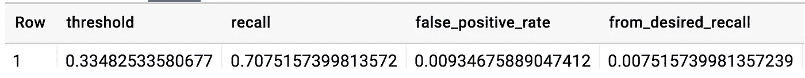
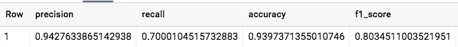

# 如何调优 BigQuery ML 分类模型以达到期望的精度或召回率

> 原文：<https://towardsdatascience.com/how-to-tune-a-bigquery-ml-classification-model-to-achieve-a-desired-precision-or-recall-e4d40b93016a?source=collection_archive---------15----------------------->

## 基于 ROC 曲线选择概率阈值

BigQuery 为在大型结构化数据集上训练机器学习模型提供了一种令人难以置信的便捷方式。在之前的一篇文章中，我向您展示了如何训练一个分类模型来预测航班延误。以下是预测航班是否会晚点 15 分钟或更久的 SQL 查询:

```
CREATE OR REPLACE MODEL flights.delayedOPTIONS (model_type='logistic_reg', input_label_cols=['late'], 
         data_split_method='custom', data_split_col='is_train_row') ASSELECT
  IF(arr_delay < 15, 0, 1) AS late,
  carrier,
  origin,
  dest,
  dep_delay,
  taxi_out,
  distance,
  is_train_day = 'True' AS is_train_row
FROM
  `cloud-training-demos.flights.tzcorr` as f
JOIN `cloud-training-demos.flights.trainday` as t
USING(FL_DATE)
WHERE
  arr_delay IS NOT NULL
```

这将在名为 flights 的数据集中创建一个名为 delayed 的模型。该模型将使用载体、原点等列。作为模型的输入，并预测航班是否会晚点。地面实况来自美国航班到达延误的历史数据。请注意，我已经按天将数据预拆分为一行是训练数据(is_train_day=True)还是应该用于独立评估(is_train_day=False)。这很重要，因为同一天的航班延误往往高度相关。

当训练完成时，BigQuery 报告训练统计数据，但是我们应该查看保留数据集的评估统计数据(is_train_day=False):

```
SELECT * from ML.EVALUATE(MODEL flights.delayed,
(
SELECT
  IF(arr_delay < 15, 0, 1) AS late,
  carrier,
  origin,
  dest,
  dep_delay,
  taxi_out,
  distance
FROM
  `cloud-training-demos.flights.tzcorr` as f
JOIN `cloud-training-demos.flights.trainday` as t
USING(FL_DATE)
WHERE
  arr_delay IS NOT NULL
  AND is_train_day = 'False'
))
```

这给了我们:



Evaluation statistics for flight delay model

航班延误数据是一个不平衡的数据集——只有 18%的航班晚点(这是我通过实践发现的):

```
SELECT
  SUM(IF(arr_delay < 15, 0, 1))/COUNT(arr_delay) AS fraction_late
FROM
  `cloud-training-demos.flights.tzcorr` as f
JOIN `cloud-training-demos.flights.trainday` as t
USING(FL_DATE)
WHERE
  arr_delay IS NOT NULL
  AND is_train_day = 'True'
```

在这样一个不平衡的数据集中，准确性并不那么有用，通常有一个业务目标来满足期望的精度(如果 1 更常见)或召回(如果 0 更常见)。

## 受试者工作特征曲线

一个分类模型实际上返回的是航班晚点的概率；上表中的评估统计数据是通过将该概率阈值设定为 0.5 来计算的。我们可以改变这个阈值，并在不同的阈值下获得精度和召回率。这被称为 ROC 曲线(这是一个可以追溯到雷达时代的首字母缩写词)，我们可以让 BigQuery 使用以下方法生成这条曲线:

```
SELECT * from ML.ROC_CURVE(MODEL flights.delayed,
(
SELECT
  IF(arr_delay < 15, 0, 1) AS late,
  carrier,
  origin,
  dest,
  dep_delay,
  taxi_out,
  distance
FROM
  `cloud-training-demos.flights.tzcorr` as f
JOIN `cloud-training-demos.flights.trainday` as t
USING(FL_DATE)
WHERE
  arr_delay IS NOT NULL
  AND is_train_day = 'True'
))
```

本质上，它和 ML 是一样的。评估查询，除了您使用 ML。ROC _ CURVE 因为我们要调整阈值，所以我们应该对训练数据进行调整(is_train_day=True)。该表返回 101 行，每个阈值都有一个误报率(1 精度)和召回率。默认情况下，阈值基于对训练数据集的百分位数的计算:



Recall, false positive rate, etc. as the probability threshold of the classification model is changed

我们可以点击 BigQuery UI 中的“Explore in Data Studio”链接，得到一个图(设置 false_positive_rate 为维度，recall 为度量):



ROC curve in Data Studio

更有用的观点是将阈值作为维度，将另外两个统计数据作为维度:



Graph the variation of recall and false_positive_rate by threshold in Data Studio and choose the threshold that gives you a recall close to 70%.

我们可以调整阈值来实现一定的回忆(然后你将生活在你得到的任何精度)。假设我们想要确保识别至少 70%的晚点航班，即我们想要 0.7 的召回率。从上图可以看出，概率阈值需要为 0.335。这意味着我们会错误地将 1%的准点航班识别为晚点。

## SQL 中的优化概率阈值

下面是一个查询，它将返回阈值，而无需绘制图形并将鼠标悬停在其上:

```
WITH roc AS (SELECT * from ML.ROC_CURVE(MODEL flights.delayed,
(
SELECT
  IF(arr_delay < 15, 0, 1) AS late,
  carrier,
  origin,
  dest,
  dep_delay,
  taxi_out,
  distance
FROM
  `cloud-training-demos.flights.tzcorr` as f
JOIN `cloud-training-demos.flights.trainday` as t
USING(FL_DATE)
WHERE
  arr_delay IS NOT NULL
  AND is_train_day = 'True'
)))SELECT 
threshold, recall, false_positive_rate,
**ABS(recall - 0.7) AS from_desired_recall**
FROM roc
**ORDER BY from_desired_recall ASC**
LIMIT 1
```

这给了我们获得 0.7 召回所需的阈值:



Choosing the threshold that gives us a recall of 0.7.


Nicely tuned! Photo by [Ali Morshedlou](https://unsplash.com/photos/RyVXnQdcw_4?utm_source=unsplash&utm_medium=referral&utm_content=creditCopyText) on [Unsplash](https://unsplash.com/search/photos/tune?utm_source=unsplash&utm_medium=referral&utm_content=creditCopyText)

## 用新的概率阈值进行评估和预测

我们可以(对保留的数据集)进行评估，看看我们是否达到了预期的召回率:

```
SELECT * from ML.EVALUATE(MODEL flights.delayed,
(
SELECT
  IF(arr_delay < 15, 0, 1) AS late,
  carrier,
  origin,
  dest,
  dep_delay,
  taxi_out,
  distance
FROM
  `cloud-training-demos.flights.tzcorr` as f
JOIN `cloud-training-demos.flights.trainday` as t
USING(FL_DATE)
WHERE
  arr_delay IS NOT NULL
  AND is_train_day = 'False'
), **STRUCT(0.3348 AS threshold)**)
```

这给了我们:



We get the hoped-for recall of 70% on the independent evaluation dataset!

万岁！我们在独立评估数据集上也获得了 70%的召回率，所以看起来我们没有过度拟合。

和 ML 一样。评估，当我们进行最大似然预测时，我们可以指定概率的期望阈值:

```
SELECT * from ML.PREDICT(MODEL flights.delayed,
(
SELECT
  IF(arr_delay < 15, 0, 1) AS late,
  carrier,
  origin,
  dest,
  dep_delay,
  taxi_out,
  distance
FROM
  `cloud-training-demos.flights.tzcorr` as f
JOIN `cloud-training-demos.flights.trainday` as t
USING(FL_DATE)
WHERE
  arr_delay IS NOT NULL
  AND is_train_day = 'False'
LIMIT 10
), **STRUCT(0.3348 AS threshold)**)
```

尽情享受吧！