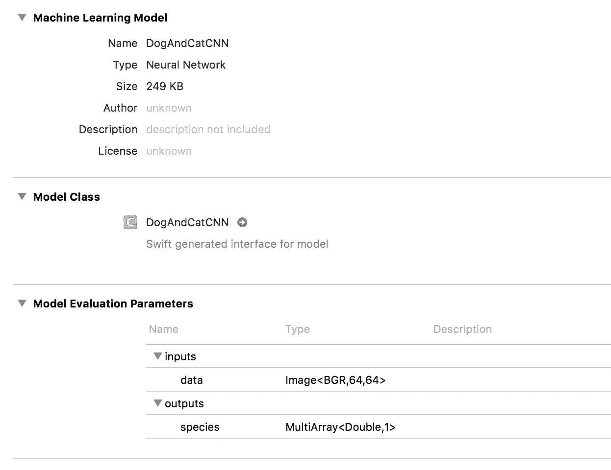

# 如何使用 Core ML 在 iOS 11 上使用机器学习模型

> 原文：<https://towardsdatascience.com/how-to-use-a-machine-learning-model-on-ios-11-using-core-ml-24a9d8654df6?source=collection_archive---------2----------------------->


iOS 11 的发布给开发者带来了很多新功能，比如 [ARKit](https://developer.apple.com/arkit/) 、 [Core NFC](https://developer.apple.com/documentation/corenfc) 等等。对我来说真正突出的一点是增加了[核心 ML](https://developer.apple.com/documentation/coreml) 。

> Core ML 可以让你将任何机器学习模型集成到你的 iOS 应用中。

在本教程中，我将使用一个预先训练好的深度卷积神经网络来确定一张图片是否包含一只猫或一只狗。这是我在学习 DL 时建立的一个非常简单的模型。

## **先决条件**

要完成本教程，您需要:

1.  运行 iOS 11 的设备
2.  Xcode 9
3.  受过训练的模特

# 获取核心 ML 模型

要将您的模型转换为 [Core ML](https://developer.apple.com/documentation/coreml) ，您需要安装 Apple 提供的命令行工具。

```
pip install coremltools
```

接下来，在与模型相同的文件夹中创建一个 python 文件，并添加下面的代码。 *image_input_names 和 is_bgr* 告诉转换器我们的输入参数将是一个图像。

**注意:如果您的模型不是用 Keras 构建的，或者如果您需要关于可用参数的更多信息，您可以查看 Apple 文档。**[https://apple . github . io/coremltools/coremltools . converters . html](https://apple.github.io/coremltools/coremltools.converters.html)

创建后，执行 python 文件来转换您的模型。

```
python your_file_name.py
```

# 将新模型添加到您的应用中

首先，将模型拖到项目导航器中，将模型添加到 Xcode 项目中。**将自动生成一个带有模型名称及其属性的新对象。**

您可以通过在 Xcode 中打开它来查看有关模型的信息。在查看 mine 时，我们可以看到模型类型和我们在转换模型时配置的输入/输出。



## 给你的模型拍照

首先实现本地相机来拍摄照片，为我们的模型提供素材。

在 UIImagePickerController 的委托中，我们将进行预测，并提供一个简单的警告来显示我们模型的输出。预测方法将在稍后实现。

## 调整照片大小

如果你仔细看了我的模型的描述，你会注意到我的输入图像的大小是 64x64。由于我的模型是用特定大小的图像训练的，我们需要将相机中的照片调整到与它们相同的大小。

## 将 UIImage 转换为 CVPixelBuffer

遗憾的是 [Core ML](https://developer.apple.com/documentation/coreml) 不允许我们将 UIImage 直接输入到模型中。而是需要转换成支持的类型[*CVPixelBuffer*](https://developer.apple.com/documentation/corevideo/cvpixelbuffer-q2e)*。我创建了一个简单的扩展来将 UIImage 转换成 CVPixelBuffer。*

## 做预测

现在是有趣的部分！我们将使用我们之前创建的方法来格式化我们的 UIImage，然后将它提供给我们的模型。一旦格式化，我们简单地调用*预测*方法来获得我们的预测。

Tada！现在，您应该可以从您的模型中获得预测。

你可以在 Github 上找到完整的项目:[https://github.com/francoismarceau29/CoreMLCNNDemo](https://github.com/francoismarceau29/CoreMLCNNDemo)

如果你喜欢这篇文章，请一定留下你的关注，你也可以在 twitter 上联系我。