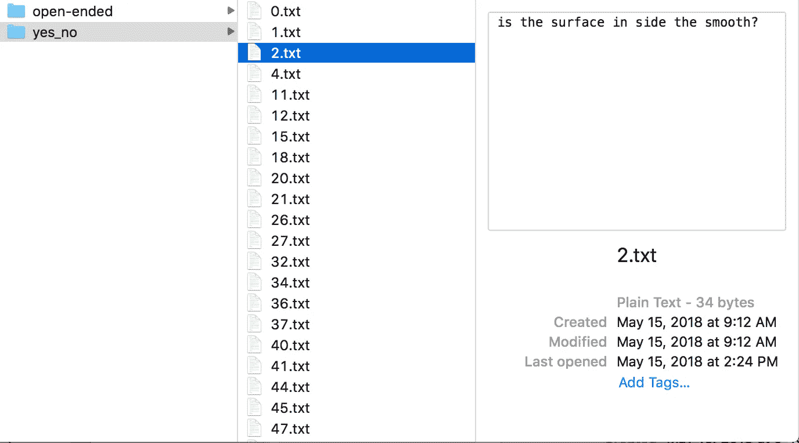
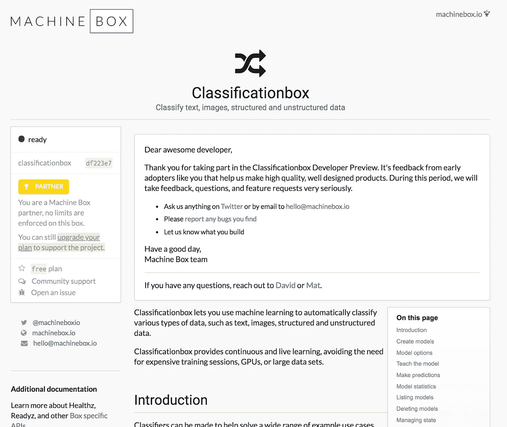
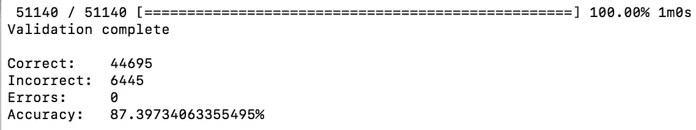

# 如何使用人工智能检测非数据科学家的开放式问题

> 原文：<https://towardsdatascience.com/how-to-use-ai-to-detect-open-ended-questions-for-non-datascientists-e2ef02427422?source=collection_archive---------6----------------------->

> 这是一个快速指南，任何人都可以按照它来训练机器学习模型，以检测文本中的开放式问题。

问*开放式问题*的能力非常重要，无论你是在产品管理、教育、咨询/治疗、销售还是新闻业。从表面上看，区分开放式问题(“你感觉如何？”)与封闭式问题(“你喜欢你的工作吗？”).

## 人工智能和机器学习

想到聊天机器人、消息服务和其他与人类互动的机器用例，我清楚地意识到，能够问(或至少能够检测)开放式问题将是重要的。这可以帮助指导学生和教师、辅导员和被辅导者、面试官和被面试者(名单还在继续)在网上和机器互动。

但是现在让我们只关注单一的用例；正在检测问题类型。我做的第一件事是在谷歌上搜索一个合适的问题和答案的数据集，上面有问题类型的标签。幸运的是，我发现了[这个](http://jmcauley.ucsd.edu/data/amazon/qa/)非常大的亚马逊问答数据集。

> **观点问答系统中的歧义性、主观性和分歧观点建模**
> 【孟婷】万，朱利安·麦考利
> *数据挖掘国际会议(ICDM)* ，2016
> [pdf](http://cseweb.ucsd.edu/~jmcauley/pdfs/icdm16c.pdf)
> 
> **通过客户评论解决复杂主观的产品相关查询**
> 朱利安·麦考利，杨顺清
> *环球网(WWW)* ，2016
> [pdf](http://cseweb.ucsd.edu/~jmcauley/pdfs/www16b.pdf)

## 下载和了解数据集

数据集被分解为亚马逊产品类别，所以我只是随机选择了一个并下载了它。不幸的是，它本质上是一个文本文件，其中每一行都是一个 JSON 对象，并且格式不正确。

这是机器学习的第一个问题。干净的数据集。

我经历了手动清理这些数据的过程，这实际上意味着运行一个 Python 脚本(幸运的是网站的作者提供了这个脚本)来将文件转换成一个格式正确的 JSON 对象列表。

接下来，我需要更改封闭式问题的问题类型标签，因为在字段名中使用“/”会在以后出现问题。我简单地对“是/否”到“是 _ 否”进行了查找和替换。

Some grammar errors

手动检查这些数据，你会发现它并不完美。不是数据集作者的错，主要是问题作者的错。有大量的语法错误、标点符号问题等。

但是没关系。还是看看能不能得到显著的结果吧。

## 文本类

我最喜欢的训练机器学习模型的方法是从将数据集转换成文本文件开始，然后将它们放入标签为“开放式”和“yes_no”的文件夹中。这不是唯一的方法，或者可能是最好的/最有效的方法，但是因为我不是一个很好的开发人员，我试图通过使用现有的工具来使事情变得简单。我最喜欢的一个是它的[文本类](https://github.com/machinebox/toys/tree/master/textclass)。它使用[机器框](https://goo.gl/hQq3tL)的[分类框](https://goo.gl/Abhy7b)使用文件夹中的文本文件构建模型。

为了做到这一点，我编写了这个 [Go](http://golang.org) 代码(请—不要评判)来将 JSONs 转换成文件夹中的文本文件。

## 训练模型

When you run Classificationbox you can visit localhost on port 8080 to see a console

下一步是挑选你最喜欢的机器学习模型创建工具。我的明明是[机盒](https://goo.gl/hQq3tL)。下载并运行[分类框](https://goo.gl/Abhy7b)，然后在你所有文本文件所在的文件夹上运行 [Textclass](https://github.com/machinebox/toys/tree/master/textclass) 工具。

它将很快对成千上万个例子进行训练(对我来说不到一分钟)，然后经历一个验证过程(它将已知的答案与模型预测的进行核对)。

在我第一次运行时，我得到了`84%`的准确度。不惊人，但它绝对有资格作为重要的。80%以上的准确率意味着您正在做一些事情，而这种优化很可能会让您获得更高的准确率。这种优化通常意味着进行更多的数据清理、平衡，或者只是有更多的样本。

我首先进行了平衡数据的步骤，这提高了几个点的准确性，然后我回到源位置，下载了几个数据集添加到第一个数据集。经过两轮添加数据和平衡，我能够获得高达`87%`的精度。

Textclass CLI output

在这上面只花了一个小时，我感到非常满意，使用机器学习来检测文本中的开放式问题是完全可行的。我强烈建议大家自己试一试，看看会有什么发现。