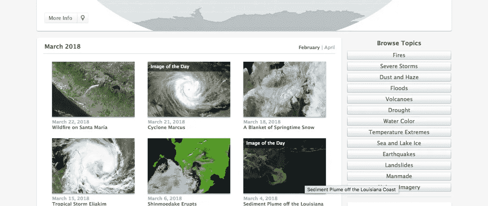
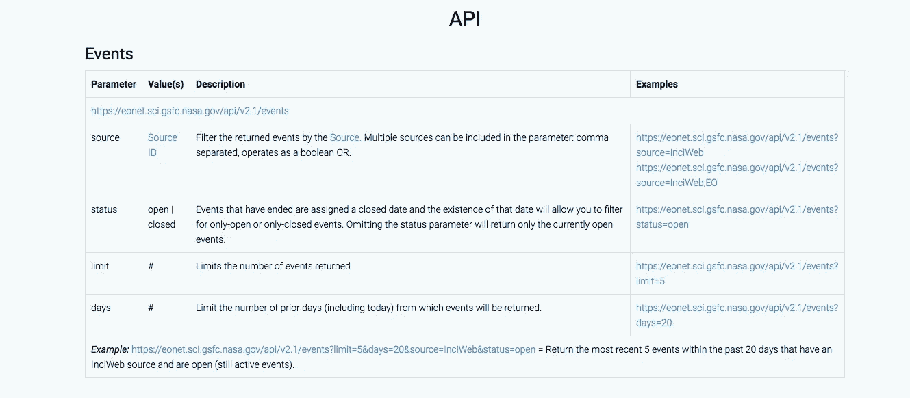
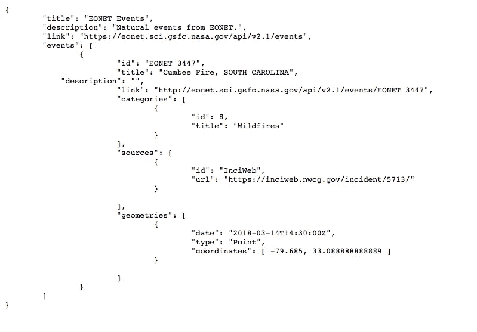

# 如何用 API 做一个深度学习卫星图片库？

> 原文：<https://towardsdatascience.com/how-to-use-api-to-make-a-deep-learning-satellite-image-repository-818a5ae2a5fa?source=collection_archive---------2----------------------->

进行任何深度学习实验的最重要的部分之一是从不同的来源提取或收集数据，以获得真实/接近实际的训练样本。现在，在缺乏已经可用的深度学习研究存储库或 kaggle 数据集的情况下，有时我们可能会在尝试我们在特定用例中学习的方法时遇到障碍。这就是神奇的 API 世界来拯救我们的地方。

# 什么是 API？

以下是维基百科的内容:

> *在计算机编程中，应用编程接口(API)是一组用于构建应用软件的子例程定义、协议和工具。一般来说，它是各种软件组件之间的一组明确定义的通信方法。一个好的 API 通过提供所有的构建模块，让开发一个计算机程序变得更加容易，然后由程序员把这些模块组合在一起。API 可以用于基于网络的系统、操作系统、数据库系统、计算机硬件或软件库。API 规范可以有多种形式，但通常包括例程、数据结构、对象类、变量或远程调用的规范。POSIX、Windows API 和 ASPI 是不同形式的 API 的例子。* ***通常提供 API 的文档以方便使用*** *。*


from -[https://shareurcodes.com/blog/creating%20a%20simple%20rest%20api%20in%20php](https://shareurcodes.com/blog/creating%20a%20simple%20rest%20api%20in%20php)

简而言之:API 是一种接口或协议，它允许用户/开发人员从开发的应用程序(如 web 服务器/web 实用工具等)中提取实用程序，而无需理解底层代码或系统。API 可用于获取数据以及更新数据源中的数据。我们在这里将涉及或使用的是 GET 请求，因为我们对数据源感兴趣。

# 手里的问题是什么？

现在考虑深度学习的图像分类问题，我需要的是一组卫星图像，这些图像被标记为对应的灾难类型。我瞄准的门户网站是[https://earthobservatory.nasa.gov/NaturalHazards/](https://earthobservatory.nasa.gov/NaturalHazards/)



[https://earthobservatory.nasa.gov/NaturalHazards/](https://earthobservatory.nasa.gov/NaturalHazards/)

现在地球观测站是一个门户网站，将有 100 多张图片，现在我需要搜索一个 API 端点，它允许我获取继续分析所需的图片。API 端点是一个 URL，根据 API 文档中提供的规范，可以查询它来搜索您需要的数据。

在浩如烟海的网络世界里搜索了一下，我找到了 https://eonet.sci.gsfc.nasa.gov/。它是关于自然事件的元数据的储存库。这个存储库支持的 API 有一个很好的端点文档。

下面是大多数 API 文档的样子:



[https://eonet.sci.gsfc.nasa.gov/docs/v2.1](https://eonet.sci.gsfc.nasa.gov/docs/v2.1)

现在我需要从表格中了解的是:

1)自然事件跟踪器的 API 端点是[https://eonet.sci.gsfc.nasa.gov/api/v2.1/events](https://eonet.sci.gsfc.nasa.gov/api/v2.1/events)。这就是我对图像元数据的所有查询，都将通过这个 URL 获得。

2)我可以根据来源、状态、限制、天数来查询存储库

3)示例查询-【https://eonet.sci.gsfc.nasa.gov/api/v2.1/events?limit=5 &天数=20 &来源=InciWeb &状态=未结。这给了我下面的 JSON 结果，关于过去 5 天的自然事件，来自 InciWeb 并且仍然开放。



# **如何有效地编码和获取信息？**

现在我们知道了信息存在于何处，但我们仍然需要找到一种最佳方法来做到这一点:

**Step-1** 使用 python 中的请求来访问 eonet API 端点并获得所需的 json 响应

```
import requests
parameters={"limit":1000,"days":5000}
response=requests.get('[https://eonet.sci.gsfc.nasa.gov/api/v2/events?status=closed&source=EO'](https://eonet.sci.gsfc.nasa.gov/api/v2/events?status=closed&source=EO'))
print(response.status_code)
```

代码应该得到 json 响应，您可以使用任何在线可用的 json 到 csv 转换器将其转换为 csv。从 csv 中过滤出您希望作为训练数据一部分保留的图像 URL

**步骤 2** 现在，当你有了所有你需要下载图片的图片网址。您可以使用以下代码将图像下载到您的硬盘或虚拟机上。

```
import csv
import urllib
import lxml.html
import requestsconnection = urllib.urlopen(url)with open('location/urls_to_download_2.csv') as csvfile:
    csvrows = csv.reader(csvfile, delimiter=',', quotechar='"')
    for row in csvrows:
      if 'view.php' in row[0]:
        filename = row[1]
        url = row[0]
        locn=row[2]
        print (locn)
```

是的。现在，您已经具备了图像形式的所有必需数据，可以征服卫星图像的深度学习了。只管去做吧！