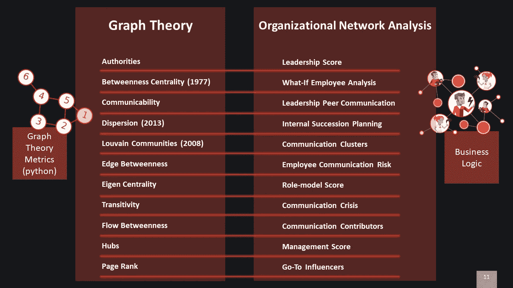
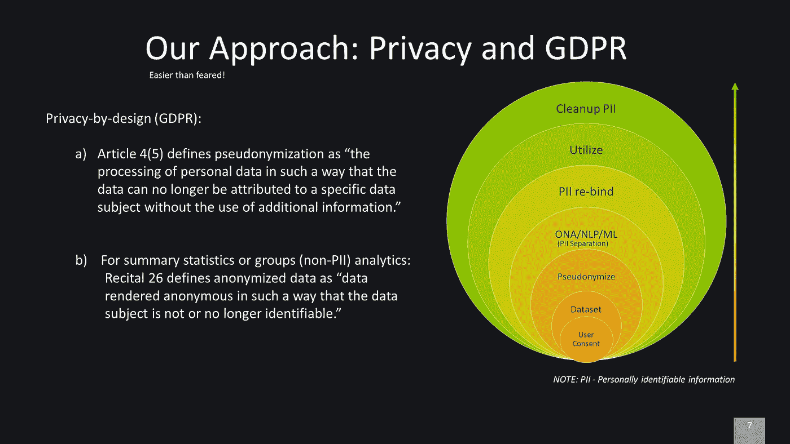

# 如何利用企业邮件分析揭示隐藏的明星，确保机会均等！

> 原文：<https://towardsdatascience.com/how-to-use-corporate-e-mail-analysis-to-reveal-hidden-stars-and-ensure-equal-opportunities-90bb77d61a7f?source=collection_archive---------13----------------------->

unsplash.com

## *组织网络分析和沟通内容分析系列文章*

1736 年，莱昂哈德·欧拉写了一篇关于柯尼斯堡七座桥的论文。这篇论文被认为是图论史上的第一篇。最近，图论被用于组织沟通领域，它被称为组织网络分析(ONA)，基本上是“[谁跟谁](https://joshbersin.com/2018/10/what-emails-reveal-about-your-performance-at-work)”。

在遍布全球的大型组织中，寻找领域专家、话题影响者或有效沟通者是一项挑战。意识到这些挑战，我们开始了探索之旅。

本系列文章的重点是电子邮件分析。简单来说，电子邮件包含:发件人、收件人、时间戳、主题和正文。但是，还有更多的字段可用。例如，MS Outlook 定义了关于[字段](https://docs.microsoft.com/en-us/office/vba/outlook/concepts/forms/standard-fields-overview#standard-fields-in-an-email-message)的更多细节，这开启了一个应用 ONA 和数据科学的机会新世界。TrustSphere 也就[主题](https://www.trustsphere.com/wp-content/uploads/2018/02/Measuring-HIPO-201801-1-Letter-7p.pdf)写了一篇很棒的文章。

从某种意义上说，公司的电子邮件交流代表了同事之间的工作关系——这正是 ONA 的意义所在。通过各种分析，我们希望了解并推进人员培养、人才发现和整体组织沟通改善。我们区分了电子邮件网络和内容，以缓解隐私和道德话题。同样的原则也适用于组织中任何形式的现代交流，无论是即时消息、评论还是反馈系统。

**基于电子邮件网络的分析**

这种方法不使用电子邮件内容。它只关注电子邮件的“发件人”、“收件人”和“时间戳”字段。给某人发送电子邮件会在网络中创建一个边缘。很明显，仅通过分析“已发送”的电子邮件就可以构建整个组织网络(“已发送”的电子邮件将总是进入某人的收件箱)。在我们的实验数据集中，我们排除了邮件列表和外部电子邮件域，同时保留了 CC 和 BCC 收件人，它们在图中可能具有不同的权重。为简单起见，我们暂时将所有权重相同的电子邮件设为 1。我们的方法基于借用图论的 11 个网络度量，如下所示:

我们提出两个最有趣的观点:

1.  内部继任计划
2.  如果员工离职怎么办

有关这些见解的技术实现的更多信息，请参见[第 2 部分](https://medium.com/@agronfazliu/technical-overview-of-e-mail-network-based-insights-376a2ef73c1c)。

此外，我们还结合了各种衡量标准，以建议的形式向员工提供进一步的见解，包括如何改善他们的沟通和协作，以及向谁寻求建议和支持。

> *我们的建议有助于员工实现他们的潜力，并在您的组织中更加引人注目。*

这些是我们已经实施的一些建议，但不是最终建议:

1.  为了增加你在组织中的影响力，请联系 *<用户>* 。
2.  改善与 *<用户>* 的沟通与协作。
3.  要提高电子邮件沟通技巧，请联系 *<用户>* 。
4.  改善与您的直接下属 *<用户>* 的沟通。

假设 *<用户>* 已经同意被推荐。

以下是这些建议的样子:

有关技术实施和指标组合的更多信息，请参见[第 3 部分](https://medium.com/@agronfazliu/deep-dive-on-e-mail-network-based-recommendations-6666c46a8f4f)，其中我们重点介绍前两个推荐器示例。

**基于电子邮件内容的分析**

电子邮件内容是电子邮件分析的另一个来源，但是它意味着更多的隐私问题。我们不断努力改进我们的概念，以解决与隐私相关的话题。如果你想了解更多，请参阅我们的文章《如何利用趋势发现隐藏的明星并致力于一个完美的项目？《人物分析会让你成为明星》，第四部分。

技术实现请参见[第五部分](https://www.linkedin.com/pulse/how-implement-email-content-based-analysis-alex-filip)。

________________________________________________________________

最后，使用 ONA 和 NLP 实现类似的电子邮件分析需要尽早解决以下问题:

*   职业道德
*   设计的数据隐私
*   机器学习用例
*   产品管理
*   员工接受度

这些话题密切相关，相互依存。例如，今天，如果隐私问题没有在早期得到解决，就很难获得员工的认可，尤其是那些属于 GDPR 领域的产品。在这方面，我们定义了一种解决隐私和 GDPR 的方法，如下所示:

类似地，除非数据隐私和伦理没有得到很好的考虑和整合，否则产品管理无法开发出好的产品。例如，经理可以使用 ONA 指标来惩罚(甚至解雇)员工，而不是做正确的事情。因此，产品管理必须通过他们的解决方案关注员工的改进和能力，同时最小化误用见解和建议的空间。

成功的 ONA 产品实施取决于组织和员工如何跟进，以及公司文化如何处理这些见解。对于组织来说，理解、计划和实施洞察后阶段和过程是至关重要的——这只有在组织领导层的支持下才能实现。这种支持的主要原因与您的组织如何利用获得的信息有关。整个组织必须有向未来组织发展和转型的意愿和支持，在未来组织中，员工是组织发展的焦点。

# 本文是 ONA @豪夫系列文章的一部分

________________________________________________________________

1.  **如何利用企业邮件分析揭示隐藏的明星，确保机会均等(**[**Part 1**](https://www.linkedin.com/pulse/how-use-corporate-e-mail-analysis-reveal-hidden-stars-agron-fazliu)**)**
2.  基于电子邮件网络的见解的技术概述([第 2 部分](https://medium.com/@agronfazliu/technical-overview-of-e-mail-network-based-insights-376a2ef73c1c))
3.  深入探讨基于电子邮件网络的推荐([第 3 部分](https://medium.com/@agronfazliu/deep-dive-on-e-mail-network-based-recommendations-6666c46a8f4f))
4.  如何利用趋势发现隐藏的明星，并致力于一个完美的项目？人物分析会让你成为明星
5.  如何实现基于电子邮件内容的分析([第 5 部分](https://www.linkedin.com/pulse/how-implement-email-content-based-analysis-alex-filip))

________________________________________________________________