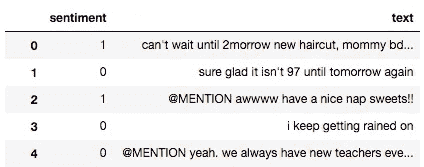

# 如何在 TensorFlow 中使用数据集

> 原文：<https://towardsdatascience.com/how-to-use-dataset-in-tensorflow-c758ef9e4428?source=collection_archive---------0----------------------->


***我在***[***LinkedIn***](https://www.linkedin.com/in/francesco-saverio-zuppichini-94659a150/?originalSubdomain=ch)***，快来打个招呼*** 👋

内置的输入管道。再也不用“feed-dict”了

***16/02/2020:我已经换成 PyTorch*** 😍

*29/05/2019:我会把教程更新到 tf 2.0😎(我正在完成我的硕士论文)*

*2018 年 2 月 6 日更新:添加了第二个完整示例，将 csv 直接读入数据集*

*2018 年 5 月 25 日更新:添加了第二个完整示例，带有一个* ***可重新初始化的迭代器***

*更新至 TensorFlow 1.8*

您应该知道，`feed-dict`是向 TensorFlow 传递信息的最慢方式，必须避免使用。将数据输入模型的正确方法是使用输入管道来确保 GPU 永远不会等待新的东西进来。

幸运的是，TensorFlow 有一个内置的 API，名为 [Dataset](https://www.tensorflow.org/programmers_guide/datasets) ，可以更容易地完成这项任务。在本教程中，我们将了解如何创建输入管道，以及如何高效地将数据输入模型。

本文将解释数据集的基本机制，涵盖最常见的用例。

你可以在这里找到 jupyter 笔记本的所有代码:

[https://github . com/FrancescoSaverioZuppichini/tensor flow-Dataset-Tutorial/blob/master/Dataset _ Tutorial . ipynb](https://github.com/FrancescoSaverioZuppichini/Tensorflow-Dataset-Tutorial/blob/master/dataset_tutorial.ipynb)

# 一般概述

为了使用数据集，我们需要三个步骤:

*   **导入数据**。从一些数据创建数据集实例
*   创建一个迭代器。通过使用创建的数据集来制作迭代器实例来遍历数据集
*   **消费数据**。通过使用创建的迭代器，我们可以从数据集中获取元素，以提供给模型

# 导入数据

我们首先需要一些数据放入我们的数据集

## 来自 numpy

这是常见的情况，我们有一个 numpy 数组，我们想把它传递给 tensorflow。

```
# create a random vector of shape (100,2)
x = np.random.sample((100,2))
# make a dataset from a numpy array
dataset = tf.data.Dataset.from_tensor_slices(x)
```

我们也可以传递不止一个 numpy 数组，一个经典的例子是当我们将一些数据分成特征和标签时

```
features, labels = (np.random.sample((100,2)), np.random.sample((100,1)))
dataset = tf.data.Dataset.from_tensor_slices((features,labels))
```

## 来自张量

当然，我们可以用一些张量初始化我们的数据集

```
# using a tensor
dataset = tf.data.Dataset.from_tensor_slices(tf.random_uniform([100, 2]))
```

## 从占位符

当我们想要动态地改变数据集中的数据时，这是很有用的，我们将在后面看到如何改变。

```
x = tf.placeholder(tf.float32, shape=[None,2])
dataset = tf.data.Dataset.from_tensor_slices(x)
```

## 来自发电机

我们也可以从生成器初始化一个数据集，当我们有一个不同元素长度的数组(例如一个序列)时，这很有用:

```
# from generator
sequence = np.array([[[1]],[[2],[3]],[[3],[4],[5]]])def generator():
    for el in sequence:
        yield eldataset = tf.data.Dataset().batch(1).from_generator(generator,
                                           output_types= tf.int64, 
                                           output_shapes=(tf.TensorShape([None, 1])))iter = dataset.make_initializable_iterator()
el = iter.get_next()with tf.Session() as sess:
    sess.run(iter.initializer)
    print(sess.run(el))
    print(sess.run(el))
    print(sess.run(el))
```

输出:

```
[[1]]
[[2]
 [3]]
[[3]
 [4]
 [5]]
```

在这种情况下，您还需要指定将用于创建正确张量的数据的类型和形状。

## 从 csv 文件

您可以直接将 csv 文件读入数据集。例如，我有一个 csv 文件，里面有推文和他们的情绪。



tweets.csv

我现在可以通过调用`tf.contrib.data.make_csv_dataset`轻松地从它创建一个`Dataset`。请注意，迭代器将创建一个字典，以 key 作为列名，以张量的形式使用正确的行值。

```
# load a csv
CSV_PATH = './tweets.csv'
dataset = tf.contrib.data.make_csv_dataset(CSV_PATH, batch_size=32)
iter = dataset.make_one_shot_iterator()
next = iter.get_next()
print(next) # next is a dict with key=columns names and value=column data
inputs, labels = next['text'], next['sentiment']with  tf.Session() as sess:
    sess.run([inputs, labels])
```

`next`在哪里

```
{'sentiment': <tf.Tensor 'IteratorGetNext_15:0' shape=(?,) dtype=int32>, 'text': <tf.Tensor 'IteratorGetNext_15:1' shape=(?,) dtype=string>}
```

# 创建迭代器

我们已经看到了如何创建数据集，但是如何取回我们的数据呢？我们必须使用一个`Iterator`，这将使我们能够遍历数据集并检索数据的真实值。有四种类型的迭代器。

*   **一针。**它可以遍历一次数据集，你**不能给它**任何值。
*   **可初始化**:可以动态改变调用它的`initializer`操作，用`feed_dict`传递新数据。它基本上是一个可以装满东西的桶。
*   **可重新初始化**:它可以从不同的`Dataset.`初始化，当你有一个训练数据集需要一些额外的变换，例如 shuffle，和一个测试数据集时非常有用。这就像使用塔式起重机来选择不同的容器。
*   **Feedable** : 可以用迭代器选择使用。按照前面的例子，就像一个塔吊选择用哪个塔吊来选择拿哪个集装箱。在我看来是没用的。

## 一次性迭代器

这是最简单的迭代器。使用第一个例子

```
x = np.random.sample((100,2))
# make a dataset from a numpy array
dataset = tf.data.Dataset.from_tensor_slices(x)# create the iterator
iter = dataset.make_one_shot_iterator()
```

然后你需要调用`get_next()`来获取包含你的数据的张量

```
...
# create the iterator
iter = dataset.make_one_shot_iterator()
el = iter.get_next()
```

我们可以运行`el`来查看它的值

```
with tf.Session() as sess:
    print(sess.run(el)) # output: [ 0.42116176  0.40666069]
```

## 可初始化迭代器

如果我们想要构建一个动态数据集，可以在运行时改变数据源，我们可以创建一个带有占位符的数据集。然后我们可以使用通用的`feed-dict`机制初始化占位符。这是通过一个*可初始化的迭代器*完成的。使用上一节中的示例三

```
# using a placeholder
x = tf.placeholder(tf.float32, shape=[None,2])
dataset = tf.data.Dataset.from_tensor_slices(x)data = np.random.sample((100,2))iter = dataset.make_initializable_iterator() # create the iterator
el = iter.get_next()with tf.Session() as sess:
    # feed the placeholder with data
    sess.run(iter.initializer, feed_dict={ x: data }) 
    print(sess.run(el)) # output [ 0.52374458  0.71968478]
```

这次我们叫`make_initializable_iterator`。然后，在`sess`范围内，我们运行`initializer`操作来传递我们的数据，在本例中是一个随机的 numpy 数组。。

想象一下，现在我们有一个训练集和一个测试集，这是一个真实的常见场景:

```
train_data = (np.random.sample((100,2)), np.random.sample((100,1)))
test_data = (np.array([[1,2]]), np.array([[0]]))
```

然后，我们将训练模型，然后在测试数据集上评估它，这可以通过在训练后再次初始化迭代器来完成

```
# initializable iterator to switch between dataset
EPOCHS = 10x, y = tf.placeholder(tf.float32, shape=[None,2]), tf.placeholder(tf.float32, shape=[None,1])
dataset = tf.data.Dataset.from_tensor_slices((x, y))train_data = (np.random.sample((100,2)), np.random.sample((100,1)))
test_data = (np.array([[1,2]]), np.array([[0]]))iter = dataset.make_initializable_iterator()
features, labels = iter.get_next()with tf.Session() as sess:
#     initialise iterator with train data
    sess.run(iter.initializer, feed_dict={ x: train_data[0], y: train_data[1]})
    for _ in range(EPOCHS):
        sess.run([features, labels])
#     switch to test data
    sess.run(iter.initializer, feed_dict={ x: test_data[0], y: test_data[1]})
    print(sess.run([features, labels]))
```

## **可重新初始化的迭代器**

这个概念类似于以前，我们要在数据之间动态切换。但是，我们不是向同一个数据集提供新数据，而是切换数据集。和以前一样，我们希望有一个训练数据集和一个测试数据集

```
# making fake data using numpy
train_data = (np.random.sample((100,2)), np.random.sample((100,1)))
test_data = (np.random.sample((10,2)), np.random.sample((10,1)))
```

我们可以创建两个数据集

```
# create two datasets, one for training and one for test
train_dataset = tf.data.Dataset.from_tensor_slices(train_data)
test_dataset = tf.data.Dataset.from_tensor_slices(test_data)
```

这就是诀窍，我们创建一个泛型迭代器

```
# create a iterator of the correct shape and type
iter = tf.data.Iterator.from_structure(train_dataset.output_types,
                                           train_dataset.output_shapes)
```

然后是两个初始化操作:

```
# create the initialisation operations
train_init_op = iter.make_initializer(train_dataset)
test_init_op = iter.make_initializer(test_dataset)
```

我们像以前一样得到下一个元素

```
features, labels = iter.get_next()
```

现在，我们可以使用我们的会话直接运行两个初始化操作。综上所述，我们得到:

```
# Reinitializable iterator to switch between Datasets
EPOCHS = 10
# making fake data using numpy
train_data = (np.random.sample((100,2)), np.random.sample((100,1)))
test_data = (np.random.sample((10,2)), np.random.sample((10,1)))
# create two datasets, one for training and one for test
train_dataset = tf.data.Dataset.from_tensor_slices(train_data)
test_dataset = tf.data.Dataset.from_tensor_slices(test_data)
# create a iterator of the correct shape and type
iter = tf.data.Iterator.from_structure(train_dataset.output_types,
                                           train_dataset.output_shapes)
features, labels = iter.get_next()
# create the initialisation operations
train_init_op = iter.make_initializer(train_dataset)
test_init_op = iter.make_initializer(test_dataset)with tf.Session() as sess:
    sess.run(train_init_op) # switch to train dataset
    for _ in range(EPOCHS):
        sess.run([features, labels])
    sess.run(test_init_op) # switch to val dataset
    print(sess.run([features, labels]))
```

## 可馈送迭代器

这非常类似于`reinitializable`迭代器，但是它不是在数据集之间切换，而是在迭代器之间切换。在我们创建了两个数据集之后

```
train_dataset = tf.data.Dataset.from_tensor_slices((x,y))
test_dataset = tf.data.Dataset.from_tensor_slices((x,y))
```

一个用于培训，一个用于测试。然后，我们可以创建我们的迭代器，在这种情况下我们使用`initializable`迭代器，但是你也可以使用`one shot`迭代器

```
train_iterator = train_dataset.make_initializable_iterator()
test_iterator = test_dataset.make_initializable_iterator()
```

现在，我们需要定义和`handle`，这将是一个可以动态改变的占位符。

```
handle = tf.placeholder(tf.string, shape=[])
```

然后，与之前类似，我们使用数据集的形状定义一个泛型迭代器

```
iter = tf.data.Iterator.from_string_handle(
    handle, train_dataset.output_types, train_dataset.output_shapes)
```

然后，我们得到下一个元素

```
next_elements = iter.get_next()
```

为了在迭代器之间切换，我们只需调用`next_elemenents`操作，并在 feed_dict 中传递正确的`handle`。例如，要从训练集中获取一个元素:

```
sess.run(next_elements, feed_dict = {handle: train_handle})
```

如果你正在使用`initializable`迭代器，就像我们正在做的那样，记得在开始之前初始化它们

```
sess.run(train_iterator.initializer, feed_dict={ x: train_data[0], y: train_data[1]})
    sess.run(test_iterator.initializer, feed_dict={ x: test_data[0], y: test_data[1]})
```

综上所述，我们得到:

```
# feedable iterator to switch between iterators
EPOCHS = 10
# making fake data using numpy
train_data = (np.random.sample((100,2)), np.random.sample((100,1)))
test_data = (np.random.sample((10,2)), np.random.sample((10,1)))
# create placeholder
x, y = tf.placeholder(tf.float32, shape=[None,2]), tf.placeholder(tf.float32, shape=[None,1])
# create two datasets, one for training and one for test
train_dataset = tf.data.Dataset.from_tensor_slices((x,y))
test_dataset = tf.data.Dataset.from_tensor_slices((x,y))
# create the iterators from the dataset
train_iterator = train_dataset.make_initializable_iterator()
test_iterator = test_dataset.make_initializable_iterator()
# same as in the doc [https://www.tensorflow.org/programmers_guide/datasets#creating_an_iterator](https://www.tensorflow.org/programmers_guide/datasets#creating_an_iterator)
handle = tf.placeholder(tf.string, shape=[])
iter = tf.data.Iterator.from_string_handle(
    handle, train_dataset.output_types, train_dataset.output_shapes)
next_elements = iter.get_next()with tf.Session() as sess:
    train_handle = sess.run(train_iterator.string_handle())
    test_handle = sess.run(test_iterator.string_handle())

    # initialise iterators. 
    sess.run(train_iterator.initializer, feed_dict={ x: train_data[0], y: train_data[1]})
    sess.run(test_iterator.initializer, feed_dict={ x: test_data[0], y: test_data[1]})

    for _ in range(EPOCHS):
        x,y = sess.run(next_elements, feed_dict = {handle: train_handle})
        print(x, y)

    x,y = sess.run(next_elements, feed_dict = {handle: test_handle})
    print(x,y)
```

# 消费数据

在前面的例子中，我们使用了会话来打印数据集中`next`元素的值。

```
...
next_el = iter.get_next()
...
print(sess.run(next_el)) # will output the current element
```

为了将数据传递给模型，我们必须传递从`get_next()`生成的张量

在下面的代码片段中，我们有一个包含两个 numpy 数组的数据集，使用了第一部分中的相同示例。注意，我们需要将`.random.sample`包装在另一个 numpy 数组中，以添加一个维度，我们需要这个维度来批量处理数据

```
# using two numpy arrays
features, labels = (np.array([np.random.sample((100,2))]), 
                    np.array([np.random.sample((100,1))]))dataset = tf.data.Dataset.from_tensor_slices((features,labels)).repeat().batch(BATCH_SIZE)
```

然后像往常一样，我们创建一个迭代器

```
iter = dataset.make_one_shot_iterator()
x, y = iter.get_next()
```

我们制作一个模型，一个简单的神经网络

```
# make a simple model
net = tf.layers.dense(x, 8) # pass the first value from iter.get_next() as input
net = tf.layers.dense(net, 8)
prediction = tf.layers.dense(net, 1)loss = tf.losses.mean_squared_error(prediction, y) # pass the second value from iter.get_net() as label
train_op = tf.train.AdamOptimizer().minimize(loss)
```

我们**直接**使用来自`iter.get_next()`的张量作为第一层的输入，并作为损失函数的标签。包装在一起:

```
EPOCHS = 10
BATCH_SIZE = 16
# using two numpy arrays
features, labels = (np.array([np.random.sample((100,2))]), 
                    np.array([np.random.sample((100,1))]))dataset = tf.data.Dataset.from_tensor_slices((features,labels)).repeat().batch(BATCH_SIZE)iter = dataset.make_one_shot_iterator()
x, y = iter.get_next()# make a simple model
net = tf.layers.dense(x, 8, activation=tf.tanh) # pass the first value from iter.get_next() as input
net = tf.layers.dense(net, 8, activation=tf.tanh)
prediction = tf.layers.dense(net, 1, activation=tf.tanh)loss = tf.losses.mean_squared_error(prediction, y) # pass the second value from iter.get_net() as label
train_op = tf.train.AdamOptimizer().minimize(loss)with tf.Session() as sess:
    sess.run(tf.global_variables_initializer())
    for i in range(EPOCHS):
        _, loss_value = sess.run([train_op, loss])
        print("Iter: {}, Loss: {:.4f}".format(i, loss_value))
```

输出:

```
Iter: 0, Loss: 0.1328 
Iter: 1, Loss: 0.1312 
Iter: 2, Loss: 0.1296 
Iter: 3, Loss: 0.1281 
Iter: 4, Loss: 0.1267 
Iter: 5, Loss: 0.1254 
Iter: 6, Loss: 0.1242 
Iter: 7, Loss: 0.1231 
Iter: 8, Loss: 0.1220 
Iter: 9, Loss: 0.1210
```

# 有用的东西

## 一批

通常批处理数据是一件痛苦的事情，有了`Dataset` API，我们可以使用方法`batch(BATCH_SIZE)`以提供的大小自动批处理数据集。默认值为 1。在下面的例子中，我们使用的批量大小为 4

```
# BATCHING
BATCH_SIZE = 4
x = np.random.sample((100,2))
# make a dataset from a numpy array
dataset = tf.data.Dataset.from_tensor_slices(x).batch(BATCH_SIZE)iter = dataset.make_one_shot_iterator()
el = iter.get_next()with tf.Session() as sess:
    print(sess.run(el)) 
```

输出:

```
[[ 0.65686128  0.99373963]
 [ 0.69690451  0.32446826]
 [ 0.57148422  0.68688242]
 [ 0.20335116  0.82473219]]
```

## 重复

使用`.repeat()`,我们可以指定数据集迭代的次数。如果没有传递参数，它将永远循环下去，通常最好是永远循环下去，用标准循环直接控制历元数。

## 洗牌

我们可以通过使用方法`shuffle()`来打乱数据集，默认情况下，每个时期都会打乱数据集。

*记住:打乱数据集对于避免过度适应非常重要。*

我们还可以设置参数`buffer_size`，一个固定大小的缓冲区，下一个元素将从其中统一选择。示例:

```
# BATCHING
BATCH_SIZE = 4
x = np.array([[1],[2],[3],[4]])
# make a dataset from a numpy array
dataset = tf.data.Dataset.from_tensor_slices(x)
dataset = dataset.shuffle(buffer_size=100)
dataset = dataset.batch(BATCH_SIZE)iter = dataset.make_one_shot_iterator()
el = iter.get_next()with tf.Session() as sess:
    print(sess.run(el))
```

首次运行输出:

```
[[4]
 [2]
 [3]
 [1]]
```

第二轮输出:

```
[[3]
 [1]
 [2]
 [4]]
```

没错。它被洗牌了。如果您愿意，也可以设置`seed`参数。

# 地图

您可以使用`map`方法将自定义函数应用于数据集的每个成员。在下面的例子中，我们将每个元素乘以 2:

```
# MAP
x = np.array([[1],[2],[3],[4]])
# make a dataset from a numpy array
dataset = tf.data.Dataset.from_tensor_slices(x)
dataset = dataset.map(lambda x: x*2)iter = dataset.make_one_shot_iterator()
el = iter.get_next()with tf.Session() as sess:
#     this will run forever
        for _ in range(len(x)):
            print(sess.run(el))
```

输出:

```
[2]
[4]
[6]
[8]
```

# 完整示例

## **可初始化的**迭代器

在下面的例子中，我们使用批处理来训练一个简单的模型，并且我们使用一个**可初始化的迭代器**在训练和测试数据集之间切换

```
# Wrapping all together -> Switch between train and test set using Initializable iterator
EPOCHS = 10
# create a placeholder to dynamically switch between batch sizes
batch_size = tf.placeholder(tf.int64)x, y = tf.placeholder(tf.float32, shape=[None,2]), tf.placeholder(tf.float32, shape=[None,1])
dataset = tf.data.Dataset.from_tensor_slices((x, y)).batch(batch_size).repeat()# using two numpy arrays
train_data = (np.random.sample((100,2)), np.random.sample((100,1)))
test_data = (np.random.sample((20,2)), np.random.sample((20,1)))iter = dataset.make_initializable_iterator()
features, labels = iter.get_next()
# make a simple model
net = tf.layers.dense(features, 8, activation=tf.tanh) # pass the first value from iter.get_next() as input
net = tf.layers.dense(net, 8, activation=tf.tanh)
prediction = tf.layers.dense(net, 1, activation=tf.tanh)loss = tf.losses.mean_squared_error(prediction, labels) # pass the second value from iter.get_net() as label
train_op = tf.train.AdamOptimizer().minimize(loss)with tf.Session() as sess:
    sess.run(tf.global_variables_initializer())
    # initialise iterator with train data
    sess.run(iter.initializer, feed_dict={ x: train_data[0], y: train_data[1], batch_size: BATCH_SIZE})
    print('Training...')
    for i in range(EPOCHS):
        tot_loss = 0
        for _ in range(n_batches):
            _, loss_value = sess.run([train_op, loss])
            tot_loss += loss_value
        print("Iter: {}, Loss: {:.4f}".format(i, tot_loss / n_batches))
    # initialise iterator with test data
    sess.run(iter.initializer, feed_dict={ x: test_data[0], y: test_data[1], batch_size: test_data[0].shape[0]})
    print('Test Loss: {:4f}'.format(sess.run(loss)))
```

**注意，我们使用了一个批量大小的占位符，以便在训练后动态切换它**

输出

```
Training...
Iter: 0, Loss: 0.2977
Iter: 1, Loss: 0.2152
Iter: 2, Loss: 0.1787
Iter: 3, Loss: 0.1597
Iter: 4, Loss: 0.1277
Iter: 5, Loss: 0.1334
Iter: 6, Loss: 0.1000
Iter: 7, Loss: 0.1154
Iter: 8, Loss: 0.0989
Iter: 9, Loss: 0.0948
Test Loss: 0.082150
```

## 可重新初始化的迭代器

在下面的例子中，我们使用批处理训练一个简单的模型，并且我们使用**可重新初始化的迭代器**在训练和测试数据集之间切换

```
# Wrapping all together -> Switch between train and test set using Reinitializable iterator
EPOCHS = 10
# create a placeholder to dynamically switch between batch sizes
batch_size = tf.placeholder(tf.int64)x, y = tf.placeholder(tf.float32, shape=[None,2]), tf.placeholder(tf.float32, shape=[None,1])
train_dataset = tf.data.Dataset.from_tensor_slices((x,y)).batch(batch_size).repeat()
test_dataset = tf.data.Dataset.from_tensor_slices((x,y)).batch(batch_size) # always batch even if you want to one shot it
# using two numpy arrays
train_data = (np.random.sample((100,2)), np.random.sample((100,1)))
test_data = (np.random.sample((20,2)), np.random.sample((20,1)))# create a iterator of the correct shape and type
iter = tf.data.Iterator.from_structure(train_dataset.output_types,
                                           train_dataset.output_shapes)
features, labels = iter.get_next()
# create the initialisation operations
train_init_op = iter.make_initializer(train_dataset)
test_init_op = iter.make_initializer(test_dataset)# make a simple model
net = tf.layers.dense(features, 8, activation=tf.tanh) # pass the first value from iter.get_next() as input
net = tf.layers.dense(net, 8, activation=tf.tanh)
prediction = tf.layers.dense(net, 1, activation=tf.tanh)loss = tf.losses.mean_squared_error(prediction, labels) # pass the second value from iter.get_net() as label
train_op = tf.train.AdamOptimizer().minimize(loss)with tf.Session() as sess:
    sess.run(tf.global_variables_initializer())
    # initialise iterator with train data
    sess.run(train_init_op, feed_dict = {x : train_data[0], y: train_data[1], batch_size: 16})
    print('Training...')
    for i in range(EPOCHS):
        tot_loss = 0
        for _ in range(n_batches):
            _, loss_value = sess.run([train_op, loss])
            tot_loss += loss_value
        print("Iter: {}, Loss: {:.4f}".format(i, tot_loss / n_batches))
    # initialise iterator with test data
    sess.run(test_init_op, feed_dict = {x : test_data[0], y: test_data[1], batch_size:len(test_data[0])})
    print('Test Loss: {:4f}'.format(sess.run(loss)))
```

# 其他资源

张量流数据集教程:[https://www.tensorflow.org/programmers_guide/datasets](https://www.tensorflow.org/programmers_guide/datasets)

数据集文档:

[https://www.tensorflow.org/api_docs/python/tf/data/Dataset](https://www.tensorflow.org/api_docs/python/tf/data/Dataset)

# 结论

`Dataset` API 为我们提供了一种快速而健壮的方式来创建优化的输入管道，以训练、评估和测试我们的模型。在本文中，我们已经看到了可以用它们进行的大多数常见操作。

你可以用我为这篇文章做的笔记本作为参考。

感谢您的阅读，

弗朗西斯科·萨维里奥