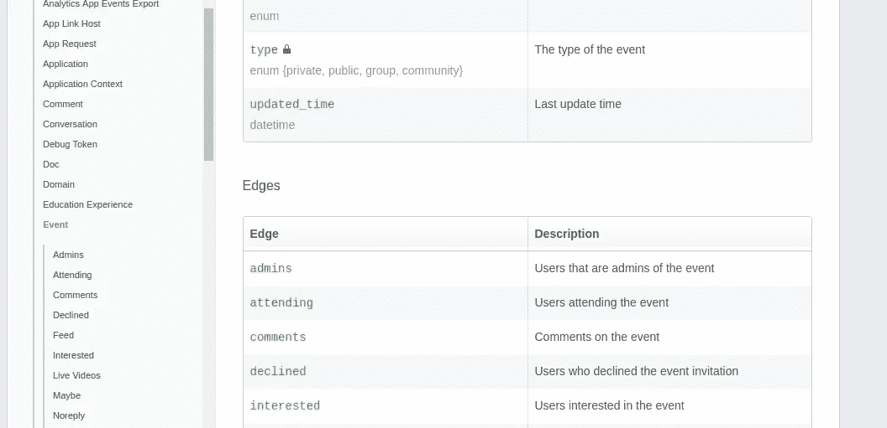
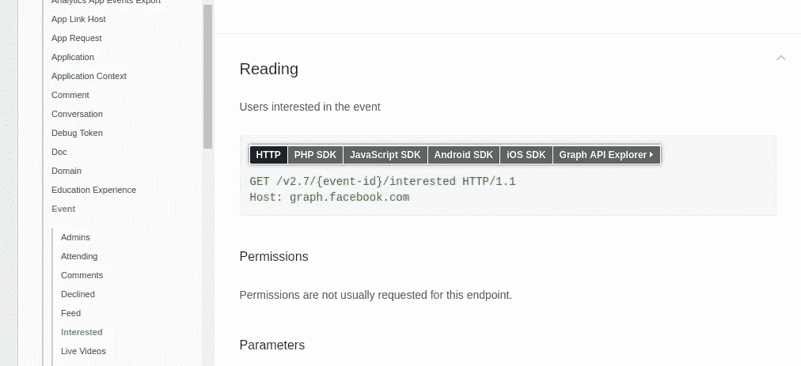
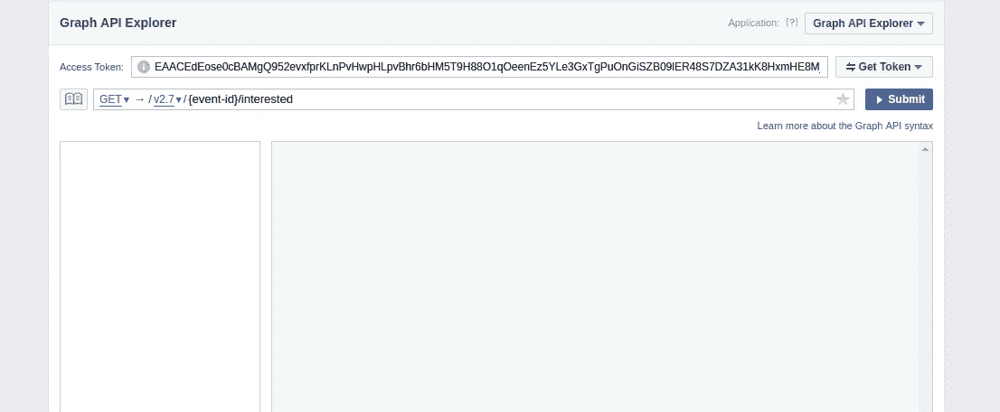
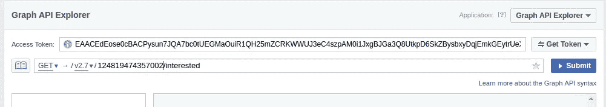
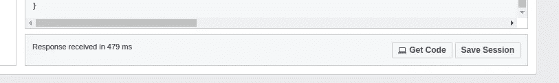

# 如何使用脸书图形 API 和使用 Python 提取数据！

> 原文：<https://towardsdatascience.com/how-to-use-facebook-graph-api-and-extract-data-using-python-1839e19d6999?source=collection_archive---------0----------------------->

大家好，

这是我关于 Medium.com 的第二篇报道。自从第一个故事以来，我已经从挣扎着写代码变成了有点舒服。我写了一个 Python 代码来提取脸书的公开数据。让我们深入研究一下。

**获取接入令牌:**

为了能够使用 python 代码从脸书提取数据，您需要在脸书上注册为开发人员，然后拥有一个访问令牌。下面是它的步骤。

1.  去 developers.facebook.com 链接[，在那里创建一个账户。](http://developers.facebook.com)
2.  转到链接[developers.facebook.com/tools/explorer](https://developers.facebook.com/tools/explorer)。
3.  转到右上角的“我的应用程序”下拉菜单，选择“添加新应用程序”。选择显示名称和类别，然后“创建应用 ID”。
4.  再次回到同一环节[developers.facebook.com/tools/explorer](https://developers.facebook.com/tools/explorer)。您将在右上角的“我的应用程序”下方看到“图形应用程序资源管理器”。从“图形 API 浏览器”下拉列表中，选择您的应用程序。
5.  然后，选择“获取令牌”。从该下拉列表中，选择“获取用户访问令牌”。从出现的菜单中选择“权限”，然后选择“获取访问令牌”
6.  转到链接[developers.facebook.com/tools/accesstoken](https://developers.facebook.com/tools/accesstoken/)。选择“用户令牌”对应的“调试”。转到“扩展令牌访问”。这将确保您的令牌不会每两小时过期一次。

**访问脸书公共数据的 Python 代码:**

如果你想收集任何公开的数据，请点击链接[https://developers.facebook.com/docs/graph-api](https://developers.facebook.com/docs/graph-api)。参见[https://developers . Facebook . com/docs/graph-API/reference/v 2.7/](https://developers.facebook.com/docs/graph-api/reference/v2.7/)。从这个文档中，选择您想要从中提取数据的任何字段，如“组”或“页”等。在选择了这些代码之后，去看看代码的例子，然后选择“facebook graph api ”,你会得到如何提取信息的提示。这个博客主要是关于获取事件数据。

首先，导入' urllib3 '，' facebook '，' requests '，如果它们已经可用的话。如果没有，请下载这些库。定义一个变量令牌，并将其值设置为上面得到的“用户访问令牌”。

```
token= ‘aiufniqaefncqiuhfencioaeusKJBNfljabicnlkjshniuwnscslkjjndfi’
```

**获取事件列表:**

现在，要查找任何搜索词“诗歌”的事件信息，并将这些事件的数量限制为 10000 个:

```
graph = facebook.GraphAPI(access_token=token, version = 2.7)
events = graph.request(‘/search?q=Poetry&type=event&limit=10000’)
```

这将给出一个在脸书上创建的所有事件的字典，并且其名称中有字符串“诗歌”。要获取事件列表，请执行以下操作:

```
eventList = events[‘data’]
```

**从上面提取的事件列表中提取事件的所有信息:**

通过以下方式获取列表中第一个事件的 EventID

```
eventid = eventList[1][‘id’]
```

对于此 EventID，获取所有信息并设置一些变量，这些变量将在以后由以下人员使用:

```
event1 = graph.get_object(id=eventid,
 fields=’attending_count,can_guests_invite,category,cover,declined_count,description,end_time,guest_list_enabled,interested_count,is_canceled,is_page_owned,is_viewer_admin,maybe_count,noreply_count,owner,parent_group,place,ticket_uri,timezone,type,updated_time’)
attenderscount = event1[‘attending_count’]
declinerscount = event1[‘declined_count’]
interestedcount = event1[‘interested_count’]
maybecount = event1[‘maybe_count’]
noreplycount = event1[‘noreply_count’]
```

获取所有参加活动的人的列表，并将响应转换成 json 格式:

```
attenders = requests.get(“[https://graph.facebook.com/v2.7/](https://graph.facebook.com/v2.7/)"+eventid+"/attending?access_token="+token+”&limit=”+str(attenderscount)) attenders_json = attenders.json()
```

获取事件的管理员:

```
admins = requests.get(“[https://graph.facebook.com/v2.7/](https://graph.facebook.com/v2.7/)"+eventid+"/admins?access_token="+token)admins_json = admins.json()
```

同样，如果您愿意，您可以提取其他信息，如该活动的照片/视频/提要。

进入[https://developers . Facebook . com/docs/graph-API/reference/event/](https://developers.facebook.com/docs/graph-api/reference/event/)查看文档中的“Edges”部分。见图片



现在，让我们说，你想有一个对这个事件感兴趣的所有人的名单，点击“感兴趣的”绿色单词在这里。这将打开新的一页:



在此选择“图形 API 浏览器”。这将打开新的一页:



在这里，输入事件的 id 来代替{event-id}，如下所示:



点击提交。此外，在同一页面上，你会发现下面的'获取代码'选项



选择它以查看代码。在出现的弹出窗口中选择“curl ”,然后在 python 代码中获得相同的输出，用 requests.get 编写它，如上面的示例所示。

希望这对那些开始使用 facebook graph API 的人有所帮助。我将很高兴听到你的建议/问题/反馈。

如果你发现这个博客对你有任何价值，如果你对加密货币感兴趣，如果你很慷慨，考虑发送一些涟漪到以下地址:

目的地标签:5973413

钱包地址:rld inlq 5 cjood 9 wdjy 9 zcdgyck 8 kgevkuj

上面的语句中有太多的如果。只有三个都是真的才发送！加密货币 FTW！