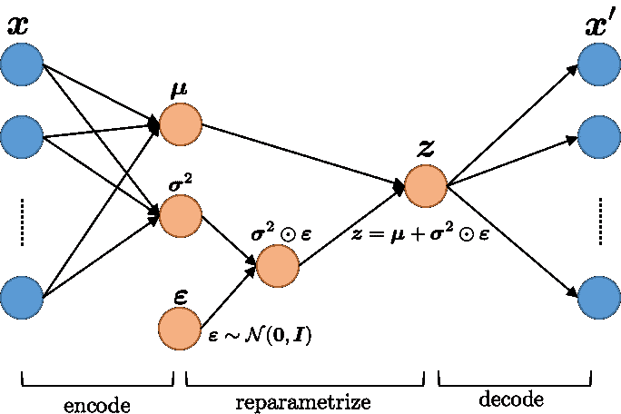
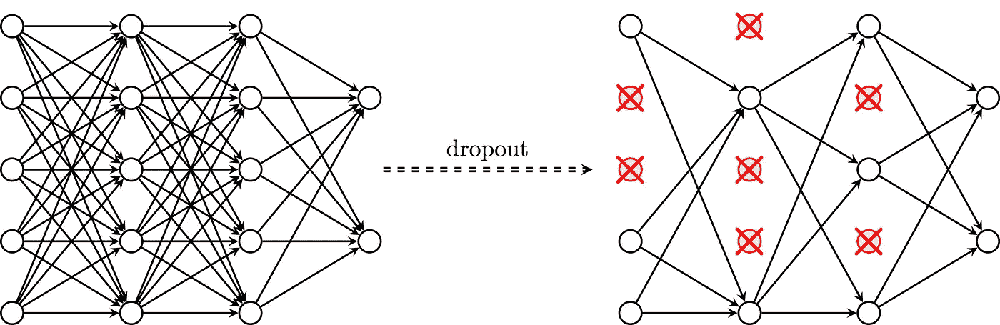
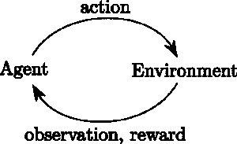
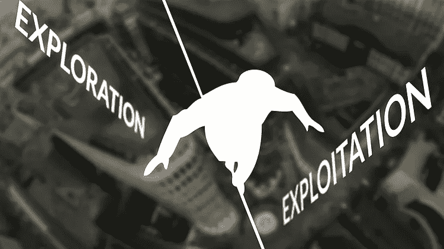
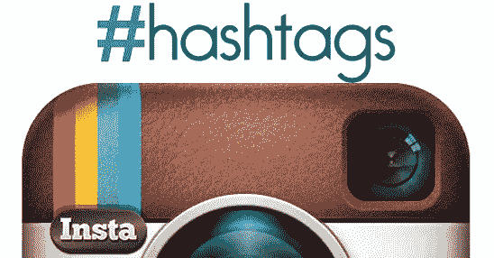
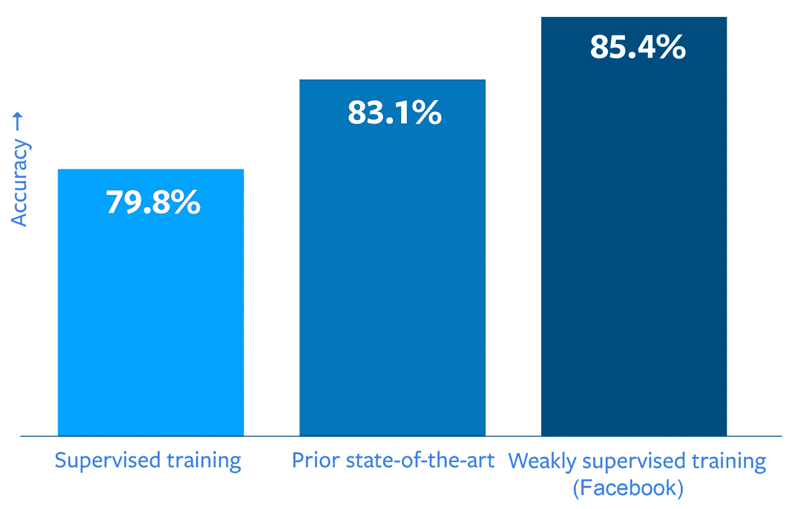

# 如何利用噪音成为你的优势？

> 原文：<https://towardsdatascience.com/how-to-use-noise-to-your-advantage-5301071d9dc3?source=collection_archive---------3----------------------->

Photo by [Jason Rosewell](https://unsplash.com/@jasonrosewell?utm_source=medium&utm_medium=referral) on [Unsplash](https://unsplash.com?utm_source=medium&utm_medium=referral)

> 噪音是工程师的头号敌人。

对科学家来说，随机波动或噪声是不受欢迎的。

虽然通常被认为会降低性能，但它有时可以改善非线性系统中的信息处理。在这篇文章中，我们将看到一些例子，噪音可以被用来作为一种优势。

# 示例 1

## 向神经网络中添加噪声

最近的工作表明，通过在训练深度神经网络时允许一些不准确性，不仅可以提高训练性能，而且可以提高模型的准确性。

神经网络能够学习输出函数，该函数可以随着输入的微小变化而剧烈变化。向输入中随机添加噪声就像告诉网络不要在你的精确输入周围改变输出。

通过限制网络中的信息量，我们迫使它**学习** ***输入特征的紧凑表示*** 。

*   [**变分自动编码器** (VAE)](https://arxiv.org/abs/1312.6114) 给隐藏层添加高斯噪声。

*   [这种技术迫使网络在有限的带宽下学习有用的信息。](http://www.cs.toronto.edu/~rsalakhu/papers/srivastava14a.pdf)

*   [**具有随机深度的深度网络**](https://arxiv.org/abs/1603.09382) :类似于 dropout 的概念，但在每层级别而不是每单元级别。

# 示例 2

## 更好地探索参数噪声

RL 是[机器学习](https://en.wikipedia.org/wiki/Machine_learning)的一个区域，假设有一个 ***代理*** 位于 ***环境*** 中。在每一步，代理采取一个 ***动作*** ，并从环境中接收一个 ***观察*** 和 ***奖励*** 。

给定一个先前未知的环境，RL 算法通过一个通常涉及大量试错的学习过程来寻求最大化代理的总报酬。

为了理解深度 RL 系统探索中的挑战，想想那些在实验室中花费大量时间却没有产生任何实际应用的研究人员。等价地，RL 代理可以花费大量的资源而不收敛到局部最优。

OpenAI 提出了一种称为参数空间噪声的技术，在每集开始时在模型策略参数中引入噪声。

其他方法集中在所谓的动作-空间-噪声上，它们引入噪声来改变与代理从一个时刻到下一个时刻可能采取的每个动作相关联的可能性。

Action-Space-Noise (left) and Parameter-Space-Noise (right)

> “我们发现，向强化学习算法的参数中添加自适应噪声经常会提高性能”——open ai

参数-空间-噪声模型的初步结果证明是很有希望的。这项技术有助于算法更有效地探索它们的环境，从而获得更高的分数和更优雅的行为。更多细节可以在研究论文中找到。

要记住的重要事情是，添加噪声被用作提高强化学习算法的探索性能的优势。

# 示例 3

## 从有噪声的标签中学习(弱监督训练)

提高识别率并不像向这些系统投放更多标签图像那么简单。事实上，手动注释大量图像是一个昂贵且耗时的过程。

脸书的研究人员和工程师通过在大量带有标签的公共图像上训练图像识别网络来解决这个问题。

由于人们经常给他们的照片加上标签，这将是一个很好的模型训练数据来源。

脸书开发了新的方法，专门用于使用标签监督进行图像识别实验。这项研究在[**探索弱监督预培训的限制**](https://research.fb.com/publications/exploring-the-limits-of-weakly-supervised-pretraining/)中有详细描述

在 COCO 对象检测挑战中，已经表明使用 hashtags 进行预训练可以将模型的平均精度提高 2%以上。

> “标签可以帮助计算机视觉系统超越一般的分类术语，以识别图像中的特定子类别和附加元素。”——脸书

# 结论

噪音不应该是我们的敌人！它并不总是一种不必要的干扰，经常可以被用作一种优势，甚至是一种有价值的研究工具。如果有人试图告诉你不同的说法，那么，就给他我们提供的例子…

请继续关注，如果你喜欢这篇文章，请留下👏！

# 参考

[1]弱监督预训练:[https://research . FB . com/publications/exploring-the-limits-of-Weakly-supervised-pre training/](https://research.fb.com/publications/exploring-the-limits-of-weakly-supervised-pretraining/)

[2]带参数噪声的更好探索:[https://blog . open ai . com/Better-Exploration-with-Parameter-Noise/](https://blog.openai.com/better-exploration-with-parameter-noise/)