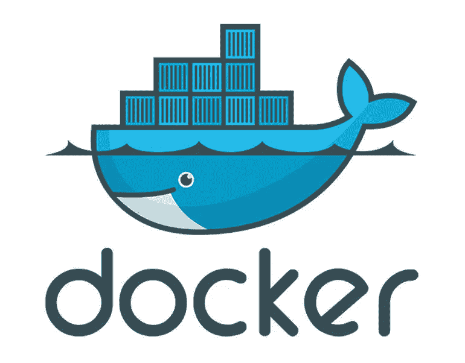

# 如何在你的电脑上使用 PySpark

> 原文：<https://towardsdatascience.com/how-to-use-pyspark-on-your-computer-9c7180075617?source=collection_archive---------2----------------------->

## 我发现对于大多数人来说，在本地机器上开始使用 Apache Spark(这里将重点介绍 PySpark)有点困难。有了这个简单的教程，你会很快到达那里！


[https://www.mytectra.com/apache-spark-and-scala-training.html](https://www.mytectra.com/apache-spark-and-scala-training.html)

我假设您知道 Apache Spark 是什么，PySpark 也是什么，但是如果您有问题，请不要介意问我！哦，你可以在这里查看我不久前做的一个快速介绍。

***$符号将表示在 shell 中运行(但不要复制该符号)。***

# 在 Jupyter 运行 PySpark


1.  安装 Jupyter 笔记本

```
$ pip install jupyter
```

2.安装 PySpark

确保您的计算机上安装了 **Java 8** 或更高版本。当然，你也会需要 Python(我推荐 [Anaconda](https://www.continuum.io/downloads) 的> Python 3.5)。

现在访问 [Spark 下载页面](http://spark.apache.org/downloads.html)。选择最新的 Spark 版本，这是一个针对 Hadoop 的预构建包，并直接下载。

如果你想得到蜂巢的支持或者更多有趣的东西，你必须自己建立你的星火分布-> [建立星火](http://spark.apache.org/docs/latest/building-spark.html)。

将其解压缩并移动到/opt 文件夹中:

```
$ tar -xzf spark-2.3.0-bin-hadoop2.7.tgz
$ mv spark-2.3.0-bin-hadoop2.7 /opt/spark-2.3.0
```

创建一个符号链接(这将让您拥有多个 spark 版本):

```
$ ln -s /opt/spark-2.3.0 /opt/spark̀
```

最后，告诉你的 bash(或 zsh 等。)哪里找火花。为此，通过在~/中添加以下行来配置$PATH 变量。bashrc(或者~/。zshrc)文件:

```
export SPARK_HOME=/opt/spark
export PATH=$SPARK_HOME/bin:$PATH
```

现在要在 Jupyter 中运行 PySpark，您需要更新 PySpark 驱动程序环境变量。就把这几行加到你的~/。bashrc(或者~/。zshrc)文件:

```
export PYSPARK_DRIVER_PYTHON=jupyter
export PYSPARK_DRIVER_PYTHON_OPTS='notebook'
```

重启你的终端并启动 PySpark:

```
$ pyspark
```

现在，这个命令应该在您的 web 浏览器中启动一个 Jupyter 笔记本。点击“新建”>“笔记本 Python[默认]”，创建一个新的笔记本。瞧，您的计算机中有一个 SparkContext 和 SqlContext(或 Spark > 2.x 的 SparkSession ),可以在笔记本中运行 PySpark(运行一些[示例](http://spark.apache.org/examples.html)来测试您的环境)。

# 在您最喜欢的 IDE 上运行 PySpark

有时候你需要一个完整的 IDE 来创建更复杂的代码，PySpark 默认不在 sys.path 上，但这并不意味着它不能作为一个常规库使用。您可以通过在运行时将 PySpark 添加到 sys.path 来解决这个问题。findspark 包[会帮你做到这一点。](https://github.com/minrk/findspark)

要安装 findspark，只需输入:

```
$ pip install findspark
```

然后在您的 IDE 上(我使用 PyCharm)初始化 PySpark，只需调用:

```
import findspark
findspark.init()import pyspark
sc = pyspark.SparkContext(appName="myAppName")
```

仅此而已。很简单，对吧？下面是一个完整的独立应用程序示例，用于在本地测试 PySpark(使用上面解释的 conf):

如果你有什么要补充的，或者只是有问题，请提出来，我会尽力帮助你。

**编辑由于贡献巨大:)——————>>**

# Jupyter 笔记本 Python，Scala，R，Spark，Mesos 栈



Docker 就像一个轻量级的“虚拟机”(Docker 技术上提供的是“映像”和“容器”而不是虚拟机。)，就好像您有一台完整的第二台计算机，它有自己的操作系统和文件，就在您的真实计算机中。您可以从您的真实计算机登录到这台机器，并像通过 ssh 登录到另一台远程计算机一样使用它。

[](https://github.com/jupyter/docker-stacks/tree/master/all-spark-notebook) [## jupyter/docker-stack

### Docker-stacks——Docker 中现成的 Jupyter 应用程序的自以为是的堆栈。

github.com](https://github.com/jupyter/docker-stacks/tree/master/all-spark-notebook) 

只需到那里并按照步骤操作，就可以获得 Spark 的完整“容器化”版本(2.3 和 Hadoop 2.7)

## 基本用途

以下命令启动一个容器，笔记本服务器使用随机生成的身份验证令牌在端口 8888 上侦听 HTTP 连接。

```
$ docker run -it --rm -p 8888:8888 jupyter/pyspark-notebook
```

# Pip 安装


这种打包目前是试验性的，在未来的版本中可能会改变(尽管我们会尽最大努力保持兼容性)。

Spark 的 Python 打包并不打算取代所有其他用例。Spark 的 Python 打包版本适合与现有集群(无论是 Spark standalone、YARN 还是 Mesos)进行交互，但不包含设置您自己的独立 Spark 集群所需的工具。

要安装它，只需运行:

```
$ pip install pyspark
```

最初发布在我的 [LinkedIn](https://www.linkedin.com/pulse/how-use-pyspark-your-computer-favio-v%C3%A1zquez/) 上。

如果您想联系我，请务必在 twitter 上关注我:

[](https://twitter.com/faviovaz) [## 法维奥·巴斯克斯(@法维奥·巴斯克斯)|推特

### Favio Vázquez 的最新推文(@FavioVaz)。数据科学家。物理学家和计算工程师。我有一个…

twitter.com](https://twitter.com/faviovaz) 

资源:

*   [希卡拉](https://blog.sicara.com/get-started-pyspark-jupyter-guide-tutorial-ae2fe84f594)
*   [阿帕奇火花](https://spark.apache.org/)
*   [FindSpark](https://github.com/minrk/findspark)