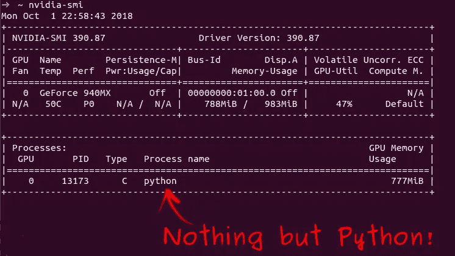
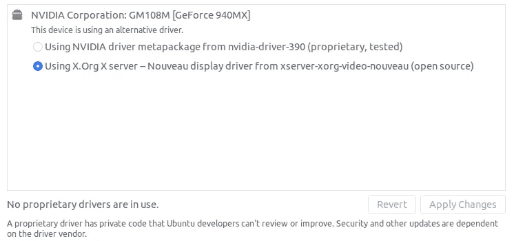
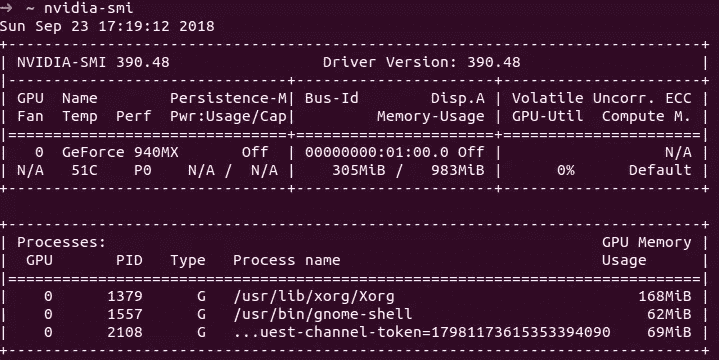
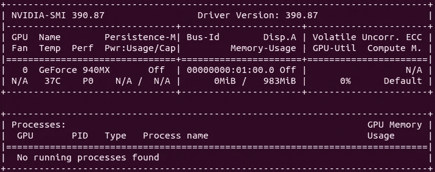
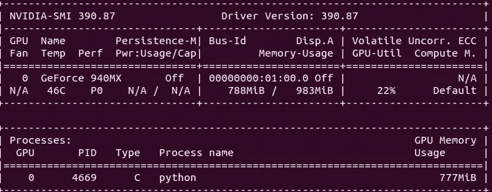

# 如何在 Ubuntu 18.04 上将笔记本电脑 GPU 专用于 TensorFlow？

> 原文：<https://towardsdatascience.com/how-to-use-tensorflow-on-the-gpu-of-your-laptop-with-ubuntu-18-04-554e1d5ea189?source=collection_archive---------7----------------------->

## 使用 Ubuntu 18.04 将笔记本电脑的 100% GPU 内存专用于 TensorFlow 并非如此简单。在这篇文章中，你会找到一个完整的教程，一步一步地去做。



Output of $ nvidia-smi at the end of this post

这篇文章分为三个部分:

1.  检查您的 GPU 是否符合 TensorFlow 标准。
2.  在您的笔记本电脑上安装合适的驱动程序，TensorFlow 和所有必需的依赖项，以便在您的 GPU 上训练模型。
3.  安装自定义驱动程序以确保只有 TensorFlow 可以使用 GPU 内存。

# 检查您的 GPU 是否符合 TensorFlow 标准。

走向你的终端，输入:

这段代码将列出所有的 PCI 设备，并过滤 NVIDIA 设备。
在我的例子中，前面命令的结果是:

```
01:00.0 3D controller: NVIDIA Corporation GM108M [GeForce 940MX] (rev a2)
```

(我的笔记本电脑是小米笔记本 Air 13”配显卡 NVIDIA GeForce 940MX。)

如果什么都没有出现，对不起，但似乎你没有任何 **NVIDIA** GPU，所以你将无法使用 TensorFlow 与它(但它仍然有可能与你的 CPU！).

如果出现一条线，那我们走！

# 在您的笔记本电脑上安装合适的驱动程序，TensorFlow 和所有必需的依赖项，以便在您的 GPU 上训练模型。

## 安装 NVIDIA 专有驱动程序。

配备 NVIDIA 显卡的现代笔记本电脑通常配备 Optimus 技术。Optimus 技术意味着你的笔记本电脑实际上有 2 个图形芯片:第一个位于主板上，靠近 CPU。第二个在你的 NVIDIA 卡上。默认情况下，在 Ubuntu 18.04 上，不使用 NVIDIA 卡。你必须安装特定的驱动程序才能使用它。

要安装它们，非常简单:

*   转到您的**软件&更新**应用程序
*   点击标签**附加驱动**
*   <wait a="" little="" bit=""></wait>

在我的笔记本电脑上，我有:



我们可以看到没有使用 NVIDIA 二进制驱动。要修复它:

*   点击使用 **NVIDIA 二进制驱动**，然后点击**应用更改**
*   <wait a="" little="" bit=""></wait>
*   完成后，重新启动计算机

重新启动计算机后，打开终端写下:

在我的计算机上，我得到了以下结果:



显示 **NVIDIA** 显卡正在使用中。

## CUDA 9.0 工具包安装

TensorFlow 需要 CUDA 9.0 才能使用你的 GPU。让我们安装它。
你应该**不要**安装其他版本的 CUDA，因为 TensorFlow 不会接受。

*   进入 [CUDA 工具包 9.0 下载页面](https://developer.nvidia.com/cuda-90-download-archive)
*   点击 **Linux** ，然后点击你的架构(可能是 **x86_64** ，然后点击 **Ubuntu** ，然后点击 **17.04** (因为用于 Ubuntu 18.04 的 CUDA 9.0 不可用，但我们会做需要做的事情来让它工作)，然后点击然后点击 **runfile (local)** ，然后点击**下载 **(不要选择除 **runfile(本地)**之外的其他**安装程序类型**，否则我们安装 CUDA 会有一些麻烦)。****
*   在控制台中，运行:

不要忘记“ **—覆盖**”选项，否则安装程序会抱怨它与 GCC 7.3(Ubuntu 18.04 提供的 GCC 版本)不兼容。
“**—覆盖**”选项将强制安装程序使用可用的 GCC 版本，这很好。

*   阅读 EULA(如果你想的话)，然后按下“ **q** ，然后写下“**接受**”。
*   关于问题*“您正试图在不支持的配置上安装。您希望继续吗？”*回答**是** *。*
*   关于“*为 Linux-x86_64 384.81 安装 NVIDIA 加速图形驱动？”*回答**否**(非常重要！).
*   关于*的问题“安装 CUDA 9.0 工具包？”*回答**是** *。*
*   在问题*“输入工具箱位置”*上点击**进入**。
*   关于问题*“您希望使用‘sudo’运行安装吗？”*回答**是**然后输入你的密码。
*   关于问题*“要不要在/usr/local/cuda 安装一个符号链接？”*回答**是** *。*
*   关于问题*“安装 CUDA 9.0 样品？”*回答**没有** *。*
*   安装完成后，在文件 **~/中添加以下两行。bashrc** (或者 to **~/。zshrc** 如果使用 **ZSH**

恭喜你！你刚刚在 **Ubuntu 18.04** 上安装了 **CUDA 9.0** ！

## NVIDIA cuDNN 安装。

TensorFlow 还需要 NVIDIA cuDNN 来使用你的 GPU。让我们安装它。

*   继续 [NVIDIA cuDNN 页面](https://developer.nvidia.com/cudnn)。
*   点击**下载 cuDNN** 。
*   如果您还没有帐户，请创建一个帐户(这是免费的)。
*   点击与 **CUDA 9.0** 兼容的最新 **cuDNN** 版本。
*   点击链接 **cuDNN … for Linux** 。
*   提取下载的文件。
*   从提取的下载文件中，将 **cuda/include** 的内容复制(可能需要 root 权限)到 **/usr/local/cuda/include** 。
*   从提取的下载文件中，复制 **cuda/lib64** 到 **/usr/local/cuda/lib64** 的所有 **libcudnn.so*** 文件(可能需要 root 权限)。
    (无需复制**)。一个"**文件)

恭喜你！你刚刚在 **Ubuntu 18.04** 上安装了 **NVIDIA cuDNN** ！

## TensorFlow 和 TensorFlow GPU 安装。

*   如果 **pip** 尚未安装，用以下工具安装:

*   安装 TensorFlow 和 TensorFlow GPU

如果只安装 **TensorFlow** ， **TensorFlow** 会使用 CPU。
**TensorFlow** 安装 **TensorFlow GPU** 后才会使用 GPU。

恭喜你！你刚刚在 **Ubuntu 18.04** 上安装了 **TensorFlow** 和 **TensorFlow GPU** ！

让我们训练一个 MNIST 模特吧！

*   在一个全新的控制台中，下载以下文件。它包含一个简单的全连接(带有一个隐藏层)网络来识别手写数字。

该脚本将训练 5 个时期(这意味着训练集的每个示例将在训练期间被算法看到 5 次)。

出于某种原因，安装完所有这些东西后，第一次培训的第一个时期相当长(在我的电脑上只有 5 分钟)。也许有一些编译，因为在这段时间里，我的一个 CPU 被完全使用。
训练时间比其他所有训练都更“平常”。

在另一个控制台中，您可以编写:

它会每秒刷新一次 **nvidia-smi** 的输出。当 Python 脚本运行时，您应该在底部看到一行带有**进程名:Python** 的内容，并为其分配了一定数量的内存。此外， **Volatile GPU-Util** 应该显示一个工作的 GPU。

恭喜你！你刚刚在装有 **Ubuntu 18.04** 的笔记本电脑上，用 **TensorFlow** 和你的 GPU 训练了你的第一个模型！

不幸的是，正如 **$ nvidia-smi** 的输出所示，你的 GPU 的大量内存被用于其他事情，而不是训练你的模型。

# 安装自定义驱动程序以确保只有 TensorFlow 可以使用 GPU 内存。

在这一部分，我们将看到如何将你的 GPU 内存 100%奉献给 **TensorFlow** 。基本上我们会用 **NVIDIA** 芯片做 **TensorFlow** ，其余(包括图形显示)用 **Intel** 芯片。

## 下载 NVIDIA 驱动程序安装运行文件。

*   进入 [NVIDIA 驱动程序安装页面](https://www.nvidia.com/Download/index.aspx)
*   选择您的显卡(如果您想查看 Linux，请不要忘记点击**“显示所有操作系统”**)。
*   下载文件。

**安装自定义 NVIDIA 驱动程序。**

暂时，我们需要关闭 **X 服务器**，这意味着你将无法访问 Ubuntu 的窗口界面(因此也无法访问这篇文章……)。

因此，请打印、写下或在其他设备上打开这篇文章，比如你的手机。

您还需要您的登录名，因此如果您不知道它，只需在控制台中写入:

*   要关闭 **X 服务器**，在控制台中写入:

*   重启。
*   输入您的登录名和密码。
*   进入您下载驱动程序的文件夹，然后写下:

这个命令行将安装驱动程序而不处理 X 服务器(所以这个驱动程序不会用于图形显示目的)。

*   关于问题*“发行版提供的预装脚本失败！您确定要继续吗？”*回答**继续安装** *。*
*   关于问题*“警告:不会安装 nvidia-drm 模块。因此，DRM-MMS 将无法与此 NVIDIA 驱动程序安装一起使用。*
*   关于问题*“你想向 DKMS 注册内核模块源代码吗？这将所有 DKMS 自动建立一个新的模块，il fou 安装一个不同的内核后？”*回答**是** *。*
*   关于*的问题【安装 NVIDIA 的 32 位兼容库】*回答**否** *。*

现在应该开始安装驱动程序了。

如果过了一会儿(比如说 5 分钟)，安装程序卡在
*构建模块上。(这可能需要一段时间)*
然后只需按几次**回车**。如果多次按下 **Enter** 没有任何作用，只需打开一个新的终端(例如使用 **Ctrl + Alt +F3** )并从行*“输入您的登录名和密码”*重新执行协议。现在应该可以了。

现在，我们必须告诉 NVIDIA 配置工具打开英特尔图形卡，然后我们必须告诉 NVIDIA 配置工具打开 NVIDIA 图形卡，然后我们必须重新启动。不清楚为什么我们应该这样做，但是如果我们不这样做，我们可能会在下次重新启动时卡在*“启动的登录服务”*上。然后我们必须重新打开 **X 服务器**。

这最后四个步骤总结如下:

重启后，

现在应该显示:



正如我们所见，没有进程使用 NVIDIA GPU。

现在，如果我们重新运行 **MNIST** python 文件(这一次，第一个纪元可能需要几分钟)，同样的 **NVIDIA SMI** 命令应该显示:



我们到了！只有 TensorFlow 使用 GPU 内存！

python 脚本完成后，应再次显示消息*“未找到正在运行的进程”*。

还有一件事:如果你不小心忘记了步骤
*“sudo prime-select Intel/NVIDIA”* ，如果在重启过程中你陷入了奇怪的状态*“Started log in Service”*，那么只需等待 5 分钟以获得登录/密码命令/提示，然后再写一次。

机器学习快乐！