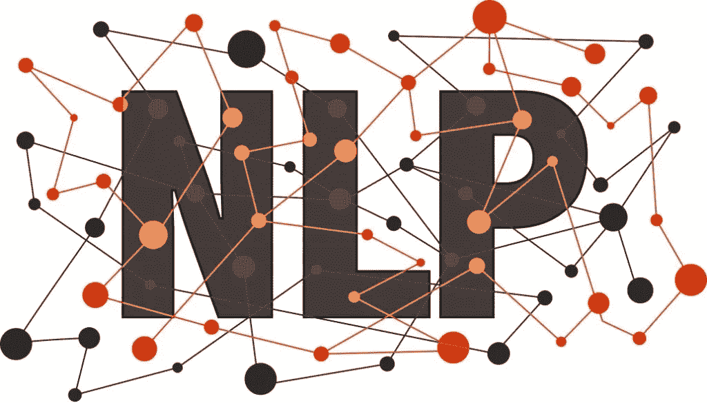
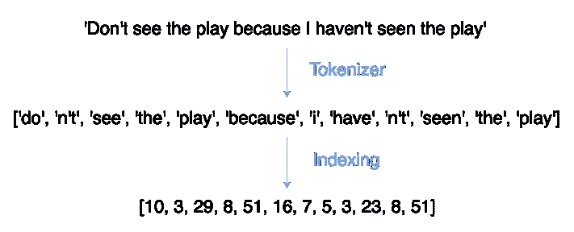
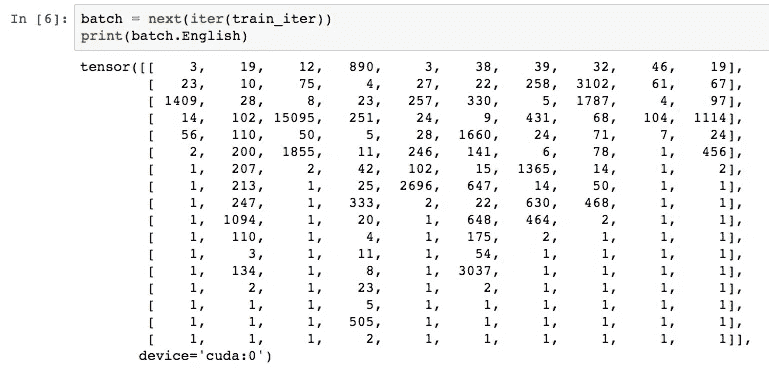

# 如何使用 TorchText 进行神经机器翻译，加上 hack 使其速度提高 5 倍

> 原文：<https://towardsdatascience.com/how-to-use-torchtext-for-neural-machine-translation-plus-hack-to-make-it-5x-faster-77f3884d95?source=collection_archive---------8----------------------->



处理文本是 NLP 中任何成功项目的第一步，幸运的是，帮助我们的工具正在变得越来越复杂。

对于我的第一个深度学习项目，我构建了一个高功能的英法翻译器，如果没有 TorchText 库，我不可能做到这一点。好吧，也许这是一个有点戏剧性的说法…我至少会被大大减慢。

TorchText 非常方便，因为它允许您快速标记和打包(这些是单词吗？)你的数据。原本需要你自己的功能和大量思考的东西现在只需要几行代码，然后，你就可以构建你的人工智能了，它将接管这个世界(或者只是翻译一种语言什么的，我不知道你在计划什么)。

然而，它也不是没有缺点，在这篇文章中，我们还将探讨它最大的低效率以及如何快速规避它。

因此，现在让我们通过浏览我在越来越多的互联网上找到的一些英语-法语数据来探索如何使用 TorchText。

# 所有翻译数据的始祖

这是我用来训练我的翻译的数据集。

虽然法语和英语之间有许多小型并行数据集，但我想创建一个尽可能强大的翻译器，于是我选择了 big kah una:the European Parliament Proceedings Parallel Corpus 1996–2011(可从这里下载)。


15 years of EU proceedings makes an enthralling read for our seq2seq model!

这个坏男孩包含了 15 年来来自欧盟程序的评论，总计 2007724 个句子，50265039 个单词。

解压缩可下载文件将产生两个文本文件，可以通过以下方式加载:

```
europarl_en = open('{YOUR_PATH}/europarl-v7.fr-en.en', encoding='utf-8').read().split('\n')
europarl_fr = open('{YOUR_PATH}/europarl-v7.fr-en.fr', encoding='utf-8').read().split('\n')
```

这给我们留下了两个 python 句子列表，其中每个句子都是另一个句子的翻译。

# 使用分词器快速处理文本

我们需要做的第一件事是为每种语言创建一个标记器。这是一个将文本分割成独立单词并给它们分配唯一数字(索引)的功能。当我们讨论嵌入时，这个数字将会发挥作用。



Sentences turned into tokens, which are then given individual indexes

下面的代码展示了如何同时使用 Torchtext 和 Spacy 来标记文本。Spacy 是一个专门构建的库，用于获取各种语言的句子，并将它们拆分成不同的标记(更多信息，请参见[此处](https://spacy.io/))。没有 Spacy，Torchtext 默认为一个简单的*。*拆分(“”)的方法进行标记化。这比 Spacy 的方法要少得多，Spacy 的方法也将像“不”这样的词分成“做”和“不”，等等。

```
import spacy
import torchtext
from torchtext.data import Field, BucketIterator, TabularDataseten = spacy.load('en')
fr = spacy.load('fr')def tokenize_en(sentence):
    return [tok.text for tok in en.tokenizer(sentence)]def tokenize_fr(sentence):
    return [tok.text for tok in fr.tokenizer(sentence)]EN_TEXT = Field(tokenize=tokenize_en)FR_TEXT = Field(tokenize=tokenize_fr, init_token = "<sos>", eos_token = "<eos>")
```

在短短几行代码中，我们创建了两个 field 对象，稍后它们将能够处理/标记我们的文本。

# 使用 Torchtext TabularDataset 构建迭代器

也许与直觉相反，使用 Torchtext 的最佳方式是将数据转换成电子表格格式，不管数据文件的原始格式是什么。

这要归功于 Torchtext TabularDataset 函数令人难以置信的多功能性，它可以从电子表格格式创建数据集。

因此，首先要将我们的数据转换成一个合适的 CSV 文件，我们使用了一点熊猫的魔法:

```
import pandas as pdraw_data = {'English' : [line for line in europarl_en], 'French': [line for line in europarl_fr]}df = pd.DataFrame(raw_data, columns=["English", "French"])# remove very long sentences and sentences where translations are 
# not of roughly equal lengthdf['eng_len'] = df['English'].str.count(' ')
df['fr_len'] = df['French'].str.count(' ')
df = df.query('fr_len < 80 & eng_len < 80')
df = df.query('fr_len < eng_len * 1.5 & fr_len * 1.5 > eng_len')
```

我们现在必须创建一个验证集。这一步很关键！例如，seq2seq 上的[这个 pytorch 教程](https://pytorch.org/tutorials/intermediate/seq2seq_translation_tutorial.html)没有做到这一点，在我自己构建它并使用验证集后，我发现它过度拟合了。

幸运的是，Sklearn 和 Torchtext 一起让这个过程变得异常简单:

```
from sklearn.model_selection import train_test_split# create train and validation set 
train, val = train_test_split(df, test_size=0.1)train.to_csv("train.csv", index=False)
val.to_csv("val.csv", index=False)
```

这将创建一个 train 和 validation csv，每个 csv 都有两列(英语、法语)，其中每行在“英语”列中包含一个英语句子，在“法语”列中包含其法语翻译。

调用 magic TabularDataset.splits 然后返回一个训练和验证数据集，其中加载了相应的数据，并根据我们前面定义的字段进行了处理(/标记化)。

```
# associate the text in the 'English' column with the EN_TEXT field, # and 'French' with FR_TEXT
data_fields = [('English', EN_TEXT), ('French', FR_TEXT)]train,val = data.TabularDataset.splits(path='./', train='train.csv', validation='val.csv', format='csv', fields=data_fields)
```

处理几百万字可能需要一段时间，所以在这里喝杯茶吧…

一旦最终完成，我们可以索引所有的令牌:

```
FR_TEXT.build_vocab(train, val)
EN_TEXT.build_vocab(train, val)
```

要查看每个字段中的令牌被分配了哪些数字，反之亦然，我们可以使用 self.vocab.stoi 和 self.vocab.itos…这在以后会很方便。

```
example input: print(EN_TEXT.vocab.stoi['the'])
example_output: 11example input: print(EN_TEXT.vocab.itos[11])
example_output: 'the'
```

只需多一行代码，我们就有了一个迭代器…

```
train_iter = BucketIterator(train, batch_size=20, \
sort_key=lambda x: len(x.French), shuffle=True)
```

让我们来看一个批次的例子，这样我们就可以看到我们到底用所有这些 Torchtext 魔法做了什么…



在每一批中，句子已经被转置，所以它们是垂直下降的(**重要:**我们将需要再次转置这些句子以使用转换器)。每个索引代表一个单词，每个列代表一个句子。我们有 10 列，因为 10 是我们指定的 batch_size。

你可能会注意到所有的“1 ”,并想这是哪个极其常见的单词的索引？这个“1”当然不是一个词，而是纯粹的填充。事实上，它太多了(这是我们将在下一节中解决的问题)。

```
..., sort_key = lambda x: len(x.French), ...
```

最后，这个排序关键字位决定了如何形成每一批。lambda 函数告诉迭代器尝试查找相同长度的句子(这意味着矩阵中更多的是有用的数据，更少的是填充)。

用这么少的几行代码完成了这么多的工作…我们已经将数据处理成了标记，并得到了一个迭代器，它返回匹配的、成批的法语和英语句子，所有的句子都是填充的，等等。

# 黑客入侵 TorchText 使其效率大大提高

```
# code from [http://nlp.seas.harvard.edu/2018/04/03/attention.html](http://nlp.seas.harvard.edu/2018/04/03/attention.html) 
# read text after for description of what it doesglobal max_src_in_batch, max_tgt_in_batchdef batch_size_fn(new, count, sofar):
    "Keep augmenting batch and calculate total number of tokens + padding."
    global max_src_in_batch, max_tgt_in_batch
    if count == 1:
        max_src_in_batch = 0
        max_tgt_in_batch = 0
    max_src_in_batch = max(max_src_in_batch,  len(new.English))
    max_tgt_in_batch = max(max_tgt_in_batch,  len(new.French) + 2)
    src_elements = count * max_src_in_batch
    tgt_elements = count * max_tgt_in_batch
    return max(src_elements, tgt_elements)class MyIterator(data.Iterator):
    def create_batches(self):
        if self.train:
            def pool(d, random_shuffler):
                for p in data.batch(d, self.batch_size * 100):
                    p_batch = data.batch(
                        sorted(p, key=self.sort_key),
                        self.batch_size, self.batch_size_fn)
                    for b in random_shuffler(list(p_batch)):
                        yield b
            self.batches = pool(self.data(), self.random_shuffler)

        else:
            self.batches = []
            for b in data.batch(self.data(), self.batch_size,
                                          self.batch_size_fn):
                self.batches.append(sorted(b, key=self.sort_key))
```

虽然 Torchtext 很出色，但它基于 sort_key 的批处理还有一些不足之处。通常，句子的长度根本不一样，你最终会向你的网络中输入大量的填充(正如你在最后一个数字的[中看到的所有 1)。](#8a90)

此外，如果您的 RAM 每次迭代可以处理 1500 个令牌，并且您的 batch_size 是 20，那么只有当您的批处理长度为 75 时，您才会利用所有的内存。一个有效的批处理机制将根据序列长度改变批处理大小，以确保每次迭代处理大约 1500 个令牌。

这是通过上面在 Torchtext 上运行的补丁批处理代码实现的。我们现在可以创建一个更有效的迭代器，如下所示:

```
train_iter = MyIterator(trn, batch_size=1300, device=0,
                        repeat=False, sort_key= lambda x:
                        (len(x.English), len(x.French)),
                        batch_size_fn=batch_size_fn, train=True,
                        shuffle=True)
```

# 准备出发！

现在你有了它，一个迭代器，可以部署在任何神经机器翻译模型上。看我的 github [这里](https://github.com/SamLynnEvans/Transformer)，我在我的[变形金刚模型](https://arxiv.org/abs/1706.03762)的实现中使用了这个代码，你可以在你自己的数据集上尝试这个最先进的 NMT 模型。