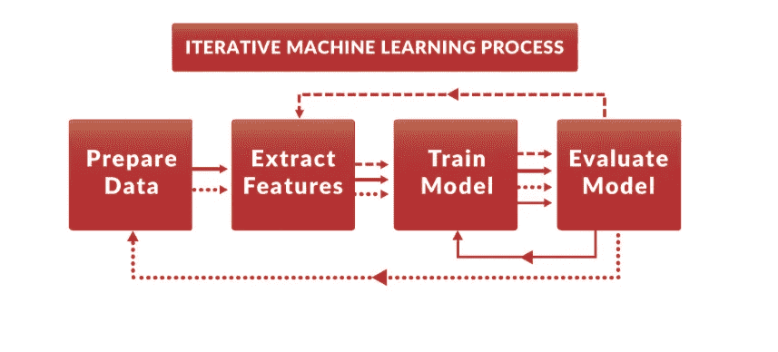
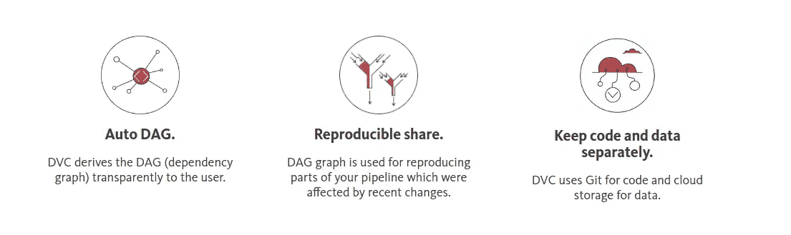
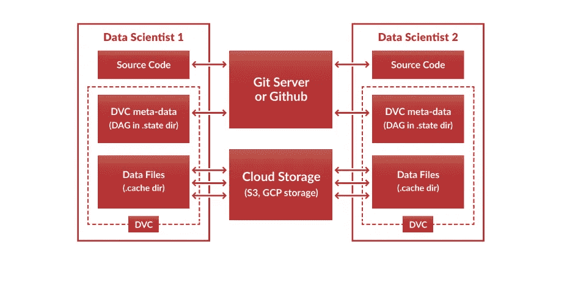

# 如何对机器学习任务进行版本控制— I

> 原文：<https://towardsdatascience.com/how-to-version-control-your-machine-learning-task-cad74dce44c4?source=collection_archive---------0----------------------->


# 什么是版本控制？

[软件配置管理](https://en.wikipedia.org/wiki/Software_configuration_management)、**版本控制**的一个组成部分，也称为**版本控制**或**源代码控制**、[【1】](https://en.wikipedia.org/wiki/Version_control#cite_note-Mercurial-1)是对文档、[计算机程序](https://en.wikipedia.org/wiki/Computer_program)、大型网站以及其他信息集合的变更管理。变更通常由数字或字母代码标识，称为“修订号”、“修订级别”，或简称为“修订”。例如，一组初始文件是“修订版 1”。当进行第一次更改时，结果集是“修订版 2”，依此类推。每个修订都与一个[时间戳](https://en.wikipedia.org/wiki/Timestamp)和做出更改的人相关联。可以比较、恢复修订，还可以合并某些类型的文件。

# 为什么要版本控制？

一个重要的问题:**为什么我们需要版本控制？**我在我的本地计算机/云上做任务，一旦模型准备好，并且只有当我完成测试时，我才在我的服务器上部署它。那么为什么我需要版本控制呢？

现在让我们看一个场景:我在一家像 [**Botsupply**](http://botsupply.co/) 这样的公司工作，我有客户。我是人工智能的家伙。我使用基于 TF-IDF 的模型进行了问答搜索。我把它部署在我的服务器上。在下一阶段，我对它做了一些更改，在我的虚拟数据上，我的准确性增加了。我把它部署在服务器上了。现在，由于测试数据的复杂性，性能下降了。现在我想回到之前的版本。

一种方法是**再次部署之前的版本**。第二，或者说**更好的解决方案是版本控制**并恢复到以前的版本。



[Source](https://dataversioncontrol.com/)

# 如何做版本控制？

1.  版本控制最流行的方式之一是 [**Git**](https://git-scm.com/) 。非常受欢迎，基本上每个人都知道如何使用它。(至少是每个程序员和数据科学家)。
    现在，Git 真的很酷，但对于一个数据科学家来说，保持 Git 中所有文件夹的同步是一项艰巨的任务。模型检查点和数据大小占用了所有不必要的空间。因此，一种方法是将所有数据集存储在像亚马逊 S3 这样的云服务器中，并将所有可复制的代码存储在 Git 中，并动态生成模型。看起来是一个不错的选择，但是如果在相同的代码中使用多个数据集，将会造成混乱，如果没有正确地记录，从长远来看，可能会导致数据集的混合。
    此外，如果数据变更/升级，并且所有的提交没有被正确地记录，模型可能会丢失上下文。

> 没有上下文的结果比毒药更致命— [乔瓦尼·托奇](https://medium.com/u/5a927ef41003?source=post_page-----cad74dce44c4--------------------------------)，[僵尸供应](http://botsupply.co/)

如果文件不能动态复制，可以选择 [**git-annex**](http://git-annex.branchable.com) 。

 [## git-附件

### git-annex 允许用 git 管理文件，而不需要将文件内容签入 git。虽然这看起来有些矛盾…

git-annex.branchable.com](https://git-annex.branchable.com/) 

2.第二个选择是在**沙盒环境**中做所有事情，看看结果，如果不好，就不要将更改提交到生产环境中。 [Ipython 笔记本(Jupyter Notebook)](https://jupyter.org/) 就是这么做的好方法。代码可以在不同的单元中分成更小的片段，然后在每一步都可以看到结果，这使得 Ipython 成为机器学习的最佳编辑器之一。

[](https://jupyter.org/) [## Jupyter 项目

### Jupyter 笔记本是一个基于网络的交互式计算平台。该笔记本结合了现场代码，方程式…

jupyter.org](https://jupyter.org/) 

3.最好的选择(在我看来)是 [**数据版本控制或者**【DVC】](https://dataversioncontrol.com/)。DVC 在许多方面与 Git 相似(如命令结构)，但它也提供对步骤的跟踪、步骤之间的依赖关系、代码和数据文件之间的依赖关系以及所有代码运行参数，因此它结合了对代码和数据库的版本控制。

[](https://dataversioncontrol.com/) [## 数据版本控制——让您的数据科学项目具有可复制性和可共享性。

### 阅读有关 dataversioncontrol 的更多信息。数据科学项目 Git。

dataversioncontrol.com](https://dataversioncontrol.com/) 

> 在现实生活中，很难一次性开发出一个好的机器学习模型。ML 建模是一个迭代过程，跟踪您的步骤、步骤之间的依赖关系、代码和数据文件之间的依赖关系以及所有代码运行参数非常重要。DVC，德米特里·彼得罗夫

# 什么是 DVC 和使用它的 5 个好理由？

DVC 通过自动构建数据依赖图(DAG)使数据科学项目具有可重复性。你的代码和依赖项可以很容易地被 Git 和数据共享——通过云存储(AWS S3，GCP)在一个单一的 DVC 环境中。



[Source](https://dataversioncontrol.com/)

1.  它是完全**开源的**，可以用 pip 的简单命令安装:

```
**pip install dvc** #pip3 for python3
```

2.**命令类似于 git** :

```
**dvc run python train_model.py data/train_matrix.p data/model.p**
```

3.它是独立于语言的，机器学习过程可以很容易地转换成任何语言的可重复的 DVC 流水线。

4.DVC 不仅可以将你的工作简化到一个单一的、可复制的环境中，它还可以通过 Git 共享这个环境，包括依赖关系(DAG)——这是一个令人兴奋的协作功能，它提供了在不同的计算机上复制研究结果的能力。

5.数据文件可以由任何云文件共享服务共享，如 AWS S3 或 GCP 存储，因为 DVC 不会将数据文件推送到 Git 存储库。



[source](https://dataversioncontrol.com/)

要详细了解 DVC 的安装和使用，请查看下面的博文:

[](https://blog.dataversioncontrol.com/data-version-control-beta-release-iterative-machine-learning-a7faf7c8be67) [## 数据版本控制测试版:迭代机器学习

### 在现实生活中，很难一次性开发出一个好的机器学习模型。ML 建模是一种…

blog.dataversioncontrol.com](https://blog.dataversioncontrol.com/data-version-control-beta-release-iterative-machine-learning-a7faf7c8be67) 

> 阅读 [**第二部分**](https://medium.com/@shridhar743/how-to-version-control-your-machine-learning-task-ii-d37da60ef570) 以了解 **DVC** 如何在与**numeri**合作时帮助我进行版本控制，在那里，数据科学家使用机器学习来做出预测，为 numeri 的对冲基金提供动力。

[](https://medium.com/@shridhar743/how-to-version-control-your-machine-learning-task-ii-d37da60ef570) [## 如何对您的机器学习任务进行版本控制— II

### 这篇文章是上一篇文章的延续:如何对你的机器学习进行版本控制- I。如果你还没有…

medium.com](https://medium.com/@shridhar743/how-to-version-control-your-machine-learning-task-ii-d37da60ef570)