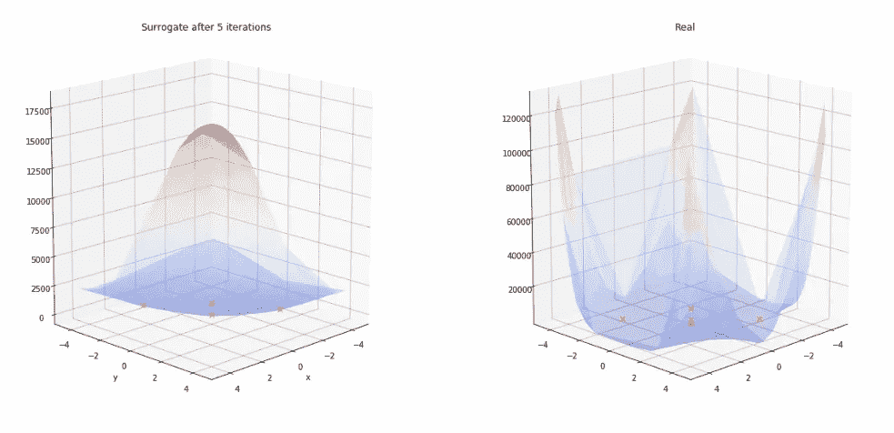
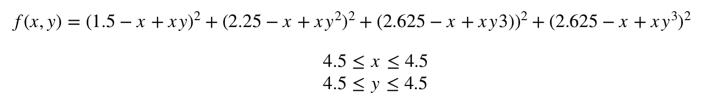
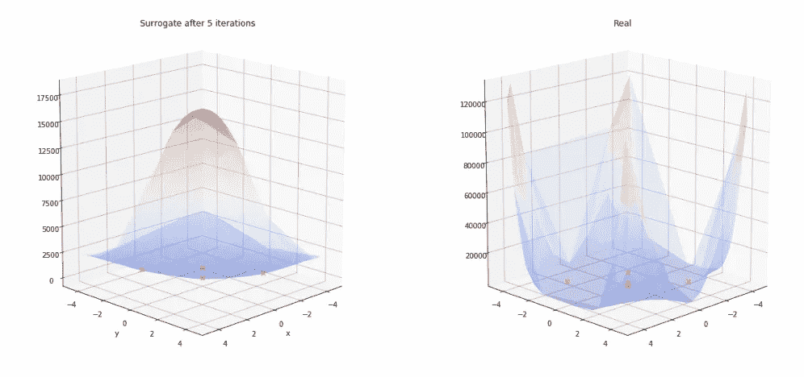
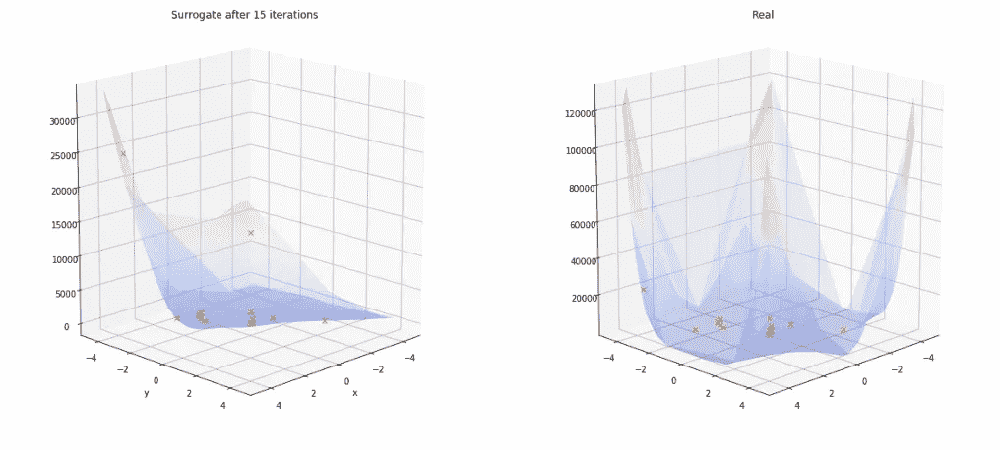
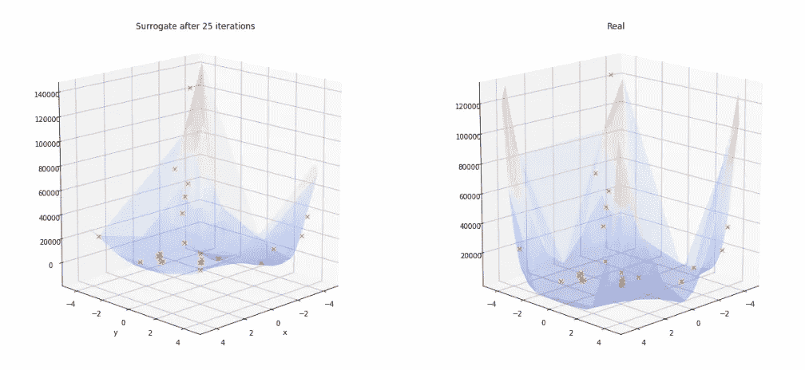
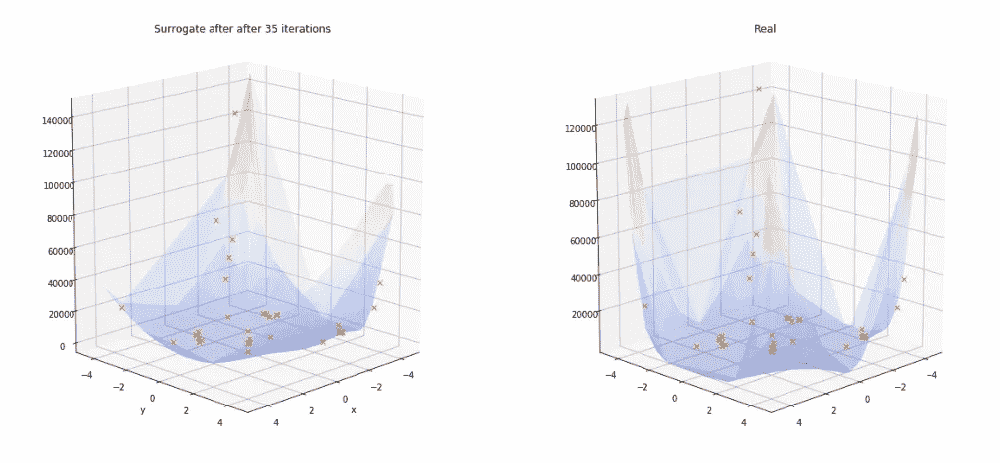
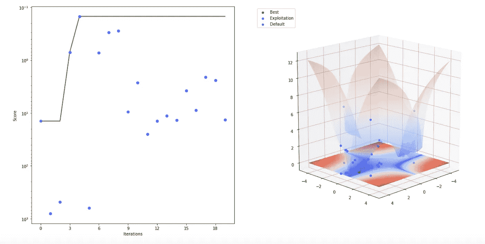
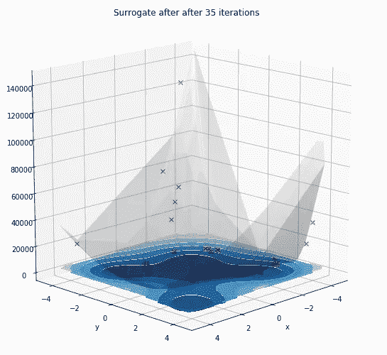

# 如何用高斯过程可视化黑盒优化问题

> 原文：<https://towardsdatascience.com/how-to-visualise-black-box-optimization-problems-with-gaussian-processes-a6128f99b09d?source=collection_archive---------11----------------------->



**更新**:我开了一家科技[公司](http://www.legislate.tech)。你可以在这里找到更多

缺乏框优化在机器学习中很常见，因为我们试图优化的过程或模型往往没有可以解析求解的代数模型。此外，在目标函数评估昂贵的某些使用情况下，一般方法包括创建目标函数的更简单的替代模型，该替代模型评估起来更便宜，并且将用于解决优化问题。在以前的一篇文章中，我解释了其中一种方法，贝叶斯优化，它使用高斯过程来逼近目标函数。这篇文章是一个 Python 教程，展示了如何使用贝叶斯优化 API[opta as](https://mindfoundry.ai/optaas)评估和可视化高斯过程代理。

[](/the-intuitions-behind-bayesian-optimization-with-gaussian-processes-7e00fcc898a0) [## 高斯过程贝叶斯优化背后的直觉

### 在某些应用中，目标函数是昂贵的或难以评估的。在这些情况下，一般…

towardsdatascience.com](/the-intuitions-behind-bayesian-optimization-with-gaussian-processes-7e00fcc898a0) 

在本教程中，我们将使用 OPTaaS 来查找由以下公式定义的 Beale 函数的全局最小值:



## 装置

OPTaaS 在 [PyPi](https://pypi.org/project/mindfoundry-optaas-client/) 上，可以直接 pip 安装:

```
!pip install mindfoundry-optaas-client%matplotlib inline
from matplotlib import pyplot as plt
import numpy as npfrom mindfoundry.optaas.client.client import OPTaaSClient, Goal
from mindfoundry.optaas.client.parameter import FloatParameter
```

## 连接到 OPTaaS

为了连接到 OPTaaS，您需要一个 API 密钥。你可以在这里得到一个。

```
client = OPTaaSClient(OPTaaS_URL, OPTaaS_API_key)
```

## 创建任务

要开始优化过程，我们需要定义参数并创建一个任务。

```
parameters = [
    FloatParameter(name='x', minimum=-4.5, maximum=4.5),
    FloatParameter(name='y', minimum=-4.5, maximum=4.5),
]initial_configurations = 5task = client.create_task(
    title='Beale Optimization', 
    parameters=parameters, 
    goal=Goal.min,
    initial_configurations=initial_configurations,

)configurations = task.generate_configurations(initial_configurations)
```

然后，我们需要生成一些初始均匀采样配置(5)来加权高斯过程代理模型。

出于本教程的目的，我们将把优化过程分解成几个步骤，但是在一个典型的场景中，我们将简单地运行总迭代次数的任务。

## 运行任务 5 次迭代

```
number_of_iterations = 5for i in range(number_of_iterations): 
    configuration = configurations[i]
    x = configuration.values['x']
    y = configuration.values['y']
    score = beale_function(x, y) 
    next_configuration = task.record_result(configuration=configuration, score=score)
    configurations.append(next_configuration)
```

既然我们已经用初始配置对代理模型进行了加权，我们将检索它的值来可视化它。

## 检索代理

我们将从 OPTaaS 生成的代理模型中请求预测。高斯过程替代模型的预测以它们的均值和方差为特征。

```
random_configs_values = [{'x': np.random.uniform(-4.5, 4.5), 
                          'y': np.random.uniform(-4.5, 4.5)
                          } for _ in range(1000)]predictions = task.get_surrogate_predictions(random_configs_values)mean = [p.mean for p in predictions]
var = [p.variance for p in predictions]
```

我们现在将检索对最初 5 种配置的 Beale 函数的评估:

```
predictions = task.get_surrogate_predictions(random_configs_values)surrogate_X = [[c['x'], c['y']] for c in random_configs_values]
surrogate_X=np.array(surrogate_X)results = task.get_results(include_configurations=True)evaluations_config_values = [r.configuration.values for r in results]
evaluations_score = [r.score for r in results]
```

## 绘制代理

我们现在将重新格式化这些值以绘制它们:

```
xs = [results[i].configuration.values['x'] for i in range(len(results)) ]
ys = [results[i].configuration.values['y'] for i in range(len(results)) ]
zs=evaluations_scorebeale=np.zeros(len(surrogate_X[:,1]))for i in range(len(surrogate_X[:,1])):
    beale[i]=beale_function(surrogate_X[i,0], surrogate_X[i,1])
```

最后，我们将绘制代理函数与实函数的曲线图，并将曲线图与 OPTaaS 所做的函数求值叠加。

```
plt.clf()
fig = plt.figure(figsize=(20, 10))
ax3d = fig.add_subplot(1, 2, 1, projection='3d')
ax3d.view_init(15, 45)surface_plot = ax3d.plot_trisurf(surrogate_X[:,0], surrogate_X[:,1], np.array(mean), cmap=plt.get_cmap('coolwarm'), zorder=2, label='Surrogate')
surface_plot.set_alpha(0.28)plt.title('Surrogate after 5 iterations')
ax3d.plot(xs, ys,zs, 'x', label='evaluations')plt.xlabel('x')
plt.ylabel('y')ax3d = fig.add_subplot(1, 2, 2, projection='3d')
ax3d.view_init(15, 45)surface_plot_real = ax3d.plot_trisurf(surrogate_X[:,0], surrogate_X[:,1], true, cmap=plt.get_cmap('coolwarm'), zorder=2, label='real')
surface_plot_real.set_alpha(0.28)plt.title('Real')
ax3d.plot(xs, ys,zs, 'x', label='evaluations')display(plt.gcf())plt.close('all')
```

哪些输出:



正如我们所看到的，代理在 5 次迭代后看起来不太像真正的函数，但我们希望随着评估次数的增加，随着它对底层函数的了解增加，这种情况会有所改变。

## 代理人的进化

随着迭代次数的增加，代理很快适应了 Beale 函数的更真实的表示。这些图是用与上面相同的代码生成的。



从不同的角度来看，相同的过程显示了 OPTaaS 性能的演变，并突出了接近最优值的推荐的集中程度:



## 绘制方差的等值线图

我们也可以尝试用等值线图来显示替代变量的变化。蓝色阴影越深，表示相关预测的不确定性越低。



## OPTaaS

如果您有任何问题或想了解更多关于 OPTaaS 的信息，您可以查看以下链接:

教程:[https://tutorial . opta as . mind foundry . ai](https://tutorial.optaas.mindfoundry.ai)

API 文档:[https://opta as . mind foundry . ai](https://optaas.mindfoundry.ai)

**研**[http://www . robots . ox . AC . uk/~ mosb/projects/project/2009/01/01/bayesopt/](http://www.robots.ox.ac.uk/~mosb/projects/project/2009/01/01/bayesopt/)

如果你仍然好奇，请随时给我发邮件了解更多信息和 API 密钥:**Charles . bre cque @ mind foundry . ai**