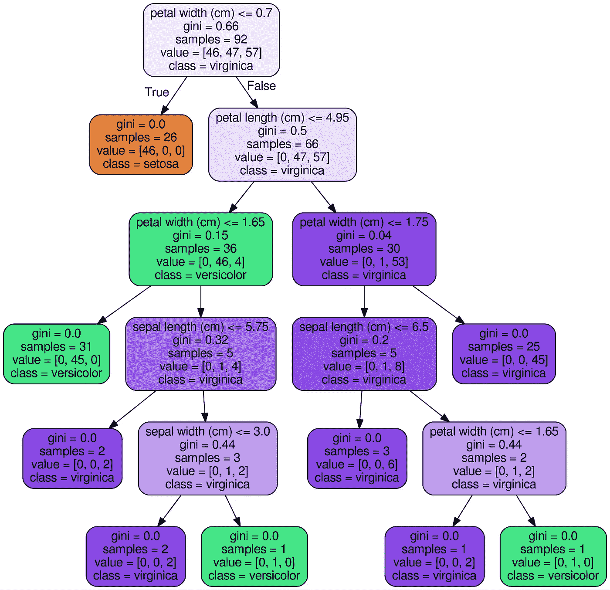
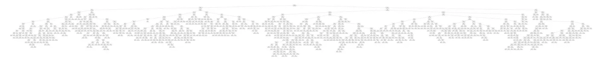

# 如何使用 Scikit-Learn 在 Python 中可视化随机森林中的决策树

> 原文：<https://towardsdatascience.com/how-to-visualize-a-decision-tree-from-a-random-forest-in-python-using-scikit-learn-38ad2d75f21c?source=collection_archive---------1----------------------->


## 有助于理解您的模型的实用程序

[下面是完整的代码](https://gist.github.com/WillKoehrsen/ff77f5f308362819805a3defd9495ffd):只需复制并粘贴到 Jupyter 笔记本或 Python 脚本中，用您的数据替换并运行:

Code to visualize a decision tree and save as png ([on GitHub here](https://gist.github.com/WillKoehrsen/ff77f5f308362819805a3defd9495ffd)).

最终结果是一个完整的决策树图像。



Decision Tree for Iris Dataset

# 代码解释

1.  **创建一个模型训练并提取:**我们可以使用一个单独的决策树，但是因为我经常使用[随机森林](http://scikit-learn.org/stable/modules/generated/sklearn.ensemble.RandomForestClassifier.html)来建模，所以在这个例子中使用了它。(树与树之间会略有不同！).

```
from sklearn.ensemble import RandomForestClassifier
model = RandomForestClassifier(n_estimators=10)*# Train*
model.fit(iris.data, iris.target)
*# Extract single tree*
estimator = model.estimators_[5]
```

**2。将树导出为。点文件:**这利用了 Scikit-Learn 中的`export_graphviz`函数。这里有许多参数控制显示的外观和信息。查看文档了解具体信息。

```
from sklearn.tree import export_graphviz# Export as dot file
export_graphviz(estimator_limited, 
                out_file='tree.dot', 
                feature_names = iris.feature_names,
                class_names = iris.target_names,
                rounded = True, proportion = False, 
                precision = 2, filled = True)
```

**3。使用系统命令** : [将 `**dot**` **转换为** `**png**` **在 Python 中运行系统命令**](https://stackoverflow.com/questions/89228/calling-an-external-command-in-python)可以方便地执行简单的任务。这需要安装包含点工具的 [graphviz。有关转换的完整选项，请查看文档](https://graphviz.gitlab.io/download/)。

```
# Convert to png
from subprocess import call
call(['dot', '-Tpng', 'tree.dot', '-o', 'tree.png', '-Gdpi=600'])
```

**4。可视化:最好的可视化出现在 Jupyter 笔记本中。(相当于你可以用`matplotlib`来显示图像)。**

```
# Display in jupyter notebook
from IPython.display import Image
Image(filename = 'tree.png')
```

## 考虑

有了随机森林，每棵树都将被不同地建造。我使用这些图像来展示决策树(以及随后的随机森林)背后的推理，而不是具体的细节。

当您拥有大量要素时，限制树的最大深度会很有帮助。否则，你最终会得到巨大的树，看起来令人印象深刻，但根本无法解读！这是一个包含 50 个特性的完整示例。



Full decision tree from a real problem ([see here](https://www.kaggle.com/willkoehrsen/a-complete-introduction-and-walkthrough)).

# 结论

机器学习仍然受到黑箱问题的困扰，一张图片并不能解决问题！尽管如此，观察单个决策树向我们展示了这种模型(和随机森林)并不是一种无法解释的方法，而是一系列逻辑问题和答案——就像我们在进行预测时形成的一样。请随意为您的数据使用和修改这些代码。

和往常一样，我欢迎反馈、建设性的批评以及倾听您的数据科学项目。可以在推特上找到我 [@koehrsen_will](http://twitter.com/@koehrsen_will)