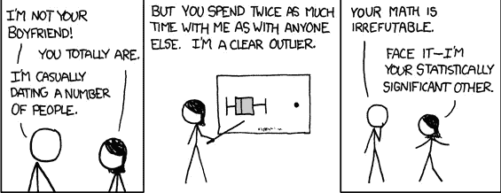
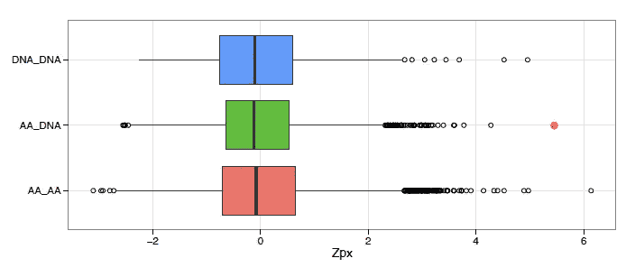
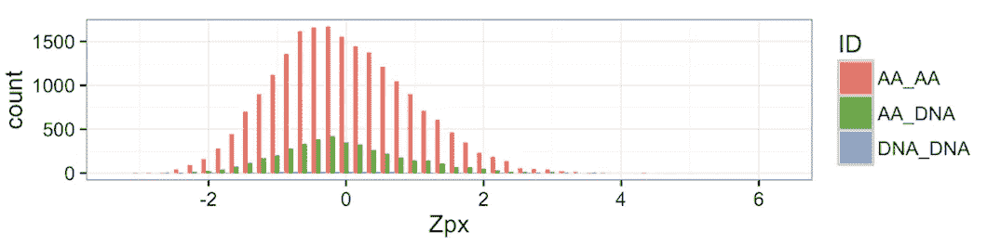
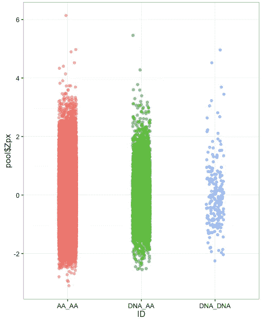
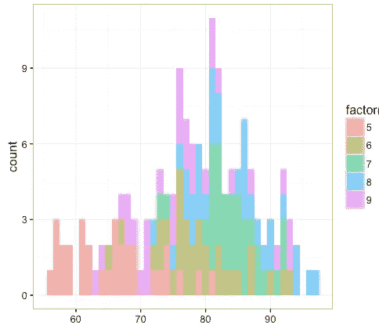
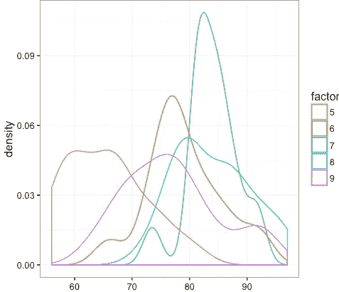
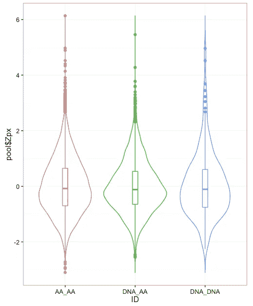

# 如何可视化分布

> 原文：<https://towardsdatascience.com/how-to-visualize-distributions-2cf2243c7b8e?source=collection_archive---------1----------------------->

Source: [https://xkcd.com/539/](https://xkcd.com/539/)

您已经将所有必要的数据整理成一种清晰的格式，您已经恰当地执行了一个时髦的统计分析，现在是分析结果的时候了。这就是可视化数据派上用场的地方。信息丰富的数据可视化不仅揭示了新颖的见解，也许你正在和某人约会，但你并不知道，但当你要向老板/客户传达你的发现时，它们真的是非常宝贵的。

这篇文章将专门研究我一次又一次面临的可视化任务。在分析数据的这些年里，我经常发现自己想要比较和对比数字数据的多种分布。这可能很棘手，取决于分布的不同程度，以及分布的大量可能的表示方法([http://www . darkhorsanalytics . com/blog/visualizing-distributions-3](http://www.darkhorseanalytics.com/blog/visualizing-distributions-3))。当比较分布时，我通常有两个目标，或者我想突出它们异常值的差异，或者，通常是它们各自分布的细微差异。也许我想展示用不同标准收集的数据集如何对统计程序做出不同的反应，或者应用统计校正如何改进评分函数。

如果我对比较异常值感兴趣，我倾向于箱线图。箱线图显示数据的总体分布，同时绘制异常值的数据点。这一物理点使得它们的特定值很容易在样品中识别和比较。

让我们忽略数据的实际意义，因为这并不重要。您可以看到分布的分布或多或少是相等的，异常值很容易比较。红色/洋红色分布具有最极端的异常值，后面是我从绿色分布中着色为红色的点。对于这个分析，红色分布已经预先计算过了，我能够通过观察极端异常值来重现他们的数据。然而，红点是一个新奇的观察。

如果你是一个关注绘图轴并了解一些统计数据的人，那么你可能已经意识到我对我的数据集应用了一个统计变换，以便放大分布异常值中的差异。我将我的数字分布转换成一个 [z 值](http://www.statisticshowto.com/probability-and-statistics/z-score/)。z 得分通过测量数据点偏离样本均值的标准偏差数来转换数据点。

我通常为分布图做的第一个可视化是直方图。你可以在这里看到这是一个可怕的和无信息的方式来看待数据。使用这种方法，不同组之间样本大小的差异使得它们不可比较。它是如此的极端，以至于你再也看不到蓝色的分布。这种可视化在比较甚至看到异常值方面也是失败的。从这个图像中我唯一能得出的结论是红色和绿色的分布有大致相同的意思。

虽然我认为箱线图是这种情况下的最佳选择，但它们看起来非常正式，人们通常不知道如何正确地解释它们(四分位数范围，分布，说什么？).此外，箱线图无法洞察用于创建它们的样本大小。对于不太在意统计的观众来说，带状图更直观，因为他们可以看到所有的数据点。该图还显示了分布的样本量。我喜欢在点上应用抖动和不透明度，让这些图更吸引人。

让我们跳到第二种情况，我们感兴趣的是比较分布的分布。在这里，如果被比较的分布具有相同的样本大小，并且您最多进行 3 次比较，直方图是一个很好的选择。否则，你会得到一个非常繁忙的图，很难看到数据。

在这些情况下，我倾向于没有填充的内核密度图。它不是很漂亮，但是你可以看到和比较分布。在最近的一个项目中，为了克服这一点，我决定在直方图上实现一个旋转，并使用一种叫做阶梯图的变体，效果很好。如果你的图变得笨拙，我建议改变你表示数据的方式。

但是如果你想要全部呢？！在这种情况下，我喜欢使用小提琴情节。我看到这些情节变得越来越受欢迎，还有许多变化，使他们更加强大。它们本质上是箱线图，周围有一个旋转的核密度图。在这里，我绘制了旋转内核密度图内的箱线图。

这就是我现在能给你的。我使用 r 中的 ggplot2 包制作了上面所有的图。我还使用 matplotlib 和 seaborne 在 python 中制作了相当多的图。案例 2 中使用的数据集是使用 R 附带的 airquality 数据集完成的，另一个数据集是我自己为我的硕士论文构建的。

代码可以在这个[库](https://github.com/mlafore3/visualizing_distributions/tree/master)中找到。如果你愿意，请随意添加图表，如果你认为有更好的方法来分析分布，请在评论中告诉我！

Pixabay.com