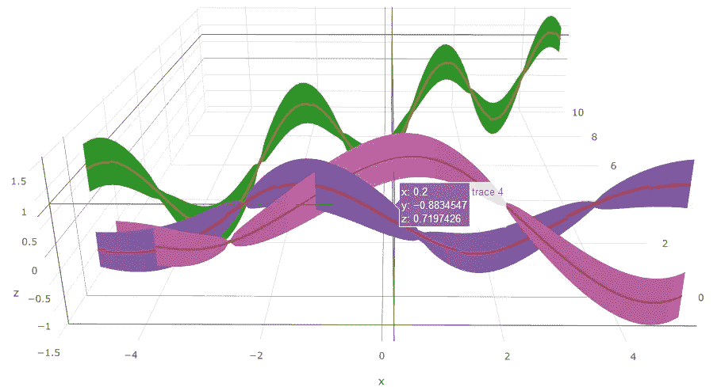
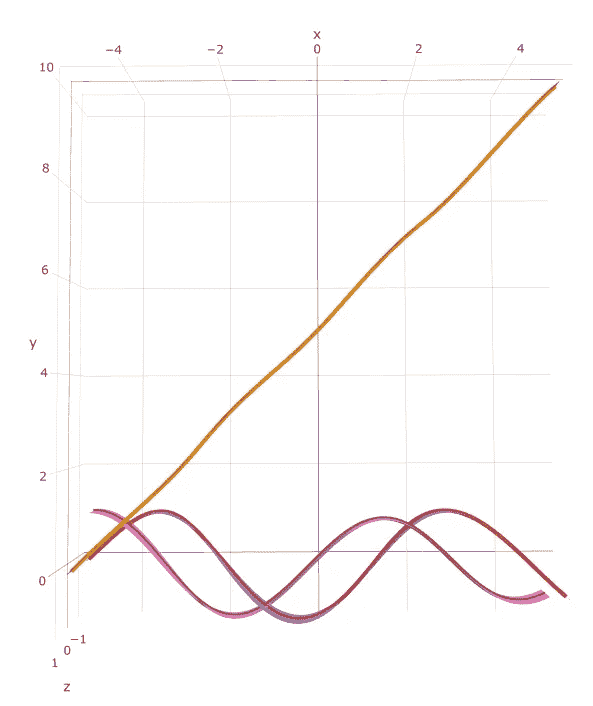

# 如何使用 Plotly R 可视化多元轨迹置信区间

> 原文：<https://towardsdatascience.com/how-to-visualize-multivariate-trajectory-confidence-intervals-using-plotly-r-da345d084bd6?source=collection_archive---------4----------------------->



Simulated datasets — 3D lines with confidence bands drawn with Plotly R

统计学或机器学习中的任何概率回归方法都会产生一个折线图以及相关的置信区间，通常定义为平均值周围的两个标准差。尽管 Plotly 拥有许多强大的图表工具，可用于绘制二维或三维图表，并可为 2D 折线图绘制误差线或置信区间，但它没有在三维折线图或曲面图中绘制置信区间的选项。

## **多元挑战**

许多有趣的概率回归任务本质上是多元的；例如，跨位置坐标 x 预测时间 t 上的数据值 z。该预测的结果将是表示时间 t 上每个点 x 处的预期值 z 的 3D 表面，以及每个值点处的相关误差的估计。这种类型的表面图在表面拓扑探测中很常见，其中传感器网格在目标空间内的每个网格点捕获数据。在 Plotly 中，该网格将被很好地可视化为跨所有 x，y 坐标的数据值的 3D 表面图，但是 Plotly 不呈现跨该表面的置信边界。

## **轨迹**


通常问题的领域局限于通过目标空间的轨迹，而不是整个领域的完整探索。例如，想象一个火箭轨道，在飞行的每个纬度和经度上都标有发动机温度的测量值。温度数据是在相对于位置的每个点捕获的，但是位置数据是整个子午线空间的子集，仅沿着火箭的轨迹测量。这在建模和可视化时，以图形方式显示为一条穿过温度、高度和经度的 3D 空间中的轨迹的温度线，而不是表面。Plotly 允许我们画出这条轨迹，但它不允许我们轻易地在这条线上画出上下置信区间。我们可以重构计算，以显示温度与高度的关系，如 2D 图，但这样我们会失去空间分辨率，例如，将无法区分火箭向外飞行的方向与向内、向地球飞行的轨迹，在不同的时间穿越相同的高度，这将给我们的回归分析带来问题。

## 如何绘制三维置信区间


显示的图表是模拟数据的渲染图，代表样本数据在 x，y 平面上的三个轨迹，z 显示每个点的数据值，带显示置信上限和置信下限。直接沿 z 轴向下看，可以看到置信带位于 z 平面内，因为误差是相对于数据值显示的，而观察到的 x 和 y 观察点被假设为是已知的，没有误差。这是回归分析中通常采用的方法，通常假设我们可以精确地获得测量坐标。



Projection down z axis

用于创建这些图的 R 代码使用 Plotly **mesh3D** 图表类型来构建向上和向下指向的交错三角形的表面，这些三角形链接在一起以在数据值的平面中形成连续的表面。

所描述的方法是完全通用的，并且可以用于创建任何形式的表面，例如在 3D 绘图表面上构造上下边界表面。使用这种方法的唯一限制是表面重叠的复杂性，当在平面图像中渲染时，会使眼睛感到困惑，而不是作为情节动态可视化。

## r 代码

```
*#R code for 3D confidence error intervals*
install.packages("plotly")
library(plotly)

*# Generate Simulated Data Points*
x <- seq(-5,5, .1)
y <- seq(0, 10, .1)
y <- cbind(y, sin(y), cos(y))

*# Generate Simulated Data Values*
z1 = sin(x+y[,1])
z2 = sin((x+y[,1])/2.)
z3 = sin((x+y[,1])/3.)

z <- cbind(z1, z2, z3)*# Generate Simulated Standard Deviations*
sd <- sqrt(abs(z) * .05)

n = length(x)
i = seq(0,n-1)*# Create Plots for each of three simulated trajectories*
p <- plot_ly(type = 'scatter3d')
for (index in 1:3){
  p <- add_trace(p, x = x, y = y[,index], z = z[,index], mode = 'lines', line = list(width = 8, color=index))
  p <- add_trace(p, type = 'mesh3d',
     *# Setup triangle vertices*
     x = c(x, x),
     y = c(y[,index], y[,index]),
     z = c(z[,index] - 2 * sd[,index], z[,index] + 2 * sd[,index]),
     *# Create triangles*
     i = c(i[1:n - 1], i[1:n - 1]),
     j = c(n + i[1:n - 1], n + i[2:n]) ,
     k = c(n + i[2:n], i[2:n]),
     color = index
  )
}

*#END*
```