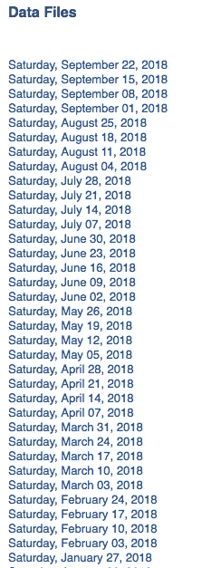
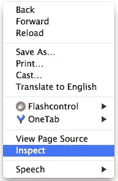
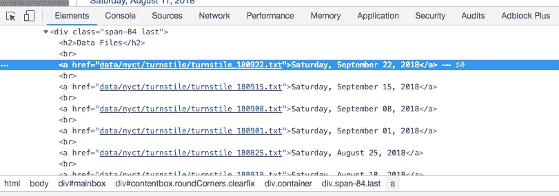
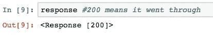
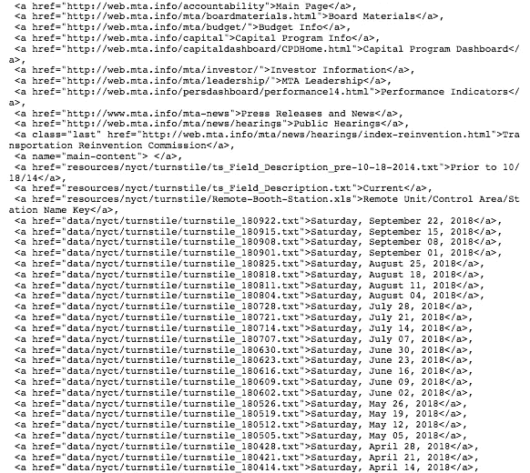

# 如何用 Python 在 4 分钟内完成网页抓取

> 原文：<https://towardsdatascience.com/how-to-web-scrape-with-python-in-4-minutes-bc49186a8460?source=collection_archive---------0----------------------->

## Python 网页抓取初学者指南


Photo by [Chris Ried](https://unsplash.com/@cdr6934?utm_source=medium&utm_medium=referral) on [Unsplash](https://unsplash.com?utm_source=medium&utm_medium=referral)

# 网页抓取

Web 抓取是一种从网站中自动访问和提取大量信息的技术，可以节省大量的时间和精力。在本文中，我们将通过一个简单的例子来演示如何从纽约 MTA 自动下载数百个文件。这是一个伟大的练习网页抓取初学者谁正在寻找了解如何网页抓取。网络抓取可能有点吓人，所以本教程将分解如何进行这个过程。

# 纽约 MTA 数据

我们将从以下网站下载十字转门数据:

```
[http://web.mta.info/developers/turnstile.html](http://web.mta.info/developers/turnstile.html)
```

十字转门的数据从 2010 年 5 月到现在每周都有汇编，所以几百个。网站上有 txt 文件。下面是一些数据的片段。每个日期都是一个链接。txt 文件，您可以下载。



手动右键点击每个链接并保存到你的桌面是很痛苦的。幸运的是，有网络抓取！

# 关于网页抓取的重要注意事项:

1.  通读网站的条款和条件，了解如何合法使用数据。大多数网站禁止你将这些数据用于商业目的。
2.  确保下载数据的速度不要太快，因为这可能会破坏网站。您也可能被阻止访问该网站。

# 检查网站

我们需要做的第一件事是找出在多层 HTML 标签中我们可以在哪里找到我们想要下载的文件的链接。简而言之，网站页面上有大量代码，我们希望找到包含我们数据的相关代码。如果你不熟悉 HTML 标签，参考 W3Schools [教程](http://www.w3schools.com/)。理解 HTML 的基础知识对于成功抓取网页是很重要的。

在网站上，右键点击“检查”。这可以让你看到网站背后的原始代码。



一旦你点击“检查”，你应该看到这个控制台弹出。



**Console**

请注意，在控制台的左上方，有一个箭头符号。


如果您单击这个箭头，然后单击站点本身的一个区域，则该特定项目的代码将在控制台中突出显示。我点击了第一个数据文件，2018 年 9 月 22 日，星期六，控制台以蓝色突出显示了该特定文件的链接。

```
<a href=”data/nyct/turnstile/turnstile_180922.txt”>Saturday, September 22, 2018</a>
```

注意所有的。txt 文件在上面一行后面的`<a>`标签中。当你做更多的网页抓取时，你会发现`<a>`是用于超链接的。

现在我们已经确定了链接的位置，让我们开始编码吧！

# Python 代码

我们从导入以下库开始。

```
import requests
import urllib.request
import time
from bs4 import BeautifulSoup
```

接下来，我们设置网站的 url，并使用我们的请求库访问该站点。

```
url = '[http://web.mta.info/developers/turnstile.html'](http://web.mta.info/developers/turnstile.html')
response = requests.get(url)
```

如果访问成功，您应该会看到以下输出:



接下来，我们用 BeautifulSoup 解析 html，这样我们就可以使用更好的嵌套式 BeautifulSoup 数据结构。如果你有兴趣了解这个库的更多信息，请查看 [BeatifulSoup 文档](https://www.crummy.com/software/BeautifulSoup/bs4/doc/)。

```
soup = BeautifulSoup(response.text, “html.parser”)
```

我们使用这种方法。findAll 找到我们所有的`<a>`标签。

```
soup.findAll('a')
```

这段代码给出了每一行带有`<a>`标签的代码。我们感兴趣的信息从第 38 行开始，如下所示。也就是说，第一个文本文件位于第 38 行，所以我们想要获取位于下面的其余文本文件。



**subset of all <a> tags**

接下来，让我们提取我们想要的实际链接。让我们测试第一个链接。

```
one_a_tag = soup.findAll(‘a’)[38]
link = one_a_tag[‘href’]
```

这段代码将第一个文本文件“data/nyct/turnstile/turnstile _ 180922 . txt”保存到我们的变量 link 中。下载数据的完整网址其实是‘http://web . MTA . info/developers**/**data/nyct/turnstile/turnstile _ 180922 . txt’，是我在网站上点击第一个数据文件作为测试发现的。我们可以使用我们的 urllib.request 库将这个文件路径下载到我们的计算机上。我们为 request.urlretrieve 提供两个参数:文件 url 和文件名。对于我的文件，我命名为“turnstile_180922.txt”、“turnstile_180901”等。

```
download_url = 'http://web.mta.info/developers/'+ link
urllib.request.urlretrieve(download_url,'./'+link[link.find('/turnstile_')+1:])
```

最后但同样重要的是，我们应该包含这一行代码，这样我们可以暂停我们的代码一秒钟，这样我们就不会向网站发送垃圾请求。这有助于我们避免被标记为垃圾邮件发送者。

```
time.sleep(1)
```

现在我们已经了解了如何下载一个文件，让我们试着用 for 循环下载整个数据文件集。下面的代码包含了网络抓取纽约 MTA 十字转门数据的整套代码。

**Note that line 19 should be 38 and not 36 due to an updated on the website.**

你可以在我的 Github 上找到我的 Jupyter 笔记本。

感谢大家的阅读和快乐的网刮！