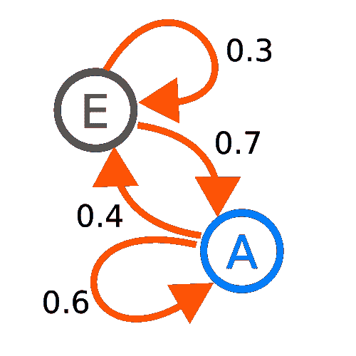
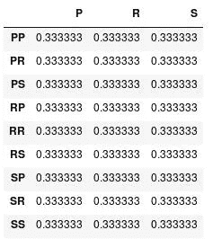
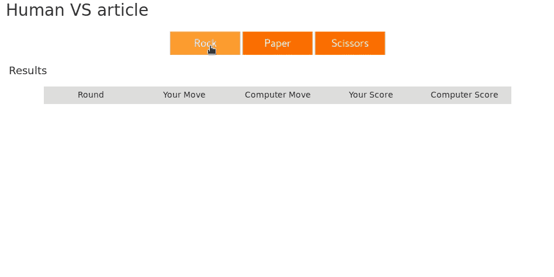
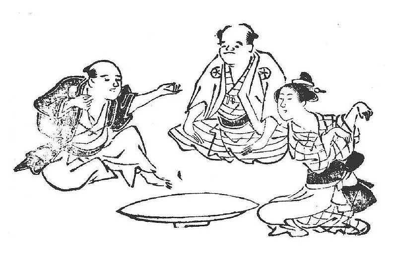

# 如何赢得 70%以上的石头剪刀布比赛

> 原文：<https://towardsdatascience.com/how-to-win-over-70-matches-in-rock-paper-scissors-3e17e67e0dab?source=collection_archive---------7----------------------->

[*https://www.flickr.com/photos/gozalewis/4565833940*](https://www.flickr.com/photos/gozalewis/4565833940)

## 一个流行游戏的初级人工智能方法

你有没有想过算法是怎么下棋的？如何设置围棋程序？为什么 AI bot 能够在你最喜欢的游戏中打败你？你不会在这篇文章中读到它。我将要写的这个游戏更容易玩，也更容易实现。

> 虽然石头剪子布(RPS)看起来像一个微不足道的游戏，但它实际上涉及到时间模式识别的困难计算问题。这个问题是机器学习、人工智能和数据压缩领域的基础。事实上，它甚至对理解人类智能的工作方式至关重要。

以上文字来自伟大的[**石头剪刀布编程大赛**](http://www.rpscontest.com/) 页面。它举办了一场自由开放的比赛，每个人都可以提交他/她的游戏算法。代码提交在 **Python 2** 中，每个人都可以看到。它让每个人都有机会看到最佳解决方案的细节。然而理解它们并不总是容易的。

提交的算法和其他程序打一千回合。这叫比赛。获胜回合数较多的算法获胜。玩家在**排行榜**上的排名基于通过比赛获得或失去的分数。

让我们实现最简单的播放算法。它总是放摇滚。

注意，在程序中你唯一要做的事情就是给全局*输出*变量一个 range 值(‘R’，‘P’，‘S’)。你反对算法将其移动分配给*输入*全局变量。每一轮你都可以看到前一轮的输入。第一轮变量是一个空字符串。

好吧，第一个游戏对于任何从数据中学习的算法来说都是很容易对付的。现在采取相反的方法。

[http://dilbert.com/strip/2001-10-25](http://dilbert.com/strip/2001-10-25)

你认为会怎样？这很容易预测:平均三分之一输，三分之一平，三分之一赢。这个策略让你有 50%的机会赢得每场比赛。为了获得更高的胜率，你必须冒险。只看随机模特比赛有趣吗？不，所以请不要提交完全随机的解决方案。不过我们会在某些情况下使用这个模型。

请注意，您可以**离线测试您的模型**。从[网站](http://www.rpscontest.com/submit)下载 *rpsrunner.py* 即可。你可以发布它们来检查它们做得怎么样，但是没有太多的计算能力。一开始犯了一个错误，贴了一些无意随机的代码。这很容易测试——只需让您的代码处理持续的输入(就像第一个实现的模型一样)。如果它松动了大约 50%,你的模型可能是随机的。

我们要实现的模型是一个**离散马尔可夫链**。它建立在一个简单的想法上。假设一个进程有两种可能的状态 A 和 e，我们现在在状态 A，我们停留在状态 A 的几率是多少？还有，去 E 州的几率有多大？关于具有两种可能状态的马尔可夫链，这两种概率的总和必须为 1。充分地说，当前状态 e 有两种概率，你可以在下面的图片上看到机制。

[https://en.wikipedia.org/wiki/Markov_chain](https://en.wikipedia.org/wiki/Markov_chain)

这里有一个关于马尔可夫模型如何工作的极好的可视化。

我们如何在 RPS 竞赛中使用该模型？一种自然的方法是分析最近一轮的*输入*和*输出*，并尝试预测下一个*输入*。然后采取行动击败它。这个设置表明我们的当前状态是一对，就像“RP”，下一个状态是我们的输出。应该是这样的:

*Image by author*

下面是实现。我还添加了一个 *n_obs* 键来保存过去发生的次数。我们将在学习过程中使用它。

*衰减*参数代表模型的**记忆**。值 1 意味着模型具有完美的记忆。如果分配一个介于 0 和 1 之间的值，模型将会忘记先前的观察，从而更快地适应对手行为的变化。

作为*输入*预测，给定最新的*输出-输入*对，模型选择具有最高概率的移动。

下面你可以找到整个播放程序:

你可以玩算法:

[http://www.rpscontest.com/human/5706404883070976](http://www.rpscontest.com/human/5706404883070976)

我必须警告你。这种型号在比赛中表现不好。只是太初级了。大部分冒险算法应该可以对抗这种策略。你可以在这个链接下看到它的表现。它只是一个让你在石头剪刀布比赛中开始冒险的地方。你可以修改参数，训练许多模型，选择最好的来玩，创建合奏。这取决于你的想象力。最好的算法赢得大约 80%的匹配。你可以在这里查看我的超 70%算法[。你能做得更好吗？](http://www.rpscontest.com/entry/5724402004000768)

关于 RPS 游戏中**贝叶斯推理**的说明。当我开始参加竞赛时，我认为最好的解决方案是贝叶斯方案。现在我相信**不是贝叶斯问题**。你可以评估所有的策略，因为输入和输出是同时的，因此相互独立。它否定了贝叶斯推理最大的优势之一——选择下一个要测试的算法。

你打算参加比赛吗？你有别的方法吗？如果你喜欢这篇文章，请在评论区或拍手告诉我！

Kitsune-ken — a popular Japanese rock–paper–scissors variant. [https://en.wikipedia.org/wiki/Rock-paper-scissors](https://en.wikipedia.org/wiki/Rock%E2%80%93paper%E2%80%93scissors)