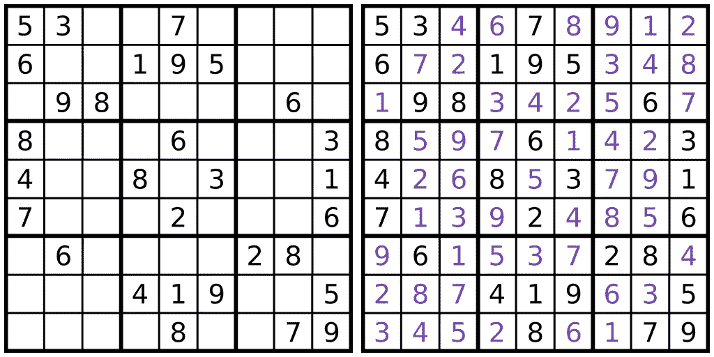
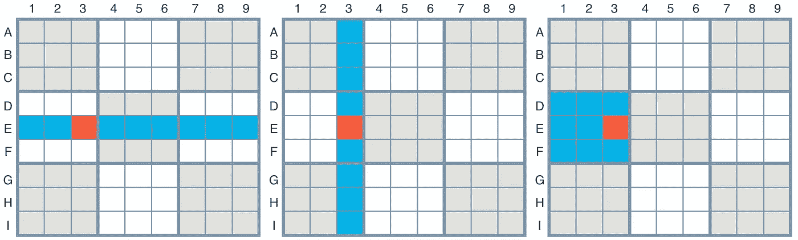
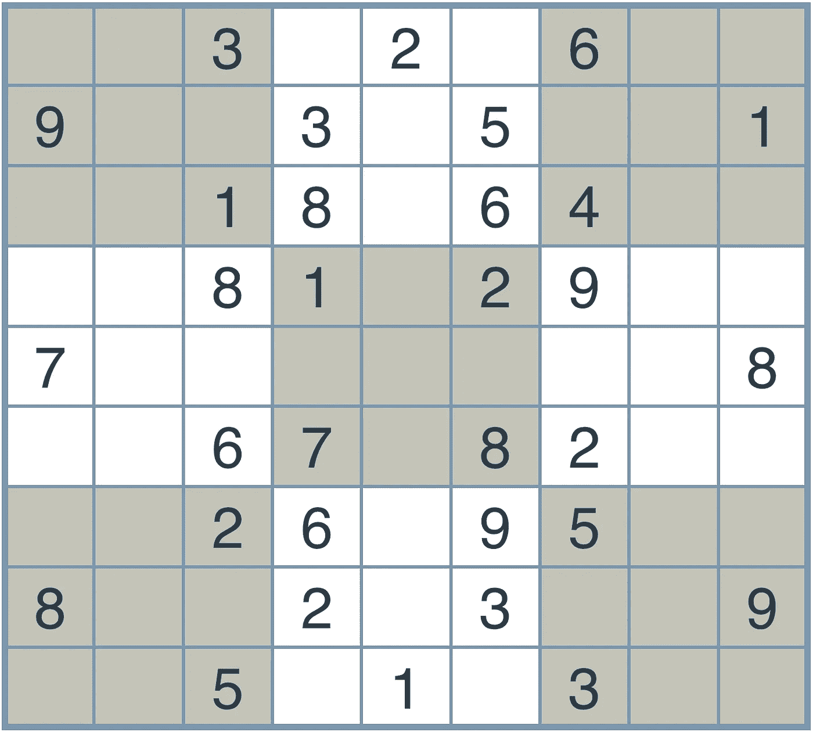
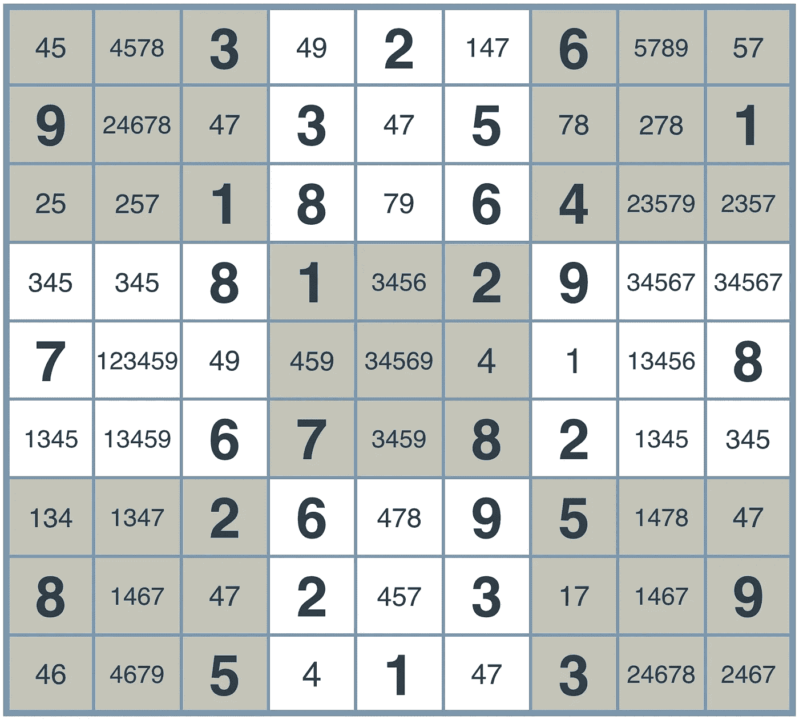
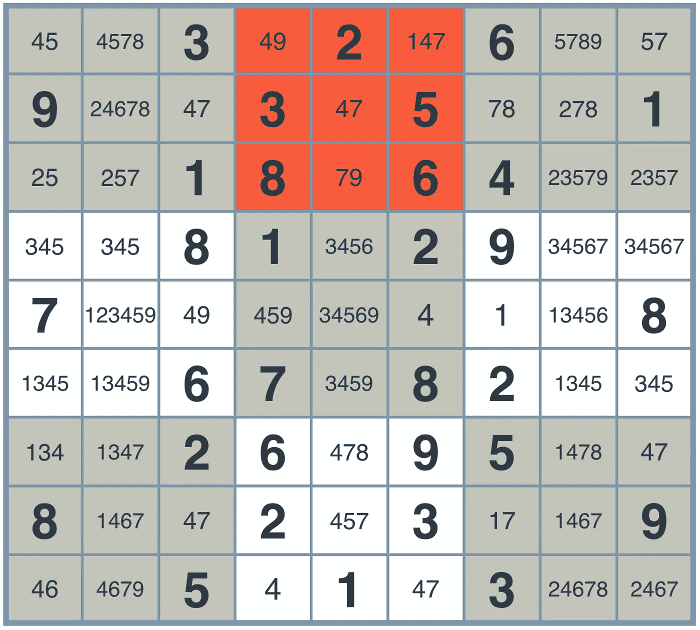
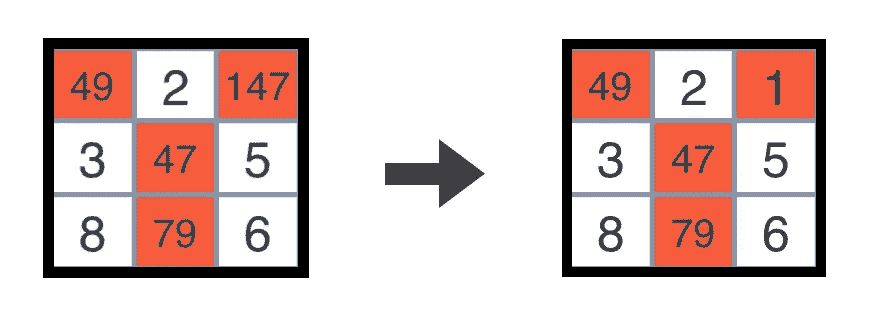
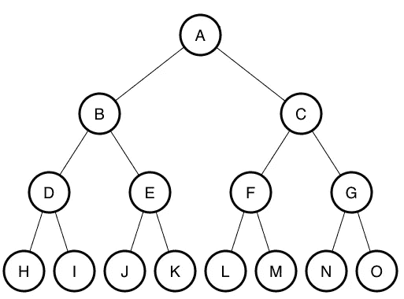
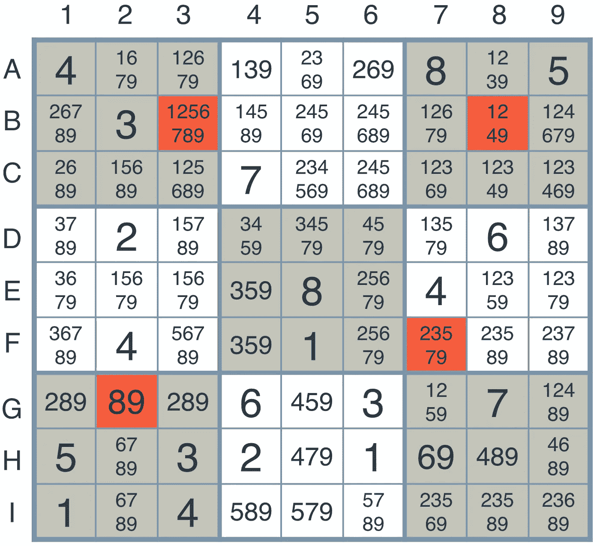

# 如何赢得数独

> 原文：<https://towardsdatascience.com/how-to-win-sudoku-3a82d05a57d?source=collection_archive---------0----------------------->

Photo by [Xan Griffin](https://unsplash.com/@xangriffin?utm_source=medium&utm_medium=referral) on [Unsplash](https://unsplash.com?utm_source=medium&utm_medium=referral)

了解被称为数独的流行谜题，以及我们如何教计算机自己解决它。

# Sudoku (aka 数独)

数独这个名字来自日本，翻译过来就是‘数’(Su)和‘单’(Doku)。然而，虽然这个名字表明了日本的传统，但创造这个谜题的主要功臣是伦纳德·欧拉；一位非常著名的 18 世纪瑞士数学家。从那以后，这个谜题在国际上被广泛采用，甚至在计算机中也是如此。

那么数独怎么玩呢？首先，这个谜题是一个由 81 个方块组成的棋盘(就像井字游戏一样),根据谜题的难度，有许多方块填满了数字，而其余的都是空白的。下面你可以在左边看到一个尚未解决的数独拼图板，在右边看到一个已经解决的相同拼图板。

[https://blogs.unimelb.edu.au/sciencecommunication/files/2016/10/sudoku-p14bi6.png](https://blogs.unimelb.edu.au/sciencecommunication/files/2016/10/sudoku-p14bi6.png)

要解决这个难题，你需要用从 1 到 9 的数字填充空白方块。问题是每个方块必须包含一个对该行、列和框唯一的值。这些行、列和框将被称为区域。一行从左到右由九个正方形组成，一列从上到下由九个正方形组成，一个盒子由九个均匀分布在棋盘上的 3x3 盒子之一组成。

Udacity AI Nanodegree Program

现在这个谜题有不同的变体，但我们将只关注最初的。如果你没有玩过数独，那就去[试试吧](https://www.websudoku.com/)！人们已经玩了几个世纪了，这很有趣(有时令人沮丧)。

# 解决数独

好了，现在你知道了数独的规则，并且有希望获得一些玩数独的经验，你可能已经注意到了在你寻找解决方法的过程中的一些模式。更有可能的是，你从填一个只能取一个值的方块开始。然后，也许你开始解决其余的方块，通过消除所有可能的值，一个特定的方块不能采取，并选择剩下的一个。可能有几次你不得不记住多个方块的几个值。也许你遇到了两个岔路口，你不得不在两条不同的路径中选择一条来寻找解决方案，其中一条路径要么帮助你解决了难题，要么产生了一个迫使你原路返回的死胡同。

这是对两种常见策略的很好的介绍，称为**消除**和**唯一选择**，它要求你列出每个方块可能取的所有值(消除)，然后填写只列出一个可能值的方块(唯一选择)。你需要做的就是一遍又一遍地重复这个循环来解决这个难题。不错！

## 约束传播

现在要教计算机如何做到这一点，我们需要使用一种常见的人工智能方法，称为**约束传播**。简而言之，这是一种方法，它允许计算机朝着可能的解决方案移动(传播)，同时遵循一些空间的规则和每个变量可能使用的值(约束)。在这种情况下，我们的约束是只能包含一个从 1 到 9 的值的正方形，并且每个区域必须是唯一的。

那么，这种方法实际上是怎样的呢？让我们从下面的数独板开始。别担心，这个难题很简单，使用约束传播时对计算机来说甚至更容易。

Udacity AI Nanodegree Program

首先，我们要列出每个方块可能取的所有可能值，这样我们可以缩小可能的选择范围，并发现“已经解决”的方块(即，只有一个可能值的方块)。根据下面的板子，你可以看到所有可能的值都列在了每一个方块上，其中一些只有一个值。

Udacity AI Nanodegree Program

现在要做的显而易见的事情是解决已经缩小到只有一个值的正方形。基于数独的规则，我们可以查看单个区域(行、列和框)来找出每个方块的不同值。这是向下钻取局部约束的过程；在这里是区域。

例如，让我们看看下图中顶部中间的红色方框。你可以看到我们几乎已经解决了这个区域，但还没有完全解决。由于这个方框中的每个方块必须是唯一的，我们知道 2、3、5、6 和 8 都不是未解方块的可能值。然而，我们可以看到，值 1 只可能出现在这个区域的右上角的正方形中，而该区域中的每个未解正方形都包含 4、7 或 9。

Udacity AI Nanodegree Program

这导致我们将 1 赋给那个正方形，因为它是值中的唯一选择，保证它在整个给定区域中是唯一的。接下来，计算机会在所有区域重复做同样的事情，直到找到解决方案。

Udacity AI Nanodegree Program

通过使用约束传播，我们可以教会计算机如何通过关注局部约束来解决几乎任何数独难题。但是你可能从经验中知道，有时候棋盘会达到一种“停滞”状态，在这种状态下，有些方块可以有多种值。也许对于任何特定的未解正方形，可供选择的最少数值是两个或更多！嗯，这将是一个你面对[裸体双胞胎](http://www.sudokudragon.com/tutorialnakedtwins.htm)的例子，这表明在通往伟大的道路上有多条道路可供选择(解决难题)。让我们一起走向伟大。

## 搜索

如果在解数独谜题的时候，有一个点是你在一个不完整的解上停滞不前，你知道你在解这个谜题的时候做了一个曾经有效的选择，导致了一个无效的解。这意味着你必须回到你当初做那个选择的地方，做出一个不同的选择。希望你留下了面包屑。

实现一种搜索方法，允许计算机遍历可能导致有效解决方案的多个场景，这正是我们在这里想要的，当面对裸体双胞胎时，我们知道我们有两个选择。当在两个不同的方向之间做出选择时，我们必须扩展到两个不同的可能性世界。这可以使用一棵树来完成，特别是一棵**(**BST**)。**

**现在，BST 由一个根节点组成，从这个根节点分支出两个方向，这些后续的点本身可以有从它们分支出的两个方向，依此类推。**

****

**[https://i.stack.imgur.com/9jegh.png](https://i.stack.imgur.com/9jegh.png)**

**现在把节点 A 想象成一个时间点，我们必须在两个决定中做出选择，最终不是 B 就是 c，在数独中，这和遇到裸体双胞胎(wut？);你必须在两条路径中选择一条，这两条路径可能会也可能不会产生有效的解决方案。**

****

**Udacity AI Nanodegree Program**

**如果你看上面的棋盘，你会注意到一个停滞的数独棋盘，左下角有一个方块，包含数值 8 和 9。既然我们被困在一个不完整的解决方案中，我们必须跃入未知，这意味着选择以一种方式解决难题，并希望它能成功。如果没有，我们知道哪里出了问题，并可以通过回溯和选择另一个选项来纠正我们的错误。**

**谁知道呢，也许在我们做出 8 或 9 的选择后，我们会遇到另一对裸体双胞胎(嗯…)，这将导致另一组可能性，从而在我们的树上出现另一组分支！通过将此建模为 BST，我们可以让计算机使用[深度优先搜索](https://en.wikipedia.org/wiki/Depth-first_search)遍历这些可能的解决方案，这将最终引导我们找到有效的解决方案。**

# **这是智力吗？**

**现在计算机不知道有解存在。它只是在时间中前进，四处探索，希望能找到一个。虽然我们人类当然知道一个合适的数独棋盘有一个或多个有效解，但计算机不知道。这意味着它必须通过做出适当的选择来聪明地找到这些解决方案之一，因为解决这个难题所需的时间是未知的，在这种情况下，这被称为 [NP 问题](http://mathworld.wolfram.com/NP-Problem.html)。**

**有些人可能不相信这是智力，但这真的取决于你对智力的定义是什么。它可能不会像 Siri 一样跟我们说话，但它肯定是在解决一个问题，而没有潜在的解决方案(就它所知)，也没有我们给它明确的条件语句。在解决数独谜题的情况下，我们只是告诉计算机:“你可以这样做，但不可以这样做。现在解决问题。”然后它就明白了。**

**彼得·诺维格——一位著名的人工智能研究员——发现了如何应用 BST 的约束传播和深度优先搜索来解决数独难题，并在这里[详细讨论了它](http://norvig.com/sudoku.html)。他甚至深入研究了代码，以展示教计算机如何做到这一点是如何可能的。**

# **包裹**

**我们讲述了在解决古老的数独难题时，约束传播与 BST 的深度优先搜索是如何完美结合的，这更好地告诉我们如何教会计算机自己做这件事。如果你有兴趣了解更多关于这个主题的知识，我强烈建议你阅读[彼得·诺维格的帖子](http://norvig.com/sudoku.html)，在那里他提供了关于代码片段问题的更深入的观点。你也可以看看我为我的 [Udacity 人工智能 Nanodegree](https://www.udacity.com/course/artificial-intelligence-nanodegree--nd889) 写的解决这个问题的代码，你可以在[我的 GitHub repo](https://github.com/grantathon/AIND-Sudoku) 上找到。**

**嗨，我是格兰特！我是一名自由开发者和作家。查看我在 https://grantbartel.com 的网站。干杯！**