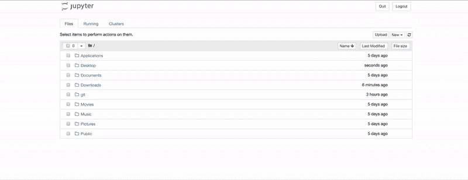
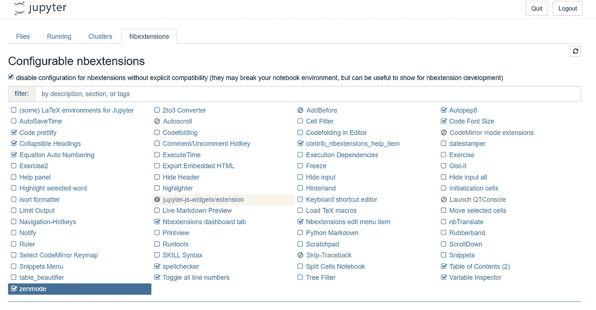
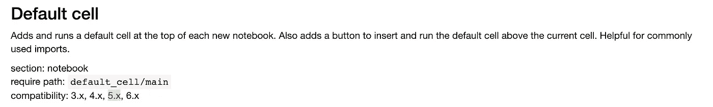
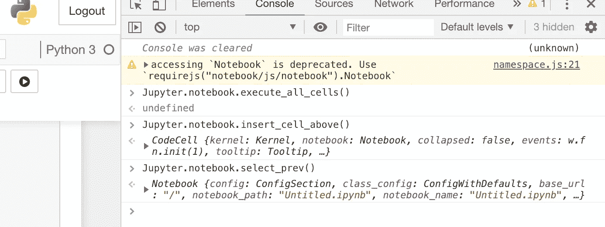
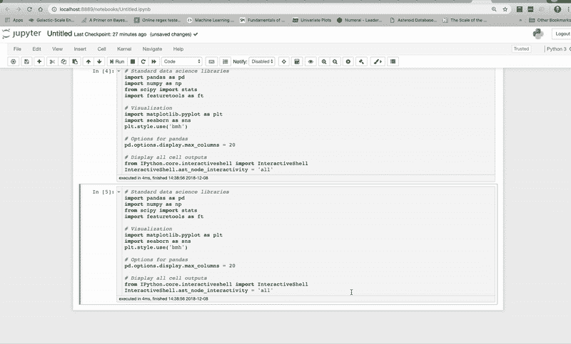
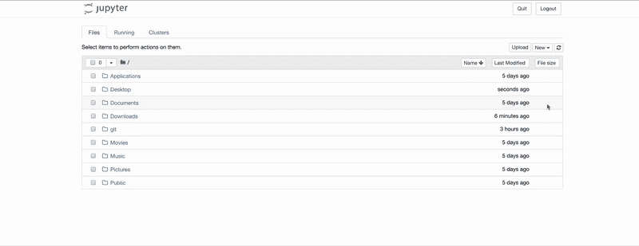
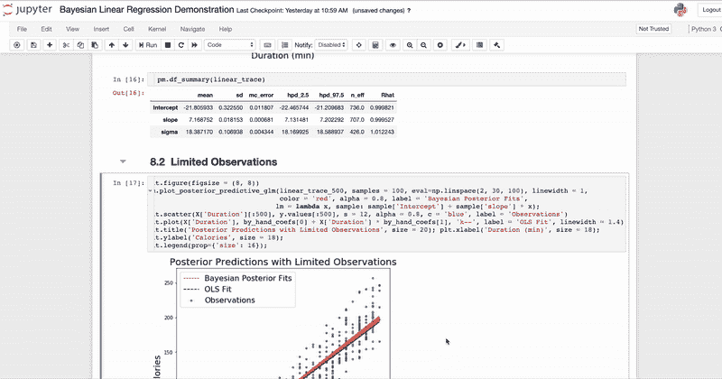
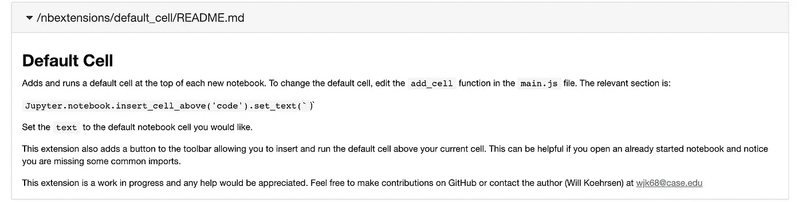
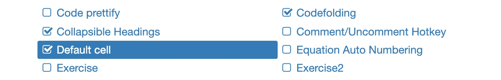

# 如何编写 Jupyter 笔记本扩展

> 原文：<https://towardsdatascience.com/how-to-write-a-jupyter-notebook-extension-a63f9578a38c?source=collection_archive---------4----------------------->


[(Source)](https://www.pexels.com/photo/top-view-photo-of-seashore-1575836/)

## 让 Jupyter 笔记本成为你的游乐场

Jupyter 笔记本扩展是简单的附加组件，可以显著提高您在笔记本电脑环境中的工作效率。它们自动执行乏味的任务，如格式化代码或添加功能，如创建目录。虽然有许多现有的扩展，我们也可以编写自己的扩展来扩展 Jupyter 的功能。

在本文中，我们将了解如何编写一个 Jupyter 笔记本扩展，在每个新笔记本的顶部添加一个默认单元格，这在您发现自己要向每个笔记本导入库时非常有用。如果你想了解扩展的背景，那么看看这篇文章。GitHub 上提供了该扩展的完整代码[。](https://github.com/WillKoehrsen/jupyter-notebook-extensions/tree/master/default_cell)

默认单元格扩展的最终结果如下所示:



Extension to add a default cell to the top of every notebook.

## 开始前的注意事项

(如果您还没有 Jupyter 扩展，[查看本文](/jupyter-notebook-extensions-517fa69d2231)或在命令提示符下运行以下代码:`pip install jupyter_contrib_nbextensions && jupyter contrib nbextensions install`然后启动一个新的笔记本服务器并导航到扩展选项卡)。

不幸的是，没有太多关于编写自己的扩展的官方文档。我的策略是阅读[其他扩展](https://github.com/ipython-contrib/jupyter_contrib_nbextensions)，大量复制和粘贴，并进行试验，直到我弄明白为止。[这个栈溢出](https://stackoverflow.com/questions/36194865/configure-a-first-cell-by-default-in-jupyter-notebooks)问答提供了这个扩展的基本代码。

# Jupyter 笔记本扩展的结构

任何 Jupyter 笔记本扩展都有 [3 个部分(至少)](https://jupyter-contrib-nbextensions.readthedocs.io/en/latest/internals.html):

1.  `description.yaml`:Jupyter 读取的配置文件
2.  `main.js`:扩展本身的 Javascript 代码
3.  `README.md`:扩展的降价描述

(我们也可以在其他文件或`css`中有更多的函数进行造型)。

这 3 个文件应该位于一个目录中，我们称之为`default_cell`。这个文件夹需要在`jupyter_contrib_extensions`库的`nbextensions`子目录中(你用 pip 安装的)。要找到安装了 pip 的库的位置，请运行`pip view package`。)

我的`jupyter_contrib_extensions`目录是:

```
/usr/local/lib/python3.6/site-packages/jupyter_contrib_nbextensions/nbextensions
```

所以文件结构看起来是这样的(如上图`nbextensions`):

```
nbextensions/    
    default_cell/
        - description.yaml
        - main.js
        - README.md
```

当您运行`jupyter notebook`时，Jupyter 在这个位置查找扩展，并在服务器上的 extensions 选项卡上显示它们:



Jupyter Notebook Extensions tab

当您在开发过程中对扩展文件进行了更改，并且希望在 Jupyter 笔记本中看到效果时，您需要运行命令`jupyter contrib nbextensions install`来重写 Jupyter 配置文件。然后，重新启动笔记本服务器以查看您的更改。

详细情况说完了，让我们来看一下我们需要的三个文件。

## 描述. yaml

[YAML (YAML 不是标记语言)](https://en.wikipedia.org/wiki/YAML)是一种人类可读的标准，用于编写配置和头文件。YAML 文件描述了要在扩展选项卡上呈现的 Jupyter 扩展配置器的扩展。

这是一个相当容易的文件复制+粘贴和修改我们的需要。

这将很好地呈现在笔记本的`NBExtensions`选项卡上:



兼容性指明了该扩展适用的 Jupyter 版本。我刚刚把它们全部加了进去(3.x — 6.x ),看起来效果不错！

## 主页. js

这是应用程序的核心，是扩展的实际逻辑所在。Jupyter 笔记本在浏览器中运行，这意味着扩展必须用 Javascript 编写，Javascript 是 web 的语言。

要弄清楚使用什么命令来让笔记本做你想要的事情可能有点困难。一种试验方法是使用 Chrome 开发工具(Windows 上的 cntrl + shift + i)或右键单击> inspect。

开发工具打开后，我们可以使用`console`选项卡来运行命令。



Console in Chrome developer tools

尝试在 Jupyter 笔记本中打开开发者工具，使用以`Jupyter.notebook.`开头的选项，你输入的任何命令都必须是 Javascript 格式的。这种行为的一个例子可以在下面的剪辑中看到。我打开开发工具，然后运行一些命令来执行单元格，插入一个新的单元格，并选择前一个单元格。



开发 Javascript 代码需要大量这样的实验！这也有助于阅读其他扩展，以确定您需要做什么。

最终的`main.js`如下:

代码中最重要的部分是`add_cell`函数。

```
var add_cell = function() {
    Jupyter.notebook.
    insert_cell_above('code').
    // Define default cell here
    set_text(`Define default cell here`);
    Jupyter.notebook.select_prev();
    Jupyter.notebook.execute_cell_and_select_below();
};
```

这将在当前选中的单元格上方添加一个代码单元格，括号中写有 python 代码(在`set_text`调用中)。这是应该定义默认代码单元的地方。然后，该函数执行单元格并选择下面的单元格。



`load_ipython_extension`功能首先检查笔记本中的单元格数量。如果只有一个单元格——一个新的笔记本——它调用`add_cell`函数，将默认单元格放在笔记本的顶部。

```
// Run on start
function load_ipython_extension() {// Add a default cell if a new notebook
    if (Jupyter.notebook.get_cells().length===1){
        add_cell();
    }
    defaultCellButton();
}
```

然后运行`defaultCellButton`功能，在 Jupyter 笔记本工具栏上放置一个按钮。我们可以使用此按钮在当前选定的单元格上方添加并运行默认单元格。当我们有一个已经启动的笔记本并且我们想要我们的正常导入时，这可能是有用的。



Function of defaultCellButton

我们可以在浏览器中用 Javascript 完成几乎无限多的任务。这只是一个简单的应用程序，但是还有许多更复杂的 Jupyter 扩展(例如[变量检查器](https://github.com/ipython-contrib/jupyter_contrib_nbextensions/tree/master/src/jupyter_contrib_nbextensions/nbextensions/varInspector))演示了更多的功能。我们还可以用 Javascript 编写应用程序，调用 Python 脚本来获得更好的控制。

## README.md

一个 readme [markdown 文件](https://github.com/adam-p/markdown-here/wiki/Markdown-Cheatsheet)对任何一个有一点编程经验的人来说都应该是熟悉的。这里是我们解释我们的应用程序做什么以及如何使用它的地方。这显示在“扩展”选项卡上:



README rendered on the extensions tab

(实际的代码很无聊，但为了完整起见，在这里)

```
Default Cell**=========**Adds and runs a default cell at the top of each new notebook. To change the default cell, edit the `add_cell` function in the `main.js` file. The relevant section is`Jupyter.notebook.insert_cell_above('code', 0).set_text(``)`Set the `text` to whatever you would like.This extension also adds a button to the toolbar allowing you to insert and run the default cell above your current cell. This can be helpful if you open an already started notebook and notice you are missing some common imports.This extension is a work in progress and any help would be appreciated. Feel free to make contributions on GitHub or contact the author (Will Koehrsen) at wjk68@case.edu
```

一旦有了三个必需的文件，您的扩展就完成了。

要查看扩展的工作情况，请确保`default_cell`目录位于正确的位置，运行`jupyter contrib nbextensions install`并启动 Jupyter 笔记本服务器。如果您导航到`NBExtensions`选项卡，您将能够启用扩展(如果您没有该选项卡，请打开笔记本并编辑> nbextensions 配置)。



Extension enabled

启动新笔记本，查看您的扩展功能:


Default cell jupyter notebook extension

这个扩展不会改变你的生活，但是它可能会节省你几秒钟的时间！

# 结论

获得计算机知识的部分乐趣是意识到如果你想在计算机上完成某件事，有机会你可以用正确的工具和学习的意愿。这个制作 Jupyter 笔记本扩展的小例子表明，我们不会受到开箱即用产品的限制。我们只需要几行代码来完成我们的目标。

希望这个扩展证明对你有用或者启发你写你自己的。我从扩展中得到了很多用处，并期待看到人们还能开发出什么。一旦你开发了一个扩展，分享它，这样其他人可以惊叹你的代码并从你的努力工作中获益。

一如既往，我欢迎反馈和建设性的批评。可以通过推特 [@koehrsen_will](http://twitter.com/@koehrsen_will) 或者通过我的个人网站 [willk.online](https://willk.online) 找到我。