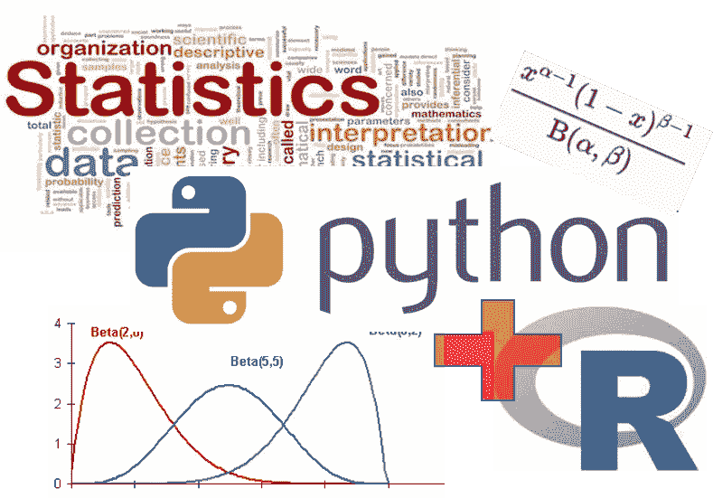
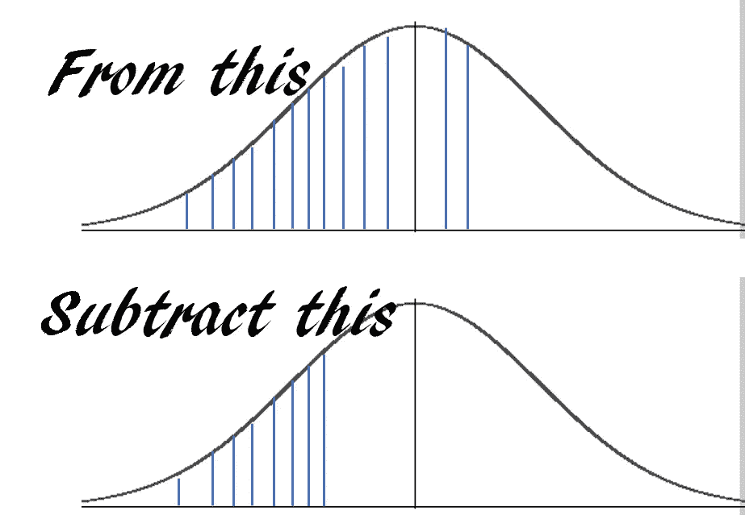
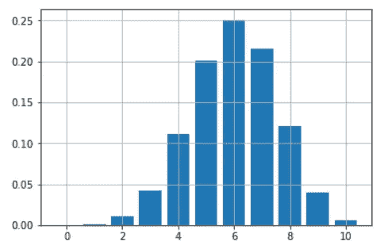

# 如何用 Python 写你最喜欢的 R 函数？

> 原文：<https://towardsdatascience.com/how-to-write-your-favorite-r-functions-in-python-11e1e9c29089?source=collection_archive---------4----------------------->

## r vs Python——争论仍在继续。与此同时，我们尝试走一条中间道路，创建一个 Python 脚本来模仿方便的 R 风格函数，以便更好、更容易地进行统计！



## 介绍

数据科学和机器学习的现代大战之一是“Python vs. R”。毫无疑问，这两种语言近年来都取得了巨大的进展，成为数据科学、预测分析和机器学习的首选编程语言。事实上，在 IEEE 最近的一篇文章中，Python 取代 C++成为 2018 年的顶级编程语言，R 也牢牢占据了前 10 名的位置。

然而，这两者之间有一些基本的区别。 [R 最初是作为统计分析和数据分析问题的快速原型开发的工具](https://www.coursera.org/lecture/r-programming/overview-and-history-of-r-pAbaE)。另一方面，Python 是作为一种通用的现代面向对象语言开发的，与 C++或 Java 一脉相承，但具有更简单的学习曲线和更灵活的风格。因此，R 继续在统计学家、定量生物学家、物理学家和经济学家中非常流行，而 Python 已经慢慢成为日常脚本、自动化、后端 web 开发、分析和通用机器学习框架的首选语言，具有广泛的支持基础和开源开发社区工作。

## 在 Python 环境下模仿函数式编程？

[R](http://adv-r.had.co.nz/Functional-programming.html)的函数式编程特性为用户提供了极其简单紧凑的界面，用于快速计算概率和对数据分析问题进行必要的描述/推断统计。例如，**仅仅通过一个简单的函数调用就能回答下面的问题，这不是很好吗？**

> 如何计算一个数据向量的均值/中值/众数？
> 
> 如何计算服从正态分布的事件的累积概率？如果分布是泊松分布呢？
> 
> 如何计算一系列数据点的四分位间距？
> 
> 如何生成几个服从学生 t 分布的随机数？

r 编程环境允许您这样做。

另一方面，Python 脚本能力允许分析师在各种各样的分析管道中使用这些统计数据，具有无限的复杂性和创造性。

**为了结合两个世界**的优势，我们需要一个简单的基于 Python 的包装器库，它包含了最常用的与概率分布和描述性统计相关的函数，这些函数在 *R-style* 中定义，这样用户就可以非常快速地调用这些函数，而不必去适当的 Python 统计库，找出所有的方法和参数。

## 用于最方便的 R 函数的 Python 包装器脚本

[我写了一个 Python 脚本](https://github.com/tirthajyoti/StatsUsingPython/blob/master/R_Functions.py)，用 Python 定义了简单统计分析中最方便、最广泛使用的 R 函数。导入这个脚本后，您将能够像在 R 编程环境中一样自然地使用这些 R 函数。

该脚本的目标是**提供简单的 Python 子程序，模仿 R 风格的统计函数，用于快速计算密度/点估计值、累积分布、分位数，并为各种重要的概率分布生成随机变量**。

> 为了保持 R 风格的精神，没有使用类层次结构，只在这个文件中定义了原始函数，这样用户就可以导入这个 Python 脚本，并在需要时通过一个名字调用来使用所有的函数。

注意，我用 ***这个词模仿*** 。在任何情况下，我都不会声称要模仿真正的 R 函数式编程范例，它包含了深层的环境设置以及这些环境和对象之间复杂的相互关系。这个脚本只允许我(我希望无数其他 Python 用户也是)快速启动 Python 程序或 Jupyter 笔记本，导入脚本，并立即开始做简单的描述性统计。这就是目标，不多不少。

或者，您可能在研究生院编写了 R 代码，刚刚开始学习和使用 Python 进行数据分析。您将会很高兴在 Jupyter 笔记本上看到并使用一些众所周知的功能，就像您在 R 环境中使用的方式一样。

不管是什么原因，这都很有趣:-)。

## 简单的例子

首先，只需导入脚本并开始处理数字列表，就像它们是 r 中的数据向量一样。

```
**from R_functions import ***
lst=[20,12,16,32,27,65,44,45,22,18]
<more code, more statistics...>
```

例如，你想从一个矢量数据点中计算出 [Tuckey 五个数](https://en.wikipedia.org/wiki/Five-number_summary) summary。你只需要调用一个简单的函数 **fivenum** 并传递向量。它将在 Numpy 数组中返回五个数字的摘要。

```
lst=[20,12,16,32,27,65,44,45,22,18]
**fivenum**(lst)
> array([12\. , 18.5, 24.5, 41\. , 65\. ])
```

或者，你想知道下面这个问题的答案。

> 假设一台机器每小时平均产出 10 件成品，标准偏差为 2。输出模式遵循近似正态分布。机器在接下来的一个小时内输出至少 7 台但不超过 12 台的概率是多少？

答案基本上是这样的，



使用 **pnorm** …只需一行代码就能得到答案

```
**pnorm**(12,10,2)-**pnorm**(7,10,2)
> 0.7745375447996848
```

或者，下面，

> 假设你有一枚装了子弹的硬币，每次扔的时候，有 60%的概率正面朝上。你在玩 10 次投掷的游戏。你如何用这枚硬币画出所有可能的中奖概率(从 0 到 10)？

只用几行代码和一个函数 ***dbinom*** …，你就可以得到一个漂亮的条形图

```
probs=[]
import matplotlib.pyplot as plt
for i in range(11):
    probs.append(**dbinom**(i,10,0.6))
plt.bar(range(11),height=probs)
plt.grid(True)
plt.show()
```



## 概率计算的简单界面

r 为从基本概率分布中快速计算提供了一个极其简化和直观的界面，令人惊叹。界面是这样的…

*   ***d***{分布} —给出点 ***x*** 的密度函数值
*   ***p***{分布} —给出点 ***x*** 的累积值
*   ***q*** 【分布】—以概率 ***p*** 给出分位数函数值
*   ***r***{分布} —生成一个或多个随机变量

在我们的实现中，我们坚持使用这个接口和相关的参数列表，这样您就可以像在 R 环境中一样执行这些函数。

## 当前实现的功能

目前，脚本中实现了以下 R 风格的函数用于快速调用。

*   均值、中值、方差、标准差
*   塔基五号总结，IQR
*   矩阵或两个向量之间的协方差
*   以下分布的密度、累积概率、分位数函数和随机变量生成-正态分布、均匀分布、二项式分布、泊松分布、f 分布、学生 t 分布、卡方分布、贝塔分布和伽玛分布。

## 工作正在进行中…

显然，这是一项正在进行的工作，我计划在这个脚本中添加一些更方便的 R 函数。例如，在 R 中，一行简单的命令`lm`就可以让你得到一个普通的最小二乘拟合模型，它是一个带有所有必要的推断统计数据(P 值、标准误差等)的数字数据集。).这是强有力的简洁和紧凑！另一方面，Python 中的标准线性回归问题通常使用 Scikit-learn 来解决，这需要更多的脚本来完成。我计划使用 Python 的 [statsmodels](https://www.statsmodels.org/stable/index.html) 后端整合这个单一函数线性模型拟合特性。

如果你喜欢这个脚本，并在你的工作中找到它的用处，请在我的 GitHub repo 上签名并传播这个消息。

如果您有任何问题或想法要分享，请通过[**tirthajyoti【AT】Gmail . com**](mailto:tirthajyoti@gmail.com)联系作者。此外，您可以查看作者的 [**GitHub 资源库**](https://github.com/tirthajyoti?tab=repositories) 中其他有趣的 Python、R 或 MATLAB 代码片段和机器学习资源。如果你像我一样对机器学习/数据科学充满热情，请随时[在 LinkedIn 上添加我](https://www.linkedin.com/in/tirthajyoti-sarkar-2127aa7/)或[在 Twitter 上关注我。](https://twitter.com/tirthajyotiS)

> **如果你喜欢这篇文章，请别忘了留下掌声:-)**