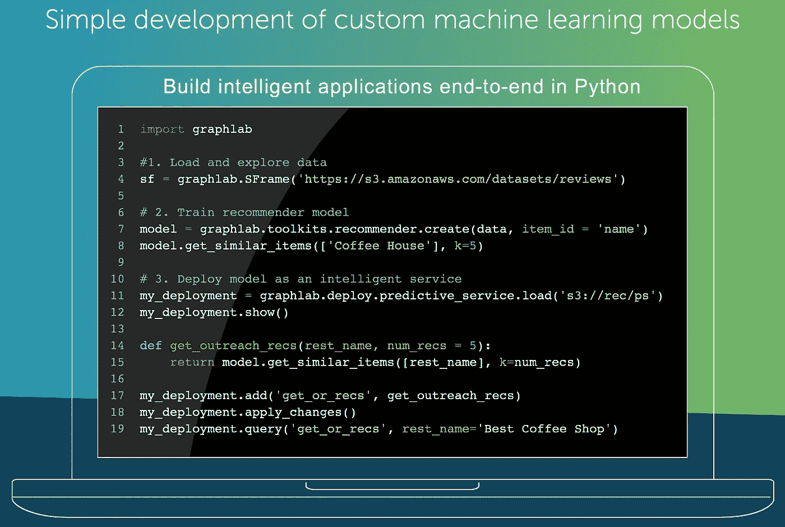
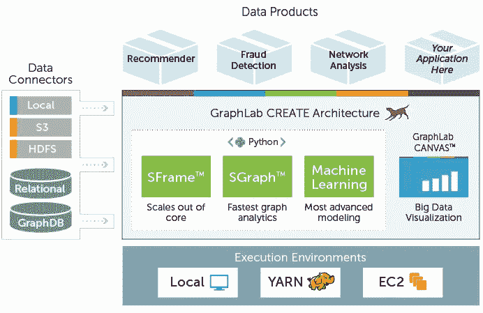
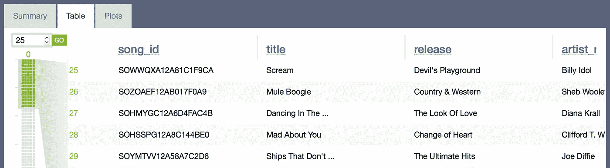
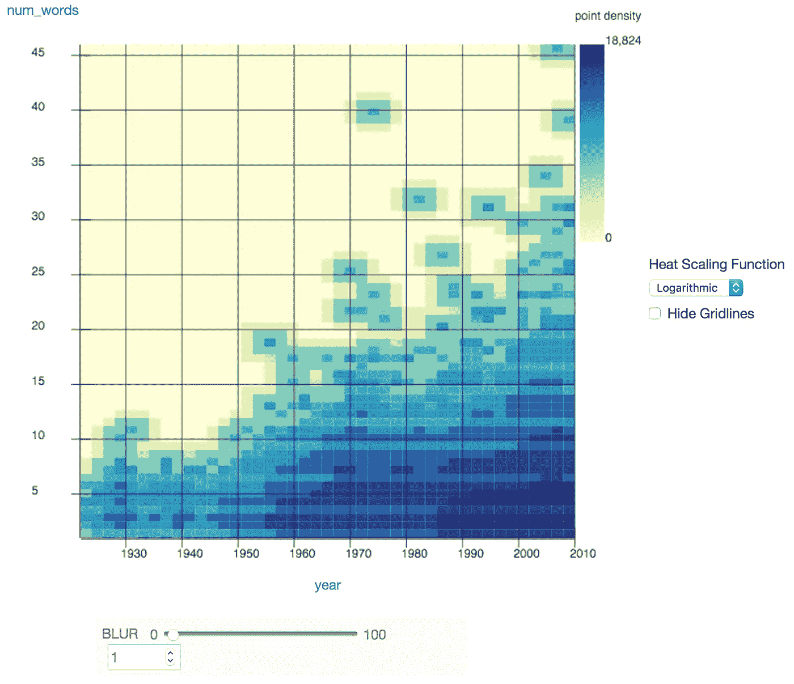
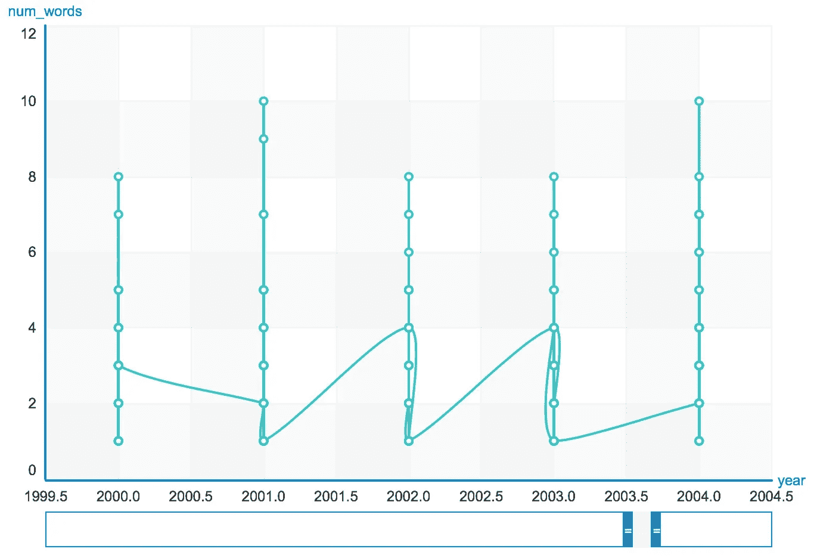
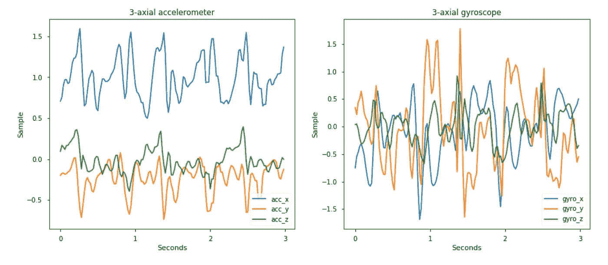

# Turi 创造的方式正在颠覆机器学习的格局

> 原文：<https://towardsdatascience.com/how-turi-create-is-disrupting-the-machine-learning-landscape-37b562f01eab?source=collection_archive---------5----------------------->

几个月前——1 月 18 日星期四——我在西雅图的第一次聚会上发表了演讲。这是我从芝加哥搬家后的第三天，所以没有浪费时间！

原因？没有什么比[苹果开源 Turi Create](https://9to5mac.com/2017/12/08/turi-create-framework-release/) 的消息*更让我关注的了，这是它在 2016 年收购 Turi 的[后拥有的机器学习(ML)库。](https://techcrunch.com/2016/08/05/apple-acquires-turi-a-machine-learning-company/)*

> 一句话:Turi Create 是一个 Pythonic 式的机器学习库，非常强大且易于使用，你应该探索它的能力！

首先，我要感谢 [Metis](https://www.thisismetis.com) 、 [BeMyApp](http://agency.bemyapp.com) 和 [Intel](https://www.intel.com/content/www/us/en/homepage.html) 共同赞助此次活动。

这篇文章是 meetup 的总结:我做了什么，观众问了一些相关的问题，一些意外访客的记录，以及我对 Turi Create 未来发展的想法。我还将分享最佳实践、经验教训以及对我未来项目的想法。



Turi Create

# 我展示的东西

首先，我分享了在准备 GraphLab Create 环境时学到的经验。眼尖的读者可能会注意到，GraphLab Create(以下简称 GC)看起来与 Turi Create(以下简称 TC)是不同的产品；Turi 团队告诉我，这种差异只是表面现象，因为两个包使用相同的核心代码，开源变体(TC)基本上可以做 GC 能做的一切。因此，虽然一些程序项目可能有所不同，但一般用法是非常相似的。

为了深入了解产品是如何发展的，我强烈推荐创始人 Carlos Guestrin 的这个演示。它已经有五年的历史了，但是 Guestrin 触及了早期开发阶段的动机和关注领域。为了了解软件包在“堆栈”中的位置，这里有一个常见的架构:



GC Architecture

值得注意的是，GC 和 TC 都运行在 Python 2 上，环境*必须用特定版本的支持库*来设置。作为一个挑战，我试图将新的包合并到我的主 [*anaconda*](https://www.anaconda.com) 环境中，但是遇到了*版本和依赖地狱*。所以，对于第一次来说:

1.  确保你有至少 8GB 的内存用于严肃的工作，或者设置在虚拟环境中
2.  [根据设置说明](https://turi.com/download/install-graphlab-create.html)创建一个新的 *conda* 环境
3.  然后，[注册许可证(针对 GC)](https://turi.com/download/academic.html)
4.  如果使用 TC，[将 repo](https://github.com/apple/turicreate) 克隆到您的机器上
5.  尝试[入门](https://turi.com/learn/userguide/sframe/introduction.html)指南中的一些练习

加载和管理数据与[熊猫](https://pandas.pydata.org)非常相似:

```
import graphlab as gl
%matplotlib inline# load data into SFrame
url = '[https://raw.githubusercontent.com/plotly/datasets/master/data.csv](https://raw.githubusercontent.com/plotly/datasets/master/data.csv)['](https://static.turi.com/datasets/millionsong/song_data.csv')df = gl.SFrame.read_csv(url)
```

从这里，我们可以调用汇总统计数据和一个交互式控制面板，它具有以下功能:

```
# summary statistics for a column
df['column'].sketch_summary()# show dashboard
df.show()
```

然后，您将能够快速找到特定的行范围，跟踪更多的汇总统计数据，并构建如下所示的交互式图表:



View large datasets with ease!



Heatmaps with various scaling functions



Line charts with zoom and drag capabilities

建模看起来与 SciKit-Learn 非常相似，但这是一件好事。如果它没坏，不要修理它:

```
# load housing data and fit a linear model
url = '[https://static.turi.com/datasets/regression/Housing.csv'](https://static.turi.com/datasets/regression/Housing.csv')
x = gl.SFrame.read_csv(url)lm = gl.linear_regression.create(x, target='price')
```

值得注意的是，GC 会自动创建“样本外”验证集，以跟踪真实的模型性能。有许多巧妙的技巧可以让你更有效地编码，更快地得到结果。然而，GC *预先选择了常见的方法*，因此您需要了解文档中的默认参数和假设！

与 SciKit-Learn 相比，一个常见的观众问题与性能有关。如果你仅仅使用 CPU 来拟合模型或者搅动数据，差别很小，并且会归结为代码优化、稍微不同的求解方法等等。然而，如果你有一个高度[可并行化的](https://en.wiktionary.org/wiki/parallelizable)任务，并且运行在 [AWS P2 或 P3 实例](https://docs.aws.amazon.com/AWSEC2/latest/UserGuide/accelerated-computing-instances.html#gpu-operating-systems)上，或者你在办公室里有一个强大的 Cuda 设置，我们所说的 TC 会快几个数量级。

这个事实本身就是将你公司的模型转移到 Turi 环境的完美理由。

目前，TC 和 SciKit-Learn 基于 Python 的 ML 库之间的一般比较如下:

## Scikit-learn 的优势:

*   开源:Scikit-learn 是一个开源库，有 500 多个贡献者和强大的支持
*   对 Python 3 的支持:Scikit-learn 支持 Python 3，而 Graphlab Create 只与 Python 2 兼容
*   更多算法:与 Graphlab 相比，Scikit-learn 拥有更多算法

## Graphlab Create 的优势:

*   Graphlab Create 是一款 24/7 全天候支持的商业软件
*   可伸缩性:Scikit-learn 实现只在内存中执行。GraphLab Create 能够扩展到核外，许多多线程实现利用了机器上的多个核。
*   GPU 支持:你可以安装带有 GPU 加速的 Graphlab Create，它可以让某些任务的速度快得惊人

最后，*在演讲*之后，Turi 的三个核心成员——负责 GC 和 TC 的编码和开发——走上前来介绍他们自己！现在，苹果的员工们，我们就产品的未来、外部市场的看法和商业模式进行了深入的交谈。

*太神奇了！*

也许是好事，我不知道他们一直在看着我…无知是福。

# 苹果和机器学习

苹果非常认真地建设其机器学习(ML)能力，因为它寻求在利润丰厚的“大数据”领域与谷歌和脸书等其他巨头竞争。然而，苹果的策略却截然不同。作为一个以[客户数据隐私](https://www.apple.com/privacy/)为荣的组织，我们的重点是利用苹果对其产品用户的了解来改善总体用户体验，包括:

*   [Siri 变得更加智能](https://www.cnet.com/how-to/11-new-ways-you-will-be-able-to-use-siri-this-fall/)预测你的需求
*   [Apple Music 利用 ML](https://www.google.com/url?sa=t&rct=j&q=&esrc=s&source=web&cd=1&cad=rja&uact=8&ved=0ahUKEwj-0ubl1IPZAhUPM8AKHft1Du4QFggnMAA&url=https%3A%2F%2Fwww.wired.com%2F2016%2F08%2Fwill-machine-learning-outperform-human-curation-in-apple-music%2F&usg=AOvVaw17HW1oR4pR1vhGlAMInU3w) 帮助您发现令人惊叹的新艺术家
*   来电显示[用于拨打您 iPhone 的新号码](https://www.wired.com/2016/08/an-exclusive-look-at-how-ai-and-machine-learning-work-at-apple/)
*   使用 ML 来[预测你的卡路里消耗和一般活动](https://www.wired.com/2016/08/an-exclusive-look-at-how-ai-and-machine-learning-work-at-apple/)
*   [差异化隐私](https://www.wired.com/2016/06/apples-differential-privacy-collecting-data/)为所有这些服务提供动力

在苹果的[定期更新并面向公众的博客](https://machinelearning.apple.com)上，我们可以看到最新最棒的产品和服务的暗示——以及数据科学是如何实现的。

# Turi 如何创造可能进化

TC 已经是 Pandas 和 [SciKit-Learn](http://scikit-learn.org/stable/) combo 的有力竞争对手，拥有完整的堆栈数据管理和建模能力。它快速而高效，并具有某些功能，如 GPU 加速，这些功能在 SciKit-Learn 中不存在或处于早期阶段。此外，由于该产品是苹果 ML 推广的一个关键方面，我希望看到与框架的深度集成，如 [Core ML](https://developer.apple.com/documentation/coreml) 、 [ARKit](https://developer.apple.com/arkit/) 和 [HealthKit](https://developer.apple.com/healthkit/) 。

Turi 与 [Tensorflow](https://www.tensorflow.org) 等平台有功能重叠，鉴于对神经网络等模型的关注和宣传，这种重叠可能会在深度学习领域增长。事实上，GPU 加速的一个关键价值主张是允许更快地拟合大型数据集上的深度模型。我也希望看到像 [Keras](https://keras.io) 这样的包装器扩展数据科学家修改参数和架构的便利性。

已经有一个[快速指南](https://developer.apple.com/documentation/vision/classifying_images_with_vision_and_core_ml)介绍如何将 TC 集成到 iPhone 应用程序中，并通过 App Store 直接向用户部署你的 ML 模型。当前的型号产品包括以下列表，但随着时间的推移，我们应该会看到更多的产品:

*   推荐系统
*   [图像分类](https://github.com/apple/turicreate/blob/master/userguide/image_classifier/README.md)
*   [图像相似度](https://github.com/apple/turicreate/blob/master/userguide/image_similarity/README.md)
*   [物体探测](https://github.com/apple/turicreate/blob/master/userguide/object_detection/README.md)
*   [活动分类器](https://github.com/apple/turicreate/blob/master/userguide/activity_classifier/README.md)
*   [文本分类器](https://github.com/apple/turicreate/blob/master/userguide/text_classifier/README.md)

最后，我希望在未来几年看到对主题建模和自然语言处理空间的更深入的推动，特别是随着 Siri 的不断完善。

# 您企业的下一步

TC 似乎是一个令人惊叹的平台，但真正重要的问题是:

> Turi Create 如何让我的业务受益？

*   如果你的企业出售订阅服务，或者软件许可，TC 的[广泛的分类模型套件](https://github.com/apple/turicreate/blob/master/userguide/supervised-learning/classifier.md)可以决定哪些客户更有可能流失，或者“流失”。然后，您可以激励这些客户续订，或者确定另一种产品是否符合他们的需求。
*   如果你的公司提供许多产品或服务——并且你对你的客户群有所了解——你可以实施 TC 的[推荐系统](https://github.com/apple/turicreate/blob/master/userguide/recommender/README.md)来量化客户的兴趣，并对你营销或提供的新产品进行优先排序。这些模式为亚马逊和易贝的“推荐给你”列表、Spotify 的音乐播放列表管理和 GrubHub 的供应商聚光灯提供了动力。
*   最后，如果您经营一家使用身体传感器收集心脏、大脑或活动指标的医疗企业，TC 的活动分类器可以从加速度计、陀螺仪、恒温器等设备中获取数据。该模型将预测可能发生的锻炼形式、心脏状况或医疗紧急情况。这个应用程序可以扩展到其他领域，如网络安全、工程应用程序或任何从噪声数据中推断模式的领域。



Classifying Activities from Gyroscope Data

# 我业务的下一步

我想在 TC 环境中重新创建我过去的一些项目，作为一个具有审查基线的真实世界测试。我将把这些代码中的一部分——尤其是我的集合模型——部署到各种 AWS 实例类型中，以便判断哪种架构能给我带来最高的性能。

今年，我专注于将更多的数据科学应用到我的投资和加密货币策略中，TC 是建立神经网络或类似投资组合优化模型的有力竞争者。

最后但同样重要的是，作为 Metis 的数据科学讲师，我将寻找将 TC 纳入我们课程的方法，以便让学生了解。在我的书中，最终的成功是:一名学生构建了一个以 ML 为中心的 iOS 应用程序，并成功地将其部署到拥有超过 10 亿智能手机用户的市场中！

你认为如何开始使用 Turi Create？在下面评论或者在[推特](https://twitter.com)和 [LinkedIn](https://www.linkedin.com/in/jbalaban/) 上联系我。