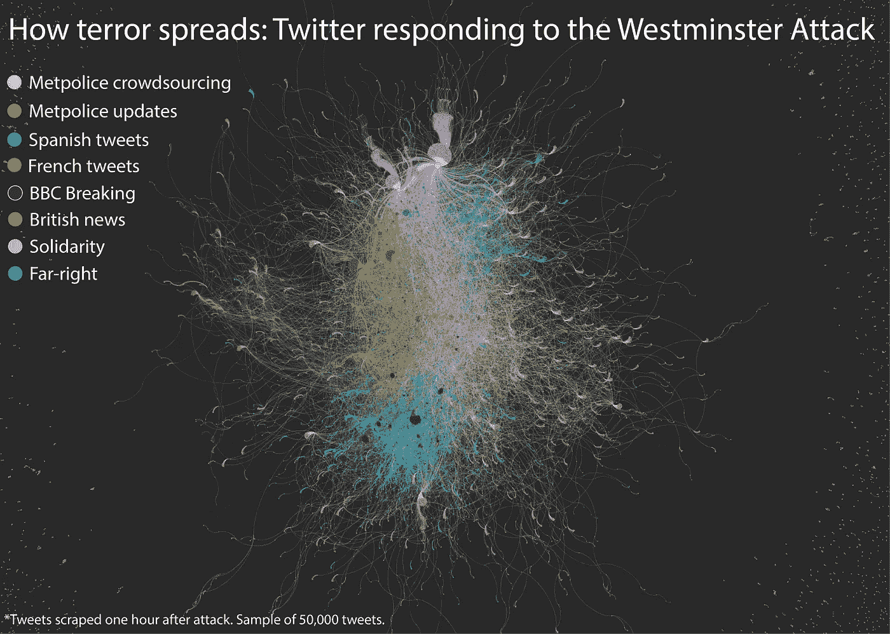
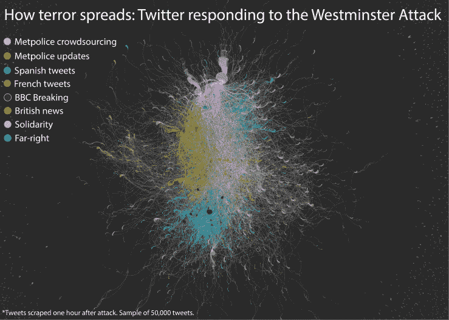
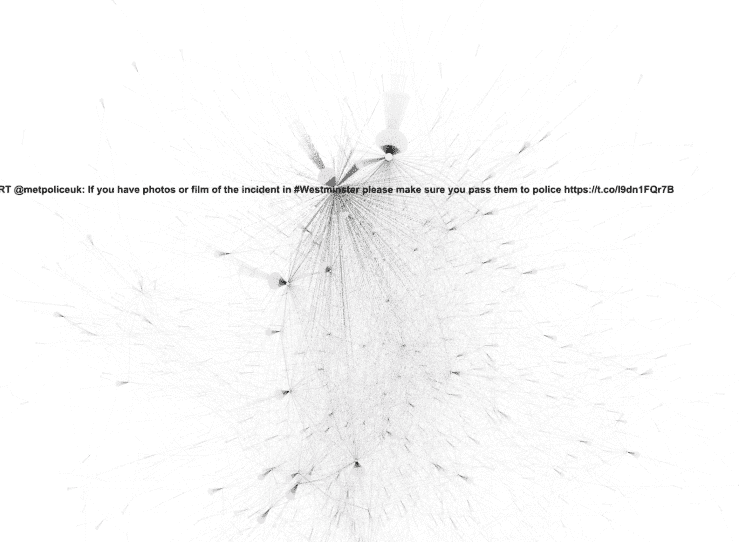
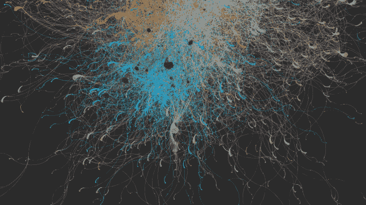
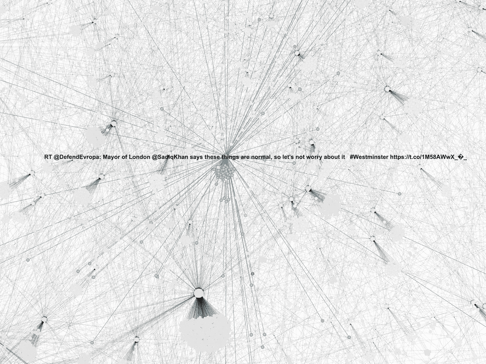
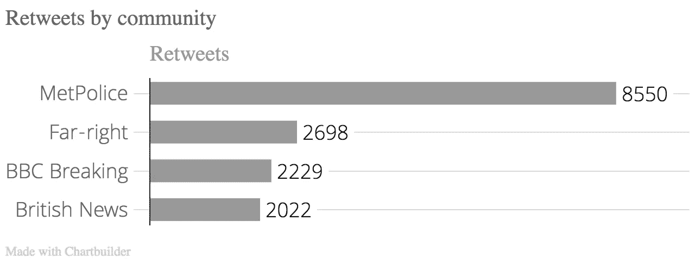

# 威斯敏斯特袭击一小时后推特如何回应

> 原文：<https://towardsdatascience.com/how-twitter-responded-an-hour-after-the-westminster-attacks-bd2823a31195?source=collection_archive---------4----------------------->

3 月 22 日威斯敏斯特袭击的消息像许多恐怖袭击一样传播开来:一名目击者的推文、英国广播公司的现场报道和大量来自直升机的空中视频，同时新闻媒体争相将这些片段拼凑起来。伦敦震惊地看着大本钟成为高度警戒的警戒线中心。但是在他们哀悼之前，许多人只是想知道发生了什么。

就像许多突发新闻事件一样，Twitter 成了了解事件最新进展的最快途径之一。为了更好地了解人们在混乱时期如何使用社交网络，我筛选了 30 分钟内收集的 5 万条推文样本。这些推文是在袭击者开始穿越威斯敏斯特大桥的致命驾驶后一小时发出的。

我发现的是各种情绪的巨大混合体:从团结和众包到伊斯兰教和移民的危险。在运行一些统计分析后，下面的网络图显示，通过映射该时间段内所有带有#Westminster 的推文的转发模式，可以找到八个潜在的社区。

图形上的每种颜色代表与攻击相关的不同推文社区。一个节点可以连接到两种不同的颜色，但颜色是基于它的原始源 tweet。lines 表示由一个帐户发送的原始推文的转发。尽管许多账户在一天中被转发了很多次，但我在分析数据时发现了一些要点。

# 大多数人想要帮助或显示团结

在数据集中发现的社区中，至少有三个与众包或展示团结有关。@MetpoliceUK 是转发量最大的账户之一，代表了大部分粉色和绿色的节点。这段时间转发量最大的推文来自大都会博物馆，敦促人们对受害者表现出谨慎和尊重。

大都会博物馆还要求人们给他们发送任何关于这次活动的信息。这条推文被广为流传，不管图中是什么社区。

灰色社区代表非新闻账户，通常包含表示关注或声援袭击受害者的推文。然而，这组情绪可能比图中描绘的这一种颜色大得多，因为由于语言的差异，所有法语和西班牙语的推文都被自动分为一个单独的类别。

# 更大的新闻网络仍然是混乱中最共享的来源

尽管 Twitter 允许任何人传播此类事件的新闻，但像@BBCBreaking 和@AP 这样的大型新闻网络仍然是正在发生的事件的新闻报道的首选来源。以至于这些推文被归类到一个独特的社区。

其他新闻网络也迅速报道了这件事(用橙色表示)。像@DailyMail、@Skynews、@iTVNews、@DailyMirror 和@Telegraph 这样的账户遍布网络中心，成为其他社区发展的基础。

# 极右的民族主义者抓住机会传播恐惧

哪里有恐惧，哪里就有人愿意煽动恐惧。图表底部用蓝色表示的社区通常可以被描述为表达极右或民族主义情绪。这些推文的严重性和意识形态各不相同。转发量最广的账号有@DefendEvropa、@V_of_Europe 和@Foxnews。

一些推文只是在传播袭击的消息，或者呼吁谨慎。但是其中一些最大的节点(因此当时转发量最大)是带有反伊斯兰情绪的推文。

无论是公开的政治还是对事件的本能反应，蓝色社区中的推文似乎表达了强烈的民族主义意识形态。这些推文在他们的社区中仍然相当孤立，但在某些情况下，会传播到图表的其他部分。

当考虑到两个社区由@MetpoliceUK 推文主导这一事实时，极右翼社区在相关转发量方面排名第二。

尽管这八个社区出现在数据集中，但还需要更多的分析来了解信息是如何随着时间的推移而传播的。然而，作为袭击发生一小时后许多问题仍未得到解答的推特样本，这些数据仍然揭示了一些关于混乱时期信息在推特上如何传播的见解，以及什么类型的账户正在分享它们。

# 用于分析的工具:

*   Python:用于抓取 Twitter
*   Excel:用于清理数据
*   Gephi:用于创建网络图和运行统计
*   Adobe Illustrator:用于创建图形

在此亲自探索 Gephi 图[。在这里](http://igor.gold.ac.uk/~bcool001/Westminster-network/index.html)下载原始数据[。所有代码都在](http://igor.gold.ac.uk/~bcool001/Westminster-super-clean-no-dup.csv) [Github 上。](https://github.com/bnj-cooley/Westminster-attack-network)

*原载于 2017 年 4 月 1 日*[*Benjamin cooley . me*](https://benjamincooley.me/2017/04/01/how-twitter-responded-an-hour-after-the-westminster-attacks/)*。*