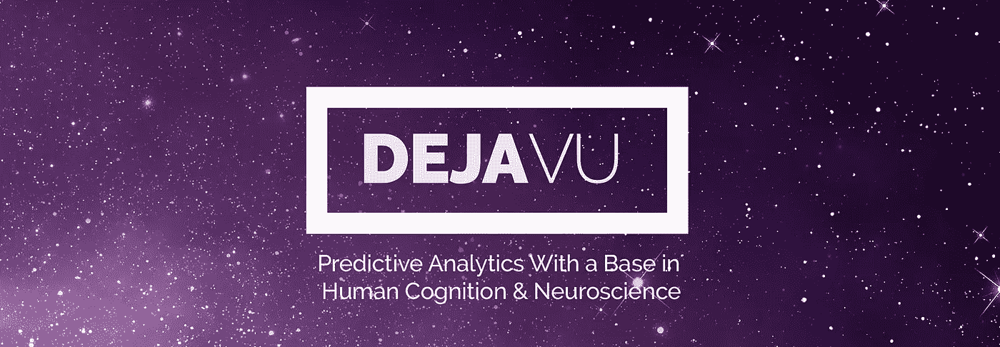
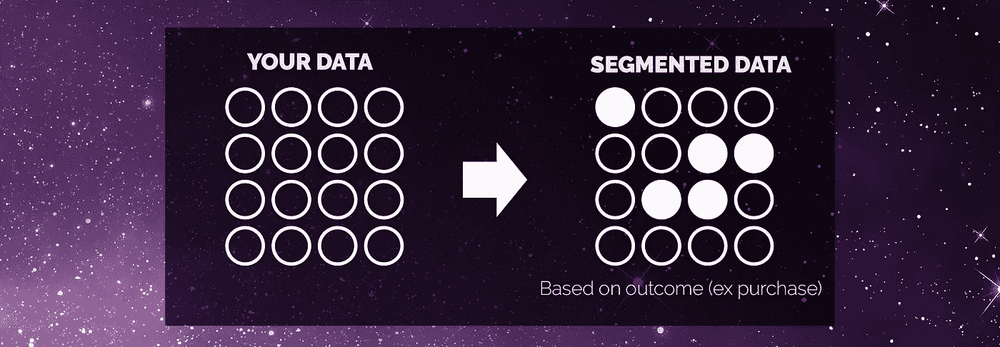
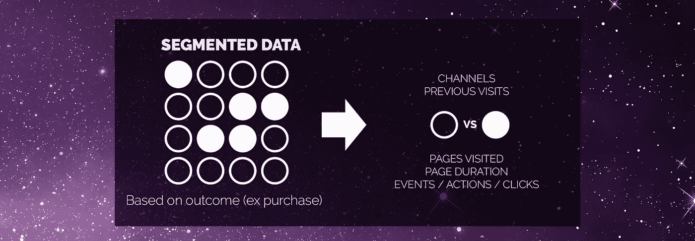
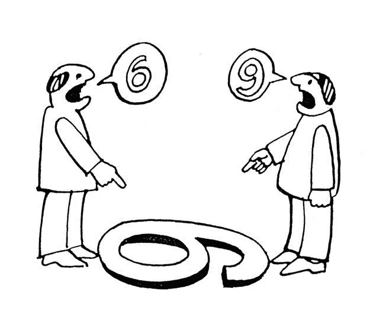
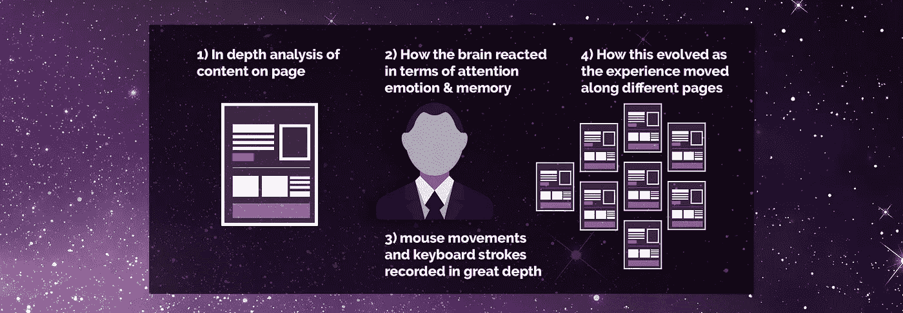

# 我们如何建立一种全新的预测分析方法

> 原文：<https://towardsdatascience.com/how-we-build-a-completely-new-way-of-doing-predictive-analytics-4be407420694?source=collection_archive---------9----------------------->

# 首先，这是当前在数字营销中进行预测分析的主要问题

 [## DejaVu |基于人类认知和神经科学的人工智能预测分析| 77Sense.com

### 加入免费测试版

77sense.com](https://77sense.com/dejavu) 

传统的预测分析工具从网站的所有访问中获取总数据，并根据预期结果对数据进行细分。一笔交易。这样，一些数据被遗漏(标记为噪声)，以便更深入地挖掘成功的数据(标记为信号)。

然后，对标记的数据进行数据挖掘，以找出与结果正相关或负相关的模式，换句话说，哪些可能导致预期的结果，哪些没有。

这些模式用于创建模型，这是一种数学表示，可以根据以前的数据(训练数据)计算未来的数据。然后，该模型用于预测输入数据的结果，并评估模型的性能。

通常会使用多种模型，以找到最适合数据的模型。

## 没有问题吧？—这比不做好得多

正确—做这种数据挖掘、建模和预测比不做要好得多。但这根本不是做预测的最佳方式。

为什么？

因为我们建模的数据是人类行为，而人类行为是由人类创造的，人类行为仍然是科学试图解开的东西。30 多年的神经科学文献证明了这一挑战——然而，就在我们进入一个令人兴奋的人工智能和机器学习时代时，神经科学也已经成熟为一个可靠的共识，即是什么让我们人类做出决定(买房子或可乐)

> 你数据中的每个点都是一个人——试图在你的网站上做一些事情

## 那么有什么问题呢？

神经科学可以同意的是，选择/决定是由三个因素驱动的——注意力、情绪和记忆。我们所关注的，结合我们的记忆，以及对此的情绪反应，是决策过程中最强的因素。

这三个因素不断更新我们对世界的认知，以及我们正在执行的任务。

通过这些过程获得的数据决定了我们如何看待这个世界。这就是为什么感知会因人而异——更重要的是因时间而异。

## 所以……大脑是我们为什么做出一个决定而不是另一个决定的答案——或者更准确地说，是注意力、情感和记忆

我们面临的挑战是抛弃看待数据的“旧”方式，提出使用相同数据的新方式，这种方式与屏幕后面的人类大脑中实际发生的事情更加一致。

一个激进的挑战需要一个激进的新方法——所以我们建立了一个神经营销平台来快速测试世界任何地方的数百人([emolab . io](http://emolab.io))——我们建立了一个系统来简化这些测试的招募([参与者](http://emolab.io/participator))

长话短说——我们出去测试了来自世界各地的 6500 人，让他们像在家一样浏览网页。我们使用 [EmoLab](http://emolab.io) 每秒钟测量他们的注意力、情绪和记忆激活 60 次。

**这产生了超过 6 亿个数据点，涉及人类的注意力、情感和记忆**在我们控制一切的环境中，我们还能够逆向工程他们的整个经历。

1.  通过专有的机器学习方法，将 HTML/Javascript & CSS 转换为单个网页和域的分类，我们保留了网页和域的意图的细节。我们还对与页面相关的 DOM 树层次结构进行了深入分析(检测顶部菜单、左侧导航、过滤器等)
2.  我们收集了这个人看向哪里的眼球轨迹，以及随后对这个元素的情绪反应，以及之前元素的连锁反应
3.  然后，我们收集了关于鼠标移动和键盘敲击的非常详细的信息，以及用户在普通网站上进行的滚动和其他标准微事件的具体信息。

## 与情绪反应相关的微事件数据库

这就产生了一个我们称之为微事件指纹的大型数据库——微事件指纹是与特定情绪反应相关的特定类型页面上的特定鼠标移动。

我们还创建了一种实时方法来预测用户在页面上的位置——无需使用网络摄像头或眼球跟踪设备——仅使用鼠标移动细节。

结果是一个我们命名为 SuperSentient 的小 javascript 片段——它纯粹基于鼠标移动来预测用户的注意力和情绪反应。

## 预测分析不应该是将数据位放入虚拟框中并试图预测用户的购买意愿，而应该是预测意图、动机和内部目标设置，以便我们可以在这方面帮助用户，创造最终的用户体验。

我们对每个会话进行实时预测分析，比以前更快、更可靠、更精确。

 [## DejaVu |基于人类认知和神经科学的人工智能预测分析| 77Sense.com

### 加入免费测试版

77sense.com](https://77sense.com/dejavu)