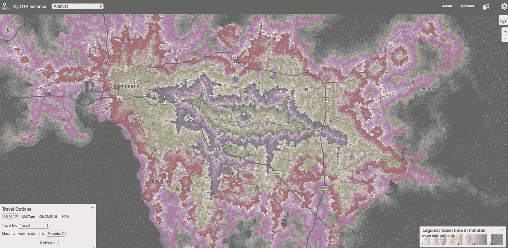
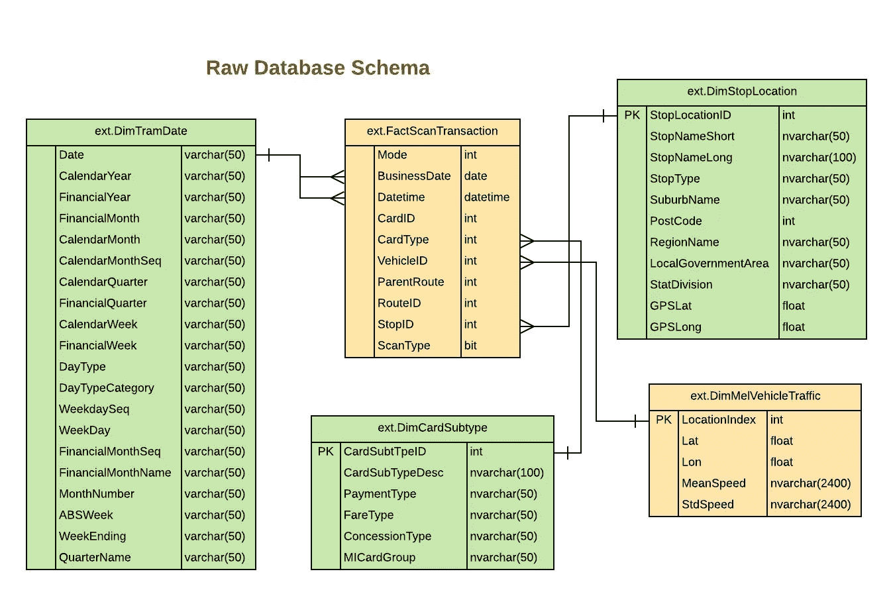
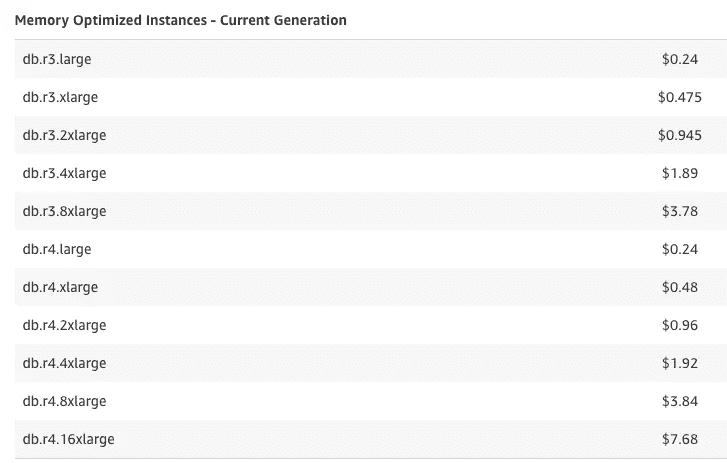
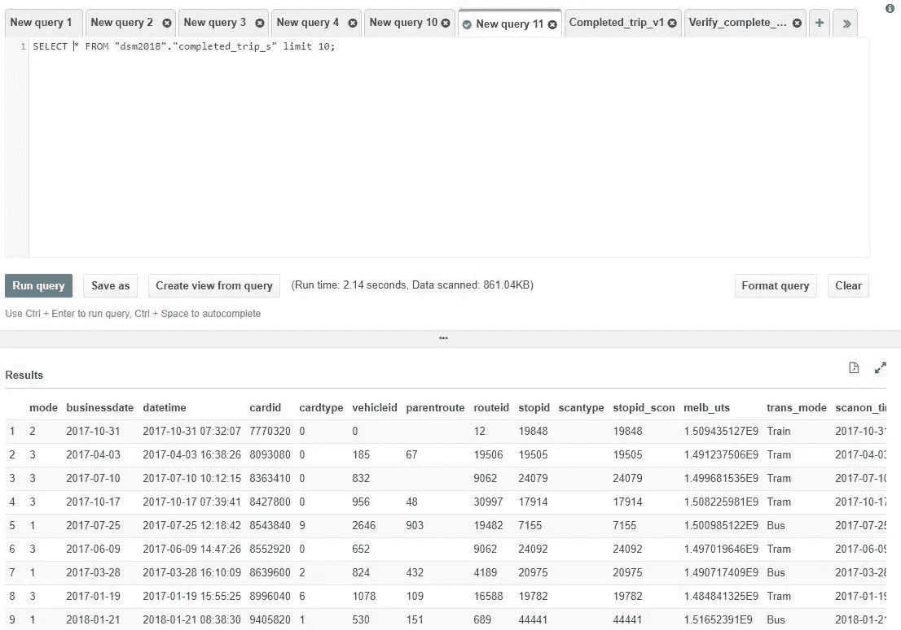
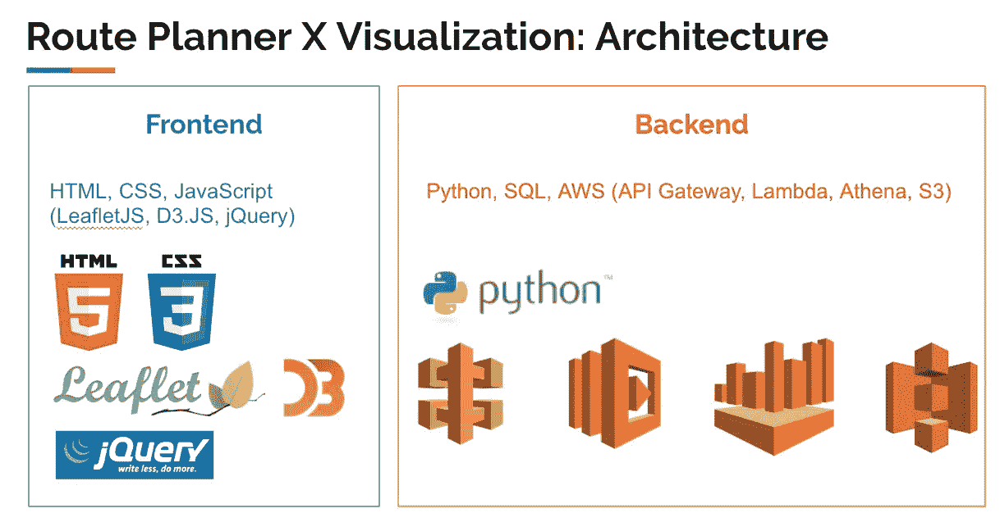
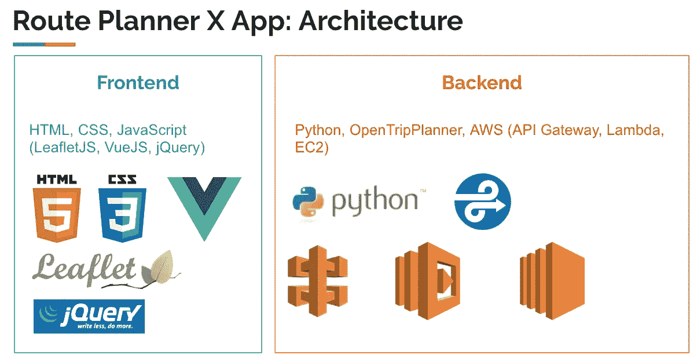

# 我们如何在 AWS 基础设施上构建数据科学 Web 应用程序“Route Planner X”

> 原文：<https://towardsdatascience.com/how-we-built-data-science-web-app-route-planner-x-on-aws-infrastructure-71f814247a0c?source=collection_archive---------12----------------------->

如今，找到拥有数百万或数十亿行数据的公司比以往任何时候都容易。然而，问题不在于**“如何创建更多的数据”**，而在于

> 如何利用这些庞大的数据？

解决这个问题的一个方法是将数据迁移到**数据仓库**，这是为分析任务构建的数据库。也就是说，构建数据仓库是一个昂贵且耗时的过程。

诸如 [AWS](https://aws.amazon.com/) 、 [GCP](https://cloud.google.com/) 或 [Azure](https://azure.microsoft.com/en-au/) 等公共云的出现为解决这个问题提供了更好的方法。在这篇博客文章中，我将告诉你我们的 5 名毕业生团队如何构建一个端到端的数据科学 web 应用程序来处理 1.5 亿行数据。

## 什么是「路线规划师 X」？

**路线规划师 X** 是我们为[墨尔本数据马拉松 2018](http://www.datasciencemelbourne.com/datathon) (澳大利亚最大的数据马拉松活动之一)在 2 个月内构建的应用程序的名称(我们团队的名称是“不是热狗”)。有 400 多名参与者，包括学生和非学生。

我们真的很努力，在提交的最后一天，我们只有 6 个小时来建立演示文稿。最终，这种努力是值得的。我们获得了非学生 Data2App 类别的二等奖。

**路线规划器 X** 的想法基于构建“**等时线地图**”的想法，该地图显示了人们在特定时间内从特定点可以行驶多远。

我们将等时图与 PTV(维多利亚公共交通)数据和[500 亿郊区火车环线计划](http://www.abc.net.au/news/2018-08-28/melbourne-suburban-train-loop-promised-by-labor/10172184)结合起来，得出了你可以在上面的视频中看到的故事。

Example isochrone built from PTV transportation feed (*Image by author*)

## 关于数据集:Myki 事务数据

Myki card in action. Thank you for the photo from [PTV Website](https://www.ptv.vic.gov.au/tickets/general-information/myki-equipment/) (This is the old Myki card, the new one is in black color)

在继续讨论应用背后的技术之前，让我快速浏览一下输入数据是什么。

每年为墨尔本数据马拉松的参与者提供的数据集都是不同的。去年，我们有一个关于药物的非常有趣的数据集。今年，数据集更加有趣。这是关于墨尔本数百万乘客使用的交通工具。

当任何乘客点击闸机上的 Myki 卡进入/离开任何车站时，都会收集这些数据。该数据集涵盖了墨尔本的所有交通类型:火车、电车和公共汽车。

由于墨尔本使用公共交通的每个人都将被记录在这个数据集中，我们在提取见解时获得了很多乐趣，并了解了一些有趣的行为，如*许多人在免费电车区旅行时如何点击他们的 Myki 卡*。

我相信总共有大约 7.5 亿行数据。然而，80%的数据集发布得太晚，没有多少团队有足够的时间将这些数据投入使用。我们依赖于第一天发布的前 1.5 亿行。

数据已经出来了。关系表的 txt 文件。没有合适的数据字典来告诉我们哪个表和哪个列是哪个。所以我们想出了我们自己版本的表之间的关系:

Database Schema (Note: This may not be the final version of the schema we used since I got this from our team’s early conversation on the Slack chat) (*Image by author*)

## 大数据的数据接收

我知道 1.5 亿行对于一些人来说可能听起来像是儿戏。然而，根据我们的团队成员在墨尔本 Datathon 的 Fleep chat(类似于 Slack 的群组聊天室)上发现的情报，许多团队都在努力将数据读入内存。

我们的团队尝试了 3 种方法来读取这个数据集。我们在数据接收上浪费了大量时间(和金钱)。我们尝试了三种方法:

## 方法 1:笔记本电脑上的 RDBMS

这种方法是在笔记本电脑上安装关系数据库管理系统，如 MySQL 或 PostgreSQL。然后将数据导入到这些 RDBMS 中，以便查询数据。

这是我去年为 2017 年墨尔本数据马拉松做的。如果我没记错的话，大约只有 800 万到 1200 万行数据。我们可以轻松地加载 800 万行数据并即时查询。在我的 Macbook 上，查询过程大约需要 3-4 分钟。这是缓慢的，但仍然可以接受。

然而，对于 1.5 亿行数据，这种方法对于我们探索数据来说效率不高。因此，我们转向了云计算。

## 方法 2:AWS 云上的 RDBMS(AWS RDS)

云技术赋予了我们梦寐以求的计算资源。但是，我们不能只是启动最大的机器，让它永远开着。正如本大叔(来自蜘蛛侠)曾经说过的“权力越大，责任越大”，AWS 中的权力越大，责任也就越大(要支付大额账单)。

尽管 AWS 赞助了墨尔本 Datathon，并给予每个团队 500 美元的 AWS 积分，但我们仍然超出了限额，因为我们的团队在我们采取下一种方法后忘记了终止数据库。

Pricing table per hour for AWS RDS. We are using the biggest machine for $7.68 per hour. Photo by [AWS](https://aws.amazon.com/rds/mysql/pricing/?pg=pr&loc=2)

我们使用了名为**“AWS RDS”(关系数据库服务)**的 AWS 服务，它基本上是基于云的 MySQL。查询速度比使用本地机器快，但是我们发现查询时间不够快。一些查询可能需要 30-60 分钟。

由于我们只有周末有时间(每个人都在全职工作)，我们需要在我们拥有的短时间内完成工作。那时我们在 AWS 中试验了相当新的服务，叫做 **Athena** 。

## 方法 3: AWS Athena —来自文本文件的 SQL 查询引擎

Athena lets you write SQL to query data directly from text files (*Image by author*)

**Athena** 是 AWS 服务，让我们可以从存储在 S3 桶(AWS 的云存储，类似于 Dropbox)中的文本文件中查询信息，而不必担心打开/关闭数据库服务器。价格也比 RDS 实惠很多。

Athena 扫描每 TB 数据的成本为 5 美元。这意味着我们可以通过优化查询来扫描更少的数据，从而轻松控制成本。

我们的团队完全转向 Athena 进行分析。这比我们迄今为止尝试的任何其他方法都要快，而且成本只是 RDS 的一小部分。我们还发现了[使用 Python 的 boto3 库](https://medium.com/@devopsglobaleli/introduction-17b4d0c592b6)向 Athena 发送查询的方法。这使得 Athena 的自动化非常简单。

## 我们想尝试的另一种方法是:BigQuery

在这次比赛中，我们听到了很多使用 [BigQuery](https://cloud.google.com/bigquery/) 的团队的成功故事。下次有机会做 Datathon 时，我们一定会尝试 BigQuery。

在我们进入下一节讨论如何整合之前，我想提一下，我发现墨尔本数据马拉松是一个试验我们以前没有尝试过的新技术的好方法。与没有时间学习新技术的 24-48 小时黑客马拉松不同，墨尔本数据马拉松给了我们两个月的时间。在数据马拉松开始之前，我们没有使用或了解过雅典娜。

## Web 应用架构

您可能会从视频中注意到，我们的提交包括 2 个应用程序:第一部分是可视化应用程序，第二部分是路线规划器 X。

可视化应用程序从 AWS 基础设施查询数据集，如下图所示:

Frontend & Backend technologies for visualization part (*Image by author*)

这里是每项技术的简要描述，请随时提问:)(我可能无法在后端部分给出准确的答案，因为我的工作主要是在前端)

*   **HTML / CSS** —用于页面布局。CSS 用于将页面分成两半。
*   **LeaftletJS** —用于在可视化中绘制交互式 choropleth 地图。这是我们视觉化的主要部分。
*   **D3。JS** —用于在页面右侧绘图。我们还使用了 [C3。JS](https://c3js.org/) 是 D3 的包装器。
*   **jQuery** —用于管理可视化中的交互。
*   **API 网关** —用于构建 web API 端点，以便我们的前端可以与后端联系，即使它们不在同一个服务器上
*   **Lambda + Python** —用于调用 Athena 查询数据。然后，结果将通过 API 网关发送回前端。
*   **雅典娜** —用于查询存储在 S3 桶中的文本文件。如前所述，雅典娜是超级快，用户不必等待分钟。
*   **S3** —用于以快速、安全且经济高效的方式存储整个数据集。

注意，我们**将前端和后端解耦**，以增加系统的灵活性。发生在前端或后端的基础设施的变化永远不会影响到另一方。

对于视频的第二部分，路线规划器应用程序，我们基于 [OpenTripPlanner](http://www.opentripplanner.org/) 的 API 服务器构建，它允许我们自定义数据以生成自定义的等时线地图。下图显示了我们使用的技术。

Frontend & Backend technologies for the app part (*Image by author*)

我们对应用程序部分使用了非常相似的架构。这部分的新组件是:

*   **VueJS** —因为允许用户添加他/她自己的数据点。我们必须使用 VueJS 来帮助管理输入数据。
*   **OpenTripPlanner** — OTP 是使用自定义 GTFS 数据生成路线计划的 Java 客户端。我们使用 PTV·GTFS 的数据以及基于用户输入的合成路线计划，以绘制最终的等时线。
*   **EC2** —这基本上是云上的虚拟机。我们必须启动 EC2 实例，以便在其上安装 OTP。

## 墨尔本数据马拉松的主要收获

在今年的墨尔本数据马拉松中，我们学到了很多东西，并有机会尝试新技术。这绝对是一次无价的经历。如果我想分享一些关于这次数据马拉松的事情，这里是我想到的三件事:

## 要点 1)记得在使用完 AWS 资源后终止它们！！！

在 EC2 或 RDS 等流行的 AWS 服务中，您可以停止或终止实例。不同之处在于:

*   **停止**不会删除文件，稍后您可以**再次启动**，但是即使您已经停止，仍然会产生文件存储费用。对于 RDS，停止的实例将在 7 天不活动后自动重新启动。(我们就是这样赔钱的。它自己又开始了，直到一天过去了我们才知道。)
*   终止将从你的实例中完全删除所有文件。这种情况下不会有更多的成本。

请记住，为了阻止账单增加，您必须**终止**。

## 2)黑客马拉松/数据马拉松需要多种多样的技能

如果你不是从 ETL 到可视化无所不能的独角兽，这完全没问题。你不必能够端到端地做所有的事情。但是你的团队必须能够端到端地做所有的事情。

组建团队时，确保团队成员拥有不同的技能组合，涵盖各个领域，例如 datathon:数据工程师、数据分析、数据可视化、开发。

## 把这当成一个学习的机会

得点奖总比没奖好。但我总是专注于为未来的工作学习新技能，而不是专注于奖金。

我相信这些新技能对我的职业生涯会比你获得的奖励更有价值。哦！记得记下你所学到的东西。写博客也是分享和获得反馈的好方法，不管你对某些话题的理解是否正确。

我希望这篇博文对那些想在云上构建 web 应用程序的人有所帮助。如果你更喜欢在内部构建东西，请阅读我今年早些时候发表的[【指南】用 React、NodeJS 和 MySQL](/guide-building-data-science-web-application-with-react-nodejs-and-mysql-1c55416ff0fb) 构建数据科学 Web 应用程序。

欢迎对任何问题发表评论，或给我发邮件询问 woratana.n@gmail.com 的任何问题。最后但同样重要的是，感谢墨尔本 Datathon 2018 的工作人员，他们是我生命中这件大事的幕后推手。

*最初发表于* [*沃拉纳珀斯*](http://www.byperth.com/2018/10/14/how-we-built-data-science-web-app-route-planner-x-on-aws-infrastructure/) *。*