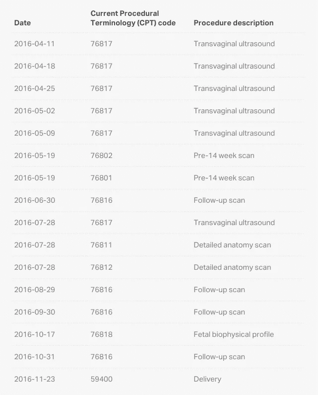
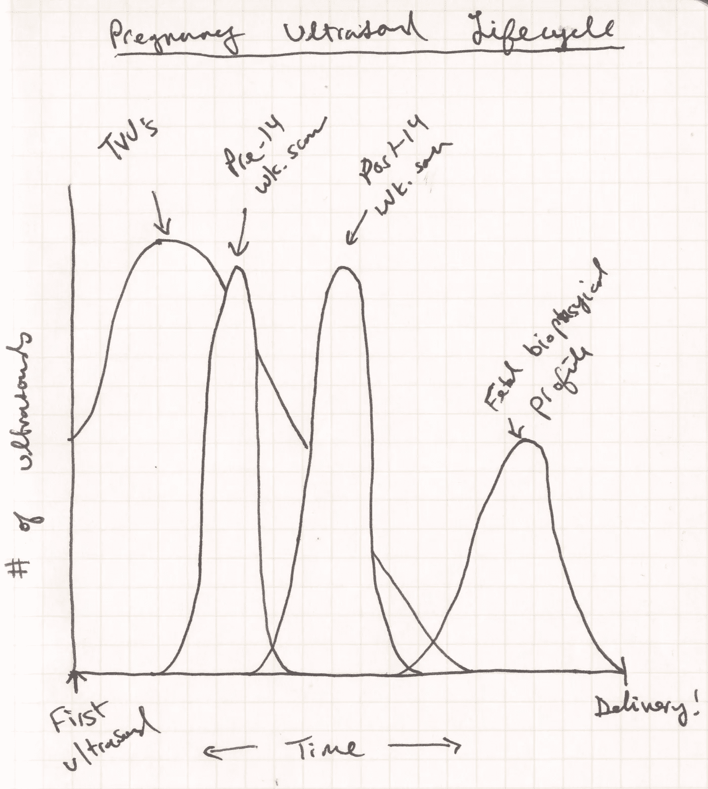
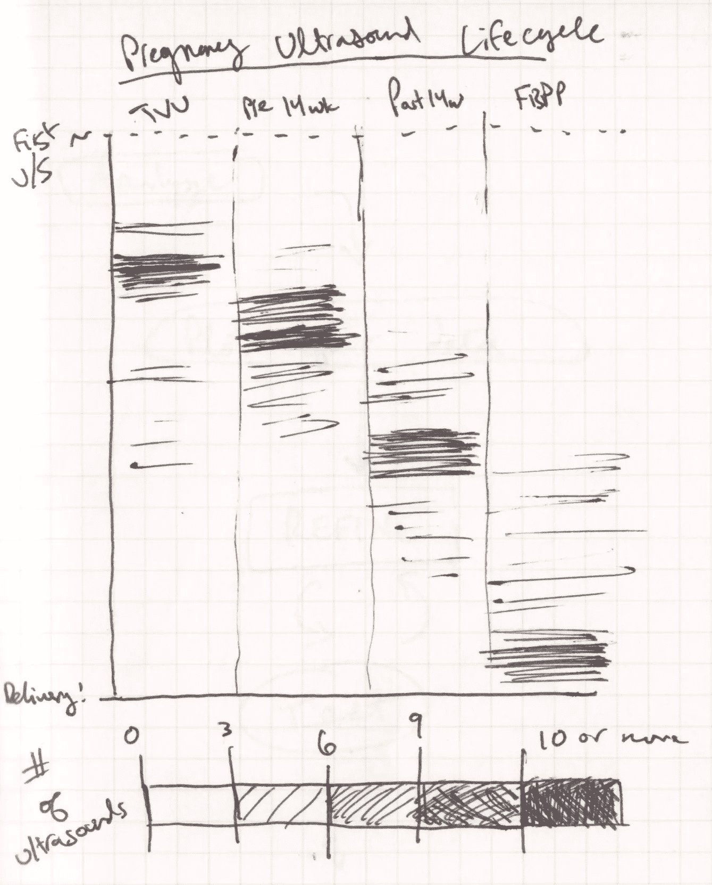
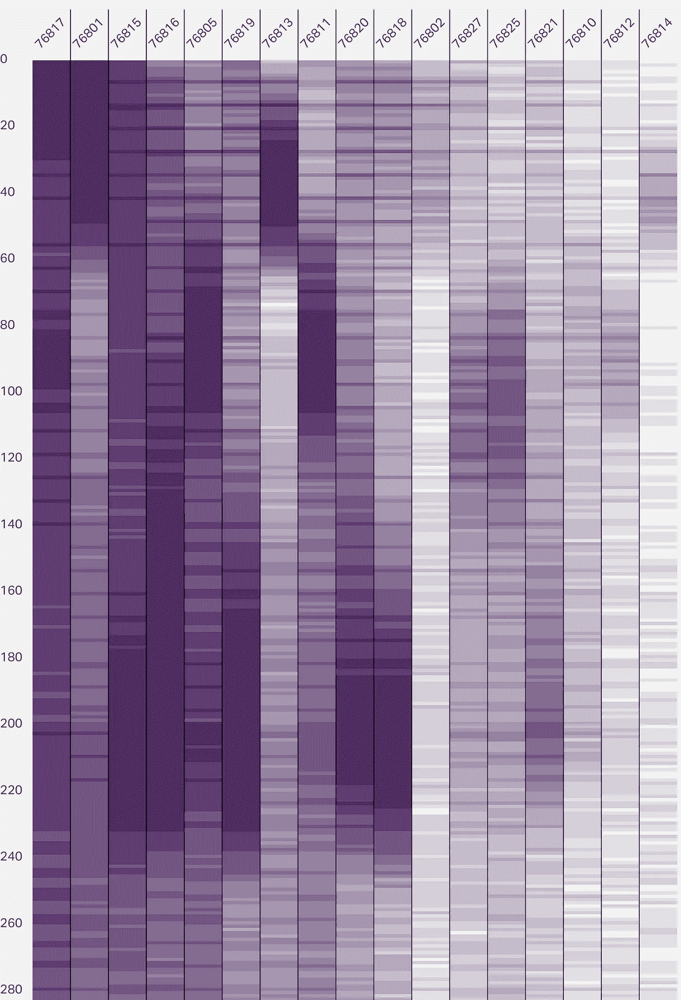
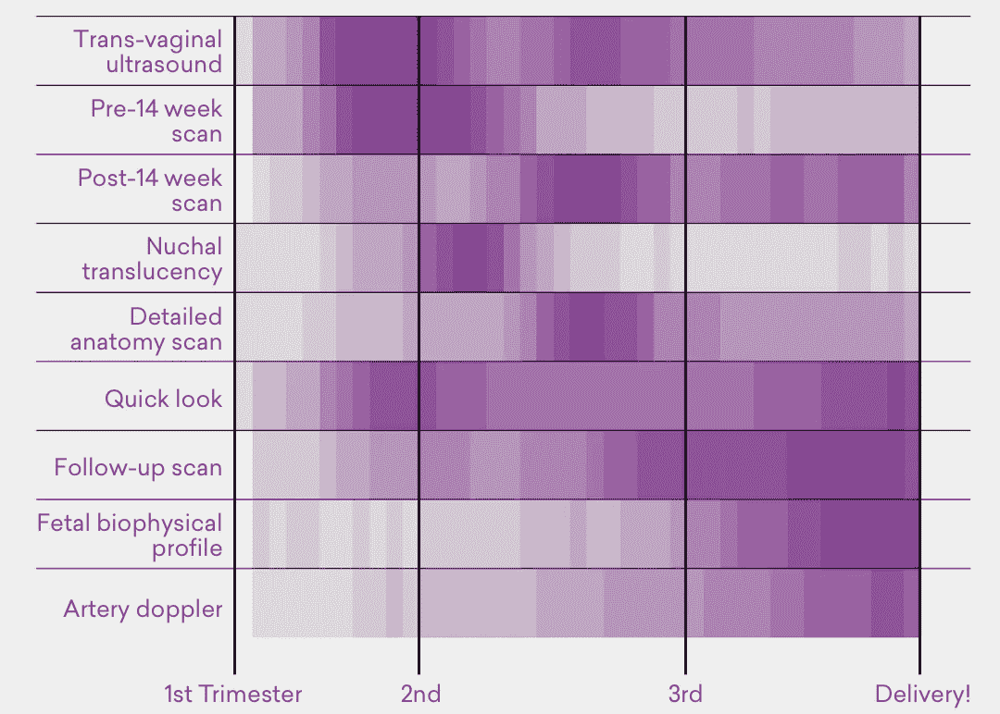
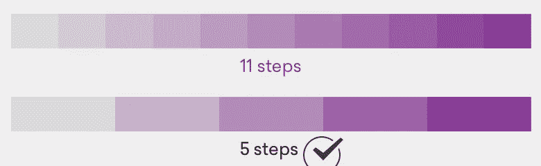
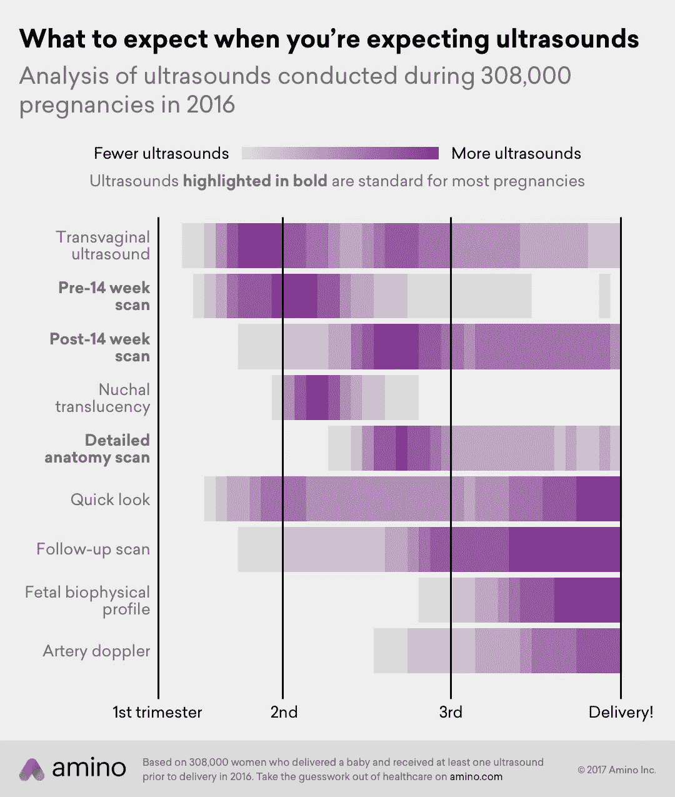

# 我们如何在 Amino 可视化数据

> 原文：<https://towardsdatascience.com/how-we-visualize-data-at-amino-c38e1ee4ba05?source=collection_archive---------5----------------------->

我们都致力于为医疗保健带来透明度。为了做到这一点，我们把大量复杂的信息变得简单易懂。有效数据可视化的目标没有什么不同，这也是我们在 [Amino 如此关注它的原因。](https://amino.com/)

虽然医疗保健和数据科学的交叉是一个令人兴奋的前沿，但有一个大问题:医疗保健已经令人困惑。添加大量的数据，很难理解你在看什么，更不用说收集任何有意义的见解了。世界上的医生和数据科学家有着高度专业化的工作，由于这种极端专业化，他们使用的行话对于那些可以从他们的专业知识中受益最多的人来说往往是不可理解的。

**在 Amino，我们认为数据科学家需要知道如何用每个人都能理解的清晰术语解释他们的工作**，因为如今，人们越来越多地对自己的医疗保健选择和费用负责。他们需要快速成为专家*。这就是数据可视化的用武之地。数据可视化使任何人都可以很容易地从大量复杂信息中快速理解关键见解。*

*在过去的一年里，我们开发了一个创建有效数据可视化的流程，帮助人们做出更好的医疗保健决策。下面是这个过程的幕后场景——以及我们最喜欢的项目之一是如何从开始到结束变成现实的。*

# *Amino 的数据可视化过程*

## *步骤 0:分析数据*

*在你可以可视化任何东西之前，你需要一些数据！我们经常被问到，是我们的分析激发了视觉，还是视觉的想法激发了分析。我们发现前者是正确的，最引人注目的视觉效果通常来自我们的数据科学家每天所做的惊人工作。*

## *第一步:编造一个故事*

*这是这个过程中最重要的部分，也是最容易被忽视的部分。你在说什么呀你想回答的问题是什么？你的数据中的洞察力是什么？你想提出什么论点？你用你的数据在支持或反驳什么立场？读者应该从视觉化中得到什么？预先回答这些类型的问题可以减少你必须修改和编辑的次数，从而在以后的过程中节省你大量的时间。如果你没有太多的故事，或者故事太难，你应该后退一步，重新评估你试图用数据做什么。*

## *第二步:制作原型*

*绘制您的数据。不要担心它是否漂亮。画出来就好。我非常鼓励在使用软件之前用手绘制草图。如果你最初的情节开始讲述第一步中概述的故事，你就朝着正确的方向前进了。如果不是，那就值得考虑重新架构这个故事。*

## *第三步:提炼*

*理想情况下，你视觉上的每一个像素都支持你想要讲述的故事。数据可视化先驱[爱德华·塔夫特](https://en.wikipedia.org/wiki/Edward_Tufte)称之为提高[“数据-墨水比率”](http://www.darkhorseanalytics.com/blog/data-looks-better-naked)有时，这意味着将单个数据点分成不同的类别，或者完全删除不必要的类别。其他时候，这意味着删除不必要的图例或投影等视觉效果。这也是你需要开始思考审美的地方；简洁的标签、文本和数据点之间充足的间距、便于阅读的正确文本对齐、突出显示数据的不同颜色等等。*

## *第四步:获得反馈并进一步完善*

*一旦你准备好了草稿，建设性的反馈——尤其是非数据从业者的反馈——可以让你的可视化更加平易近人和易于理解。我试图通过提出以下问题来收集反馈:*

> *“这张图表告诉你什么？”*
> 
> *“哪些元素有助于你理解数据？”*
> 
> *“哪些元素令人困惑？”*

*如果你在第一个问题上得到的答案不是你在第一步中希望得到的答案，那么就有必要深入研究一下是什么导致了这种误解。有时，所有需要的只是简单地改变一个标题或标签，以向读者重新构建整个想法。*

## *第五步:发表并反思你的工作*

*你成功了！是时候与世界分享你的想象了。根据我们的经验，如果我们真的很幸运，我们的视频会在媒体上发表，并在社交媒体上分享。我对视觉产生的对话特别感兴趣。如果我们实现了让一个复杂的想法变得清晰易懂的目标，对话就不是关于数据本身，而是从数据中获得的洞察力。*

*以这条推特为例，它展示了 [Amino 关于宫内节育器成本的数据](https://amino.com/blog/obamacare-repeal/):*

*如果你读了回复，讨论往往围绕着人们根据自己的经验支付的宫内节育器的费用，而不是数据本身(它是什么，它是如何得出的，等等。).我们对这张特别的图表感到非常自豪。*

# *Amino 的数据可视化指导原则*

*在整个过程中，我们制定了一些指导原则来保持我们的专注。*

## *了解你的观众。使用每个人都能理解的术语。*

*只要有可能，我们就避免使用技术术语，并试图用每个人都能理解的简单术语来解释我们的数据。如果我们发现我们必须依靠技术术语来表达一个概念，那么很可能我们还没有把它简化得足够简单。太多时候，技术写作(如研究论文)缺乏对作者发现的简单明了的解释。因此，他们经常被误解——有时是故意欺骗！这在医疗保健和 T2 政治中尤为常见。我们希望成为数据的好管家，防止数据被滥用。*

## *透明、真实、可信。*

*没有[误导的指南或尺度](http://www.tylervigen.com/spurious-correlations)，避免使用专有的“黑箱”方法或措施。我们努力设计每一个图表，让它能够独立存在；独立于特定的内容，如新闻文章或博客文章。你永远不知道你的工作会在哪里结束！*

## *最大化视觉可访问性，尤其是移动屏幕。*

*我们使用一种对患有常见色盲的人来说容易辨别的配色方案。我们对所有内容都采取“移动优先”的方式，因为大多数美国人通过智能手机和平板电脑阅读新闻。因此，我们优化了我们的数据可视化，使它们可以在移动屏幕上轻松阅读。在实践中，这意味着我们的视觉效果有薄的边界，粗体，和大量的对比。*

# *数据可视化过程如何工作:一个真实的例子*

*六月，[我们发表了一篇关于女性在怀孕期间接受各种超声波检查的数据报道](https://amino.com/blog/pregnancy-ultrasound-cost-how-many-ultrasounds-during-pregnancy/)。这是一个与我们在 Amino 的使命紧密相关的主题。我们知道，在怀孕期间，很难弄清楚你需要什么类型的超声波，你需要它们的频率，你应该什么时候得到它们，或者它们要花多少钱。虽然没有“普遍”的怀孕经历，但我们的目标是帮助孕妇理解并想象出预期的基线。*

*然而，在我们最初的数据探索中，我们发现各种类型的妊娠超声有近 20 种不同的代码。我们如何清晰、简单、有效地表示这些数据？最重要的是，我们如何包装它，让它真正有用？下面是我们如何从初始分析到最终可视化的一步一步的介绍——一个简单易懂的图形，代表了来自 308，000 例怀孕的 200 多万个数据点。*

## *步骤 0:分析数据*

*在绘制单个数据点之前，我们首先做了大量的分析。在我们对与怀孕相关的超声波索赔的探索中，我们能够通过观察不同类型的超声波何时出现在保险索赔中来跟踪怀孕的阶段。下面是一个例子，一名妇女的怀孕超声波声称什么样子。*

**

**Example of one patient’s pregnancy ultrasound claims. This patient likely had twins, which could explain why there are so many TVUs and follow-up scans.**

## *第一步:编造一个故事*

*在研究这个话题时，我们从女性那里听到的一个典型问题是*“我对超声波的体验正常吗？”*我们没有在网上找到任何资源来提供每种类型的超声波发生的鸟瞰图，所以我们认为我们可以自己制作。如果我们有数以千计的上述数据的例子，我们可以概括超声波的频率和时间，并向女性提供她们自己的经历有多么相似或不同的感觉。*

## *第二步:制作原型*

*我最初考虑将这些数据可视化为折线图。x 轴代表时间，而 y 轴代表超声波的数量。每种超声波都有自己的线路:*

**

*然而，人们很快发现，用标签或图例来跟踪所有不同类型的代码太困难了。重叠的线条也很难辨认。因此，我们认为热图可能效果更好。*

**

*在热图中，在怀孕的每个阶段接收到的超声波数量将通过颜色来表示——颜色越深，在特定时间接收到的超声波越多。这使得超声波的类型被清楚地标记为它们自己的轴。*

*初稿在电脑上绘制出来了。y 轴是以天为单位的时间，列是各种超声波的代码。*

**

*我们立刻看到了一些有趣的模式。一些代码在怀孕早期出现，而另一些则出现得较晚。然而，它仍然非常复杂，可以做很多事情来简化事情——也就是说，你必须是医学编码专家才能理解图表顶部的代码。不理想。*

## *第三步:提炼*

*是时候改进了。我们有两种主要的方法来简化上面的草案:将代码分组到有清晰标签的类别中，并以四个月为主要界限将时间显示为周而不是天。*

**

*翻转图表使其水平放置也更容易阅读。现在，所有文本都是水平的——不需要倾斜头部。*

## *第四步:获得反馈并进一步完善*

*从我们听到的反馈来看，仍然很难看出每种超声波的“热点”。我们把这归因于太多的颜色。我们减少了不同颜色之间的步数，并增加了每周超声检查次数的下限。*

**

*这些调整增加了步骤之间的对比度，并使每种超声波的“热点”更加明显。*

**

*Previously, every week with an observed ultrasound was included in the visual, but in the updated version, only weeks with at least 100 ultrasounds were shown.*

## *第五步:发表并反思你的工作*

*最后一步包括写一个清晰的标题、描述性的副标题、有用的图例和附加的指针。我们喜欢我们的标题稍微带有编辑性，并且尽可能回答“那又怎样？”在图表后面。字幕总是对所呈现的数据进行更技术性的描述。*

**

*我们对图例做出的一个有意识的决定是不包括任何数字界限。我们认为，对于读者来说，在任何给定的一周内进行超声波检查的确切次数并没有多大关系——颜色强度的差异足以说明问题。在博文中，我们澄清了灰色条带代表仅观察到 100–200 名患者接受超声检查的几周，而最暗的紫色条带代表 10，000 多名患者的观察结果。*

*我们很高兴地看到，这个视觉效果，以及我们其余的分析，出现在了一篇由 [The Bump](https://www.thebump.com/news/ultrasound-costs-vary-amino-study) 撰写的文章中，这是一个致力于为准父母提供怀孕信息的新闻网站。*

# *一些最后的想法和进一步的阅读*

*理解越来越多的海量信息是数据科学家和非数据科学家都面临的挑战，而且不仅仅是医疗保健。我们生活在一个充满数据的世界。很多影响我们生活的决定都是在大量信息的情况下做出的，这些信息往往超出了我们的理解范围:我们的新闻提要中显示了什么，我们与谁约会，我们获得的住房贷款利率是多少，或者我们的医疗保险将支付什么费用。有效的数据可视化是朝着让每个人更容易理解这个信息海洋迈出的一小步。*

*如果您是数据可视化的新手，并且正在寻找灵感、指南和工具，下面是一些重要资源的链接。你也可以在这里查看我们的其他作品。*

## *灵感*

*   *[流动数据](https://flowingdata.com/)*
*   *[布丁](https://pudding.cool/)*
*   *[结果](https://www.nytimes.com/section/upshot?mcubz=1)*
*   *[538](https://fivethirtyeight.com/features/the-52-best-and-weirdest-charts-we-made-in-2016/)*
*   *[守护者视觉效果](https://twitter.com/guardianvisuals)*
*   *[彭博视觉数据](https://www.bloomberg.com/graphics/infographics/)*

## *指导*

*   *[如何使用 R 和 ggplot2 为网站制作高质量的数据可视化效果](http://minimaxir.com/2017/08/ggplot2-web/)*
*   *[制作互联网事物，第 1 部分:使用数据](https://pudding.cool/process/how-to-make-dope-shit-part-1/)(专门针对 Python)*
*   *[D3 . js 的搭便车指南](https://medium.com/@enjalot/the-hitchhikers-guide-to-d3-js-a8552174733a)*
*   *[*设想信息*](https://www.amazon.com/Envisioning-Information-Edward-R-Tufte/dp/0961392118/) 爱德华·塔夫特*

## *工具*

*   *[ggplot2](http://ggplot2.tidyverse.org/)*
*   *matplotlib—Python 的数据可视化*
*   *RStudio —一个流畅的 R 环境，让使用 ggplot2 变得轻而易举*
*   *[闪亮的](https://shiny.rstudio.com/) —使用 ggplot2 语法为 web 创建交互式图表*
*   *ge phi——强大且可扩展的开源图形可视化软件*
*   *[D3.js](https://d3js.org/) —信息可视化的 web 标准*
*   *[模式](https://modeanalytics.com/) —我目前最喜欢的数据协作工具*

*事实上，我更喜欢*对信息的想象*而不是他更著名的作品 [*对量化信息的可视化展示*](https://www.amazon.com/Visual-Display-Quantitative-Information/dp/0961392142/) ，因为我认为其中的讨论和例子与现代媒体更相关。*

*在 Amino，我们为 [R](https://www.r-project.org/) 使用 ggplot2/ggmap，结合 [Sketch](https://www.sketchapp.com/) 来创建我们的视觉效果。*